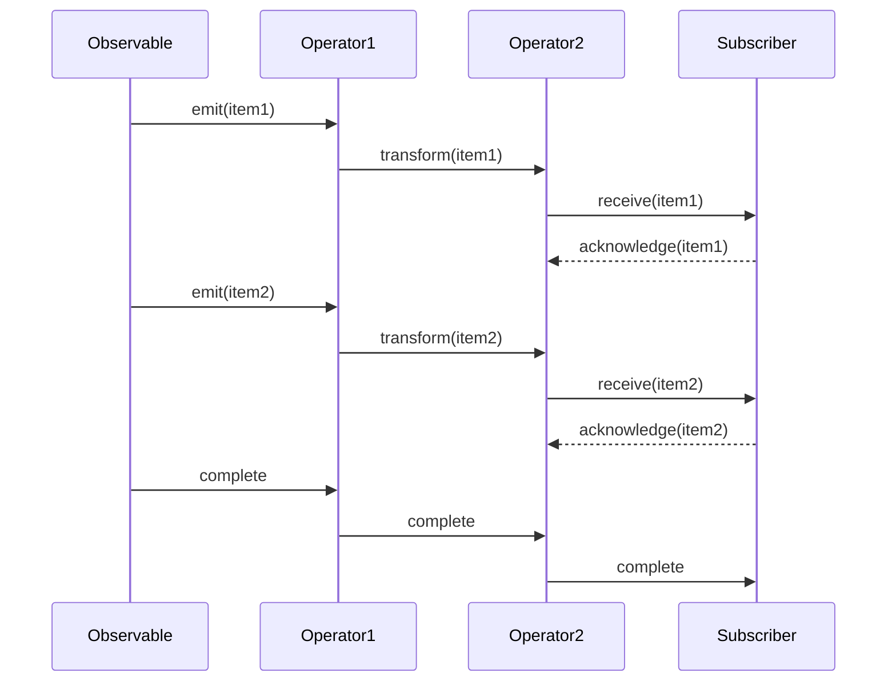

## 9.2 Using RxJava with Kotlin

Reactive programming has become an essential paradigm in modern software development, particularly for handling asynchronous data streams and event-driven applications. RxJava, a library for composing asynchronous and event-based programs using observable sequences, is a powerful tool in this domain. When combined with Kotlin, a language known for its concise syntax and powerful features, developers can create highly efficient and readable reactive applications. In this section, we'll delve into the integration of RxJava with Kotlin, exploring key concepts such as Observables, Singles, Completables, and Maybes, and how they can be effectively utilized in Kotlin applications.

### Introduction to Reactive Extensions in Kotlin

Reactive Extensions (Rx) is a library for composing asynchronous and event-based programs by using observable sequences. It extends the observer pattern to support sequences of data/events and adds operators that allow you to compose sequences together declaratively while abstracting away concerns about things like low-level threading, synchronization, thread-safety, concurrent data structures, and non-blocking I/O.

Kotlin, with its expressive syntax and powerful language features, is well-suited for reactive programming. By leveraging RxJava in Kotlin, developers can write more concise and expressive code, making it easier to handle complex asynchronous operations.

### Understanding RxJava Core Components

Before diving into the integration with Kotlin, let's explore the core components of RxJava:

- **Observable**: Represents a stream of data or events that can be observed. Observables can emit zero or more items and terminate either successfully or with an error.

- **Single**: Emits a single item or an error. It's useful when you have a single response, such as a network call returning a single result.

- **Completable**: Represents a computation without any value but only indication for completion or exception. It's often used for operations like writing to a database where you only care about the success or failure of the operation.

- **Maybe**: Can emit either a single item, no item, or an error. It's a combination of Single and Completable.

- **Flowable**: Similar to Observable but supports backpressure, which is crucial for handling large streams of data efficiently.

### Observable, Single, Completable, Maybe

#### Observable

An `Observable` is the most common type in RxJava. It can emit multiple items over time and is ideal for representing streams of data. Here's a simple example of creating an Observable in Kotlin:

```kotlin
import io.reactivex.rxjava3.core.Observable

fun main() {
    val observable = Observable.just("Hello", "RxJava", "with", "Kotlin")
    
    observable.subscribe(
        { item -> println("Received: $item") },
        { error -> println("Error: ${error.message}") },
        { println("Completed") }
    )
}
```

In this example, the `Observable.just()` method creates an Observable that emits a sequence of strings. The `subscribe()` method is used to listen to the emissions, handle errors, and perform actions upon completion.

#### Single

A `Single` is used when you expect only one item to be emitted. It's perfect for network requests or database queries that return a single result:

```kotlin
import io.reactivex.rxjava3.core.Single

fun fetchUser(): Single<String> {
    return Single.create { emitter ->
        // Simulate a network call
        Thread.sleep(1000)
        emitter.onSuccess("User data")
    }
}

fun main() {
    fetchUser().subscribe(
        { result -> println("Received: $result") },
        { error -> println("Error: ${error.message}") }
    )
}
```

Here, `Single.create()` is used to simulate a network call that returns user data. The `subscribe()` method handles the single emission or any errors.

#### Completable

A `Completable` is used when you don't need to emit any items but only care about the completion of an operation:

```kotlin
import io.reactivex.rxjava3.core.Completable

fun saveData(): Completable {
    return Completable.create { emitter ->
        // Simulate saving data
        Thread.sleep(500)
        emitter.onComplete()
    }
}

fun main() {
    saveData().subscribe(
        { println("Data saved successfully") },
        { error -> println("Error: ${error.message}") }
    )
}
```

In this example, `Completable.create()` is used to simulate a data-saving operation. The `subscribe()` method provides callbacks for completion and error handling.

#### Maybe

A `Maybe` can emit a single item, no item, or an error. It's useful when the presence of a result is optional:

```kotlin
import io.reactivex.rxjava3.core.Maybe

fun findItem(): Maybe<String> {
    return Maybe.create { emitter ->
        val item = "Found item" // Simulate finding an item
        if (item != null) {
            emitter.onSuccess(item)
        } else {
            emitter.onComplete()
        }
    }
}

fun main() {
    findItem().subscribe(
        { item -> println("Received: $item") },
        { error -> println("Error: ${error.message}") },
        { println("No item found") }
    )
}
```

In this example, `Maybe.create()` is used to simulate finding an item. The `subscribe()` method provides callbacks for the item emission, completion without an item, and error handling.

### Combining RxJava with Kotlin Features

Kotlin's language features, such as extension functions, lambda expressions, and null safety, make it an excellent choice for working with RxJava. Let's explore how these features can enhance your reactive programming experience.

#### Extension Functions

Kotlin's extension functions allow you to add new functions to existing classes without modifying their source code. This feature is particularly useful when working with RxJava, as it enables you to create custom operators and utility functions.

For example, you can create an extension function to log emissions from an Observable:

```kotlin
import io.reactivex.rxjava3.core.Observable

fun <T> Observable<T>.log(): Observable<T> {
    return this.doOnNext { item -> println("Logging: $item") }
}

fun main() {
    val observable = Observable.just("Hello", "RxJava", "with", "Kotlin")
    
    observable.log().subscribe { item -> println("Received: $item") }
}
```

In this example, the `log()` extension function uses `doOnNext()` to log each emitted item before passing it to the subscriber.

#### Lambda Expressions

Kotlin's lambda expressions provide a concise way to define functions, making your RxJava code more readable and expressive. Consider the following example:

```kotlin
import io.reactivex.rxjava3.core.Observable

fun main() {
    val observable = Observable.just(1, 2, 3, 4, 5)
    
    observable
        .filter { it % 2 == 0 }
        .map { it * 2 }
        .subscribe { println("Received: $it") }
}
```

Here, lambda expressions are used with the `filter()` and `map()` operators to process the emitted items. This approach results in more concise and readable code.

#### Null Safety

Kotlin's null safety features help prevent null pointer exceptions, a common source of bugs in Java applications. When working with RxJava, you can leverage Kotlin's null safety to handle nullable types more effectively.

For example, consider a scenario where you want to filter out null values from an Observable:

```kotlin
import io.reactivex.rxjava3.core.Observable

fun main() {
    val observable = Observable.just("Kotlin", null, "RxJava", null, "Extensions")
    
    observable
        .filter { it != null }
        .subscribe { println("Received: $it") }
}
```

In this example, the `filter()` operator is used to remove null values from the stream, ensuring that only non-null items are emitted.

### Extensions and Utility Functions

Kotlin's support for extension functions and utility functions allows you to create reusable components that enhance your RxJava code. Let's explore some common patterns and techniques for creating extensions and utilities.

#### Creating Custom Operators

Custom operators can encapsulate common patterns and logic, making your code more modular and reusable. Here's an example of a custom operator that retries an Observable a specified number of times:

```kotlin
import io.reactivex.rxjava3.core.Observable
import io.reactivex.rxjava3.core.ObservableSource
import io.reactivex.rxjava3.functions.Function
import java.util.concurrent.TimeUnit

fun <T> Observable<T>.retryWithDelay(retries: Int, delay: Long): Observable<T> {
    return this.retryWhen { errors ->
        errors.zipWith(Observable.range(1, retries + 1)) { error, retryCount ->
            if (retryCount > retries) {
                throw error
            } else {
                retryCount
            }
        }.flatMap { retryCount ->
            Observable.timer(delay * retryCount, TimeUnit.MILLISECONDS)
        }
    }
}

fun main() {
    val observable = Observable.create<String> { emitter ->
        println("Attempting...")
        emitter.onError(Exception("Failed"))
    }
    
    observable
        .retryWithDelay(3, 1000)
        .subscribe(
            { println("Received: $it") },
            { error -> println("Error: ${error.message}") }
        )
}
```

In this example, the `retryWithDelay()` extension function retries an Observable with a delay between attempts. The `retryWhen()` operator is used to handle errors and implement the retry logic.

#### Utility Functions for Testing

When working with RxJava, it's essential to test your reactive code to ensure it behaves as expected. Kotlin's utility functions can help simplify testing by providing common setup and teardown logic.

Here's an example of a utility function for testing Observables:

```kotlin
import io.reactivex.rxjava3.core.Observable
import io.reactivex.rxjava3.observers.TestObserver

fun <T> Observable<T>.testWithLogging(): TestObserver<T> {
    val testObserver = TestObserver<T>()
    this.doOnNext { println("Emitting: $it") }
        .doOnError { println("Error: ${it.message}") }
        .doOnComplete { println("Completed") }
        .subscribe(testObserver)
    return testObserver
}

fun main() {
    val observable = Observable.just("Test", "Observable")
    
    val testObserver = observable.testWithLogging()
    
    testObserver.assertComplete()
    testObserver.assertNoErrors()
    testObserver.assertValues("Test", "Observable")
}
```

In this example, the `testWithLogging()` utility function creates a `TestObserver` and logs emissions, errors, and completion events. This approach simplifies testing by providing a reusable setup for Observables.

### Visualizing RxJava with Kotlin

To better understand how RxJava components interact with each other, let's visualize the flow of data using a sequence diagram. This diagram illustrates the interaction between an Observable, its operators, and a subscriber.



In this sequence diagram, the `Observable` emits items that are processed by `Operator1` and `Operator2` before being received by the `Subscriber`. The flow of data is acknowledged at each step, ensuring that the sequence is processed correctly.

### Practical Applications and Use Cases

RxJava combined with Kotlin is particularly useful in scenarios where you need to handle asynchronous data streams, such as:

- **Network Requests**: Use RxJava to handle API calls, process responses, and manage errors in a clean and efficient manner.

- **User Interface Updates**: React to user interactions and update the UI based on data changes without blocking the main thread.

- **Data Processing Pipelines**: Create complex data processing pipelines that transform and filter data streams in real-time.

- **Event-Driven Systems**: Implement event-driven architectures where components react to events and state changes asynchronously.

### Try It Yourself

Now that we've explored the integration of RxJava with Kotlin, let's encourage you to experiment with the concepts and examples provided. Here are some suggestions for modifications and extensions:

- **Modify the Observable Example**: Change the sequence of items emitted by the Observable and observe how the output changes.

- **Create a Custom Operator**: Implement a custom operator that filters out even numbers from a stream of integers.

- **Experiment with Error Handling**: Introduce errors into the Observable stream and implement custom error handling logic.

- **Combine Multiple Streams**: Use the `merge()` or `zip()` operators to combine multiple Observable streams and observe the results.

### Knowledge Check

To reinforce your understanding of RxJava with Kotlin, consider the following questions and challenges:

- **What are the key differences between Observable, Single, Completable, and Maybe in RxJava?**

- **How can Kotlin's extension functions enhance the use of RxJava?**

- **What are some common use cases for RxJava in Kotlin applications?**

- **How can you handle errors and retries in an Observable stream?**

- **What are the benefits of using RxJava for asynchronous programming compared to traditional approaches?**

### Embrace the Journey

Remember, mastering RxJava with Kotlin is a journey that requires practice and experimentation. As you continue to explore reactive programming, you'll discover new patterns and techniques that can enhance your applications. Stay curious, keep experimenting, and enjoy the journey!

## Quiz Time!



### What is the primary purpose of RxJava?

- [x] To compose asynchronous and event-based programs using observable sequences.
- [ ] To provide a framework for building user interfaces.
- [ ] To replace traditional Java concurrency mechanisms.
- [ ] To simplify database operations.

> **Explanation:** RxJava is designed to compose asynchronous and event-based programs using observable sequences, allowing developers to handle data streams and events efficiently.

### Which RxJava component is used when you expect only one item to be emitted?

- [ ] Observable
- [x] Single
- [ ] Completable
- [ ] Maybe

> **Explanation:** A Single is used when you expect only one item to be emitted, making it ideal for operations like network requests that return a single result.

### How can Kotlin's extension functions benefit RxJava usage?

- [x] By allowing developers to add new functions to existing classes without modifying their source code.
- [ ] By enabling the use of coroutines with RxJava.
- [ ] By providing a way to handle null values in RxJava streams.
- [ ] By simplifying the creation of custom operators.

> **Explanation:** Kotlin's extension functions allow developers to add new functions to existing classes without modifying their source code, making it easier to create custom operators and utilities for RxJava.

### What is the main advantage of using lambda expressions in RxJava with Kotlin?

- [ ] They improve the performance of RxJava streams.
- [x] They make the code more readable and expressive.
- [ ] They enable the use of coroutines in RxJava.
- [ ] They provide better error handling capabilities.

> **Explanation:** Lambda expressions in Kotlin provide a concise way to define functions, making RxJava code more readable and expressive.

### Which RxJava component represents a computation without any value but only indication for completion or exception?

- [ ] Observable
- [ ] Single
- [x] Completable
- [ ] Maybe

> **Explanation:** A Completable represents a computation without any value but only indication for completion or exception, often used for operations like writing to a database.

### What is the purpose of the `retryWithDelay` custom operator in the provided example?

- [ ] To log emissions from an Observable.
- [x] To retry an Observable with a delay between attempts.
- [ ] To filter out null values from a stream.
- [ ] To combine multiple Observable streams.

> **Explanation:** The `retryWithDelay` custom operator retries an Observable with a delay between attempts, using the `retryWhen` operator to handle errors and implement the retry logic.

### How can you filter out null values from an Observable stream in Kotlin?

- [ ] By using the `map()` operator.
- [ ] By using the `flatMap()` operator.
- [x] By using the `filter()` operator.
- [ ] By using the `merge()` operator.

> **Explanation:** The `filter()` operator is used to remove null values from an Observable stream, ensuring that only non-null items are emitted.

### What is the role of the `TestObserver` in RxJava testing?

- [ ] To create custom operators for testing.
- [x] To observe emissions, errors, and completion events during testing.
- [ ] To handle errors and retries in an Observable stream.
- [ ] To log emissions from an Observable.

> **Explanation:** The `TestObserver` is used in RxJava testing to observe emissions, errors, and completion events, providing a way to assert the behavior of reactive streams.

### Which operator can be used to combine multiple Observable streams?

- [ ] `filter()`
- [ ] `map()`
- [ ] `retryWhen()`
- [x] `merge()`

> **Explanation:** The `merge()` operator is used to combine multiple Observable streams, allowing them to emit items concurrently.

### True or False: Kotlin's null safety features can help prevent null pointer exceptions in RxJava applications.

- [x] True
- [ ] False

> **Explanation:** Kotlin's null safety features help prevent null pointer exceptions by allowing developers to handle nullable types more effectively, reducing the risk of runtime errors in RxJava applications.


