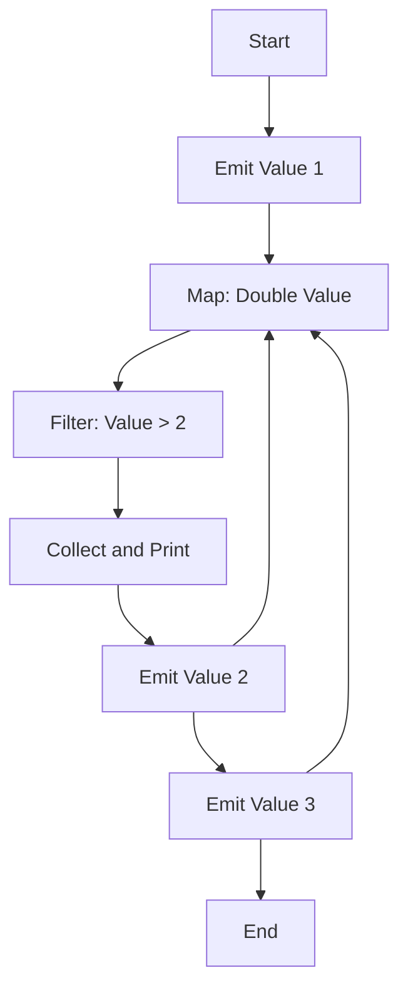

## 9.3 Coroutines and Flows in Reactive Programming

In the ever-evolving landscape of software development, the ability to handle asynchronous data streams efficiently is paramount. Kotlin, with its powerful coroutines and flows, offers a robust framework for reactive programming. This section delves into the intricacies of using coroutines and flows to manage asynchronous data streams, focusing on flow operators, transformations, and state management with StateFlow and SharedFlow.

### Understanding Coroutines and Flows

Before diving into flows, it's essential to understand Kotlin's coroutines. Coroutines are a design pattern for handling asynchronous programming, allowing you to write non-blocking code that is easy to read and maintain. They enable you to perform long-running tasks without blocking the main thread, making them ideal for tasks like network requests, database operations, and more.

**Key Concepts of Coroutines:**

- **Suspending Functions:** Functions that can be paused and resumed, allowing for non-blocking operations.
- **Coroutine Scope:** Defines the lifecycle of coroutines, ensuring they are canceled when no longer needed.
- **Coroutine Context:** Holds information about the coroutine, such as its dispatcher and job.

**Introduction to Flows:**

Flows in Kotlin are a type of cold asynchronous data stream that can emit multiple values sequentially. They are built on top of coroutines and provide a more declarative approach to handling streams of data.

- **Cold Stream:** A flow is cold, meaning it doesn't produce values until it is collected.
- **Emit Values:** Flows can emit multiple values over time, unlike suspend functions that return a single value.
- **Backpressure Handling:** Flows handle backpressure automatically, making them suitable for reactive programming.

### Using Flows for Asynchronous Data Streams

Flows are designed to handle asynchronous data streams efficiently. They allow you to emit values over time and handle them using a variety of operators. Let's explore how to create and collect flows in Kotlin.

#### Creating a Flow

To create a flow, you use the `flow` builder. This builder allows you to emit values using the `emit` function.

```kotlin
import kotlinx.coroutines.flow.*
import kotlinx.coroutines.runBlocking

fun simpleFlow(): Flow<Int> = flow {
    for (i in 1..3) {
        emit(i) // Emit values 1, 2, 3
    }
}

fun main() = runBlocking {
    simpleFlow().collect { value ->
        println(value) // Collect and print each emitted value
    }
}
```

In this example, `simpleFlow` is a flow that emits integers from 1 to 3. The `collect` function is used to receive and process each emitted value.

#### Flow Operators and Transformations

Flows provide a rich set of operators for transforming and combining data. These operators allow you to perform operations such as filtering, mapping, and reducing on the emitted values.

**Common Flow Operators:**

- **`map`:** Transforms each emitted value.
- **`filter`:** Filters values based on a predicate.
- **`reduce`:** Reduces the flow to a single value using an accumulator.

```kotlin
fun main() = runBlocking {
    simpleFlow()
        .map { it * 2 } // Double each value
        .filter { it > 2 } // Filter values greater than 2
        .collect { value ->
            println(value) // Collect and print transformed values
        }
}
```

In this example, the flow is transformed using `map` to double each value and `filter` to only allow values greater than 2.

#### Handling Exceptions in Flows

Handling exceptions in flows is crucial for building robust applications. You can use the `catch` operator to handle exceptions that occur during flow collection.

```kotlin
fun main() = runBlocking {
    simpleFlow()
        .map { check(it != 2) { "Value cannot be 2" } } // Throw exception if value is 2
        .catch { e -> println("Caught exception: $e") } // Handle exception
        .collect { value ->
            println(value)
        }
}
```

In this example, an exception is thrown if the value is 2, and the `catch` operator handles it gracefully.

### StateFlow and SharedFlow for State Management

State management is a critical aspect of reactive programming. Kotlin provides StateFlow and SharedFlow for managing state in a reactive way.

#### StateFlow

StateFlow is a state-holder observable flow that emits the current and new state updates. It is similar to LiveData in Android but is designed for Kotlin's coroutines.

- **Hot Stream:** StateFlow is a hot stream, meaning it always has a value and emits updates to collectors.
- **State Management:** Ideal for managing UI state in a reactive way.

```kotlin
import kotlinx.coroutines.flow.*
import kotlinx.coroutines.runBlocking
import kotlinx.coroutines.launch

fun main() = runBlocking {
    val stateFlow = MutableStateFlow(0) // Initial state is 0

    launch {
        stateFlow.collect { value ->
            println("Collected: $value") // Collect and print state updates
        }
    }

    stateFlow.value = 1 // Update state
    stateFlow.value = 2 // Update state
}
```

In this example, `MutableStateFlow` is used to manage state, and collectors receive updates whenever the state changes.

#### SharedFlow

SharedFlow is a highly-configurable, shared, and hot flow that allows multiple collectors to receive the same emissions.

- **Hot Stream:** Like StateFlow, SharedFlow is a hot stream.
- **Replay and Buffering:** Supports replaying emissions to new collectors and buffering emissions.

```kotlin
import kotlinx.coroutines.flow.*
import kotlinx.coroutines.runBlocking
import kotlinx.coroutines.launch

fun main() = runBlocking {
    val sharedFlow = MutableSharedFlow<Int>(replay = 1) // Replay last emission

    launch {
        sharedFlow.collect { value ->
            println("Collector 1: $value")
        }
    }

    launch {
        sharedFlow.collect { value ->
            println("Collector 2: $value")
        }
    }

    sharedFlow.emit(1) // Emit value
    sharedFlow.emit(2) // Emit value
}
```

In this example, `MutableSharedFlow` is used to emit values, and both collectors receive the same emissions.

### Visualizing Flow Operations

To better understand flow operations, let's visualize a simple flow transformation using a flowchart.



**Diagram Description:** This flowchart represents a flow that emits values, transforms them by doubling, filters values greater than 2, and collects the results.

### Practical Use Cases

Coroutines and flows are versatile tools that can be applied to various use cases in reactive programming.

#### Networking with Flows

Flows can be used to handle network requests asynchronously, providing a clean and efficient way to manage data streams.

```kotlin
import kotlinx.coroutines.*
import kotlinx.coroutines.flow.*

fun fetchData(): Flow<String> = flow {
    emit("Fetching data...") // Emit loading state
    delay(1000) // Simulate network delay
    emit("Data received") // Emit data
}

fun main() = runBlocking {
    fetchData().collect { value ->
        println(value) // Collect and print network data
    }
}
```

In this example, `fetchData` simulates a network request and emits loading and data states.

#### UI State Management

StateFlow is particularly useful for managing UI state in Android applications, providing a reactive way to update UI components.

```kotlin
import kotlinx.coroutines.flow.*
import kotlinx.coroutines.runBlocking
import kotlinx.coroutines.launch

fun main() = runBlocking {
    val uiStateFlow = MutableStateFlow("Initial State")

    launch {
        uiStateFlow.collect { state ->
            println("UI State: $state") // Collect and print UI state
        }
    }

    uiStateFlow.value = "Updated State" // Update UI state
}
```

This example demonstrates how `MutableStateFlow` can be used to manage and update UI state reactively.

### Advanced Flow Techniques

As you become more comfortable with flows, you can explore advanced techniques to enhance your reactive programming skills.

#### Combining Flows

Kotlin provides operators to combine multiple flows, allowing you to merge, zip, or flatten them.

```kotlin
fun main() = runBlocking {
    val flow1 = flowOf(1, 2, 3)
    val flow2 = flowOf("A", "B", "C")

    flow1.zip(flow2) { num, letter ->
        "$num$letter" // Combine values from both flows
    }.collect { value ->
        println(value) // Collect and print combined values
    }
}
```

In this example, `zip` is used to combine values from two flows into a single flow.

#### Flow Buffers

Flow buffering can be used to control the flow's backpressure and improve performance.

```kotlin
fun main() = runBlocking {
    simpleFlow()
        .buffer() // Buffer emissions
        .collect { value ->
            delay(100) // Simulate processing delay
            println(value)
        }
}
```

The `buffer` operator allows the flow to emit values without waiting for the collector to process them, improving throughput.

### Try It Yourself

Experiment with the provided code examples by modifying them to suit your needs. Try changing the flow operators, adding new transformations, or combining multiple flows to see how they interact. This hands-on approach will deepen your understanding of coroutines and flows in reactive programming.

### Knowledge Check

- **Question:** What is the primary difference between a cold and hot stream in Kotlin flows?
- **Exercise:** Modify the `simpleFlow` example to include error handling using the `catch` operator.

### Conclusion

Kotlin's coroutines and flows provide a powerful framework for reactive programming, enabling you to handle asynchronous data streams efficiently. By mastering flow operators, transformations, and state management with StateFlow and SharedFlow, you can build robust and responsive applications. Remember, this is just the beginning. As you progress, you'll discover even more advanced techniques and patterns to enhance your reactive programming skills. Keep experimenting, stay curious, and enjoy the journey!

## Quiz Time!



### What is a primary characteristic of a cold stream in Kotlin flows?

- [x] It doesn't produce values until collected.
- [ ] It continuously emits values even without collectors.
- [ ] It requires a buffer to operate.
- [ ] It is always hot.

> **Explanation:** A cold stream in Kotlin flows does not produce values until it is collected, making it efficient for on-demand data processing.

### Which operator would you use to transform each emitted value in a flow?

- [ ] filter
- [x] map
- [ ] reduce
- [ ] collect

> **Explanation:** The `map` operator is used to transform each emitted value in a flow, allowing you to apply a function to each element.

### How can you handle exceptions in a flow?

- [ ] Using try-catch blocks
- [x] Using the catch operator
- [ ] Using the map operator
- [ ] Using the filter operator

> **Explanation:** The `catch` operator is specifically designed to handle exceptions that occur during flow collection, providing a clean way to manage errors.

### What is a key feature of StateFlow?

- [ ] It is a cold stream.
- [x] It always has a current value.
- [ ] It cannot be collected.
- [ ] It doesn't support state updates.

> **Explanation:** StateFlow is a hot stream that always has a current value, making it ideal for state management in reactive programming.

### Which flow operator is used to combine values from two flows?

- [ ] buffer
- [ ] map
- [x] zip
- [ ] filter

> **Explanation:** The `zip` operator is used to combine values from two flows, allowing you to pair elements from each flow into a single flow.

### What does the buffer operator do in a flow?

- [x] Controls backpressure by buffering emissions.
- [ ] Filters values based on a predicate.
- [ ] Transforms each emitted value.
- [ ] Reduces the flow to a single value.

> **Explanation:** The `buffer` operator controls backpressure by allowing the flow to emit values without waiting for the collector to process them, improving throughput.

### How can you update the state in a MutableStateFlow?

- [ ] Using the emit function
- [x] By setting the value property
- [ ] Using the collect function
- [ ] By calling the update method

> **Explanation:** In a `MutableStateFlow`, you update the state by setting the `value` property, which automatically notifies collectors of the change.

### What is a SharedFlow?

- [ ] A cold stream that emits values on demand.
- [x] A hot stream that allows multiple collectors to receive the same emissions.
- [ ] A flow that cannot be collected.
- [ ] A flow that only supports single collectors.

> **Explanation:** SharedFlow is a hot stream that allows multiple collectors to receive the same emissions, making it suitable for broadcasting events.

### Which flow operator would you use to filter values based on a condition?

- [ ] map
- [ ] reduce
- [x] filter
- [ ] buffer

> **Explanation:** The `filter` operator is used to filter values in a flow based on a predicate, allowing you to selectively process elements.

### True or False: Flows in Kotlin automatically handle backpressure.

- [x] True
- [ ] False

> **Explanation:** True. Flows in Kotlin are designed to automatically handle backpressure, making them suitable for reactive programming scenarios.


