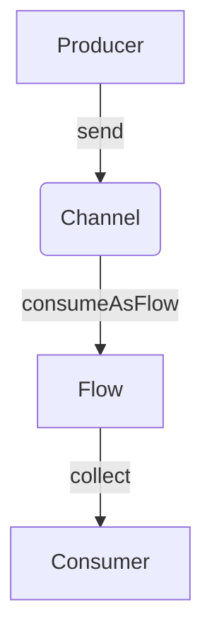

## 9.4 Combining Flows and Channels

In the realm of reactive programming, Kotlin provides powerful tools such as Flows and Channels to handle asynchronous data streams and manage concurrency. This section delves into advanced patterns for combining Flows and Channels, enabling expert developers to efficiently merge and manage data streams in complex applications. By understanding and leveraging these patterns, you can create responsive, resilient, and scalable systems.

### Introduction to Flows and Channels

Before we dive into combining these two constructs, let's briefly revisit what Flows and Channels are and how they fit into Kotlin's concurrency model.

#### Flows

Flows are a part of Kotlin's coroutines library and represent a cold asynchronous data stream that emits values sequentially. They are similar to sequences but are designed for asynchronous operations. Flows can emit zero or more values and complete successfully or with an exception.

```kotlin
import kotlinx.coroutines.*
import kotlinx.coroutines.flow.*

fun main() = runBlocking {
    val flow = flow {
        for (i in 1..3) {
            delay(100) // Simulate asynchronous operation
            emit(i) // Emit values
        }
    }

    flow.collect { value ->
        println("Received $value")
    }
}
```

In this example, the `flow` builder creates a Flow that emits numbers from 1 to 3 with a delay between each emission.

#### Channels

Channels provide a way to communicate between coroutines. They are similar to blocking queues but are designed for non-blocking communication. Channels can be used to send and receive values between coroutines.

```kotlin
import kotlinx.coroutines.*
import kotlinx.coroutines.channels.*

fun main() = runBlocking {
    val channel = Channel<Int>()

    launch {
        for (x in 1..5) {
            channel.send(x) // Send values to the channel
        }
        channel.close() // Close the channel
    }

    for (y in channel) {
        println("Received $y")
    }
}
```

Here, a coroutine sends numbers to a channel, and another coroutine receives and prints them.

### Combining Flows and Channels

Combining Flows and Channels allows you to create complex reactive systems where data streams can be merged, transformed, and managed efficiently. Let's explore some advanced patterns for combining these constructs.

#### Merging Data Streams

One common pattern is merging multiple data streams into a single stream. This can be achieved using the `merge` function, which combines multiple Flows into one.

```kotlin
import kotlinx.coroutines.*
import kotlinx.coroutines.flow.*

fun main() = runBlocking {
    val flow1 = flowOf(1, 2, 3)
    val flow2 = flowOf(4, 5, 6)

    val mergedFlow = merge(flow1, flow2)

    mergedFlow.collect { value ->
        println("Merged value: $value")
    }
}
```

In this example, `flow1` and `flow2` are merged into a single Flow, and the values are emitted in the order they are produced.

#### Combining Channels with Flows

You can also combine Channels with Flows to create a more dynamic data stream. By converting a Channel into a Flow, you can leverage Flow operators to transform and manage the data.

```kotlin
import kotlinx.coroutines.*
import kotlinx.coroutines.channels.*
import kotlinx.coroutines.flow.*

fun main() = runBlocking {
    val channel = Channel<Int>()

    launch {
        for (x in 1..5) {
            channel.send(x)
        }
        channel.close()
    }

    val flowFromChannel = channel.consumeAsFlow()

    flowFromChannel
        .map { it * 2 } // Transform the data
        .collect { value ->
            println("Transformed value: $value")
        }
}
```

Here, the `consumeAsFlow` extension function converts a Channel into a Flow, allowing you to apply Flow operators like `map`.

### Advanced Patterns and Use Cases

Combining Flows and Channels opens up a myriad of possibilities for handling complex data streams. Let's explore some advanced patterns and use cases.

#### Fan-In and Fan-Out Patterns

Fan-in and fan-out are patterns used to manage multiple data streams. Fan-in combines multiple streams into one, while fan-out distributes a single stream to multiple consumers.

**Fan-In Example:**

```kotlin
import kotlinx.coroutines.*
import kotlinx.coroutines.flow.*

fun main() = runBlocking {
    val flow1 = flowOf(1, 2, 3)
    val flow2 = flowOf(4, 5, 6)

    val fanInFlow = merge(flow1, flow2)

    fanInFlow.collect { value ->
        println("Fan-in value: $value")
    }
}
```

**Fan-Out Example:**

```kotlin
import kotlinx.coroutines.*
import kotlinx.coroutines.channels.*
import kotlinx.coroutines.flow.*

fun main() = runBlocking {
    val channel = Channel<Int>()

    launch {
        for (x in 1..5) {
            channel.send(x)
        }
        channel.close()
    }

    val flow = channel.consumeAsFlow()

    launch {
        flow.collect { value ->
            println("Consumer 1 received: $value")
        }
    }

    launch {
        flow.collect { value ->
            println("Consumer 2 received: $value")
        }
    }
}
```

In the fan-out example, the same data stream is consumed by two different consumers.

#### Backpressure Handling

Backpressure is a crucial aspect of reactive systems, ensuring that producers do not overwhelm consumers. Kotlin Flows handle backpressure naturally, but when combining with Channels, you need to manage it explicitly.

**Example with Backpressure:**

```kotlin
import kotlinx.coroutines.*
import kotlinx.coroutines.channels.*
import kotlinx.coroutines.flow.*

fun main() = runBlocking {
    val channel = Channel<Int>(Channel.RENDEZVOUS)

    launch {
        for (x in 1..5) {
            println("Sending $x")
            channel.send(x) // This will suspend if the buffer is full
        }
        channel.close()
    }

    val flow = channel.consumeAsFlow()

    flow.collect { value ->
        delay(100) // Simulate slow consumer
        println("Received $value")
    }
}
```

In this example, the channel uses a rendezvous buffer, which means the send operation will suspend until the receive operation is ready, effectively handling backpressure.

### Visualizing Data Flow

To better understand how data flows through Flows and Channels, let's visualize the process using a Mermaid.js diagram.



**Diagram Description:** This diagram illustrates the flow of data from a producer to a consumer through a Channel and then a Flow. The producer sends data to the Channel, which is then consumed as a Flow and collected by the consumer.

### Design Considerations

When combining Flows and Channels, consider the following design aspects:

- **Concurrency:** Ensure that your design handles concurrency effectively, avoiding race conditions and deadlocks.
- **Error Handling:** Implement robust error handling to manage exceptions and ensure system resilience.
- **Performance:** Optimize for performance by minimizing context switches and using appropriate buffer sizes.
- **Scalability:** Design your system to scale with increasing data volumes and consumer demands.

### Differences and Similarities

While Flows and Channels serve similar purposes in handling asynchronous data, they have distinct characteristics:

- **Flows** are cold and lazy, meaning they do not produce values until collected. They are ideal for transforming and processing data streams.
- **Channels** are hot and can be used for direct communication between coroutines. They are suitable for scenarios requiring immediate data transfer.

### Try It Yourself

Experiment with the code examples provided by modifying them to suit different scenarios. For instance, try changing the buffer size of Channels or applying different Flow operators to see how they affect the data stream.

### Knowledge Check

- What are the main differences between Flows and Channels?
- How can you handle backpressure when combining Flows and Channels?
- What are some use cases for fan-in and fan-out patterns?

### Embrace the Journey

Remember, mastering Flows and Channels is just the beginning of your journey into reactive programming with Kotlin. As you progress, you'll build more complex and interactive systems. Keep experimenting, stay curious, and enjoy the journey!

## Quiz Time!



### What is a key difference between Flows and Channels in Kotlin?

- [x] Flows are cold, while Channels are hot.
- [ ] Flows are hot, while Channels are cold.
- [ ] Both are cold.
- [ ] Both are hot.

> **Explanation:** Flows are cold and only start emitting values when collected, while Channels are hot and can send and receive values immediately.

### How can you convert a Channel into a Flow in Kotlin?

- [x] Using the `consumeAsFlow` extension function.
- [ ] Using the `asFlow` extension function.
- [ ] Using the `toFlow` method.
- [ ] Using the `flowOf` function.

> **Explanation:** The `consumeAsFlow` extension function is used to convert a Channel into a Flow.

### What pattern is used to combine multiple data streams into one?

- [x] Fan-In pattern.
- [ ] Fan-Out pattern.
- [ ] Backpressure pattern.
- [ ] Merge pattern.

> **Explanation:** The Fan-In pattern is used to combine multiple data streams into a single stream.

### Which function is used to merge multiple Flows in Kotlin?

- [x] `merge`
- [ ] `combine`
- [ ] `zip`
- [ ] `join`

> **Explanation:** The `merge` function is used to combine multiple Flows into one.

### What is a common use case for the Fan-Out pattern?

- [x] Distributing a single data stream to multiple consumers.
- [ ] Combining multiple data streams into one.
- [ ] Handling backpressure.
- [ ] Managing concurrency.

> **Explanation:** The Fan-Out pattern is used to distribute a single data stream to multiple consumers.

### How does Kotlin handle backpressure in Flows?

- [x] Naturally, by suspending the producer if the consumer is slow.
- [ ] By dropping values.
- [ ] By buffering values indefinitely.
- [ ] By throwing exceptions.

> **Explanation:** Kotlin Flows handle backpressure naturally by suspending the producer if the consumer is slow.

### What is the purpose of using a rendezvous buffer in Channels?

- [x] To suspend the send operation until the receive operation is ready.
- [ ] To buffer values indefinitely.
- [ ] To drop values when the buffer is full.
- [ ] To throw exceptions when the buffer is full.

> **Explanation:** A rendezvous buffer suspends the send operation until the receive operation is ready, effectively handling backpressure.

### Which Kotlin construct is suitable for direct communication between coroutines?

- [x] Channels
- [ ] Flows
- [ ] Sequences
- [ ] Streams

> **Explanation:** Channels are suitable for direct communication between coroutines.

### What is one advantage of using Flows over Channels?

- [x] Flows are lazy and can be transformed using operators.
- [ ] Flows are eager and can be transformed using operators.
- [ ] Flows are suitable for direct communication.
- [ ] Flows can buffer values indefinitely.

> **Explanation:** Flows are lazy and can be transformed using operators, making them ideal for processing data streams.

### True or False: Channels in Kotlin can be used to handle asynchronous data streams.

- [x] True
- [ ] False

> **Explanation:** Channels in Kotlin can indeed be used to handle asynchronous data streams, allowing for non-blocking communication between coroutines.


