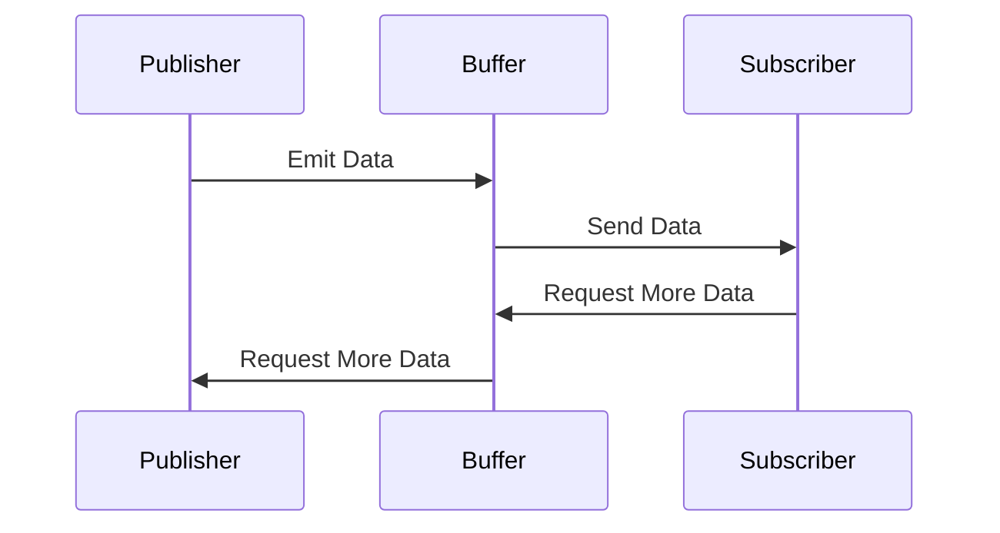

## 9.5 Reactive Streams and Backpressure

In the realm of modern software development, managing data flow efficiently is crucial, especially when dealing with asynchronous data streams. Reactive Streams and Backpressure are pivotal concepts that enable developers to handle data flow in a non-blocking, efficient manner. In this section, we will delve into the intricacies of Reactive Streams and Backpressure, exploring how they are implemented in Kotlin, and examining strategies like buffering and conflating to manage data flow effectively.

### Understanding Reactive Streams

Reactive Streams is a specification aimed at providing a standard for asynchronous stream processing with non-blocking backpressure. The primary goal is to allow different libraries and components to interoperate seamlessly while handling data streams. Reactive Streams are particularly useful in scenarios where data is produced at a different rate than it is consumed, such as in real-time data processing, user interfaces, and network communication.

#### Key Components of Reactive Streams

Reactive Streams consist of four main components:

1. **Publisher**: The source of data. It produces items and sends them to a Subscriber.
2. **Subscriber**: The consumer of data. It receives items from a Publisher.
3. **Subscription**: Represents the link between a Publisher and a Subscriber. It allows the Subscriber to request items and cancel the subscription.
4. **Processor**: A combination of a Publisher and Subscriber. It processes data as it flows from the Publisher to the Subscriber.

#### Implementing Reactive Streams in Kotlin

Kotlin, with its support for coroutines and Flow, provides a robust foundation for implementing Reactive Streams. The `Flow` API in Kotlin is designed to handle asynchronous data streams, providing operators for transforming and consuming data in a reactive manner.

Here's a basic example of a Kotlin `Flow`:

```kotlin
import kotlinx.coroutines.flow.*
import kotlinx.coroutines.runBlocking

fun simpleFlow(): Flow<Int> = flow {
    for (i in 1..5) {
        emit(i)
    }
}

fun main() = runBlocking {
    simpleFlow().collect { value ->
        println(value)
    }
}
```

In this example, `simpleFlow` is a `Flow` that emits integers from 1 to 5. The `collect` function is used to consume the emitted values.

### Introduction to Backpressure

Backpressure is a mechanism for handling situations where the rate of data production exceeds the rate of consumption. Without backpressure, a system can become overwhelmed, leading to memory exhaustion and degraded performance. Backpressure allows a Subscriber to control the flow of data, requesting only as much data as it can handle.

#### Backpressure Strategies

There are several strategies for managing backpressure:

1. **Buffering**: Temporarily storing data in a buffer until the Subscriber is ready to consume it.
2. **Dropping**: Discarding data that cannot be processed immediately.
3. **Conflating**: Merging multiple data items into one, reducing the number of items that need to be processed.
4. **Throttling**: Limiting the rate at which data is emitted.

### Buffering and Conflating in Kotlin

Kotlin's `Flow` API provides built-in support for backpressure management through operators like `buffer` and `conflate`.

#### Buffering

The `buffer` operator allows you to specify a buffer size, enabling the system to store a certain number of items before they are consumed. This can help smooth out bursts of data and prevent the system from becoming overwhelmed.

Here's an example of using the `buffer` operator:

```kotlin
import kotlinx.coroutines.*
import kotlinx.coroutines.flow.*

fun bufferedFlow(): Flow<Int> = flow {
    for (i in 1..10) {
        delay(100) // Simulate a delay in data production
        emit(i)
    }
}

fun main() = runBlocking {
    bufferedFlow()
        .buffer(5) // Buffer size of 5
        .collect { value ->
            delay(300) // Simulate a delay in data consumption
            println(value)
        }
}
```

In this example, the `buffer` operator allows the `Flow` to emit items at a faster rate than they are consumed, storing up to 5 items in the buffer.

#### Conflating

The `conflate` operator is used to merge multiple emissions into one, effectively reducing the number of items that need to be processed. This is useful in scenarios where only the latest value is of interest, such as updating a user interface.

Here's an example of using the `conflate` operator:

```kotlin
import kotlinx.coroutines.*
import kotlinx.coroutines.flow.*

fun conflatedFlow(): Flow<Int> = flow {
    for (i in 1..10) {
        delay(100) // Simulate a delay in data production
        emit(i)
    }
}

fun main() = runBlocking {
    conflatedFlow()
        .conflate() // Conflate emissions
        .collect { value ->
            delay(300) // Simulate a delay in data consumption
            println(value)
        }
}
```

In this example, the `conflate` operator ensures that only the latest value is processed, skipping intermediate values.

### Visualizing Reactive Streams and Backpressure

To better understand the flow of data and backpressure management, let's visualize the process using a sequence diagram.



This diagram illustrates the interaction between a Publisher, Buffer, and Subscriber. The Buffer temporarily stores data, allowing the Subscriber to consume it at its own pace.

### Design Considerations for Reactive Streams

When implementing Reactive Streams, consider the following:

- **Data Volume**: Assess the volume of data being processed and choose appropriate backpressure strategies.
- **Latency**: Consider the impact of buffering and conflating on latency. While buffering can smooth out data flow, it may introduce delays.
- **Resource Utilization**: Monitor resource usage, especially memory, when using buffering strategies.
- **Error Handling**: Implement robust error handling to manage exceptions in data processing.

### Differences and Similarities with Other Patterns

Reactive Streams share similarities with other asynchronous programming patterns, such as:

- **Observer Pattern**: Both involve a Publisher-Subscriber model, but Reactive Streams provide built-in backpressure management.
- **Iterator Pattern**: Reactive Streams can be seen as an asynchronous version of the Iterator pattern, where data is pushed rather than pulled.

### Practical Applications of Reactive Streams

Reactive Streams are widely used in various domains, including:

- **User Interfaces**: Managing real-time updates and user interactions.
- **Network Communication**: Handling data streams in network protocols.
- **Data Processing**: Processing large volumes of data in real-time.

### Try It Yourself

To deepen your understanding, try modifying the provided code examples:

- Experiment with different buffer sizes and observe the impact on data flow.
- Implement a custom backpressure strategy using the `Flow` API.
- Combine `buffer` and `conflate` operators to optimize data processing.

### Knowledge Check

- What is the primary purpose of backpressure in Reactive Streams?
- How does the `buffer` operator help manage data flow?
- In what scenarios would you use the `conflate` operator?

### Conclusion

Reactive Streams and Backpressure are essential tools for managing data flow in modern applications. By leveraging Kotlin's `Flow` API and understanding backpressure strategies, you can build efficient, responsive systems that handle data streams gracefully. Remember, this is just the beginning. As you progress, you'll discover more advanced techniques and patterns to enhance your applications. Keep experimenting, stay curious, and enjoy the journey!

## Quiz Time!



### What is the primary purpose of backpressure in Reactive Streams?

- [x] To manage the rate of data flow between a Publisher and Subscriber.
- [ ] To increase the speed of data processing.
- [ ] To reduce memory usage.
- [ ] To simplify error handling.

> **Explanation:** Backpressure is used to control the flow of data, ensuring that a Subscriber is not overwhelmed by the rate of data production.

### Which operator in Kotlin's Flow API is used to temporarily store data before it is consumed?

- [x] buffer
- [ ] conflate
- [ ] map
- [ ] filter

> **Explanation:** The `buffer` operator allows data to be stored temporarily, managing the flow of data between a Publisher and Subscriber.

### What does the `conflate` operator do in Kotlin's Flow API?

- [x] Merges multiple emissions into one, reducing the number of items processed.
- [ ] Increases the buffer size for data storage.
- [ ] Filters out unwanted data.
- [ ] Maps data to a different type.

> **Explanation:** The `conflate` operator reduces the number of items processed by merging multiple emissions into one.

### In which scenario would you use the `conflate` operator?

- [x] When only the latest value is of interest.
- [ ] When all data must be processed.
- [ ] When data needs to be filtered.
- [ ] When data needs to be transformed.

> **Explanation:** The `conflate` operator is useful when only the latest value is needed, such as updating a user interface.

### What is a key difference between Reactive Streams and the Observer Pattern?

- [x] Reactive Streams provide built-in backpressure management.
- [ ] Reactive Streams are synchronous.
- [ ] The Observer Pattern uses a Publisher-Subscriber model.
- [ ] The Observer Pattern handles data streams.

> **Explanation:** Reactive Streams include backpressure management, which is not present in the Observer Pattern.

### How does the `buffer` operator affect latency in data processing?

- [x] It may introduce delays due to data storage.
- [ ] It reduces latency by speeding up data flow.
- [ ] It eliminates latency entirely.
- [ ] It has no effect on latency.

> **Explanation:** Buffering can introduce delays as data is stored temporarily before being processed.

### What should you monitor when using buffering strategies in Reactive Streams?

- [x] Resource usage, especially memory.
- [ ] The speed of data production.
- [ ] The number of Subscribers.
- [ ] The type of data being processed.

> **Explanation:** Buffering can increase memory usage, so it's important to monitor resource consumption.

### Which component of Reactive Streams represents the link between a Publisher and a Subscriber?

- [x] Subscription
- [ ] Processor
- [ ] Buffer
- [ ] Conflator

> **Explanation:** The Subscription represents the connection between a Publisher and a Subscriber, allowing data flow control.

### What is a common application of Reactive Streams in user interfaces?

- [x] Managing real-time updates and user interactions.
- [ ] Storing user data.
- [ ] Designing static layouts.
- [ ] Handling offline data.

> **Explanation:** Reactive Streams are used in UIs to handle real-time updates and interactions efficiently.

### True or False: The `Flow` API in Kotlin is designed to handle synchronous data streams.

- [ ] True
- [x] False

> **Explanation:** The `Flow` API is designed for asynchronous data streams, allowing non-blocking data processing.


