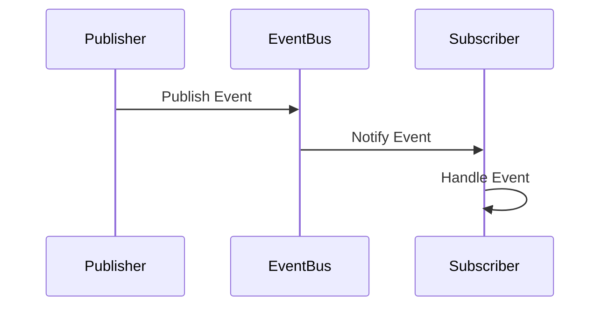

## 9.6 Event-Driven Programming

Event-driven programming is a powerful paradigm that focuses on the production, detection, and consumption of events. In this section, we will delve into how Kotlin can be leveraged to build responsive systems using event-driven programming. We'll explore the concepts, key participants, applicability, and provide practical code examples to illustrate these ideas.

### Introduction to Event-Driven Programming

Event-driven programming is a design paradigm where the flow of the program is determined by events such as user actions, sensor outputs, or messages from other programs. This approach is particularly useful for building responsive systems that need to react to asynchronous inputs.

#### Key Concepts

- **Event**: An occurrence or action that can trigger a response in the system.
- **Event Handler**: A function or method that processes events.
- **Event Loop**: A programming construct that waits for and dispatches events or messages in a program.
- **Callback**: A function passed as an argument to be executed after an event occurs.

### Building Responsive Systems

Responsive systems are those that can react to events promptly and efficiently. Kotlin, with its coroutines and reactive libraries, provides robust tools for implementing event-driven architectures.

#### Advantages of Event-Driven Programming

- **Scalability**: Systems can handle numerous events concurrently.
- **Decoupling**: Components are loosely coupled, enhancing maintainability.
- **Asynchronous Processing**: Efficiently manages I/O-bound and CPU-bound tasks.

### Implementing Event-Driven Systems in Kotlin

Kotlin's language features, such as coroutines and Flow, make it an excellent choice for building event-driven systems. Let's explore how these tools can be used to handle events reactively.

#### Coroutines for Asynchronous Programming

Kotlin's coroutines simplify asynchronous programming by providing a sequential style of code that is easy to read and maintain.

```kotlin
import kotlinx.coroutines.*

fun main() = runBlocking {
    launch {
        delay(1000L)
        println("World!")
    }
    println("Hello,")
}
```

In this example, the `launch` coroutine builder is used to create a new coroutine that delays for 1 second before printing "World!". Meanwhile, "Hello," is printed immediately, demonstrating asynchronous execution.

#### Using Flow for Reactive Streams

Kotlin's `Flow` is a type that represents a cold asynchronous stream of values. It is a powerful tool for handling streams of data reactively.

```kotlin
import kotlinx.coroutines.flow.*
import kotlinx.coroutines.runBlocking

fun main() = runBlocking {
    flowOf(1, 2, 3, 4, 5)
        .filter { it % 2 == 0 }
        .map { it * it }
        .collect { println(it) }
}
```

In this code snippet, a `Flow` is created from a list of integers. The flow is then filtered to include only even numbers, mapped to their squares, and collected to print the results.

### Event-Driven Architecture Patterns

Event-driven architecture (EDA) can be implemented using various patterns, each suited to different scenarios. Let's explore some common patterns.

#### Publish-Subscribe Pattern

In the publish-subscribe pattern, senders (publishers) emit events without knowing who will receive them. Receivers (subscribers) express interest in certain events and are notified when those events occur.

```kotlin
interface Event
class UserCreatedEvent(val userId: String) : Event

interface EventListener {
    fun onEvent(event: Event)
}

class EventBus {
    private val listeners = mutableMapOf<Class<out Event>, MutableList<EventListener>>()

    fun subscribe(eventType: Class<out Event>, listener: EventListener) {
        listeners.computeIfAbsent(eventType) { mutableListOf() }.add(listener)
    }

    fun publish(event: Event) {
        listeners[event::class.java]?.forEach { it.onEvent(event) }
    }
}

fun main() {
    val eventBus = EventBus()

    eventBus.subscribe(UserCreatedEvent::class.java, object : EventListener {
        override fun onEvent(event: Event) {
            if (event is UserCreatedEvent) {
                println("User created with ID: ${event.userId}")
            }
        }
    })

    eventBus.publish(UserCreatedEvent("12345"))
}
```

In this example, an `EventBus` is used to manage subscriptions and publish events. The `UserCreatedEvent` is published, and the subscribed listener reacts to it.

#### Observer Pattern

The observer pattern is similar to publish-subscribe but typically involves a single subject and multiple observers.

```kotlin
interface Observer {
    fun update(event: String)
}

class Subject {
    private val observers = mutableListOf<Observer>()

    fun addObserver(observer: Observer) {
        observers.add(observer)
    }

    fun notifyObservers(event: String) {
        observers.forEach { it.update(event) }
    }
}

class ConcreteObserver : Observer {
    override fun update(event: String) {
        println("Received event: $event")
    }
}

fun main() {
    val subject = Subject()
    val observer = ConcreteObserver()

    subject.addObserver(observer)
    subject.notifyObservers("Event 1")
}
```

Here, the `Subject` class manages a list of observers and notifies them of events. The `ConcreteObserver` implements the `Observer` interface to react to events.

### Design Considerations

When implementing event-driven systems, consider the following:

- **Concurrency**: Ensure thread safety when handling events concurrently.
- **Error Handling**: Implement robust error handling to manage exceptions gracefully.
- **Performance**: Optimize event processing to minimize latency.

### Differences and Similarities

Event-driven programming shares similarities with reactive programming, as both involve responding to changes or events. However, event-driven programming focuses more on the production and consumption of discrete events, while reactive programming emphasizes the propagation of change.

### Visualizing Event-Driven Systems

To better understand event-driven systems, let's visualize a simple event-driven architecture using a sequence diagram.



This diagram illustrates the flow of an event from a publisher to a subscriber via an event bus.

### Try It Yourself

Experiment with the provided code examples by modifying the events or adding new subscribers. Consider implementing additional patterns such as the mediator or command pattern to further explore event-driven architectures.

### Knowledge Check

- **What is the primary advantage of using event-driven programming?**
- **How does Kotlin's Flow differ from traditional event handling?**
- **What are the key differences between the observer and publish-subscribe patterns?**

### Conclusion

Event-driven programming is a versatile paradigm that enables the creation of responsive and scalable systems. By leveraging Kotlin's features such as coroutines and Flow, developers can efficiently handle events and build robust applications. Remember, this is just the beginning. As you progress, you'll discover more ways to harness the power of event-driven programming in Kotlin. Keep experimenting, stay curious, and enjoy the journey!

## Quiz Time!



### What is the primary advantage of event-driven programming?

- [x] Scalability and responsiveness
- [ ] Simplicity of implementation
- [ ] Reduced code complexity
- [ ] Increased security

> **Explanation:** Event-driven programming allows systems to handle numerous events concurrently, making them scalable and responsive.

### Which Kotlin feature is particularly useful for handling asynchronous streams of data?

- [ ] Sealed classes
- [ ] Data classes
- [x] Flow
- [ ] Extension functions

> **Explanation:** Kotlin's Flow is designed for handling asynchronous streams of data reactively.

### What is the role of an event handler in event-driven programming?

- [x] To process events when they occur
- [ ] To generate events
- [ ] To store events
- [ ] To log events

> **Explanation:** An event handler is responsible for processing events when they occur in the system.

### How does the publish-subscribe pattern differ from the observer pattern?

- [x] Publish-subscribe involves multiple publishers and subscribers, while observer typically involves one subject and multiple observers.
- [ ] Publish-subscribe is synchronous, while observer is asynchronous.
- [ ] Publish-subscribe requires a central event bus, while observer does not.
- [ ] Publish-subscribe is used for UI events, while observer is used for backend events.

> **Explanation:** The publish-subscribe pattern allows multiple publishers and subscribers, whereas the observer pattern typically involves a single subject and multiple observers.

### What is a key consideration when implementing event-driven systems?

- [x] Concurrency and thread safety
- [ ] Code readability
- [ ] User interface design
- [ ] Database schema design

> **Explanation:** Concurrency and thread safety are crucial when handling events in an event-driven system.

### Which of the following is NOT a component of event-driven programming?

- [ ] Event
- [ ] Event Loop
- [x] Database
- [ ] Callback

> **Explanation:** A database is not a component of event-driven programming, which focuses on events, event loops, and callbacks.

### What is the main purpose of a coroutine in Kotlin?

- [x] To simplify asynchronous programming
- [ ] To enhance security
- [ ] To improve UI design
- [ ] To manage database connections

> **Explanation:** Coroutines in Kotlin simplify asynchronous programming by providing a sequential style of code.

### In Kotlin, what is a common use case for the `launch` coroutine builder?

- [x] To start a new coroutine
- [ ] To define a new class
- [ ] To handle exceptions
- [ ] To create a new thread

> **Explanation:** The `launch` coroutine builder is used to start a new coroutine.

### True or False: Event-driven programming is only applicable to user interface design.

- [ ] True
- [x] False

> **Explanation:** Event-driven programming is applicable to various domains, not just user interface design.

### What is a common benefit of using the observer pattern?

- [x] It allows multiple objects to react to changes in a single subject.
- [ ] It simplifies database queries.
- [ ] It reduces the need for error handling.
- [ ] It enhances code readability.

> **Explanation:** The observer pattern allows multiple objects to react to changes in a single subject, promoting decoupling and flexibility.


