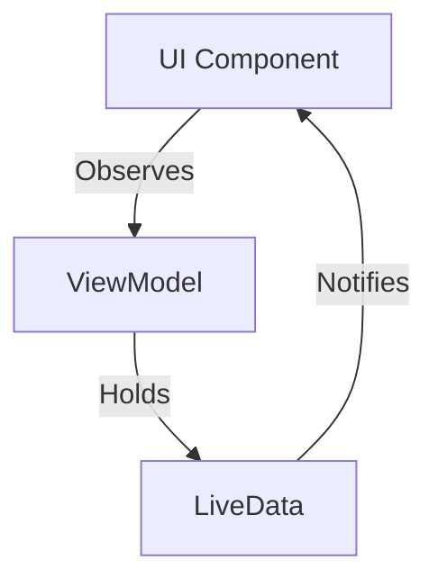

## 9.7 LiveData and ViewModel Patterns in Android

In the realm of Android development, managing UI-related data in a lifecycle-conscious way is crucial for creating robust and responsive applications. The LiveData and ViewModel patterns, part of the Android Architecture Components, provide a powerful framework for building lifecycle-aware data streams and maintaining UI data across configuration changes. In this section, we will delve into these patterns, exploring their concepts, implementation, and best practices.

### Introduction to LiveData and ViewModel

LiveData and ViewModel are integral components of the Android Architecture Components, designed to help developers build applications that are more robust, testable, and maintainable. They work together to handle UI-related data in a lifecycle-aware manner, ensuring that the data survives configuration changes such as screen rotations.

#### LiveData

**LiveData** is an observable data holder class. Unlike a regular observable, LiveData is lifecycle-aware, meaning it respects the lifecycle of other app components, such as activities, fragments, or services. This awareness ensures that LiveData only updates app component observers that are in an active lifecycle state.

##### Key Features of LiveData

- **Lifecycle Awareness**: LiveData is aware of the lifecycle state of its observers, ensuring updates are only sent to active observers.
- **Automatic Cleanup**: Observers are automatically removed when their associated lifecycle is destroyed.
- **No Memory Leaks**: Since LiveData is lifecycle-aware, it helps prevent memory leaks by automatically removing observers when they are no longer needed.
- **UI Consistency**: LiveData ensures that the UI matches the data state by notifying observers when data changes.

#### ViewModel

**ViewModel** is a class designed to store and manage UI-related data in a lifecycle-conscious way. The ViewModel class allows data to survive configuration changes such as screen rotations. It acts as a bridge between the UI controllers (like activities and fragments) and the data model, providing a clean separation of concerns.

##### Key Features of ViewModel

- **Lifecycle Awareness**: ViewModel objects are automatically retained during configuration changes, ensuring that data is not lost.
- **Separation of Concerns**: ViewModel separates UI data from UI controllers, promoting a cleaner architecture.
- **Data Persistence**: ViewModel retains data during configuration changes, reducing the need for complex data handling in UI controllers.

### Implementing LiveData and ViewModel in Android

To effectively implement LiveData and ViewModel in your Android applications, follow these steps:

#### Step 1: Add Dependencies

Ensure that your project includes the necessary dependencies for LiveData and ViewModel. Add the following lines to your `build.gradle` file:

```groovy
dependencies {
    def lifecycle_version = "2.4.0"
    implementation "androidx.lifecycle:lifecycle-viewmodel-ktx:$lifecycle_version"
    implementation "androidx.lifecycle:lifecycle-livedata-ktx:$lifecycle_version"
}
```

#### Step 2: Create a ViewModel

Create a ViewModel class to hold your UI-related data. The ViewModel class should extend `ViewModel` from the Android Architecture Components.

```kotlin
import androidx.lifecycle.ViewModel
import androidx.lifecycle.MutableLiveData

class MyViewModel : ViewModel() {
    val data: MutableLiveData<String> = MutableLiveData()

    fun updateData(newData: String) {
        data.value = newData
    }
}
```

In this example, `MyViewModel` holds a `MutableLiveData` object that represents a piece of data that the UI will observe.

#### Step 3: Use LiveData in the UI

In your activity or fragment, observe the LiveData object from the ViewModel. This ensures that the UI updates automatically when the data changes.

```kotlin
import androidx.activity.viewModels
import androidx.appcompat.app.AppCompatActivity
import android.os.Bundle
import androidx.lifecycle.Observer

class MainActivity : AppCompatActivity() {

    private val viewModel: MyViewModel by viewModels()

    override fun onCreate(savedInstanceState: Bundle?) {
        super.onCreate(savedInstanceState)
        setContentView(R.layout.activity_main)

        viewModel.data.observe(this, Observer { newData ->
            // Update the UI with the new data
            textView.text = newData
        })
    }
}
```

Here, the `MainActivity` observes the `data` LiveData from `MyViewModel`. Whenever `data` changes, the observer updates the UI accordingly.

### Lifecycle-Aware Data Streams

LiveData's lifecycle awareness is one of its most powerful features. It ensures that updates are only sent to active observers, preventing unnecessary updates and potential crashes.

#### Lifecycle States

Understanding lifecycle states is crucial when working with LiveData. The lifecycle of an activity or fragment consists of several states, such as `CREATED`, `STARTED`, `RESUMED`, `PAUSED`, `STOPPED`, and `DESTROYED`. LiveData only notifies observers when they are in an active state (`STARTED` or `RESUMED`).

#### Automatic Cleanup

LiveData automatically removes observers when their associated lifecycle is destroyed. This prevents memory leaks and ensures that your application remains efficient.

### Advanced LiveData Usage

While basic usage of LiveData involves observing data changes, there are more advanced techniques you can employ to enhance your application's architecture.

#### MediatorLiveData

**MediatorLiveData** is a subclass of LiveData that can observe other LiveData objects and react to their changes. It allows you to combine multiple LiveData sources into one.

```kotlin
import androidx.lifecycle.MediatorLiveData

val liveData1 = MutableLiveData<String>()
val liveData2 = MutableLiveData<String>()
val mediatorLiveData = MediatorLiveData<String>()

mediatorLiveData.addSource(liveData1) { value ->
    mediatorLiveData.value = "Source 1: $value"
}

mediatorLiveData.addSource(liveData2) { value ->
    mediatorLiveData.value = "Source 2: $value"
}
```

In this example, `mediatorLiveData` observes both `liveData1` and `liveData2`, updating its value based on changes from either source.

#### Transformations

LiveData provides transformation functions, such as `map` and `switchMap`, to modify the data before it reaches the observer.

- **Map Transformation**: Transforms the data emitted by a LiveData source.

```kotlin
val transformedLiveData = Transformations.map(liveData) { value ->
    "Transformed: $value"
}
```

- **SwitchMap Transformation**: Switches to a new LiveData source based on changes in the original source.

```kotlin
val switchMappedLiveData = Transformations.switchMap(liveData) { value ->
    liveDataRepository.getLiveDataBasedOnValue(value)
}
```

### Best Practices for LiveData and ViewModel

To maximize the benefits of LiveData and ViewModel, follow these best practices:

- **Keep UI Controllers Lean**: Move business logic and data handling to the ViewModel to keep activities and fragments focused on UI rendering.
- **Use MutableLiveData Sparingly**: Expose immutable LiveData (`LiveData<T>`) to the UI and keep `MutableLiveData` private within the ViewModel.
- **Leverage Transformations**: Use `map` and `switchMap` to transform data and reduce complexity in the UI layer.
- **Test ViewModels Independently**: Since ViewModels are independent of the UI, they can be tested without relying on Android framework classes.

### Visualizing LiveData and ViewModel Interaction

To better understand the interaction between LiveData, ViewModel, and UI components, let's visualize the data flow using a Mermaid.js diagram.



**Diagram Description**: This diagram illustrates the relationship between UI components, ViewModel, and LiveData. The UI component observes the ViewModel, which holds LiveData. When LiveData changes, it notifies the UI component, prompting a UI update.

### Try It Yourself

To solidify your understanding, try modifying the code examples provided:

- **Experiment with MediatorLiveData**: Combine multiple LiveData sources and observe how changes in one source affect the combined LiveData.
- **Implement Transformations**: Use `map` and `switchMap` to transform LiveData data before it reaches the UI.
- **Create a Complex ViewModel**: Design a ViewModel that manages multiple pieces of data and uses LiveData transformations to simplify UI updates.

### Knowledge Check

Let's reinforce what we've learned with some questions:

1. What is the primary advantage of using LiveData in Android applications?
2. How does ViewModel help in managing UI-related data during configuration changes?
3. What is the purpose of MediatorLiveData?
4. How can you transform LiveData data before it reaches the observer?

### Conclusion

LiveData and ViewModel are powerful tools in the Android developer's toolkit, enabling the creation of lifecycle-aware, robust applications. By leveraging these patterns, you can ensure that your app's UI remains responsive and consistent, even in the face of configuration changes. Remember, this is just the beginning. As you progress, you'll build more complex and interactive applications. Keep experimenting, stay curious, and enjoy the journey!

## Quiz Time!



### What is LiveData primarily used for in Android?

- [x] Lifecycle-aware data observation
- [ ] Storing UI state across configuration changes
- [ ] Managing network requests
- [ ] Handling user input

> **Explanation:** LiveData is primarily used for lifecycle-aware data observation, ensuring that updates are only sent to active observers.

### How does ViewModel help with configuration changes?

- [x] Retains UI-related data
- [ ] Automatically updates the UI
- [ ] Manages network requests
- [ ] Handles user input

> **Explanation:** ViewModel retains UI-related data during configuration changes, preventing data loss.

### What is MediatorLiveData used for?

- [x] Combining multiple LiveData sources
- [ ] Transforming LiveData data
- [ ] Observing lifecycle changes
- [ ] Managing network requests

> **Explanation:** MediatorLiveData is used to combine multiple LiveData sources into one.

### Which transformation function is used to switch to a new LiveData source?

- [x] switchMap
- [ ] map
- [ ] combine
- [ ] filter

> **Explanation:** The `switchMap` transformation function is used to switch to a new LiveData source based on changes in the original source.

### What is a best practice when using LiveData in ViewModel?

- [x] Expose immutable LiveData to the UI
- [ ] Use MutableLiveData everywhere
- [ ] Keep all logic in the UI controller
- [ ] Avoid using transformations

> **Explanation:** It's a best practice to expose immutable LiveData to the UI and keep MutableLiveData private within the ViewModel.

### How does LiveData prevent memory leaks?

- [x] Automatically removes observers when lifecycle is destroyed
- [ ] Stores data in a cache
- [ ] Uses weak references
- [ ] Manages network requests

> **Explanation:** LiveData prevents memory leaks by automatically removing observers when their associated lifecycle is destroyed.

### What is the benefit of using Transformations.map?

- [x] Transforms data before it reaches the observer
- [ ] Combines multiple LiveData sources
- [ ] Observes lifecycle changes
- [ ] Manages network requests

> **Explanation:** Transformations.map is used to transform data before it reaches the observer, allowing for data manipulation.

### What is the role of the ViewModel in the MVVM architecture?

- [x] Acts as a bridge between UI and data model
- [ ] Manages network requests
- [ ] Handles user input
- [ ] Observes lifecycle changes

> **Explanation:** In the MVVM architecture, the ViewModel acts as a bridge between the UI and the data model, providing a clean separation of concerns.

### Which lifecycle states are considered active for LiveData observers?

- [x] STARTED and RESUMED
- [ ] CREATED and DESTROYED
- [ ] PAUSED and STOPPED
- [ ] INITIALIZED and TERMINATED

> **Explanation:** LiveData only notifies observers when they are in an active state, which includes STARTED and RESUMED.

### True or False: ViewModel is destroyed when the activity is destroyed.

- [ ] True
- [x] False

> **Explanation:** ViewModel is retained even when the activity is destroyed, allowing data to survive configuration changes.




