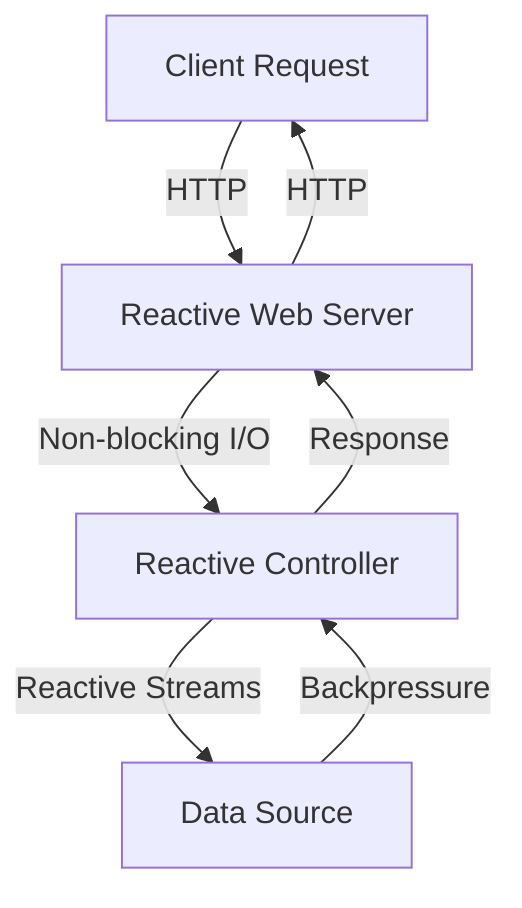

## 9.8 Web Reactive Frameworks

In the ever-evolving landscape of web development, the need for responsive, scalable, and efficient applications has driven the adoption of reactive programming paradigms. Reactive programming, with its focus on asynchronous data streams and non-blocking operations, offers a robust solution to the challenges of modern web applications. In this section, we delve into two powerful web reactive frameworks: **Ktor** and **Spring WebFlux**, both of which leverage Kotlin to build non-blocking web applications.

### Understanding Reactive Programming

Before diving into the specifics of Ktor and Spring WebFlux, let's revisit the core principles of reactive programming. At its heart, reactive programming is about building systems that react to changes, such as user inputs, data updates, or network responses, in a non-blocking and asynchronous manner. This approach leads to more responsive applications that can handle high concurrency with ease.

#### Key Concepts of Reactive Programming

1. **Asynchronous Data Streams**: Reactive programming treats data as streams that can be observed and manipulated asynchronously. This allows applications to process data as it arrives, rather than waiting for entire datasets to be available.

2. **Non-blocking Operations**: By avoiding blocking calls, reactive systems can handle more concurrent operations with fewer resources. This is achieved through the use of callbacks, promises, or reactive streams.

3. **Backpressure**: In reactive systems, backpressure is a mechanism to control the flow of data between producers and consumers, ensuring that consumers are not overwhelmed by data they cannot process in time.

4. **Responsive Systems**: Reactive applications are designed to be responsive under varying load conditions, maintaining performance and reliability.

### Ktor: A Lightweight Framework for Building Reactive Applications

Ktor is a Kotlin-based framework designed for building asynchronous servers and clients. It is lightweight, flexible, and built with coroutines, making it an excellent choice for developers looking to create reactive web applications.

#### Key Features of Ktor

- **Coroutines-Based**: Ktor leverages Kotlin's coroutines to provide a simple and efficient way to handle asynchronous programming. This makes it easy to write non-blocking code without the complexity of traditional callback-based approaches.

- **Modular Architecture**: Ktor's modular design allows developers to include only the components they need, resulting in lean and efficient applications.

- **Extensible**: With a rich ecosystem of plugins, Ktor can be easily extended to support various functionalities, such as authentication, routing, and content negotiation.

- **Built-in Testing Support**: Ktor provides tools for testing applications, making it easier to ensure the reliability and correctness of your code.

#### Building a Simple Reactive Application with Ktor

Let's walk through the process of building a simple reactive web application using Ktor. We'll create a basic REST API that responds to HTTP requests in a non-blocking manner.

##### Setting Up the Project

First, create a new Kotlin project and add the necessary dependencies for Ktor in your `build.gradle.kts` file:

```kotlin
plugins {
    kotlin("jvm") version "1.8.0"
    id("io.ktor.plugin") version "2.0.0"
}

dependencies {
    implementation("io.ktor:ktor-server-core:2.0.0")
    implementation("io.ktor:ktor-server-netty:2.0.0")
    implementation("io.ktor:ktor-server-content-negotiation:2.0.0")
    implementation("io.ktor:ktor-serialization-kotlinx-json:2.0.0")
    testImplementation("io.ktor:ktor-server-tests:2.0.0")
    testImplementation("org.jetbrains.kotlin:kotlin-test:1.8.0")
}
```

##### Creating the Application

Next, define the main application module and configure the server:

```kotlin
import io.ktor.application.*
import io.ktor.features.ContentNegotiation
import io.ktor.http.HttpStatusCode
import io.ktor.response.*
import io.ktor.routing.*
import io.ktor.serialization.*
import io.ktor.server.engine.embeddedServer
import io.ktor.server.netty.Netty

fun main() {
    embeddedServer(Netty, port = 8080) {
        install(ContentNegotiation) {
            json()
        }
        routing {
            get("/hello") {
                call.respond(HttpStatusCode.OK, mapOf("message" to "Hello, World!"))
            }
        }
    }.start(wait = true)
}
```

In this example, we set up a basic Ktor server using the Netty engine. We install the `ContentNegotiation` feature to handle JSON serialization and define a simple route that responds with a JSON message.

##### Running the Application

To run the application, execute the `main` function. The server will start on port 8080, and you can test it by navigating to `http://localhost:8080/hello` in your browser or using a tool like `curl`.

```bash
curl http://localhost:8080/hello
```

You should see the following response:

```json
{
  "message": "Hello, World!"
}
```

##### Try It Yourself

Experiment with the Ktor application by adding more routes and handling different HTTP methods (e.g., POST, PUT, DELETE). You can also explore Ktor's plugins to add features like authentication or database integration.

### Spring WebFlux: A Comprehensive Reactive Framework

Spring WebFlux is part of the Spring Framework and provides a reactive programming model for building non-blocking web applications. It is built on Project Reactor and supports the Reactive Streams API, making it a powerful choice for developers familiar with the Spring ecosystem.

#### Key Features of Spring WebFlux

- **Reactive Streams Support**: Spring WebFlux fully supports the Reactive Streams API, enabling backpressure and efficient data handling.

- **Integration with Spring Ecosystem**: WebFlux integrates seamlessly with other Spring components, such as Spring Data, Spring Security, and Spring Boot, providing a comprehensive development experience.

- **Annotation-Based Programming Model**: Like Spring MVC, WebFlux supports an annotation-based programming model, making it easy for developers to transition from traditional Spring applications.

- **Functional Endpoints**: In addition to annotations, WebFlux offers a functional programming model for defining routes and handlers, providing flexibility in how applications are structured.

#### Building a Simple Reactive Application with Spring WebFlux

Let's build a simple REST API using Spring WebFlux to demonstrate its capabilities.

##### Setting Up the Project

Create a new Spring Boot project and add the necessary dependencies for WebFlux in your `build.gradle.kts` file:

```kotlin
plugins {
    id("org.springframework.boot") version "2.6.0"
    id("io.spring.dependency-management") version "1.0.11.RELEASE"
    kotlin("jvm") version "1.8.0"
    kotlin("plugin.spring") version "1.8.0"
}

dependencies {
    implementation("org.springframework.boot:spring-boot-starter-webflux")
    implementation("org.jetbrains.kotlin:kotlin-reflect")
    implementation("org.jetbrains.kotlin:kotlin-stdlib-jdk8")
    testImplementation("org.springframework.boot:spring-boot-starter-test")
}
```

##### Creating the Application

Define a simple controller to handle HTTP requests:

```kotlin
import org.springframework.web.bind.annotation.GetMapping
import org.springframework.web.bind.annotation.RestController
import reactor.core.publisher.Mono

@RestController
class HelloController {

    @GetMapping("/hello")
    fun hello(): Mono<Map<String, String>> {
        return Mono.just(mapOf("message" to "Hello, World!"))
    }
}
```

In this example, we define a `HelloController` with a single endpoint `/hello` that returns a `Mono` of a JSON response. The `Mono` type represents a single asynchronous value or error.

##### Running the Application

Run the Spring Boot application, and the server will start on the default port 8080. You can test the endpoint using a browser or `curl`:

```bash
curl http://localhost:8080/hello
```

You should receive the following response:

```json
{
  "message": "Hello, World!"
}
```

##### Try It Yourself

Enhance the Spring WebFlux application by adding more endpoints and exploring the use of `Flux` for handling multiple values. You can also integrate with Spring Data to perform reactive database operations.

### Comparing Ktor and Spring WebFlux

Both Ktor and Spring WebFlux offer powerful tools for building reactive web applications, but they cater to different needs and preferences.

#### Ktor vs. Spring WebFlux

- **Simplicity vs. Ecosystem**: Ktor is lightweight and simple, making it ideal for small to medium-sized applications or when you want to have fine-grained control over your setup. Spring WebFlux, on the other hand, is part of the larger Spring ecosystem, offering a comprehensive suite of tools and integrations for enterprise-level applications.

- **Coroutines vs. Reactive Streams**: Ktor uses Kotlin coroutines for asynchronous programming, providing a straightforward and intuitive way to write non-blocking code. Spring WebFlux relies on Reactive Streams and Project Reactor, which can be more complex but offer powerful backpressure management.

- **Flexibility vs. Convention**: Ktor's modular design allows for high flexibility, letting you choose only the components you need. Spring WebFlux follows the Spring convention-over-configuration approach, which can speed up development by providing sensible defaults and integrations.

### Design Considerations for Reactive Web Applications

When building reactive web applications with Ktor or Spring WebFlux, consider the following design aspects:

- **Scalability**: Reactive applications are inherently more scalable due to their non-blocking nature. Ensure your architecture can handle increased load by leveraging horizontal scaling and cloud-native practices.

- **Error Handling**: Implement robust error handling strategies to manage exceptions and failures gracefully. Both Ktor and Spring WebFlux provide mechanisms for handling errors in a reactive context.

- **Testing**: Test your reactive applications thoroughly to ensure they behave correctly under various conditions. Use the testing tools provided by Ktor and Spring WebFlux to simulate different scenarios and validate your application's behavior.

- **Security**: Secure your reactive applications by implementing authentication, authorization, and data validation. Both frameworks offer plugins and integrations for common security practices.

- **Performance Monitoring**: Monitor the performance of your reactive applications to identify bottlenecks and optimize resource usage. Use tools like Prometheus, Grafana, or Spring Boot Actuator for monitoring and metrics.

### Visualizing Reactive Web Application Architecture

To better understand the architecture of a reactive web application, consider the following diagram, which illustrates the flow of data and interactions between components in a typical reactive system.



**Diagram Description**: This diagram depicts a client making an HTTP request to a reactive web server. The server processes the request using non-blocking I/O and communicates with a reactive controller. The controller interacts with a data source using reactive streams, which support backpressure to manage data flow. Finally, the controller sends a response back to the server, which returns it to the client.

### References and Further Reading

- [Reactive Streams Specification](https://www.reactive-streams.org/)
- [Ktor Documentation](https://ktor.io/docs/)
- [Spring WebFlux Documentation](https://docs.spring.io/spring-framework/docs/current/reference/html/web-reactive.html)
- [Project Reactor](https://projectreactor.io/)

### Knowledge Check

To reinforce your understanding of web reactive frameworks, consider the following questions and exercises:

1. What are the key differences between Ktor and Spring WebFlux?
2. How do coroutines in Ktor simplify asynchronous programming compared to traditional callback-based approaches?
3. Implement a new endpoint in your Ktor application that handles POST requests and returns a JSON response.
4. Explore the use of `Flux` in Spring WebFlux to handle streaming data from a database.
5. Discuss the role of backpressure in reactive programming and how it is managed in Spring WebFlux.

### Embrace the Journey

Building reactive web applications with Ktor and Spring WebFlux opens up a world of possibilities for creating responsive, scalable, and efficient systems. Remember, this is just the beginning. As you continue to explore and experiment with these frameworks, you'll gain deeper insights into the power of reactive programming. Stay curious, keep learning, and enjoy the journey!

## Quiz Time!



### What is a key feature of reactive programming?

- [x] Non-blocking operations
- [ ] Synchronous data processing
- [ ] Blocking I/O
- [ ] Single-threaded execution

> **Explanation:** Reactive programming emphasizes non-blocking operations to handle high concurrency efficiently.

### Which framework uses Kotlin coroutines for asynchronous programming?

- [x] Ktor
- [ ] Spring WebFlux
- [ ] Both Ktor and Spring WebFlux
- [ ] Neither Ktor nor Spring WebFlux

> **Explanation:** Ktor leverages Kotlin coroutines for asynchronous programming, providing a simpler approach compared to traditional callback-based methods.

### What does backpressure in reactive systems manage?

- [x] Data flow between producers and consumers
- [ ] Network latency
- [ ] CPU usage
- [ ] Memory allocation

> **Explanation:** Backpressure controls the data flow between producers and consumers, ensuring consumers are not overwhelmed by data they cannot process in time.

### Which framework is part of the larger Spring ecosystem?

- [ ] Ktor
- [x] Spring WebFlux
- [ ] Both Ktor and Spring WebFlux
- [ ] Neither Ktor nor Spring WebFlux

> **Explanation:** Spring WebFlux is part of the Spring ecosystem, offering comprehensive tools and integrations for enterprise-level applications.

### What is the primary purpose of using reactive streams in Spring WebFlux?

- [x] To enable backpressure and efficient data handling
- [ ] To simplify synchronous programming
- [ ] To increase server load
- [ ] To block I/O operations

> **Explanation:** Reactive streams in Spring WebFlux enable backpressure and efficient data handling, allowing for responsive and scalable applications.

### How does Ktor's modular architecture benefit developers?

- [x] By allowing them to include only the components they need
- [ ] By enforcing a strict set of components
- [ ] By increasing application size
- [ ] By limiting customization options

> **Explanation:** Ktor's modular architecture allows developers to include only the components they need, resulting in lean and efficient applications.

### What type of data does a `Mono` in Spring WebFlux represent?

- [x] A single asynchronous value or error
- [ ] A collection of synchronous values
- [ ] A blocking I/O operation
- [ ] A thread pool

> **Explanation:** A `Mono` in Spring WebFlux represents a single asynchronous value or error, suitable for handling single-result operations.

### Which of the following is a benefit of non-blocking operations in reactive applications?

- [x] Improved scalability and responsiveness
- [ ] Increased CPU usage
- [ ] Reduced concurrency
- [ ] Slower response times

> **Explanation:** Non-blocking operations improve scalability and responsiveness by allowing applications to handle more concurrent operations with fewer resources.

### What is a common use case for using `Flux` in Spring WebFlux?

- [x] Handling multiple values or streaming data
- [ ] Blocking I/O operations
- [ ] Synchronous data processing
- [ ] Single-threaded execution

> **Explanation:** `Flux` in Spring WebFlux is used for handling multiple values or streaming data, making it suitable for scenarios where multiple results are expected.

### True or False: Ktor and Spring WebFlux both support the Reactive Streams API.

- [ ] True
- [x] False

> **Explanation:** Only Spring WebFlux supports the Reactive Streams API. Ktor uses Kotlin coroutines for asynchronous programming.


