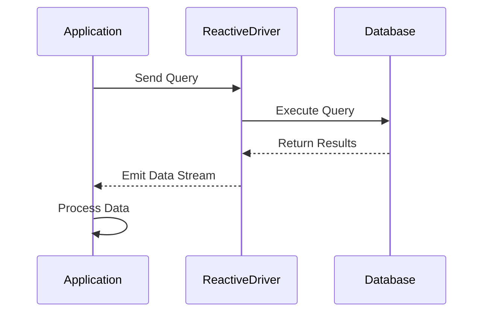

## 9.9 Reactive Databases

In the rapidly evolving landscape of software development, the demand for responsive and scalable applications is ever-increasing. Reactive programming has emerged as a powerful paradigm to meet these demands, especially when dealing with databases. In this section, we will explore the integration of reactive databases with Kotlin, focusing on R2DBC (Reactive Relational Database Connectivity) and NoSQL databases. We will delve into the concepts, provide practical examples, and offer insights into building efficient applications using reactive programming patterns.

### Understanding Reactive Programming

Before diving into reactive databases, it's essential to understand the core principles of reactive programming. Reactive programming is a paradigm that focuses on asynchronous data streams and the propagation of change. It allows developers to write code that reacts to changes in data, making applications more responsive and scalable.

#### Key Concepts of Reactive Programming

- **Asynchronous Data Streams**: Reactive programming deals with data streams that can emit items asynchronously. These streams can be finite or infinite and can emit zero or more items over time.
  
- **Backpressure**: This is a mechanism to handle situations where the producer of data is faster than the consumer. It ensures that the system remains stable by controlling the flow of data.

- **Event-Driven Architecture**: Reactive systems are inherently event-driven, where components communicate through events rather than direct method calls.

- **Non-blocking I/O**: Reactive programming leverages non-blocking I/O operations to improve performance and scalability.

### Reactive Databases: An Overview

Reactive databases are designed to work seamlessly with reactive programming paradigms. They provide non-blocking access to data, enabling applications to handle a large number of concurrent operations efficiently. Reactive databases can be broadly categorized into two types:

1. **Reactive Relational Databases**: These databases use R2DBC to provide reactive access to traditional relational databases like PostgreSQL, MySQL, and others.

2. **Reactive NoSQL Databases**: These databases are inherently designed for scalability and flexibility, offering reactive access to data. Examples include MongoDB, Cassandra, and Couchbase.

### Integrating with R2DBC

R2DBC (Reactive Relational Database Connectivity) is a specification that provides a reactive API for relational databases. It allows developers to interact with databases in a non-blocking manner, making it ideal for building reactive applications.

#### Key Features of R2DBC

- **Non-blocking API**: R2DBC provides a non-blocking API for interacting with relational databases, enabling applications to handle more concurrent requests.

- **Backpressure Support**: R2DBC supports backpressure, allowing applications to control the flow of data and prevent overwhelming the system.

- **Asynchronous Execution**: Queries are executed asynchronously, freeing up resources and improving application responsiveness.

#### Setting Up R2DBC with Kotlin

To get started with R2DBC in Kotlin, you need to include the necessary dependencies in your project. Here's an example of how to set up a Kotlin project with R2DBC:

```kotlin
dependencies {
    implementation("org.springframework.boot:spring-boot-starter-data-r2dbc")
    implementation("io.r2dbc:r2dbc-postgresql")
    implementation("org.jetbrains.kotlin:kotlin-reflect")
    implementation("org.jetbrains.kotlin:kotlin-stdlib-jdk8")
}
```

#### Connecting to a Database

Once the dependencies are set up, you can connect to a database using R2DBC. Here's an example of how to connect to a PostgreSQL database:

```kotlin
import io.r2dbc.spi.ConnectionFactory
import io.r2dbc.spi.ConnectionFactories
import io.r2dbc.spi.ConnectionFactoryOptions
import io.r2dbc.spi.Option

val connectionFactory: ConnectionFactory = ConnectionFactories.get(
    ConnectionFactoryOptions.builder()
        .option(ConnectionFactoryOptions.DRIVER, "postgresql")
        .option(ConnectionFactoryOptions.HOST, "localhost")
        .option(ConnectionFactoryOptions.PORT, 5432)
        .option(ConnectionFactoryOptions.USER, "user")
        .option(ConnectionFactoryOptions.PASSWORD, "password")
        .option(ConnectionFactoryOptions.DATABASE, "mydatabase")
        .build()
)
```

#### Executing Queries

With the connection established, you can execute queries using R2DBC. Here's an example of how to perform a simple query:

```kotlin
import reactor.core.publisher.Flux

val sql = "SELECT * FROM users"
val result: Flux<User> = connectionFactory.create()
    .flatMapMany { connection ->
        connection.createStatement(sql)
            .execute()
            .flatMap { result ->
                result.map { row, _ ->
                    User(
                        id = row.get("id", Long::class.java) ?: 0L,
                        name = row.get("name", String::class.java) ?: ""
                    )
                }
            }
            .doFinally { connection.close() }
    }

result.subscribe { user ->
    println("User: $user")
}
```

In this example, we use `Flux` from Project Reactor to handle the asynchronous data stream. The query is executed, and the results are mapped to a `User` object.

### Integrating with Reactive NoSQL Databases

NoSQL databases are known for their scalability and flexibility, making them a popular choice for modern applications. Many NoSQL databases offer reactive drivers, allowing seamless integration with reactive programming paradigms.

#### MongoDB: A Reactive NoSQL Database

MongoDB is a widely used NoSQL database that provides a reactive driver for non-blocking access to data. Let's explore how to integrate MongoDB with Kotlin using its reactive driver.

##### Setting Up MongoDB Reactive Driver

To use the MongoDB reactive driver, add the following dependencies to your project:

```kotlin
dependencies {
    implementation("org.springframework.boot:spring-boot-starter-data-mongodb-reactive")
    implementation("org.jetbrains.kotlin:kotlin-reflect")
    implementation("org.jetbrains.kotlin:kotlin-stdlib-jdk8")
}
```

##### Connecting to MongoDB

Here's an example of how to connect to a MongoDB database using the reactive driver:

```kotlin
import com.mongodb.reactivestreams.client.MongoClients
import com.mongodb.reactivestreams.client.MongoClient

val mongoClient: MongoClient = MongoClients.create("mongodb://localhost:27017")
val database = mongoClient.getDatabase("mydatabase")
```

##### Performing CRUD Operations

With the connection established, you can perform CRUD (Create, Read, Update, Delete) operations using the reactive driver. Here's an example of how to insert a document into a collection:

```kotlin
import com.mongodb.client.model.Filters
import com.mongodb.reactivestreams.client.MongoCollection
import org.bson.Document
import reactor.core.publisher.Mono

val collection: MongoCollection<Document> = database.getCollection("users")

val document = Document("name", "John Doe").append("age", 30)

val insertMono: Mono<Void> = Mono.from(collection.insertOne(document))

insertMono.subscribe {
    println("Document inserted successfully")
}
```

In this example, we use `Mono` from Project Reactor to handle the asynchronous operation of inserting a document into the MongoDB collection.

### Visualizing Reactive Database Interactions

To better understand how reactive databases interact with applications, let's visualize the flow of data using a Mermaid.js sequence diagram.



**Figure 1: Reactive Database Interaction Flow**

This diagram illustrates the flow of data in a reactive database interaction. The application sends a query to the reactive driver, which executes it on the database. The database returns the results, which are emitted as a data stream to the application for processing.

### Design Considerations for Reactive Databases

When integrating reactive databases into your applications, there are several design considerations to keep in mind:

- **Scalability**: Reactive databases are designed to handle a large number of concurrent operations. Ensure that your application is architected to take advantage of this scalability.

- **Error Handling**: Reactive programming introduces new challenges in error handling. Use mechanisms like `onErrorResume` and `onErrorReturn` to handle errors gracefully.

- **Backpressure Management**: Implement backpressure strategies to prevent overwhelming the system. Use operators like `buffer`, `window`, and `throttle` to control the flow of data.

- **Testing**: Testing reactive applications can be challenging due to their asynchronous nature. Use tools like `StepVerifier` from Project Reactor to test reactive streams.

### Differences and Similarities with Traditional Databases

Reactive databases differ from traditional databases in several key ways:

- **Non-blocking Access**: Unlike traditional databases, reactive databases provide non-blocking access to data, improving performance and scalability.

- **Asynchronous Execution**: Queries in reactive databases are executed asynchronously, freeing up resources and improving responsiveness.

- **Backpressure Support**: Reactive databases support backpressure, allowing applications to control the flow of data.

Despite these differences, reactive databases share similarities with traditional databases, such as support for transactions, indexing, and querying capabilities.

### Try It Yourself

To solidify your understanding of reactive databases, try modifying the code examples provided in this section. Experiment with different queries, data models, and backpressure strategies to see how they affect the performance and scalability of your application. Remember, the best way to learn is by doing, so don't hesitate to dive in and explore the possibilities of reactive databases in Kotlin.

### Conclusion

Reactive databases offer a powerful way to build scalable and responsive applications. By integrating R2DBC and reactive NoSQL databases with Kotlin, you can take advantage of the benefits of reactive programming to handle a large number of concurrent operations efficiently. As you continue to explore the world of reactive programming, remember to experiment, stay curious, and enjoy the journey.

## Quiz Time!



### What is a key feature of reactive programming?

- [x] Asynchronous data streams
- [ ] Synchronous execution
- [ ] Blocking I/O operations
- [ ] Single-threaded execution

> **Explanation:** Reactive programming focuses on asynchronous data streams, allowing applications to react to changes in data efficiently.

### What does R2DBC stand for?

- [x] Reactive Relational Database Connectivity
- [ ] Relational Database Connectivity
- [ ] Reactive Database Connection
- [ ] Relational Database Connection

> **Explanation:** R2DBC stands for Reactive Relational Database Connectivity, providing a reactive API for relational databases.

### Which of the following is a reactive NoSQL database?

- [x] MongoDB
- [ ] MySQL
- [ ] PostgreSQL
- [ ] Oracle

> **Explanation:** MongoDB is a NoSQL database that offers a reactive driver for non-blocking access to data.

### What is backpressure in reactive programming?

- [x] A mechanism to control the flow of data
- [ ] A method to increase data throughput
- [ ] A technique to block data streams
- [ ] A way to prioritize data processing

> **Explanation:** Backpressure is a mechanism in reactive programming to control the flow of data and prevent overwhelming the system.

### How do you connect to a PostgreSQL database using R2DBC?

- [x] Using ConnectionFactoryOptions
- [ ] Using JDBC
- [ ] Using MongoClient
- [ ] Using SQLAlchemy

> **Explanation:** R2DBC uses `ConnectionFactoryOptions` to establish a connection to a PostgreSQL database.

### What is the purpose of the `Mono` type in Project Reactor?

- [x] To handle asynchronous operations that emit a single item
- [ ] To handle synchronous operations
- [ ] To manage database connections
- [ ] To execute blocking I/O

> **Explanation:** `Mono` is a type in Project Reactor used to handle asynchronous operations that emit a single item or complete without emitting any item.

### Which operator can be used to implement backpressure in reactive streams?

- [x] Buffer
- [ ] Map
- [ ] FlatMap
- [ ] Filter

> **Explanation:** The `buffer` operator can be used to implement backpressure by controlling the flow of data in reactive streams.

### What is a common challenge when testing reactive applications?

- [x] Asynchronous nature of operations
- [ ] Lack of testing frameworks
- [ ] Limited database support
- [ ] Inability to handle errors

> **Explanation:** The asynchronous nature of operations in reactive applications can make testing challenging, requiring specialized tools and techniques.

### What is a benefit of using reactive databases?

- [x] Improved scalability and responsiveness
- [ ] Simplified synchronous execution
- [ ] Reduced need for error handling
- [ ] Increased blocking operations

> **Explanation:** Reactive databases improve scalability and responsiveness by providing non-blocking access to data and supporting asynchronous execution.

### True or False: Reactive databases do not support transactions.

- [ ] True
- [x] False

> **Explanation:** Reactive databases do support transactions, similar to traditional databases, allowing for consistent and reliable data operations.


