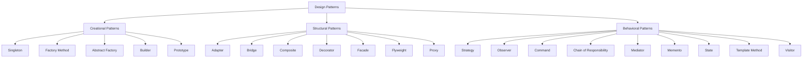

## 1.1 What Are Design Patterns?

### Definition and Purpose

Design patterns are a crucial concept in software engineering, offering reusable solutions to common problems encountered during software design. They provide a template for how to solve a problem that can be used in many different situations. By using design patterns, developers can create more flexible, reusable, and maintainable code.

In essence, design patterns are about capturing design expertise in a form that can be reused. They allow developers to communicate using well-understood names for software interactions, making it easier to discuss potential solutions and their trade-offs. This shared vocabulary can significantly enhance collaboration and understanding within development teams.

### Historical Context

The concept of design patterns in software engineering was popularized by the "Gang of Four" (GoF) book, *Design Patterns: Elements of Reusable Object-Oriented Software*, published in 1994. The authors—Erich Gamma, Richard Helm, Ralph Johnson, and John Vlissides—introduced 23 classic design patterns that have since become a cornerstone of software development.

The idea of design patterns, however, originated from the field of architecture. Christopher Alexander, an architect, introduced the concept of patterns in his book *A Pattern Language*, which described a set of design solutions for common architectural problems. The GoF adapted these ideas to software engineering, recognizing that similar patterns could be applied to recurring problems in software design.

### Types of Design Patterns

Design patterns are generally categorized into three main types: creational, structural, and behavioral patterns. Each category addresses a different aspect of software design.

#### Creational Patterns

Creational patterns deal with object creation mechanisms, trying to create objects in a manner suitable to the situation. The basic form of object creation could result in design problems or added complexity to the design. Creational design patterns solve this problem by controlling the object creation process.

- **Singleton Pattern**: Ensures a class has only one instance and provides a global point of access to it.
- **Factory Method Pattern**: Defines an interface for creating an object, but lets subclasses alter the type of objects that will be created.
- **Abstract Factory Pattern**: Provides an interface for creating families of related or dependent objects without specifying their concrete classes.
- **Builder Pattern**: Separates the construction of a complex object from its representation, allowing the same construction process to create different representations.
- **Prototype Pattern**: Creates new objects by copying an existing object, known as the prototype.

#### Structural Patterns

Structural patterns are concerned with how classes and objects are composed to form larger structures. They help ensure that if one part of a system changes, the entire system doesn't need to do the same.

- **Adapter Pattern**: Allows the interface of an existing class to be used as another interface.
- **Bridge Pattern**: Separates an object’s abstraction from its implementation so that the two can vary independently.
- **Composite Pattern**: Composes objects into tree structures to represent part-whole hierarchies.
- **Decorator Pattern**: Adds additional responsibilities to an object dynamically.
- **Facade Pattern**: Provides a simplified interface to a complex subsystem.
- **Flyweight Pattern**: Reduces the cost of creating and manipulating a large number of similar objects.
- **Proxy Pattern**: Provides a surrogate or placeholder for another object to control access to it.

#### Behavioral Patterns

Behavioral patterns are concerned with algorithms and the assignment of responsibilities between objects. They help make the interaction between objects more flexible and efficient.

- **Strategy Pattern**: Defines a family of algorithms, encapsulates each one, and makes them interchangeable.
- **Observer Pattern**: Defines a one-to-many dependency between objects so that when one object changes state, all its dependents are notified and updated automatically.
- **Command Pattern**: Encapsulates a request as an object, thereby allowing for parameterization of clients with queues, requests, and operations.
- **Chain of Responsibility Pattern**: Passes a request along a chain of handlers, allowing each handler to either process the request or pass it to the next handler in the chain.
- **Mediator Pattern**: Defines an object that encapsulates how a set of objects interact.
- **Memento Pattern**: Captures and externalizes an object’s internal state so that the object can be restored to this state later.
- **State Pattern**: Allows an object to alter its behavior when its internal state changes.
- **Template Method Pattern**: Defines the skeleton of an algorithm in an operation, deferring some steps to subclasses.
- **Visitor Pattern**: Represents an operation to be performed on the elements of an object structure, allowing you to define a new operation without changing the classes of the elements on which it operates.

### Code Examples

To better understand how design patterns work, let's look at a simple example using the Singleton pattern in Lua. The Singleton pattern ensures that a class has only one instance and provides a global point of access to it.

```lua
-- Singleton Pattern in Lua

local Singleton = {}
Singleton.__index = Singleton

-- Private variable to hold the single instance
local instance

-- Private constructor
local function new()
    local self = setmetatable({}, Singleton)
    -- Initialize your instance variables here
    self.value = 0
    return self
end

-- Public method to get the single instance
function Singleton:getInstance()
    if not instance then
        instance = new()
    end
    return instance
end

-- Example usage
local singleton1 = Singleton:getInstance()
singleton1.value = 10

local singleton2 = Singleton:getInstance()
print(singleton2.value)  -- Output: 10, proving both are the same instance
```

**Try It Yourself**: Modify the Singleton pattern to include a method that increments the `value` by a given number. Test it by calling this method from different instances and observe the changes.

### Visualizing Design Patterns

To help visualize how design patterns fit into software architecture, consider the following diagram that illustrates the relationship between different types of design patterns and their roles in software design.



**Diagram Description**: This diagram categorizes design patterns into creational, structural, and behavioral types, showing how each pattern fits into the broader design pattern landscape.

### References and Links

For further reading on design patterns, consider exploring the following resources:

- [Design Patterns: Elements of Reusable Object-Oriented Software](https://en.wikipedia.org/wiki/Design_Patterns) by the Gang of Four.
- [Refactoring Guru: Design Patterns](https://refactoring.guru/design-patterns)
- [MDN Web Docs: Design Patterns](https://developer.mozilla.org/en-US/docs/Web/JavaScript/Guide/Design_Patterns)

### Knowledge Check

To reinforce your understanding of design patterns, consider the following questions:

- What are the main benefits of using design patterns in software development?
- How do creational patterns differ from structural patterns?
- Can you think of a real-world analogy for the Observer pattern?

### Embrace the Journey

Remember, mastering design patterns is a journey. As you continue to explore and apply these patterns, you'll find that they become an invaluable part of your software development toolkit. Keep experimenting, stay curious, and enjoy the process of learning and growing as a developer.

## Quiz Time!



### What is the primary purpose of design patterns in software development?

- [x] To provide reusable solutions to common design problems
- [ ] To enforce strict coding standards
- [ ] To replace the need for documentation
- [ ] To automate code generation

> **Explanation:** Design patterns offer reusable solutions to common software design problems, helping developers create more flexible and maintainable code.

### Which book popularized the concept of design patterns in software engineering?

- [x] Design Patterns: Elements of Reusable Object-Oriented Software
- [ ] The Pragmatic Programmer
- [ ] Clean Code
- [ ] Code Complete

> **Explanation:** The book "Design Patterns: Elements of Reusable Object-Oriented Software" by the Gang of Four introduced and popularized design patterns in software engineering.

### What are the three main categories of design patterns?

- [x] Creational, Structural, Behavioral
- [ ] Functional, Procedural, Object-Oriented
- [ ] Static, Dynamic, Hybrid
- [ ] Abstract, Concrete, Virtual

> **Explanation:** Design patterns are categorized into creational, structural, and behavioral patterns, each addressing different aspects of software design.

### Which pattern ensures a class has only one instance?

- [x] Singleton Pattern
- [ ] Factory Method Pattern
- [ ] Observer Pattern
- [ ] Strategy Pattern

> **Explanation:** The Singleton pattern ensures that a class has only one instance and provides a global point of access to it.

### What is the main focus of structural design patterns?

- [x] How classes and objects are composed to form larger structures
- [ ] How objects are created
- [ ] How objects interact with each other
- [ ] How to encapsulate algorithms

> **Explanation:** Structural patterns focus on how classes and objects are composed to form larger structures, ensuring flexibility and efficiency.

### Which pattern allows an object to alter its behavior when its internal state changes?

- [x] State Pattern
- [ ] Observer Pattern
- [ ] Strategy Pattern
- [ ] Command Pattern

> **Explanation:** The State pattern allows an object to change its behavior when its internal state changes, making it appear as if the object has changed its class.

### What is the role of the Factory Method pattern?

- [x] To define an interface for creating an object, but let subclasses alter the type of objects that will be created
- [ ] To ensure a class has only one instance
- [ ] To add additional responsibilities to an object dynamically
- [ ] To encapsulate a request as an object

> **Explanation:** The Factory Method pattern defines an interface for creating an object, but lets subclasses alter the type of objects that will be created.

### Which pattern provides a simplified interface to a complex subsystem?

- [x] Facade Pattern
- [ ] Adapter Pattern
- [ ] Proxy Pattern
- [ ] Composite Pattern

> **Explanation:** The Facade pattern provides a simplified interface to a complex subsystem, making it easier to use.

### What is the main advantage of using the Observer pattern?

- [x] It defines a one-to-many dependency between objects, allowing automatic updates
- [ ] It encapsulates a request as an object
- [ ] It separates an object’s abstraction from its implementation
- [ ] It allows an object to alter its behavior when its internal state changes

> **Explanation:** The Observer pattern defines a one-to-many dependency between objects so that when one object changes state, all its dependents are notified and updated automatically.

### True or False: Design patterns eliminate the need for documentation.

- [ ] True
- [x] False

> **Explanation:** Design patterns do not eliminate the need for documentation. They provide a common vocabulary and solutions for design problems, but documentation is still necessary for understanding and maintaining code.


