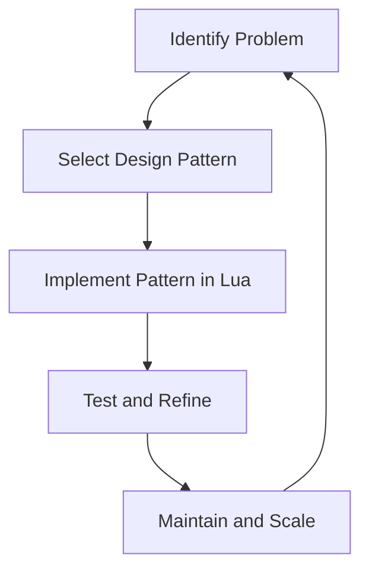

## 1.2 The Relevance of Design Patterns in Lua

In the realm of software development, design patterns serve as time-tested solutions to common problems. They provide a blueprint for structuring code in a way that is both efficient and maintainable. When it comes to Lua, a lightweight and flexible scripting language, the relevance of design patterns becomes even more pronounced. In this section, we will delve into the dynamic nature of Lua, compare its usage of design patterns with systems languages like C++ or Java, and explore the benefits these patterns bring to Lua development.

### Dynamic Nature of Lua

Lua is renowned for its simplicity and flexibility, making it a popular choice for embedding within applications, game development, and scripting. Its dynamic nature allows developers to write concise and expressive code. However, this flexibility can also lead to challenges in maintaining large codebases. This is where design patterns come into play.

#### Impact on Design Patterns

The dynamic features of Lua, such as first-class functions, metatables, and coroutines, influence how design patterns are implemented. These features allow for more elegant and concise implementations of patterns compared to statically typed languages. For instance, Lua's first-class functions enable easy implementation of the Strategy pattern, while metatables facilitate the Proxy pattern.

Let's explore how Lua's dynamic nature impacts the implementation of some common design patterns:

- **Strategy Pattern**: Lua's first-class functions make it straightforward to implement the Strategy pattern. You can pass functions as arguments, store them in tables, and invoke them dynamically.

  ```lua
  -- Define strategies as functions
  local function strategyA()
      print("Executing Strategy A")
  end

  local function strategyB()
      print("Executing Strategy B")
  end

  -- Context that uses a strategy
  local function executeStrategy(strategy)
      strategy()
  end

  -- Use different strategies
  executeStrategy(strategyA)  -- Output: Executing Strategy A
  executeStrategy(strategyB)  -- Output: Executing Strategy B
  ```

- **Proxy Pattern**: Metatables in Lua allow you to intercept and modify table operations, making it ideal for implementing the Proxy pattern.

  ```lua
  local realSubject = { data = "Real Data" }

  local proxy = setmetatable({}, {
      __index = function(_, key)
          print("Accessing key:", key)
          return realSubject[key]
      end
  })

  print(proxy.data)  -- Output: Accessing key: data
                     --         Real Data
  ```

- **Observer Pattern**: Lua's tables and functions can be combined to create a simple and effective Observer pattern.

  ```lua
  local subject = {}
  local observers = {}

  function subject:registerObserver(observer)
      table.insert(observers, observer)
  end

  function subject:notifyObservers()
      for _, observer in ipairs(observers) do
          observer:update()
      end
  end

  -- Example observer
  local observer1 = {
      update = function()
          print("Observer 1 notified")
      end
  }

  subject:registerObserver(observer1)
  subject:notifyObservers()  -- Output: Observer 1 notified
  ```

### Scripting vs. Systems Languages

Lua is often compared to systems languages like C++ or Java, which are statically typed and compiled. These languages have a different approach to design patterns due to their type systems and performance considerations.

#### Comparing Usage of Patterns

- **Flexibility vs. Structure**: Lua's dynamic typing offers flexibility, allowing for more creative implementations of patterns. In contrast, C++ and Java require more boilerplate code due to their static type systems.

- **Performance Considerations**: Systems languages often focus on performance optimization, which can influence the choice and implementation of design patterns. Lua, being an interpreted language, emphasizes simplicity and ease of use.

- **Code Readability**: Design patterns in Lua can be more readable and concise, thanks to its expressive syntax. However, this can also lead to less structured code if not used carefully.

#### Example: Singleton Pattern

In C++ or Java, implementing a Singleton pattern involves ensuring thread safety and managing instance creation. In Lua, the implementation is simpler due to its dynamic nature.

```lua
-- Singleton pattern in Lua
local Singleton = {}
Singleton.__index = Singleton

function Singleton:new()
    if not Singleton.instance then
        Singleton.instance = setmetatable({}, Singleton)
    end
    return Singleton.instance
end

-- Usage
local instance1 = Singleton:new()
local instance2 = Singleton:new()

print(instance1 == instance2)  -- Output: true
```

### Benefits in Lua Development

Design patterns offer numerous benefits in Lua development, enhancing code quality and maintainability.

#### Improving Code Quality

- **Consistency**: Design patterns provide a consistent approach to solving common problems, making the codebase easier to understand and maintain.

- **Reusability**: Patterns encourage code reuse, reducing duplication and promoting modularity.

- **Scalability**: By using design patterns, developers can build scalable Lua applications that can grow and evolve over time.

#### Enhancing Maintainability

- **Simplified Debugging**: Patterns offer a clear structure, making it easier to identify and fix bugs.

- **Ease of Collaboration**: With a common vocabulary and structure, design patterns facilitate collaboration among developers.

- **Future-Proofing**: Patterns help in designing systems that are adaptable to future changes and requirements.

### Visualizing Design Patterns in Lua

To better understand the relevance of design patterns in Lua, let's visualize how they fit into the development process.



**Figure 1**: Visualizing the integration of design patterns in the Lua development process.

### Try It Yourself

Experiment with the code examples provided. Try modifying the strategies in the Strategy pattern or adding more observers in the Observer pattern. Observe how these changes affect the behavior of the code.

### References and Further Reading

- [Lua Programming Guide](https://www.lua.org/manual/5.4/)
- [Design Patterns: Elements of Reusable Object-Oriented Software](https://en.wikipedia.org/wiki/Design_Patterns)
- [MDN Web Docs on Design Patterns](https://developer.mozilla.org/en-US/docs/Web/JavaScript/Guide/Design_Patterns)

### Knowledge Check

- What are the benefits of using design patterns in Lua?
- How does Lua's dynamic nature influence the implementation of design patterns?
- Compare the usage of design patterns in Lua with C++ or Java.

### Embrace the Journey

Remember, mastering design patterns in Lua is a journey. As you continue to explore and experiment, you'll gain a deeper understanding of how to build robust and maintainable applications. Keep learning, stay curious, and enjoy the process!

## Quiz Time!



### What is a key benefit of using design patterns in Lua?

- [x] They provide a consistent approach to solving common problems.
- [ ] They increase the complexity of the code.
- [ ] They make the code less readable.
- [ ] They are only useful in statically typed languages.

> **Explanation:** Design patterns offer a consistent approach to solving common problems, enhancing code quality and maintainability.

### How does Lua's dynamic nature impact design pattern implementation?

- [x] It allows for more elegant and concise implementations.
- [ ] It makes patterns harder to implement.
- [ ] It requires more boilerplate code.
- [ ] It limits the use of patterns.

> **Explanation:** Lua's dynamic features, such as first-class functions and metatables, enable more elegant and concise implementations of design patterns.

### Which Lua feature is particularly useful for implementing the Proxy pattern?

- [x] Metatables
- [ ] Coroutines
- [ ] First-class functions
- [ ] Tables

> **Explanation:** Metatables in Lua allow you to intercept and modify table operations, making them ideal for implementing the Proxy pattern.

### In Lua, what makes the Strategy pattern easy to implement?

- [x] First-class functions
- [ ] Static typing
- [ ] Complex syntax
- [ ] Lack of flexibility

> **Explanation:** Lua's first-class functions enable easy implementation of the Strategy pattern by allowing functions to be passed as arguments and invoked dynamically.

### How does the Singleton pattern in Lua differ from its implementation in C++ or Java?

- [x] It is simpler due to Lua's dynamic nature.
- [ ] It requires more code.
- [ ] It is more complex.
- [ ] It is not possible in Lua.

> **Explanation:** The Singleton pattern in Lua is simpler due to its dynamic nature, which eliminates the need for complex instance management.

### What is a challenge of using design patterns in Lua?

- [x] They can lead to less structured code if not used carefully.
- [ ] They are not applicable to Lua.
- [ ] They always increase code complexity.
- [ ] They are only useful in large projects.

> **Explanation:** While design patterns enhance code quality, Lua's flexibility can lead to less structured code if patterns are not used carefully.

### Why are design patterns beneficial for collaboration among developers?

- [x] They provide a common vocabulary and structure.
- [ ] They make the code more complex.
- [ ] They are only useful for individual developers.
- [ ] They reduce code readability.

> **Explanation:** Design patterns provide a common vocabulary and structure, facilitating collaboration among developers.

### What is a benefit of using design patterns for future-proofing applications?

- [x] They help design systems adaptable to future changes.
- [ ] They make the code harder to modify.
- [ ] They limit the application's scalability.
- [ ] They are only useful for current requirements.

> **Explanation:** Design patterns help in designing systems that are adaptable to future changes and requirements.

### How do design patterns enhance code maintainability?

- [x] By providing a clear structure for easier debugging.
- [ ] By increasing code complexity.
- [ ] By making the code less readable.
- [ ] By limiting code reuse.

> **Explanation:** Design patterns offer a clear structure, making it easier to identify and fix bugs, thus enhancing maintainability.

### True or False: Design patterns are only useful in statically typed languages.

- [ ] True
- [x] False

> **Explanation:** Design patterns are applicable and beneficial in both dynamically and statically typed languages, including Lua.




