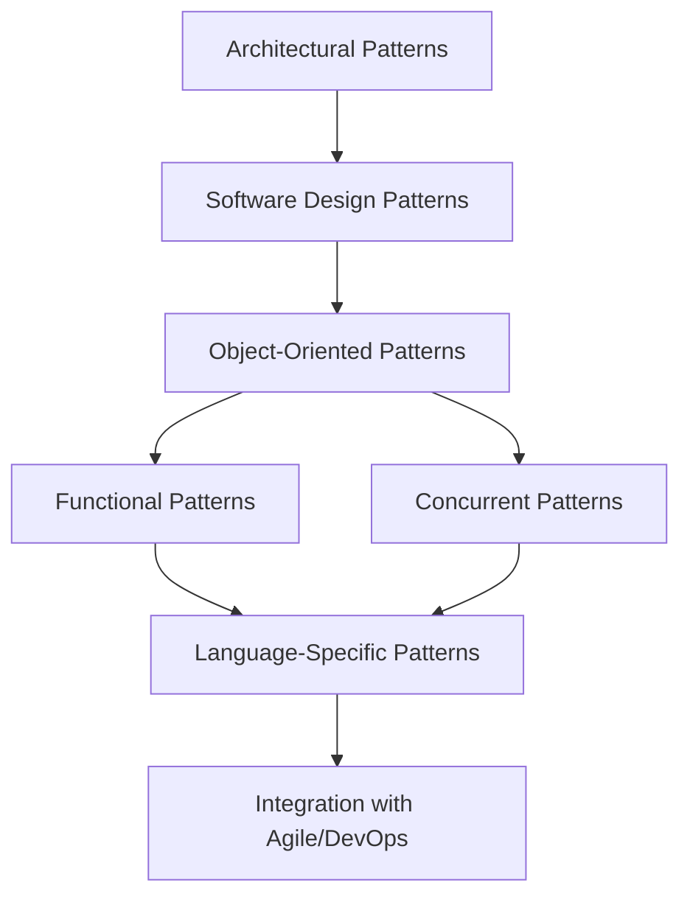

## 1.3 History and Evolution of Design Patterns

Design patterns have become an integral part of software engineering, providing a shared language for developers to communicate complex design ideas efficiently. Understanding the history and evolution of design patterns not only enriches our knowledge but also enhances our ability to apply these patterns effectively in modern software development. In this section, we will explore the origins of design patterns, their adaptation from architecture to software, and their evolution over time.

### Origins: From Architecture to Software

The concept of design patterns originated in the field of architecture. Christopher Alexander, an architect, introduced the idea in his book "A Pattern Language: Towns, Buildings, Construction" published in 1977. Alexander's work focused on identifying recurring problems in architectural design and proposing solutions that could be reused in different contexts. His patterns were intended to improve the quality of life by creating environments that are functional, aesthetically pleasing, and harmonious.

Alexander's approach to patterns was revolutionary because it provided a structured method for solving design problems. His patterns were not rigid blueprints but flexible guidelines that could be adapted to specific situations. This adaptability made them highly valuable in architecture and laid the groundwork for their application in other fields.

#### Transition to Software Engineering

The transition of design patterns from architecture to software engineering began in the late 1980s and early 1990s. Software developers recognized that many of the challenges they faced were similar to those in architecture: creating systems that are robust, maintainable, and scalable. They saw the potential of applying Alexander's pattern-based approach to software design.

The adaptation of design patterns to software was driven by the need for reusable solutions to common programming problems. As software systems grew in complexity, developers sought ways to manage this complexity by identifying and documenting best practices. Design patterns provided a way to capture these best practices in a form that could be easily communicated and reused.

### The Gang of Four (GoF): A Seminal Work

The formal introduction of design patterns to the software community came with the publication of "Design Patterns: Elements of Reusable Object-Oriented Software" in 1994 by Erich Gamma, Richard Helm, Ralph Johnson, and John Vlissides, collectively known as the Gang of Four (GoF). This book was a landmark in software engineering, as it systematically cataloged 23 design patterns that addressed common problems in object-oriented design.

#### Key Contributions of the GoF

1. **Standardization**: The GoF book provided a standardized vocabulary for discussing design patterns, making it easier for developers to communicate complex design ideas.

2. **Classification**: The patterns were categorized into three types: creational, structural, and behavioral, based on their purpose and usage. This classification helped developers understand when and how to apply each pattern.

3. **Documentation**: Each pattern was documented with a consistent structure, including its intent, applicability, structure, participants, collaborations, consequences, and implementation. This thorough documentation made the patterns accessible and practical for developers.

4. **Object-Oriented Focus**: The GoF patterns were specifically tailored for object-oriented programming, which was gaining popularity at the time. This focus helped promote the adoption of object-oriented principles in software design.

#### Impact on Software Development

The GoF book had a profound impact on software development. It not only popularized the concept of design patterns but also influenced the way developers approached software design. By providing a common language and a set of proven solutions, the GoF patterns helped improve the quality and consistency of software systems.

### Evolution Over Time

Since the publication of the GoF book, design patterns have continued to evolve, adapting to new programming paradigms and languages. This evolution has been driven by several factors:

#### Emergence of New Programming Paradigms

As programming paradigms have evolved, so too have design patterns. For example, the rise of functional programming has led to the development of new patterns that leverage the strengths of functional languages. Similarly, the advent of concurrent and distributed systems has spurred the creation of patterns that address the unique challenges of these environments.

#### Language-Specific Patterns

While the GoF patterns were designed for object-oriented languages, many modern languages have unique features that require specialized patterns. For instance, Lua, a lightweight scripting language, has its own set of idiomatic patterns that take advantage of its dynamic typing and first-class functions. These language-specific patterns demonstrate the adaptability of the design pattern concept to different programming contexts.

#### Expansion of Pattern Catalogs

The original 23 GoF patterns have been expanded upon by numerous authors and researchers, resulting in a rich catalog of patterns that address a wide range of design challenges. These expanded catalogs include patterns for areas such as enterprise application architecture, user interface design, and cloud computing.

#### Integration with Agile and DevOps Practices

Design patterns have also been integrated into modern software development practices such as Agile and DevOps. These practices emphasize iterative development, continuous integration, and rapid deployment, all of which benefit from the use of design patterns to ensure consistency and quality.

### Visualizing the Evolution of Design Patterns

To better understand the evolution of design patterns, let's visualize the transition from architectural patterns to software design patterns and their subsequent adaptation to modern programming paradigms.

**Diagram Description**: This diagram illustrates the evolution of design patterns from their origins in architecture to their adaptation in software engineering. It shows the transition from general software design patterns to object-oriented patterns, and then to functional and concurrent patterns. The diagram also highlights the development of language-specific patterns and their integration with Agile and DevOps practices.

### Key Takeaways

- **Design patterns originated in architecture** and were adapted to software engineering to address common design challenges.
- **The Gang of Four (GoF) book** was a seminal work that standardized the vocabulary and documentation of design patterns, focusing on object-oriented programming.
- **Design patterns have evolved** to accommodate new programming paradigms, languages, and development practices, demonstrating their adaptability and enduring relevance.

### Embrace the Journey

As we continue our exploration of design patterns in Lua, remember that understanding the history and evolution of design patterns enriches our ability to apply them effectively. By learning from the past and adapting to the present, we can design software systems that are robust, maintainable, and scalable. Keep experimenting, stay curious, and enjoy the journey!

## Quiz Time!



### Who introduced the concept of design patterns in architecture?

- [x] Christopher Alexander
- [ ] Erich Gamma
- [ ] Richard Helm
- [ ] Ralph Johnson

> **Explanation:** Christopher Alexander introduced the concept of design patterns in architecture with his book "A Pattern Language: Towns, Buildings, Construction."

### What was the primary focus of the GoF design patterns?

- [x] Object-oriented programming
- [ ] Functional programming
- [ ] Procedural programming
- [ ] Concurrent programming

> **Explanation:** The GoF design patterns were specifically tailored for object-oriented programming, which was gaining popularity at the time.

### How many design patterns were cataloged in the GoF book?

- [x] 23
- [ ] 15
- [ ] 30
- [ ] 10

> **Explanation:** The GoF book cataloged 23 design patterns that addressed common problems in object-oriented design.

### What is a key benefit of using design patterns in software development?

- [x] Reusability of solutions
- [ ] Increased code complexity
- [ ] Reduced performance
- [ ] Limited language support

> **Explanation:** Design patterns provide reusable solutions to common design problems, improving the quality and consistency of software systems.

### Which programming paradigm has led to the development of new design patterns?

- [x] Functional programming
- [ ] Procedural programming
- [ ] Assembly programming
- [ ] Machine learning

> **Explanation:** The rise of functional programming has led to the development of new patterns that leverage the strengths of functional languages.

### What is the significance of language-specific patterns?

- [x] They leverage unique features of modern languages
- [ ] They are only applicable to legacy systems
- [ ] They increase code redundancy
- [ ] They limit the use of design patterns

> **Explanation:** Language-specific patterns take advantage of unique features of modern languages, demonstrating the adaptability of design patterns to different programming contexts.

### How have design patterns been integrated into modern software practices?

- [x] Through Agile and DevOps practices
- [ ] By eliminating iterative development
- [ ] By reducing continuous integration
- [ ] By limiting rapid deployment

> **Explanation:** Design patterns have been integrated into Agile and DevOps practices, which emphasize iterative development, continuous integration, and rapid deployment.

### What does the diagram in the article illustrate?

- [x] The evolution of design patterns from architecture to modern programming paradigms
- [ ] The decline of design patterns in software engineering
- [ ] The exclusive use of design patterns in object-oriented programming
- [ ] The limitations of design patterns in functional programming

> **Explanation:** The diagram illustrates the evolution of design patterns from their origins in architecture to their adaptation in software engineering and modern programming paradigms.

### What is a key takeaway from the history and evolution of design patterns?

- [x] Design patterns are adaptable and enduring
- [ ] Design patterns are only applicable to object-oriented programming
- [ ] Design patterns are static and unchanging
- [ ] Design patterns are irrelevant in modern software development

> **Explanation:** Design patterns have evolved to accommodate new programming paradigms, languages, and development practices, demonstrating their adaptability and enduring relevance.

### True or False: The GoF book was published in 1994.

- [x] True
- [ ] False

> **Explanation:** The GoF book, "Design Patterns: Elements of Reusable Object-Oriented Software," was published in 1994.


