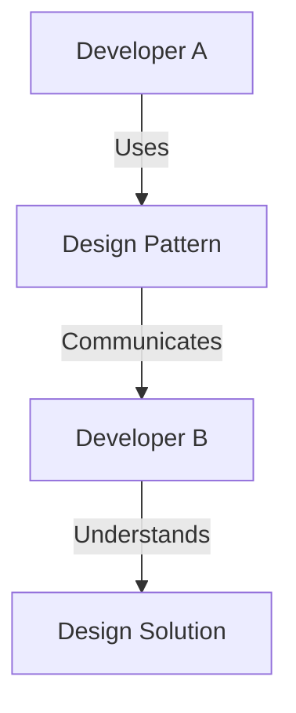

## 1.4 Importance of Design Patterns in Software Development

In the ever-evolving world of software development, design patterns have emerged as a cornerstone for creating robust, scalable, and maintainable applications. They provide a structured approach to solving common design problems, facilitate effective communication among developers, and promote best practices across the industry. In this section, we will delve into the importance of design patterns, focusing on their role in problem-solving, communication, and the adoption of best practices.

### Problem-Solving: How Patterns Provide Tested Solutions to Recurring Design Issues

Design patterns are essentially blueprints that offer tested solutions to common design problems. They encapsulate best practices and provide a reusable solution that can be adapted to different contexts. By leveraging design patterns, developers can avoid reinventing the wheel and focus on solving more complex and unique challenges.

#### The Role of Design Patterns in Problem-Solving

1. **Efficiency and Speed**: Design patterns streamline the development process by providing ready-made solutions. This allows developers to implement features more quickly and efficiently, reducing the time spent on trial and error.

2. **Consistency and Reliability**: Patterns ensure consistency across different parts of an application. By applying the same pattern to similar problems, developers can maintain a uniform structure and behavior, leading to more reliable software.

3. **Scalability and Flexibility**: Many design patterns are designed with scalability in mind. They provide a flexible architecture that can easily accommodate changes and new requirements, making it easier to scale applications as they grow.

4. **Reduction of Complexity**: Patterns help break down complex problems into manageable components. By using a pattern, developers can focus on individual parts of a problem, making it easier to understand and solve.

#### Code Example: Singleton Pattern in Lua

The Singleton pattern is a creational design pattern that ensures a class has only one instance and provides a global point of access to it. This pattern is useful in scenarios where a single instance is required to coordinate actions across the system.

```lua
-- Singleton Pattern in Lua
local Singleton = {}
Singleton.__index = Singleton

-- Private instance variable
local instance

-- Constructor
function Singleton:new()
    error("Cannot instantiate a Singleton directly. Use getInstance() instead.")
end

-- Method to get the single instance
function Singleton:getInstance()
    if not instance then
        instance = setmetatable({}, Singleton)
        -- Initialize instance variables here
        instance.value = 0
    end
    return instance
end

-- Example method
function Singleton:setValue(val)
    self.value = val
end

function Singleton:getValue()
    return self.value
end

-- Usage
local singleton1 = Singleton:getInstance()
singleton1:setValue(10)
print(singleton1:getValue()) -- Output: 10

local singleton2 = Singleton:getInstance()
print(singleton2:getValue()) -- Output: 10
```

In this example, the Singleton pattern ensures that only one instance of the `Singleton` class is created. Any attempt to create a new instance using `Singleton:new()` will result in an error, enforcing the single instance rule.

### Communication: Enabling Developers to Communicate Ideas Efficiently Using a Common Vocabulary

Design patterns provide a common vocabulary for developers, enabling them to communicate complex ideas more efficiently. This shared language helps bridge the gap between different teams and stakeholders, facilitating collaboration and understanding.

#### The Impact of Design Patterns on Communication

1. **Standardization**: Patterns standardize the way developers describe solutions, making it easier to convey ideas and intentions. This standardization reduces misunderstandings and ensures everyone is on the same page.

2. **Documentation and Knowledge Transfer**: Patterns serve as a form of documentation, capturing the rationale behind design decisions. They make it easier to transfer knowledge between team members and across projects.

3. **Collaboration and Teamwork**: By using a common set of patterns, teams can collaborate more effectively. Patterns provide a framework for discussing design choices and evaluating alternatives, leading to better decision-making.

4. **Onboarding and Training**: New team members can quickly get up to speed by learning the patterns used in a project. This accelerates the onboarding process and helps maintain continuity in development.

#### Visualizing Communication with Design Patterns



In this diagram, Developer A uses a design pattern to communicate a design solution to Developer B. The pattern acts as a bridge, ensuring that both developers have a shared understanding of the solution.

### Best Practices: Encouraging the Use of Industry-Recognized Practices for Robust Software Design

Design patterns encapsulate industry-recognized best practices, guiding developers towards creating robust and maintainable software. By adhering to these patterns, developers can ensure their applications are built on solid foundations.

#### The Role of Design Patterns in Promoting Best Practices

1. **Quality and Maintainability**: Patterns promote high-quality code that is easier to maintain and extend. They encourage developers to follow proven practices, reducing the likelihood of introducing errors or technical debt.

2. **Reusability and Modularity**: Patterns encourage the creation of reusable and modular components. This not only saves time but also enhances the flexibility and adaptability of the software.

3. **Adaptability and Evolution**: Patterns provide a framework for adapting to changing requirements. They facilitate the evolution of software by providing a clear path for incorporating new features and improvements.

4. **Risk Mitigation**: By following established patterns, developers can mitigate risks associated with untested or experimental designs. Patterns provide a safety net, ensuring that solutions are grounded in proven methodologies.

#### Code Example: Observer Pattern in Lua

The Observer pattern is a behavioral design pattern that defines a one-to-many dependency between objects. When one object changes state, all its dependents are notified and updated automatically.

```lua
-- Observer Pattern in Lua
local Subject = {}
Subject.__index = Subject

function Subject:new()
    local instance = setmetatable({}, Subject)
    instance.observers = {}
    return instance
end

function Subject:attach(observer)
    table.insert(self.observers, observer)
end

function Subject:detach(observer)
    for i, obs in ipairs(self.observers) do
        if obs == observer then
            table.remove(self.observers, i)
            break
        end
    end
end

function Subject:notify()
    for _, observer in ipairs(self.observers) do
        observer:update(self)
    end
end

local Observer = {}
Observer.__index = Observer

function Observer:new()
    return setmetatable({}, Observer)
end

function Observer:update(subject)
    print("Observer updated with subject state.")
end

-- Usage
local subject = Subject:new()
local observer1 = Observer:new()
local observer2 = Observer:new()

subject:attach(observer1)
subject:attach(observer2)

subject:notify() -- Both observers are notified
```

In this example, the Observer pattern allows multiple observers to be notified of changes in the subject's state. This pattern is useful in scenarios where an object needs to notify other objects about changes without being tightly coupled to them.

### Try It Yourself

To deepen your understanding of design patterns, try modifying the code examples provided. For instance, in the Singleton pattern, experiment with adding additional methods or properties to the singleton instance. In the Observer pattern, try implementing a more complex update mechanism that passes specific data to the observers.

### Knowledge Check

1. Explain how design patterns contribute to problem-solving in software development.
2. Describe the role of design patterns in facilitating communication among developers.
3. Discuss how design patterns promote best practices in software design.
4. Provide an example of a design pattern that enhances scalability and flexibility.
5. How do design patterns help in reducing complexity in software development?

### Embrace the Journey

Remember, mastering design patterns is a journey. As you continue to explore and apply these patterns, you'll gain deeper insights into software design and architecture. Keep experimenting, stay curious, and enjoy the process of learning and growing as a developer.

## Quiz Time!



### What is the primary benefit of using design patterns in software development?

- [x] They provide tested solutions to common design problems.
- [ ] They eliminate the need for documentation.
- [ ] They guarantee bug-free software.
- [ ] They make code execution faster.

> **Explanation:** Design patterns offer tested solutions to recurring design issues, which helps in creating robust and maintainable software.

### How do design patterns facilitate communication among developers?

- [x] By providing a common vocabulary.
- [ ] By eliminating the need for meetings.
- [ ] By automating code reviews.
- [ ] By reducing the number of developers needed.

> **Explanation:** Design patterns provide a common vocabulary that helps developers communicate complex ideas more efficiently.

### Which design pattern ensures a class has only one instance?

- [x] Singleton Pattern
- [ ] Observer Pattern
- [ ] Factory Pattern
- [ ] Strategy Pattern

> **Explanation:** The Singleton pattern ensures that a class has only one instance and provides a global point of access to it.

### What is a key advantage of using the Observer pattern?

- [x] It allows multiple objects to be notified of changes in another object.
- [ ] It ensures only one object is created.
- [ ] It simplifies the user interface design.
- [ ] It speeds up database queries.

> **Explanation:** The Observer pattern defines a one-to-many dependency, allowing multiple objects to be notified of changes in another object.

### How do design patterns promote best practices in software design?

- [x] By encapsulating industry-recognized practices.
- [ ] By enforcing strict coding standards.
- [ ] By reducing the need for testing.
- [ ] By automating code generation.

> **Explanation:** Design patterns encapsulate industry-recognized best practices, guiding developers towards creating robust and maintainable software.

### What is a common use case for the Singleton pattern?

- [x] Managing a shared resource or configuration.
- [ ] Creating multiple instances of a class.
- [ ] Implementing complex algorithms.
- [ ] Designing user interfaces.

> **Explanation:** The Singleton pattern is commonly used to manage shared resources or configurations where only one instance is needed.

### Which of the following is NOT a benefit of using design patterns?

- [ ] They provide tested solutions.
- [ ] They facilitate communication.
- [ ] They promote best practices.
- [x] They eliminate the need for testing.

> **Explanation:** While design patterns offer many benefits, they do not eliminate the need for testing. Testing is still essential to ensure software quality.

### What is the main focus of the Observer pattern?

- [x] Managing dependencies between objects.
- [ ] Creating a single instance of a class.
- [ ] Simplifying user interface design.
- [ ] Optimizing database queries.

> **Explanation:** The Observer pattern focuses on managing dependencies between objects, allowing multiple objects to be notified of changes in another object.

### How do design patterns help in reducing complexity?

- [x] By breaking down complex problems into manageable components.
- [ ] By eliminating the need for documentation.
- [ ] By automating code generation.
- [ ] By reducing the number of developers needed.

> **Explanation:** Design patterns help reduce complexity by breaking down complex problems into manageable components, making them easier to understand and solve.

### True or False: Design patterns guarantee bug-free software.

- [ ] True
- [x] False

> **Explanation:** While design patterns provide tested solutions and best practices, they do not guarantee bug-free software. Testing and quality assurance are still necessary.




