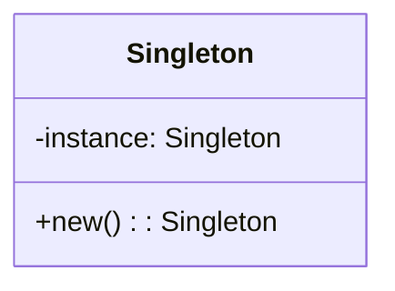
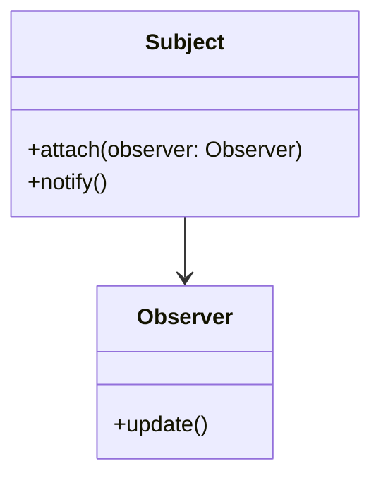
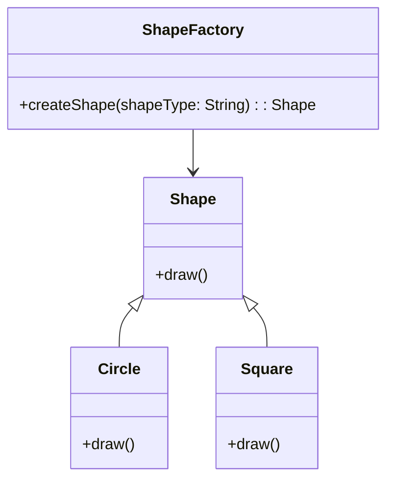
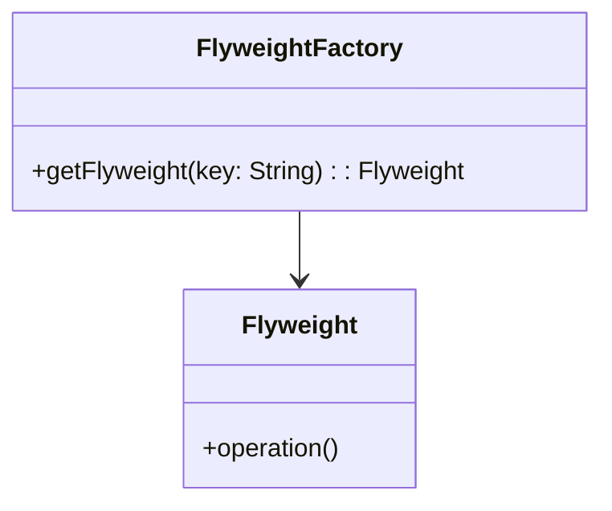

## 1.5 Benefits of Using Design Patterns in Lua

Design patterns are a crucial element in software engineering, providing a proven solution to common problems in software design. In Lua, a lightweight and flexible scripting language, design patterns offer numerous benefits that can significantly enhance your development process. In this section, we will delve into the key advantages of using design patterns in Lua, including code reusability, readability, maintainability, and performance optimization.

### Code Reusability

One of the primary benefits of using design patterns in Lua is the enhancement of code reusability. Design patterns provide a template for solving common problems, allowing developers to reuse code components across different projects. This not only saves time but also ensures consistency and reliability in your codebase.

#### Example: Singleton Pattern

The Singleton pattern is a classic example of a design pattern that promotes code reusability. It ensures that a class has only one instance and provides a global point of access to it. This is particularly useful in scenarios where a single object is needed to coordinate actions across the system.

```lua
-- Singleton Pattern in Lua
local Singleton = {}
Singleton.__index = Singleton

function Singleton:new()
    if not Singleton.instance then
        Singleton.instance = setmetatable({}, Singleton)
    end
    return Singleton.instance
end

-- Usage
local instance1 = Singleton:new()
local instance2 = Singleton:new()

print(instance1 == instance2) -- Output: true
```

In this example, the Singleton pattern ensures that only one instance of the `Singleton` class is created, promoting code reusability by providing a single point of access to the instance.

### Readability

Design patterns also improve the readability of your code. By using well-known patterns, you make your code more understandable to other developers who are familiar with these patterns. This is particularly important in collaborative environments where multiple developers work on the same codebase.

#### Example: Observer Pattern

The Observer pattern is a behavioral design pattern that allows an object, known as the subject, to maintain a list of its dependents, called observers, and notify them of any state changes. This pattern enhances readability by clearly defining the relationship between the subject and its observers.

```lua
-- Observer Pattern in Lua
local Subject = {}
Subject.__index = Subject

function Subject:new()
    local instance = setmetatable({}, Subject)
    instance.observers = {}
    return instance
end

function Subject:attach(observer)
    table.insert(self.observers, observer)
end

function Subject:notify()
    for _, observer in ipairs(self.observers) do
        observer:update()
    end
end

local Observer = {}
Observer.__index = Observer

function Observer:new(name)
    local instance = setmetatable({}, Observer)
    instance.name = name
    return instance
end

function Observer:update()
    print(self.name .. " has been notified.")
end

-- Usage
local subject = Subject:new()
local observer1 = Observer:new("Observer 1")
local observer2 = Observer:new("Observer 2")

subject:attach(observer1)
subject:attach(observer2)

subject:notify()
```

In this example, the Observer pattern makes it clear how observers are notified of changes in the subject, improving the overall readability of the code.

### Maintainability

Maintainability is another significant benefit of using design patterns in Lua. By providing a structured approach to solving problems, design patterns make it easier to update and modify your code over time. This is particularly important in large projects where changes are frequent and complex.

#### Example: Factory Method Pattern

The Factory Method pattern is a creational design pattern that defines an interface for creating objects but allows subclasses to alter the type of objects that will be created. This pattern enhances maintainability by decoupling the client code from the object creation process.

```lua
-- Factory Method Pattern in Lua
local ShapeFactory = {}
ShapeFactory.__index = ShapeFactory

function ShapeFactory:createShape(shapeType)
    if shapeType == "circle" then
        return Circle:new()
    elseif shapeType == "square" then
        return Square:new()
    end
end

local Circle = {}
Circle.__index = Circle

function Circle:new()
    return setmetatable({}, Circle)
end

function Circle:draw()
    print("Drawing a circle.")
end

local Square = {}
Square.__index = Square

function Square:new()
    return setmetatable({}, Square)
end

function Square:draw()
    print("Drawing a square.")
end

-- Usage
local factory = ShapeFactory:new()
local shape1 = factory:createShape("circle")
shape1:draw()

local shape2 = factory:createShape("square")
shape2:draw()
```

In this example, the Factory Method pattern allows for easy addition of new shapes without modifying the existing code, thereby enhancing maintainability.

### Performance

While design patterns are primarily about structure and organization, they can also lead to performance optimizations. Certain patterns, such as the Flyweight pattern, are specifically designed to improve performance by reducing memory usage.

#### Example: Flyweight Pattern

The Flyweight pattern is a structural design pattern that allows programs to support a large number of objects efficiently by sharing common parts of the state between multiple objects.

```lua
-- Flyweight Pattern in Lua
local FlyweightFactory = {}
FlyweightFactory.__index = FlyweightFactory

function FlyweightFactory:new()
    local instance = setmetatable({}, FlyweightFactory)
    instance.flyweights = {}
    return instance
end

function FlyweightFactory:getFlyweight(key)
    if not self.flyweights[key] then
        self.flyweights[key] = Flyweight:new(key)
    end
    return self.flyweights[key]
end

local Flyweight = {}
Flyweight.__index = Flyweight

function Flyweight:new(state)
    local instance = setmetatable({}, Flyweight)
    instance.state = state
    return instance
end

function Flyweight:operation()
    print("Flyweight with state: " .. self.state)
end

-- Usage
local factory = FlyweightFactory:new()
local flyweight1 = factory:getFlyweight("sharedState")
flyweight1:operation()

local flyweight2 = factory:getFlyweight("sharedState")
flyweight2:operation()

print(flyweight1 == flyweight2) -- Output: true
```

In this example, the Flyweight pattern reduces memory usage by sharing the `Flyweight` objects with the same state, leading to performance improvements.

### Try It Yourself

To fully grasp the benefits of using design patterns in Lua, try modifying the code examples provided above. For instance, you can:

- Extend the Singleton pattern to include additional methods.
- Add more observers in the Observer pattern and see how the notification mechanism scales.
- Introduce new shapes in the Factory Method pattern and observe how easily they integrate.
- Experiment with different states in the Flyweight pattern to understand how shared states affect memory usage.

### Visualizing Design Patterns

To better understand how design patterns work, let's visualize the structure and interaction of some of the patterns discussed above using Mermaid.js diagrams.

#### Singleton Pattern Diagram



#### Observer Pattern Diagram



#### Factory Method Pattern Diagram



#### Flyweight Pattern Diagram



### References and Links

For further reading on design patterns and their implementation in Lua, consider exploring the following resources:

- [Design Patterns: Elements of Reusable Object-Oriented Software](https://en.wikipedia.org/wiki/Design_Patterns) - A seminal book on design patterns.
- [Lua Programming Language](https://www.lua.org/manual/5.4/) - Official Lua documentation.
- [Lua Design Patterns](https://www.lua.org/pil/16.html) - A section from the book "Programming in Lua" discussing design patterns.

### Knowledge Check

To reinforce your understanding of the benefits of using design patterns in Lua, consider the following questions and exercises:

- What are the key advantages of using design patterns in Lua?
- How does the Singleton pattern promote code reusability?
- In what ways does the Observer pattern enhance code readability?
- How can the Factory Method pattern improve maintainability?
- What performance benefits can be achieved using the Flyweight pattern?

### Embrace the Journey

Remember, mastering design patterns in Lua is a journey. As you continue to explore and experiment with different patterns, you'll gain a deeper understanding of how they can enhance your software development process. Keep experimenting, stay curious, and enjoy the journey!

## Quiz Time!



### What is one of the primary benefits of using design patterns in Lua?

- [x] Code reusability
- [ ] Increased complexity
- [ ] Reduced performance
- [ ] Limited flexibility

> **Explanation:** Design patterns enhance code reusability by providing templates for solving common problems, allowing developers to reuse code components across different projects.

### How does the Singleton pattern promote code reusability?

- [x] By ensuring a class has only one instance
- [ ] By creating multiple instances of a class
- [ ] By increasing memory usage
- [ ] By complicating the code

> **Explanation:** The Singleton pattern ensures that a class has only one instance, providing a global point of access and promoting code reusability.

### What is the main advantage of the Observer pattern?

- [x] Enhances code readability
- [ ] Increases code complexity
- [ ] Reduces code maintainability
- [ ] Decreases performance

> **Explanation:** The Observer pattern enhances code readability by clearly defining the relationship between the subject and its observers.

### How does the Factory Method pattern improve maintainability?

- [x] By decoupling client code from object creation
- [ ] By tightly coupling client code with object creation
- [ ] By increasing code complexity
- [ ] By reducing code readability

> **Explanation:** The Factory Method pattern improves maintainability by decoupling client code from the object creation process, making it easier to update and modify the code.

### What performance benefit does the Flyweight pattern provide?

- [x] Reduces memory usage
- [ ] Increases memory usage
- [ ] Decreases code readability
- [ ] Increases code complexity

> **Explanation:** The Flyweight pattern reduces memory usage by sharing common parts of the state between multiple objects.

### Which design pattern is used to ensure a class has only one instance?

- [x] Singleton pattern
- [ ] Observer pattern
- [ ] Factory Method pattern
- [ ] Flyweight pattern

> **Explanation:** The Singleton pattern is used to ensure that a class has only one instance and provides a global point of access to it.

### What is the purpose of the Factory Method pattern?

- [x] To define an interface for creating objects
- [ ] To increase code complexity
- [ ] To reduce code readability
- [ ] To tightly couple client code with object creation

> **Explanation:** The Factory Method pattern defines an interface for creating objects, allowing subclasses to alter the type of objects that will be created.

### How does the Observer pattern notify its observers?

- [x] By calling the update method on each observer
- [ ] By creating new instances of observers
- [ ] By deleting observers
- [ ] By increasing memory usage

> **Explanation:** The Observer pattern notifies its observers by calling the update method on each observer, informing them of any state changes.

### What is a key feature of the Flyweight pattern?

- [x] Sharing common parts of the state between objects
- [ ] Creating multiple instances of objects
- [ ] Increasing memory usage
- [ ] Reducing code readability

> **Explanation:** The Flyweight pattern shares common parts of the state between multiple objects, reducing memory usage.

### True or False: Design patterns can lead to performance optimizations in Lua.

- [x] True
- [ ] False

> **Explanation:** Certain design patterns, such as the Flyweight pattern, are specifically designed to improve performance by reducing memory usage.


