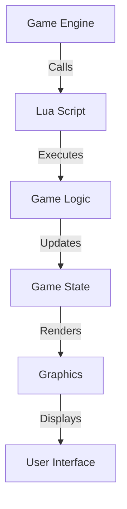

## 10.1 Introduction to Lua in Game Development

Lua has emerged as a powerful and flexible scripting language in the realm of game development. Its lightweight nature, ease of integration, and performance efficiency make it a preferred choice for developers looking to create dynamic and interactive gaming experiences. In this section, we will delve into the role of Lua in game development, explore its integration with popular game engines, and understand the division of responsibilities between scripting and engine code.

### Lua as a Scripting Language

Lua is renowned for its simplicity and speed, making it an ideal scripting language for game development. Its syntax is straightforward, allowing developers to write clean and maintainable code. Lua's dynamic typing and garbage collection features further enhance its usability in scripting complex game logic.

#### Key Advantages of Using Lua in Game Development

1. **Flexibility**: Lua's dynamic nature allows developers to modify game behavior on the fly without recompiling the entire game engine. This flexibility is crucial for rapid prototyping and iterative development.

2. **Performance**: Lua is designed to be fast and efficient, with a small memory footprint. This makes it suitable for resource-constrained environments, such as mobile devices and embedded systems.

3. **Ease of Integration**: Lua can be easily embedded into C/C++ applications, making it a popular choice for extending game engines with scripting capabilities.

4. **Community Support**: Lua has a vibrant community and a wealth of libraries and tools that can be leveraged to accelerate game development.

### Integration with Game Engines

Lua's integration with game engines is one of its most compelling features. It allows developers to script game logic, AI behavior, and user interfaces without delving into the complexities of engine code. Let's explore how Lua integrates with some popular game engines.

#### Popular Engines Using Lua

1. **Love2D**: Love2D is a simple and powerful 2D game engine that uses Lua for scripting. It is known for its ease of use and rapid development capabilities, making it a favorite among indie game developers.

2. **Corona SDK**: Corona SDK is a cross-platform framework that uses Lua for scripting. It is widely used for mobile game development due to its robust set of APIs and fast performance.

3. **Custom Engines**: Many custom game engines integrate Lua to provide scripting capabilities. This allows developers to create bespoke solutions tailored to their specific game requirements.

#### Scripting vs. Engine Code

In game development, it's essential to delineate the responsibilities between scripting and engine code. This separation ensures that the game engine remains efficient and maintainable while allowing for flexible game logic implementation.

- **Engine Code**: The engine code is responsible for core functionalities such as rendering, physics, and input handling. It is typically written in a compiled language like C++ for performance reasons.

- **Scripting**: Scripting is used for high-level game logic, AI behavior, and user interactions. Lua scripts can be easily modified and reloaded, enabling rapid iteration and testing.

### Code Example: Integrating Lua with a Game Engine

Let's look at a simple example of integrating Lua with a C++ game engine. We'll create a basic setup where Lua scripts control the movement of a game character.

```cpp
// C++ code to integrate Lua
#include <lua.hpp>
#include <iostream>

// Function to move the character
int moveCharacter(lua_State* L) {
    int x = luaL_checkinteger(L, 1);
    int y = luaL_checkinteger(L, 2);
    std::cout << "Moving character to position: (" << x << ", " << y << ")" << std::endl;
    return 0;
}

int main() {
    lua_State* L = luaL_newstate();
    luaL_openlibs(L);

    // Register the moveCharacter function
    lua_register(L, "moveCharacter", moveCharacter);

    // Load and execute the Lua script
    if (luaL_dofile(L, "game_script.lua") != LUA_OK) {
        std::cerr << "Error: " << lua_tostring(L, -1) << std::endl;
        lua_pop(L, 1);
    }

    lua_close(L);
    return 0;
}
```

```lua
-- Lua script: game_script.lua
-- Move the character to a new position
moveCharacter(10, 20)
```

In this example, we define a `moveCharacter` function in C++ and register it with the Lua state. The Lua script `game_script.lua` calls this function to move the character to a new position.

### Try It Yourself

Experiment with the code example by modifying the Lua script to move the character to different positions. Try adding new functions in C++ and calling them from Lua to extend the game's functionality.

### Visualizing Lua's Role in Game Development

To better understand Lua's integration with game engines, let's visualize the interaction between Lua scripts and engine code.



This diagram illustrates how the game engine interacts with Lua scripts to execute game logic, update the game state, and render graphics.

### References and Further Reading

- [Lua Official Website](https://www.lua.org/)
- [Love2D Documentation](https://love2d.org/wiki/Main_Page)
- [Corona SDK Documentation](https://docs.coronalabs.com/)

### Knowledge Check

- What are the key advantages of using Lua in game development?
- How does Lua integrate with popular game engines?
- What is the difference between scripting and engine code in game development?

### Embrace the Journey

Remember, this is just the beginning of your journey into Lua game development. As you progress, you'll build more complex and interactive games. Keep experimenting, stay curious, and enjoy the journey!

## Quiz Time!



### What is one of the key advantages of using Lua in game development?

- [x] Flexibility
- [ ] Complexity
- [ ] High memory usage
- [ ] Difficult syntax

> **Explanation:** Lua offers flexibility, allowing developers to modify game behavior on the fly without recompiling the entire game engine.

### Which game engine is known for using Lua for scripting and is popular among indie developers?

- [x] Love2D
- [ ] Unreal Engine
- [ ] Unity
- [ ] CryEngine

> **Explanation:** Love2D is a simple and powerful 2D game engine that uses Lua for scripting, making it popular among indie developers.

### What is the primary role of scripting in game development?

- [x] Implementing high-level game logic
- [ ] Handling core functionalities like rendering
- [ ] Managing memory allocation
- [ ] Compiling engine code

> **Explanation:** Scripting is used for high-level game logic, AI behavior, and user interactions, allowing for rapid iteration and testing.

### How does Lua integrate with game engines?

- [x] By embedding Lua scripts into the engine
- [ ] By replacing the engine code
- [ ] By compiling Lua scripts into machine code
- [ ] By using Lua as the primary language for engine development

> **Explanation:** Lua integrates with game engines by embedding scripts into the engine, allowing developers to script game logic and behavior.

### What is the purpose of the `moveCharacter` function in the code example?

- [x] To move the game character to a specified position
- [ ] To render graphics
- [ ] To handle user input
- [ ] To compile the game engine

> **Explanation:** The `moveCharacter` function is used to move the game character to a specified position, as demonstrated in the code example.

### Which of the following is NOT a popular game engine that uses Lua?

- [ ] Love2D
- [ ] Corona SDK
- [x] Unreal Engine
- [ ] Custom Engines

> **Explanation:** Unreal Engine does not use Lua as its primary scripting language; it primarily uses C++ and Blueprints.

### What is the main advantage of using Lua for scripting in resource-constrained environments?

- [x] Small memory footprint
- [ ] High computational power
- [ ] Complex syntax
- [ ] Large community

> **Explanation:** Lua's small memory footprint makes it suitable for resource-constrained environments, such as mobile devices and embedded systems.

### What is the role of engine code in game development?

- [x] Handling core functionalities like rendering and physics
- [ ] Implementing high-level game logic
- [ ] Managing user interactions
- [ ] Scripting AI behavior

> **Explanation:** Engine code is responsible for core functionalities such as rendering, physics, and input handling, typically written in a compiled language like C++.

### True or False: Lua scripts can be modified and reloaded without recompiling the entire game engine.

- [x] True
- [ ] False

> **Explanation:** Lua's flexibility allows scripts to be modified and reloaded without recompiling the entire game engine, enabling rapid iteration.

### What is the primary benefit of separating scripting from engine code?

- [x] Ensures the engine remains efficient and maintainable
- [ ] Increases the complexity of game development
- [ ] Requires more resources
- [ ] Limits the flexibility of game logic

> **Explanation:** Separating scripting from engine code ensures that the engine remains efficient and maintainable while allowing for flexible game logic implementation.


