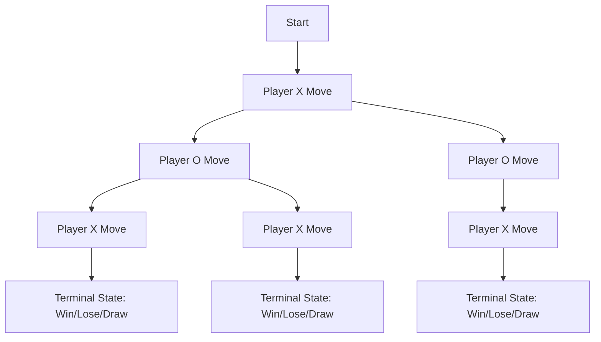

## 10.10 Implementing AI Algorithms: Tic-Tac-Toe and the Minimax Algorithm

Artificial Intelligence (AI) in games is a fascinating field that allows us to create opponents that can challenge human players. In this section, we will delve into implementing AI algorithms in Lua, focusing on the Minimax algorithm to develop a Tic-Tac-Toe game. This exploration will cover the fundamentals of the Minimax algorithm, its optimization through alpha-beta pruning, and practical use cases in game development.

### Understanding the Minimax Algorithm

The Minimax algorithm is a decision-making algorithm used in turn-based games. It is designed to minimize the possible loss for a worst-case scenario. When dealing with two-player games like Tic-Tac-Toe, the algorithm assumes that both players are playing optimally. The goal is to find the best move for the player by evaluating all possible moves and their outcomes.

#### Key Concepts of Minimax

- **Game Tree**: A tree structure where each node represents a game state, and each edge represents a move.
- **Maximizing Player**: The player trying to maximize their score.
- **Minimizing Player**: The opponent trying to minimize the maximizing player's score.
- **Terminal State**: A game state where the game ends (win, lose, or draw).
- **Utility Function**: A function that assigns a numerical value to terminal states, indicating the desirability of the outcome.

### Implementing Minimax in Lua

Let's implement the Minimax algorithm in Lua for a Tic-Tac-Toe game. We'll start by defining the game board and utility functions.

#### Setting Up the Game Board

```lua
-- Define the Tic-Tac-Toe board
local board = {
    {' ', ' ', ' '},
    {' ', ' ', ' '},
    {' ', ' ', ' '}
}

-- Function to print the board
local function printBoard(board)
    for i = 1, 3 do
        print(table.concat(board[i], " | "))
        if i < 3 then
            print("---------")
        end
    end
end

-- Function to check for a win
local function checkWin(board, player)
    -- Check rows, columns, and diagonals
    for i = 1, 3 do
        if board[i][1] == player and board[i][2] == player and board[i][3] == player then
            return true
        end
        if board[1][i] == player and board[2][i] == player and board[3][i] == player then
            return true
        end
    end
    if board[1][1] == player and board[2][2] == player and board[3][3] == player then
        return true
    end
    if board[1][3] == player and board[2][2] == player and board[3][1] == player then
        return true
    end
    return false
end

-- Function to check for a draw
local function checkDraw(board)
    for i = 1, 3 do
        for j = 1, 3 do
            if board[i][j] == ' ' then
                return false
            end
        end
    end
    return true
end
```

#### Implementing the Minimax Function

The Minimax function will recursively evaluate all possible moves and return the best move for the player.

```lua
-- Minimax algorithm implementation
local function minimax(board, depth, isMaximizing)
    local scores = { X = 1, O = -1, draw = 0 }
    local player = isMaximizing and 'X' or 'O'

    if checkWin(board, 'X') then
        return scores.X
    elseif checkWin(board, 'O') then
        return scores.O
    elseif checkDraw(board) then
        return scores.draw
    end

    if isMaximizing then
        local bestScore = -math.huge
        for i = 1, 3 do
            for j = 1, 3 do
                if board[i][j] == ' ' then
                    board[i][j] = 'X'
                    local score = minimax(board, depth + 1, false)
                    board[i][j] = ' '
                    bestScore = math.max(score, bestScore)
                end
            end
        end
        return bestScore
    else
        local bestScore = math.huge
        for i = 1, 3 do
            for j = 1, 3 do
                if board[i][j] == ' ' then
                    board[i][j] = 'O'
                    local score = minimax(board, depth + 1, true)
                    board[i][j] = ' '
                    bestScore = math.min(score, bestScore)
                end
            end
        end
        return bestScore
    end
end
```

#### Choosing the Best Move

Now, let's create a function to choose the best move for the AI.

```lua
-- Function to find the best move for the AI
local function findBestMove(board)
    local bestScore = -math.huge
    local move = { row = -1, col = -1 }

    for i = 1, 3 do
        for j = 1, 3 do
            if board[i][j] == ' ' then
                board[i][j] = 'X'
                local score = minimax(board, 0, false)
                board[i][j] = ' '
                if score > bestScore then
                    bestScore = score
                    move = { row = i, col = j }
                end
            end
        end
    end
    return move
end
```

### Optimizing Minimax with Alpha-Beta Pruning

Alpha-beta pruning is an optimization technique for the Minimax algorithm that reduces the number of nodes evaluated in the game tree. It works by eliminating branches that cannot possibly influence the final decision.

#### Implementing Alpha-Beta Pruning

Let's enhance our Minimax function with alpha-beta pruning.

```lua
-- Minimax with alpha-beta pruning
local function minimaxAlphaBeta(board, depth, alpha, beta, isMaximizing)
    local scores = { X = 1, O = -1, draw = 0 }
    local player = isMaximizing and 'X' or 'O'

    if checkWin(board, 'X') then
        return scores.X
    elseif checkWin(board, 'O') then
        return scores.O
    elseif checkDraw(board) then
        return scores.draw
    end

    if isMaximizing then
        local bestScore = -math.huge
        for i = 1, 3 do
            for j = 1, 3 do
                if board[i][j] == ' ' then
                    board[i][j] = 'X'
                    local score = minimaxAlphaBeta(board, depth + 1, alpha, beta, false)
                    board[i][j] = ' '
                    bestScore = math.max(score, bestScore)
                    alpha = math.max(alpha, score)
                    if beta <= alpha then
                        break
                    end
                end
            end
        end
        return bestScore
    else
        local bestScore = math.huge
        for i = 1, 3 do
            for j = 1, 3 do
                if board[i][j] == ' ' then
                    board[i][j] = 'O'
                    local score = minimaxAlphaBeta(board, depth + 1, alpha, beta, true)
                    board[i][j] = ' '
                    bestScore = math.min(score, bestScore)
                    beta = math.min(beta, score)
                    if beta <= alpha then
                        break
                    end
                end
            end
        end
        return bestScore
    end
end
```

### Use Cases and Examples

The Minimax algorithm, especially with alpha-beta pruning, is applicable in various turn-based strategy games and puzzle games. It provides a robust framework for AI decision-making, ensuring that the AI plays optimally.

#### Turn-Based Strategy Games

In games like chess or checkers, the Minimax algorithm can be used to evaluate potential moves and select the best strategy. By incorporating alpha-beta pruning, the AI can efficiently search deeper into the game tree, making more informed decisions.

#### Puzzle Games

Puzzle games that involve decision-making, such as Sudoku or Connect Four, can also benefit from the Minimax algorithm. The AI can evaluate different configurations and choose the optimal path to solve the puzzle or achieve the highest score.

### Visualizing the Minimax Algorithm

To better understand the Minimax algorithm, let's visualize the decision-making process using a game tree.



**Diagram Description:** This diagram illustrates a simplified game tree for Tic-Tac-Toe, showing the sequence of moves and terminal states. Each node represents a game state, and each edge represents a player's move.

### Try It Yourself

Experiment with the provided code by modifying the utility function or adding additional rules to the game. Try implementing the algorithm for a different game, such as Connect Four, to deepen your understanding.

### Knowledge Check

- What is the purpose of the Minimax algorithm in game AI?
- How does alpha-beta pruning optimize the Minimax algorithm?
- Can you implement the Minimax algorithm for a different game?

### Embrace the Journey

Remember, mastering AI algorithms is a journey. As you experiment with different games and algorithms, you'll gain a deeper understanding of AI decision-making. Keep exploring, stay curious, and enjoy the process!

## Quiz Time!



### What is the primary goal of the Minimax algorithm in game AI?

- [x] To minimize the possible loss for a worst-case scenario
- [ ] To maximize the possible gain for a best-case scenario
- [ ] To randomly select moves
- [ ] To always win the game

> **Explanation:** The Minimax algorithm aims to minimize the possible loss for a worst-case scenario by assuming both players play optimally.

### What does a terminal state in a game tree represent?

- [x] A game state where the game ends (win, lose, or draw)
- [ ] The beginning of the game
- [ ] An intermediate game state
- [ ] A state where the player is undecided

> **Explanation:** A terminal state is a game state where the game ends, such as a win, lose, or draw.

### How does alpha-beta pruning enhance the Minimax algorithm?

- [x] By reducing the number of nodes evaluated in the game tree
- [ ] By increasing the number of nodes evaluated in the game tree
- [ ] By making random decisions
- [ ] By ignoring terminal states

> **Explanation:** Alpha-beta pruning reduces the number of nodes evaluated in the game tree, optimizing the Minimax algorithm.

### In the context of Minimax, who is the maximizing player?

- [x] The player trying to maximize their score
- [ ] The player trying to minimize their score
- [ ] The player making random moves
- [ ] The player who always loses

> **Explanation:** The maximizing player is the one trying to maximize their score in the game.

### Which of the following games can benefit from the Minimax algorithm?

- [x] Chess
- [x] Tic-Tac-Toe
- [ ] Racing games
- [ ] First-person shooters

> **Explanation:** Turn-based strategy games like Chess and Tic-Tac-Toe can benefit from the Minimax algorithm.

### What is the utility function's role in the Minimax algorithm?

- [x] To assign a numerical value to terminal states
- [ ] To randomly select moves
- [ ] To print the game board
- [ ] To check for a draw

> **Explanation:** The utility function assigns a numerical value to terminal states, indicating the desirability of the outcome.

### What is the purpose of the `checkWin` function in the provided code?

- [x] To check if a player has won the game
- [ ] To print the game board
- [ ] To randomly select moves
- [ ] To assign scores to moves

> **Explanation:** The `checkWin` function checks if a player has won the game by evaluating rows, columns, and diagonals.

### What does the `minimax` function return?

- [x] The best score for the player
- [ ] The worst score for the player
- [ ] A random score
- [ ] The game board

> **Explanation:** The `minimax` function returns the best score for the player by evaluating all possible moves.

### What is the significance of the `alpha` and `beta` parameters in the `minimaxAlphaBeta` function?

- [x] They represent the best scores for the maximizing and minimizing players
- [ ] They represent random scores
- [ ] They are used to print the game board
- [ ] They are used to check for a draw

> **Explanation:** The `alpha` and `beta` parameters represent the best scores for the maximizing and minimizing players, used in alpha-beta pruning.

### True or False: The Minimax algorithm can be used for real-time strategy games.

- [ ] True
- [x] False

> **Explanation:** The Minimax algorithm is typically used for turn-based games, not real-time strategy games, due to the complexity and time constraints of evaluating all possible moves in real-time.


