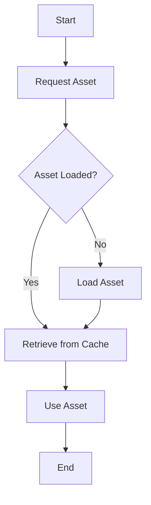

## 10.11 Resource Management and Asset Loading

In the realm of game development, efficient resource management and asset loading are crucial for creating seamless and engaging experiences. As games become more complex, the need to manage resources such as textures, audio, and levels effectively becomes paramount. In this section, we will explore strategies for managing game assets efficiently using Lua, focusing on implementing resource managers, utilizing lazy loading, and optimizing caching.

### Understanding Resource Management

Resource management in game development involves the efficient handling of game assets to ensure optimal performance and user experience. This includes loading assets only when needed, reusing assets to save memory, and unloading assets that are no longer required. Effective resource management can significantly reduce load times, minimize memory usage, and enhance the overall performance of a game.

### Implementing Resource Managers

A resource manager is a system responsible for loading, caching, and unloading game assets. It acts as an intermediary between the game engine and the assets, ensuring that resources are managed efficiently. Let's delve into the key components of a resource manager:

#### Lazy Loading

Lazy loading is a technique where assets are loaded only when they are needed. This approach helps in reducing initial load times and conserving memory by deferring the loading of assets until they are required. In Lua, lazy loading can be implemented using functions or coroutines that load assets on demand.

**Example: Lazy Loading Textures**

```lua
-- Resource Manager
local ResourceManager = {}
ResourceManager.assets = {}

-- Function to load a texture lazily
function ResourceManager:loadTexture(name, path)
    if not self.assets[name] then
        self.assets[name] = function()
            -- Simulate loading texture
            print("Loading texture: " .. path)
            return {name = name, path = path}
        end
    end
    return self.assets[name]()
end

-- Usage
local texture = ResourceManager:loadTexture("hero", "assets/hero.png")
print(texture.name)  -- Output: hero
```

In this example, the `loadTexture` function checks if the texture is already loaded. If not, it creates a function that simulates loading the texture. The texture is loaded only when the function is called, demonstrating lazy loading.

#### Caching

Caching involves storing loaded assets in memory for quick access, reducing the need to reload them from disk. This technique is particularly useful for assets that are used frequently, such as textures and audio files.

**Example: Caching Audio Files**

```lua
-- Resource Manager
local ResourceManager = {}
ResourceManager.audioCache = {}

-- Function to load and cache audio
function ResourceManager:loadAudio(name, path)
    if not self.audioCache[name] then
        -- Simulate loading audio
        print("Loading audio: " .. path)
        self.audioCache[name] = {name = name, path = path}
    end
    return self.audioCache[name]
end

-- Usage
local audio = ResourceManager:loadAudio("background_music", "assets/music.mp3")
print(audio.name)  -- Output: background_music
```

In this example, the `loadAudio` function checks if the audio file is already cached. If not, it simulates loading the audio and stores it in the cache for future use.

### Use Cases and Examples

Let's explore some practical use cases where resource management and asset loading play a crucial role in game development.

#### Texture and Audio Management

Textures and audio files are among the most common assets in games. Efficient management of these assets can significantly impact the game's performance and user experience.

**Texture Management**

Textures are often large files that can consume significant memory. By implementing lazy loading and caching, we can ensure that textures are loaded only when needed and reused efficiently.

**Audio Management**

Audio files, especially background music and sound effects, are critical for creating an immersive gaming experience. By caching audio files, we can reduce load times and ensure smooth playback.

#### Level Streaming

Level streaming is a technique used to load and unload parts of a game world dynamically. This approach allows for large, open-world games to be played without long load times, as only the necessary parts of the world are loaded at any given time.

**Example: Level Streaming with Lua**

```lua
-- Level Manager
local LevelManager = {}
LevelManager.loadedLevels = {}

-- Function to load a level
function LevelManager:loadLevel(name, path)
    if not self.loadedLevels[name] then
        -- Simulate loading level
        print("Loading level: " .. path)
        self.loadedLevels[name] = {name = name, path = path}
    end
    return self.loadedLevels[name]
end

-- Function to unload a level
function LevelManager:unloadLevel(name)
    if self.loadedLevels[name] then
        -- Simulate unloading level
        print("Unloading level: " .. name)
        self.loadedLevels[name] = nil
    end
end

-- Usage
local level1 = LevelManager:loadLevel("forest", "levels/forest.lua")
LevelManager:unloadLevel("forest")
```

In this example, the `LevelManager` is responsible for loading and unloading levels. The `loadLevel` function loads a level if it is not already loaded, while the `unloadLevel` function removes the level from memory when it is no longer needed.

### Visualizing Resource Management

To better understand the flow of resource management, let's visualize the process using a flowchart.



**Description:** This flowchart illustrates the process of requesting an asset. If the asset is not loaded, it is loaded and cached. If it is already loaded, it is retrieved from the cache and used.

### Design Considerations

When implementing resource management and asset loading in Lua, consider the following:

- **Memory Constraints**: Be mindful of memory usage, especially on devices with limited resources. Implement strategies to unload assets that are no longer needed.
- **Performance**: Optimize the loading and caching processes to minimize impact on game performance. Use asynchronous loading where possible to prevent blocking the main game loop.
- **Scalability**: Design the resource manager to handle a large number of assets efficiently. Consider using data structures like hash tables for quick lookups.

### Differences and Similarities

Resource management and asset loading share similarities with other design patterns, such as the Singleton pattern, where a single instance of a resource manager is used throughout the game. However, they differ in their focus on managing assets rather than controlling access to a single instance.

### Try It Yourself

Experiment with the code examples provided by modifying them to suit your needs. Try implementing a resource manager for a different type of asset, such as shaders or models. Consider adding features like reference counting to track asset usage and unload assets when they are no longer needed.

### References and Links

For further reading on resource management and asset loading, consider the following resources:

- [Game Programming Patterns](http://gameprogrammingpatterns.com/resource-management.html)
- [Lua Users Wiki](http://lua-users.org/wiki/)
- [MDN Web Docs on Lazy Loading](https://developer.mozilla.org/en-US/docs/Web/Performance/Lazy_loading)

### Knowledge Check

- What is lazy loading, and how does it benefit game development?
- How can caching improve the performance of a game?
- Describe a scenario where level streaming would be beneficial.
- What are some design considerations when implementing a resource manager?

### Embrace the Journey

Remember, mastering resource management and asset loading is just one step in your game development journey. As you continue to explore and experiment, you'll discover new techniques and strategies to enhance your games. Keep pushing the boundaries, stay curious, and enjoy the process!

## Quiz Time!



### What is the primary benefit of lazy loading in game development?

- [x] Reducing initial load times and conserving memory
- [ ] Increasing the complexity of asset management
- [ ] Ensuring all assets are loaded at startup
- [ ] Improving the visual quality of assets

> **Explanation:** Lazy loading defers the loading of assets until they are needed, which helps reduce initial load times and conserve memory.

### How does caching improve game performance?

- [x] By storing loaded assets in memory for quick access
- [ ] By increasing the number of assets loaded at once
- [ ] By reducing the need for asset optimization
- [ ] By ensuring assets are never unloaded

> **Explanation:** Caching stores loaded assets in memory, allowing for quick access and reducing the need to reload them from disk.

### What is level streaming used for in game development?

- [x] Dynamically loading and unloading parts of a game world
- [ ] Streaming game levels to online players
- [ ] Increasing the resolution of game textures
- [ ] Enhancing audio quality in games

> **Explanation:** Level streaming allows for dynamic loading and unloading of game world parts, enabling large, open-world games to be played without long load times.

### Which of the following is a key component of a resource manager?

- [x] Lazy loading
- [ ] Asset duplication
- [ ] Texture compression
- [ ] Audio enhancement

> **Explanation:** Lazy loading is a key component of a resource manager, as it helps in loading assets only when needed.

### What is a potential drawback of not using a resource manager?

- [x] Increased memory usage and longer load times
- [ ] Improved game performance
- [ ] Simplified asset management
- [ ] Enhanced visual quality

> **Explanation:** Without a resource manager, memory usage can increase, and load times can become longer due to inefficient asset handling.

### What is the purpose of unloading assets in a game?

- [x] To free up memory and resources
- [ ] To improve asset quality
- [ ] To increase game complexity
- [ ] To enhance audio playback

> **Explanation:** Unloading assets frees up memory and resources, which is crucial for maintaining optimal game performance.

### How can reference counting be used in resource management?

- [x] To track asset usage and unload assets when no longer needed
- [ ] To increase the number of assets loaded at once
- [ ] To enhance the visual quality of assets
- [ ] To simplify asset duplication

> **Explanation:** Reference counting tracks asset usage, allowing for assets to be unloaded when they are no longer needed, thus optimizing resource management.

### What is a common data structure used for quick asset lookups in resource management?

- [x] Hash tables
- [ ] Linked lists
- [ ] Binary trees
- [ ] Stacks

> **Explanation:** Hash tables are commonly used for quick asset lookups due to their efficient key-value mapping.

### True or False: Lazy loading ensures all assets are loaded at startup.

- [ ] True
- [x] False

> **Explanation:** Lazy loading defers the loading of assets until they are needed, rather than loading all assets at startup.

### What is the role of a resource manager in game development?

- [x] To load, cache, and unload game assets efficiently
- [ ] To enhance the visual quality of assets
- [ ] To increase the number of assets used in a game
- [ ] To simplify game level design

> **Explanation:** A resource manager is responsible for efficiently loading, caching, and unloading game assets to optimize performance and memory usage.




