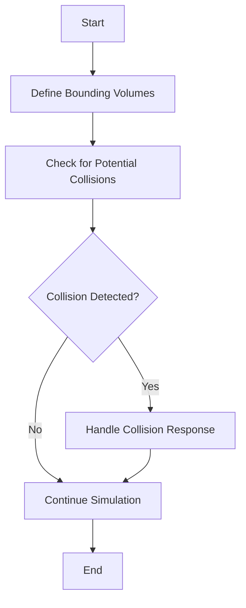

## 10.12 Collision Detection Patterns

Collision detection is a fundamental aspect of game development, enabling interactions between game objects. Whether you're creating a simple 2D platformer or a complex 3D simulation, understanding and implementing efficient collision detection patterns is crucial. In this section, we'll explore the concepts of collision detection, focusing on bounding volumes and spatial partitioning, and provide practical examples using Lua.

### Handling Interactions Between Game Objects

Collision detection involves determining when two or more objects in a game world intersect or come into contact. This process is essential for various game mechanics, such as physics simulations, character interactions, and environmental effects. Let's delve into the key components of collision detection:

#### Implementing Collision Detection

##### Bounding Volumes

Bounding volumes are simplified geometric shapes used to approximate the shape of complex objects. They provide a quick way to test for potential collisions before performing more detailed checks. Common types of bounding volumes include:

- **Axis-Aligned Bounding Boxes (AABB)**: Rectangular boxes aligned with the coordinate axes.
- **Bounding Circles/Spheres**: Circles (in 2D) or spheres (in 3D) that encompass an object.
- **Oriented Bounding Boxes (OBB)**: Rectangular boxes that can rotate with the object.

###### Axis-Aligned Bounding Boxes (AABB)

AABB is one of the simplest and most efficient bounding volumes. It involves creating a rectangle around an object, aligned with the coordinate axes. Here's how you can implement AABB collision detection in Lua:

```lua
-- Define a function to check AABB collision
function checkAABBCollision(a, b)
    -- Check if the bounding boxes intersect
    return a.x < b.x + b.width and
           a.x + a.width > b.x and
           a.y < b.y + b.height and
           a.y + a.height > b.y
end

-- Example usage
local box1 = {x = 10, y = 10, width = 50, height = 50}
local box2 = {x = 40, y = 40, width = 50, height = 50}

if checkAABBCollision(box1, box2) then
    print("Collision detected!")
else
    print("No collision.")
end
```

In this example, we define a function `checkAABBCollision` that takes two bounding boxes as input and returns `true` if they intersect.

###### Bounding Circles

Bounding circles are another simple and efficient method for collision detection, especially for circular or roughly circular objects. Here's how you can implement bounding circle collision detection in Lua:

```lua
-- Define a function to check circle collision
function checkCircleCollision(circle1, circle2)
    local dx = circle1.x - circle2.x
    local dy = circle1.y - circle2.y
    local distance = math.sqrt(dx * dx + dy * dy)
    return distance < (circle1.radius + circle2.radius)
end

-- Example usage
local circle1 = {x = 30, y = 30, radius = 20}
local circle2 = {x = 50, y = 50, radius = 20}

if checkCircleCollision(circle1, circle2) then
    print("Collision detected!")
else
    print("No collision.")
end
```

This function calculates the distance between the centers of two circles and checks if it's less than the sum of their radii.

##### Spatial Partitioning

Spatial partitioning is a technique used to optimize collision detection by dividing the game world into smaller regions. This reduces the number of collision checks needed, improving performance. Common spatial partitioning methods include:

- **Grids**: Dividing the world into a grid of cells.
- **Quadtrees**: A tree structure that recursively subdivides the space into four quadrants.
- **Octrees**: Similar to quadtrees but used for 3D space.

###### Grid-Based Partitioning

Grid-based partitioning involves dividing the game world into a grid and only checking for collisions within the same or neighboring cells. Here's a basic implementation in Lua:

```lua
-- Define a grid
local grid = {}
local cellSize = 50

-- Function to add an object to the grid
function addToGrid(object)
    local cellX = math.floor(object.x / cellSize)
    local cellY = math.floor(object.y / cellSize)
    grid[cellX] = grid[cellX] or {}
    grid[cellX][cellY] = grid[cellX][cellY] or {}
    table.insert(grid[cellX][cellY], object)
end

-- Function to check for collisions within a cell
function checkCollisionsInCell(cell)
    for i = 1, #cell do
        for j = i + 1, #cell do
            if checkAABBCollision(cell[i], cell[j]) then
                print("Collision detected between objects in the same cell!")
            end
        end
    end
end

-- Example usage
local object1 = {x = 10, y = 10, width = 50, height = 50}
local object2 = {x = 40, y = 40, width = 50, height = 50}

addToGrid(object1)
addToGrid(object2)

for _, column in pairs(grid) do
    for _, cell in pairs(column) do
        checkCollisionsInCell(cell)
    end
end
```

This example demonstrates how to add objects to a grid and check for collisions within each cell.

###### Quadtree Partitioning

Quadtrees are more sophisticated than grids and are particularly useful for dynamic environments where objects frequently move. Here's a basic implementation of a quadtree in Lua:

```lua
-- Define a quadtree node
Quadtree = {}
Quadtree.__index = Quadtree

function Quadtree:new(x, y, width, height, level, maxLevel)
    local node = {
        x = x,
        y = y,
        width = width,
        height = height,
        level = level,
        maxLevel = maxLevel,
        objects = {},
        nodes = {}
    }
    setmetatable(node, Quadtree)
    return node
end

function Quadtree:subdivide()
    local subWidth = self.width / 2
    local subHeight = self.height / 2
    local x = self.x
    local y = self.y

    self.nodes[1] = Quadtree:new(x, y, subWidth, subHeight, self.level + 1, self.maxLevel)
    self.nodes[2] = Quadtree:new(x + subWidth, y, subWidth, subHeight, self.level + 1, self.maxLevel)
    self.nodes[3] = Quadtree:new(x, y + subHeight, subWidth, subHeight, self.level + 1, self.maxLevel)
    self.nodes[4] = Quadtree:new(x + subWidth, y + subHeight, subWidth, subHeight, self.level + 1, self.maxLevel)
end

function Quadtree:insert(object)
    if #self.nodes > 0 then
        local index = self:getIndex(object)
        if index ~= -1 then
            self.nodes[index]:insert(object)
            return
        end
    end

    table.insert(self.objects, object)

    if #self.objects > 4 and self.level < self.maxLevel then
        if #self.nodes == 0 then
            self:subdivide()
        end

        local i = 1
        while i <= #self.objects do
            local index = self:getIndex(self.objects[i])
            if index ~= -1 then
                table.insert(self.nodes[index].objects, table.remove(self.objects, i))
            else
                i = i + 1
            end
        end
    end
end

function Quadtree:getIndex(object)
    local index = -1
    local verticalMidpoint = self.x + self.width / 2
    local horizontalMidpoint = self.y + self.height / 2

    local topQuadrant = (object.y < horizontalMidpoint and object.y + object.height < horizontalMidpoint)
    local bottomQuadrant = (object.y > horizontalMidpoint)

    if object.x < verticalMidpoint and object.x + object.width < verticalMidpoint then
        if topQuadrant then
            index = 1
        elseif bottomQuadrant then
            index = 3
        end
    elseif object.x > verticalMidpoint then
        if topQuadrant then
            index = 2
        elseif bottomQuadrant then
            index = 4
        end
    end

    return index
end

-- Example usage
local quadtree = Quadtree:new(0, 0, 100, 100, 0, 5)
local object = {x = 10, y = 10, width = 10, height = 10}
quadtree:insert(object)
```

This implementation creates a quadtree node and provides methods for subdividing the node and inserting objects into the appropriate quadrant.

### Use Cases and Examples

Collision detection is used in various game mechanics and simulations. Here are some common use cases:

- **Physics Simulations**: Detecting collisions between objects to simulate realistic physics interactions, such as bouncing or sliding.
- **Gameplay Mechanics**: Implementing features like character movement, enemy interactions, and environmental effects.

#### Physics Simulations

In physics simulations, collision detection is crucial for determining how objects interact with each other and their environment. For example, in a 2D platformer, collision detection can be used to determine when a character lands on a platform or collides with an obstacle.

#### Gameplay Mechanics

Collision detection is also essential for implementing various gameplay mechanics. For instance, in a shooting game, collision detection can be used to determine when a bullet hits a target or when a player collides with an enemy.

### Visualizing Collision Detection

To better understand collision detection patterns, let's visualize the process using a flowchart. This diagram illustrates the steps involved in detecting collisions using bounding volumes and spatial partitioning.



In this flowchart, we start by defining bounding volumes for each object. We then check for potential collisions and handle the collision response if a collision is detected.

### Try It Yourself

Experiment with the provided code examples by modifying the object properties, such as position and size, to see how the collision detection behaves. Try implementing additional features, such as collision response, to enhance your understanding of collision detection patterns.

### Knowledge Check

- Explain the difference between AABB and bounding circles.
- Describe how spatial partitioning improves collision detection performance.
- Implement a simple collision response mechanism using Lua.

### Embrace the Journey

Remember, mastering collision detection patterns is just one step in your game development journey. As you progress, you'll build more complex and interactive games. Keep experimenting, stay curious, and enjoy the journey!

## Quiz Time!



### What is the primary purpose of collision detection in games?

- [x] To determine when objects intersect or come into contact
- [ ] To render graphics on the screen
- [ ] To manage game state transitions
- [ ] To handle user input

> **Explanation:** Collision detection is used to determine when objects in a game world intersect or come into contact, enabling interactions between them.

### Which of the following is NOT a type of bounding volume?

- [ ] Axis-Aligned Bounding Box (AABB)
- [ ] Bounding Circle
- [ ] Oriented Bounding Box (OBB)
- [x] Bounding Triangle

> **Explanation:** Bounding volumes typically include AABB, bounding circles, and OBB, but not bounding triangles.

### How does spatial partitioning improve collision detection performance?

- [x] By reducing the number of collision checks needed
- [ ] By increasing the rendering speed
- [ ] By simplifying the game logic
- [ ] By enhancing the graphics quality

> **Explanation:** Spatial partitioning divides the game world into smaller regions, reducing the number of collision checks needed and improving performance.

### What is a quadtree used for in collision detection?

- [x] To recursively subdivide space into quadrants
- [ ] To render 3D graphics
- [ ] To manage game state transitions
- [ ] To handle user input

> **Explanation:** A quadtree is a tree structure used to recursively subdivide space into quadrants, optimizing collision detection.

### In the provided AABB collision detection code, what does the function return if a collision is detected?

- [x] true
- [ ] false
- [ ] nil
- [ ] 0

> **Explanation:** The `checkAABBCollision` function returns `true` if a collision is detected between two bounding boxes.

### Which Lua function is used to calculate the distance between two points in the bounding circle collision detection example?

- [x] math.sqrt
- [ ] math.abs
- [ ] math.floor
- [ ] math.ceil

> **Explanation:** The `math.sqrt` function is used to calculate the square root of the sum of the squared differences between the x and y coordinates, giving the distance between two points.

### What is the purpose of the `subdivide` function in the quadtree implementation?

- [x] To divide a node into four smaller nodes
- [ ] To merge nodes into a larger node
- [ ] To delete nodes from the tree
- [ ] To balance the tree

> **Explanation:** The `subdivide` function divides a node into four smaller nodes, allowing the quadtree to handle more objects efficiently.

### Which of the following is a common use case for collision detection in games?

- [x] Physics simulations
- [ ] Sound effects
- [ ] User interface design
- [ ] Network communication

> **Explanation:** Collision detection is commonly used in physics simulations to determine how objects interact with each other and their environment.

### What is the main advantage of using bounding volumes for collision detection?

- [x] They provide a quick way to test for potential collisions
- [ ] They enhance the graphics quality
- [ ] They simplify the game logic
- [ ] They manage game state transitions

> **Explanation:** Bounding volumes provide a quick way to test for potential collisions before performing more detailed checks, improving efficiency.

### True or False: Spatial partitioning is only useful for static environments.

- [ ] True
- [x] False

> **Explanation:** Spatial partitioning is useful for both static and dynamic environments, as it helps optimize collision detection by reducing the number of checks needed.




