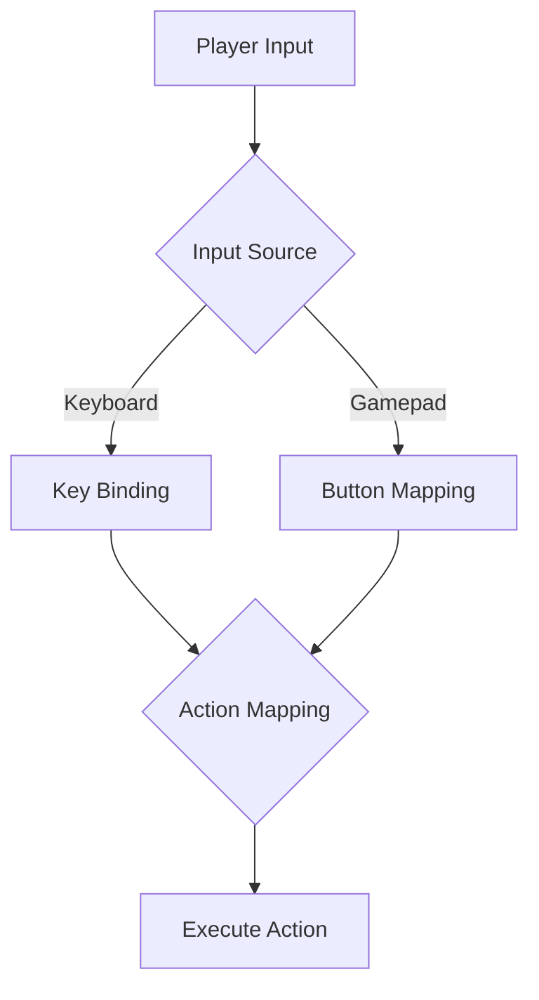

## 10.13 Input Handling and Control Mapping

In the realm of game development, input handling and control mapping are critical components that define how players interact with the game world. This section delves into the intricacies of managing player input using Lua, focusing on implementing robust input systems, key binding, and action mapping. We will explore use cases, provide examples, and discuss supporting multiple input devices and accessibility features.

### Managing Player Input

Player input is the bridge between the player and the game, allowing for interaction and control. Effective input handling ensures that players can seamlessly execute actions and navigate the game environment. Let's break down the essential components of managing player input in Lua.

#### Implementing Input Systems

An input system is responsible for capturing player inputs and translating them into game actions. A well-designed input system should be flexible, allowing for customization and extension. Here are the key aspects to consider:

##### Key Binding

Key binding refers to the process of assigning specific keys or buttons to game actions. This allows players to customize controls according to their preferences, enhancing the gaming experience.

**Example: Basic Key Binding in Lua**

```lua
-- Define a table to store key bindings
local keyBindings = {
    jump = "space",
    moveLeft = "a",
    moveRight = "d",
    shoot = "ctrl"
}

-- Function to handle key press events
function handleKeyPress(key)
    if key == keyBindings.jump then
        print("Player jumps!")
    elseif key == keyBindings.moveLeft then
        print("Player moves left!")
    elseif key == keyBindings.moveRight then
        print("Player moves right!")
    elseif key == keyBindings.shoot then
        print("Player shoots!")
    else
        print("Unassigned key pressed.")
    end
end

-- Simulate key press events
handleKeyPress("space")
handleKeyPress("a")
```

In this example, we define a simple key binding system using a Lua table. The `handleKeyPress` function checks the pressed key against the defined bindings and executes the corresponding action.

##### Action Mapping

Action mapping decouples inputs from actions, allowing for more flexible control schemes. Instead of directly linking keys to actions, we map inputs to abstract actions, which are then translated into game commands.

**Example: Action Mapping in Lua**

```lua
-- Define actions
local actions = {
    jump = function() print("Player jumps!") end,
    moveLeft = function() print("Player moves left!") end,
    moveRight = function() print("Player moves right!") end,
    shoot = function() print("Player shoots!") end
}

-- Define input to action mapping
local inputMap = {
    space = "jump",
    a = "moveLeft",
    d = "moveRight",
    ctrl = "shoot"
}

-- Function to handle key press events
function handleKeyPress(key)
    local action = inputMap[key]
    if action and actions[action] then
        actions[action]()
    else
        print("Unassigned key pressed.")
    end
end

-- Simulate key press events
handleKeyPress("space")
handleKeyPress("a")
```

Here, we separate the input keys from the actions they trigger. This approach makes it easier to change controls without altering the underlying game logic.

### Use Cases and Examples

Input handling and control mapping are crucial in various game genres and scenarios. Let's explore some common use cases and examples.

#### Supporting Multiple Input Devices

Modern games often support multiple input devices, such as keyboards, gamepads, and touchscreens. A flexible input system should accommodate these devices seamlessly.

**Example: Handling Multiple Input Devices**

```lua
-- Define input sources
local inputSources = {
    keyboard = {
        space = "jump",
        a = "moveLeft",
        d = "moveRight",
        ctrl = "shoot"
    },
    gamepad = {
        buttonA = "jump",
        buttonLeft = "moveLeft",
        buttonRight = "moveRight",
        buttonB = "shoot"
    }
}

-- Function to handle input from different sources
function handleInput(source, input)
    local action = inputSources[source][input]
    if action and actions[action] then
        actions[action]()
    else
        print("Unassigned input.")
    end
end

-- Simulate input events
handleInput("keyboard", "space")
handleInput("gamepad", "buttonA")
```

This example demonstrates how to handle inputs from both a keyboard and a gamepad, using a unified action mapping system.

#### Accessibility Features

Accessibility is an important consideration in game design. Providing customizable controls and alternative input methods can make games more inclusive.

**Example: Implementing Accessibility Features**

```lua
-- Define accessibility options
local accessibilityOptions = {
    highContrastMode = false,
    textToSpeech = false
}

-- Function to toggle accessibility features
function toggleAccessibility(option)
    if accessibilityOptions[option] ~= nil then
        accessibilityOptions[option] = not accessibilityOptions[option]
        print(option .. " is now " .. tostring(accessibilityOptions[option]))
    else
        print("Invalid accessibility option.")
    end
end

-- Toggle features
toggleAccessibility("highContrastMode")
toggleAccessibility("textToSpeech")
```

By providing options like high contrast mode and text-to-speech, we can enhance the gaming experience for players with different needs.

### Visualizing Input Handling and Control Mapping

To better understand the flow of input handling and control mapping, let's visualize the process using a flowchart.



**Description:** This flowchart illustrates the process of handling player input from different sources, mapping them to actions, and executing the corresponding game commands.

### Try It Yourself

Experiment with the code examples provided in this section. Try modifying the key bindings, adding new actions, or supporting additional input devices. Consider implementing a simple game loop that continuously checks for player input and updates the game state accordingly.

### References and Links

- [Lua Programming Language](https://www.lua.org/)
- [Game Development with Lua](https://www.gamedev.net/tutorials/programming/general-and-gameplay-programming/game-development-with-lua-r4948/)
- [Input Handling in Games](https://www.gamasutra.com/view/feature/131686/implementing_a_robust_input_.php)

### Knowledge Check

Before moving on, let's reinforce what we've learned with a few questions and exercises.

- What is the difference between key binding and action mapping?
- How can you support multiple input devices in a Lua game?
- Implement a simple input handling system that supports both keyboard and mouse inputs.

### Embrace the Journey

Remember, mastering input handling and control mapping is a journey. As you progress, you'll develop more sophisticated systems that enhance player interaction and enjoyment. Keep experimenting, stay curious, and enjoy the process of creating engaging game experiences!

## Quiz Time!



### What is key binding in the context of game development?

- [x] Assigning specific keys or buttons to game actions
- [ ] Mapping inputs to abstract actions
- [ ] Decoupling inputs from actions
- [ ] Supporting multiple input devices

> **Explanation:** Key binding involves assigning specific keys or buttons to game actions, allowing players to customize controls.

### What is the primary benefit of action mapping?

- [x] Decoupling inputs from actions
- [ ] Assigning specific keys to actions
- [ ] Supporting multiple input devices
- [ ] Enhancing accessibility features

> **Explanation:** Action mapping decouples inputs from actions, allowing for more flexible control schemes.

### How can you support multiple input devices in a Lua game?

- [x] By using a unified action mapping system
- [ ] By hardcoding inputs for each device
- [ ] By using only keyboard inputs
- [ ] By ignoring gamepad inputs

> **Explanation:** A unified action mapping system allows for seamless support of multiple input devices.

### What is an example of an accessibility feature in games?

- [x] High contrast mode
- [ ] Key binding
- [ ] Action mapping
- [ ] Gamepad support

> **Explanation:** High contrast mode is an accessibility feature that enhances visibility for players with visual impairments.

### What is the role of the `handleKeyPress` function in the examples?

- [x] To process key press events and execute corresponding actions
- [ ] To define key bindings
- [ ] To map inputs to actions
- [ ] To toggle accessibility features

> **Explanation:** The `handleKeyPress` function processes key press events and executes the corresponding actions.

### Which of the following is NOT a benefit of action mapping?

- [ ] Decoupling inputs from actions
- [ ] Allowing flexible control schemes
- [x] Hardcoding inputs for each device
- [ ] Simplifying control changes

> **Explanation:** Action mapping avoids hardcoding inputs, allowing for flexible and simplified control changes.

### What does the flowchart illustrate?

- [x] The process of handling player input and executing actions
- [ ] The process of rendering graphics
- [ ] The process of loading game assets
- [ ] The process of saving game progress

> **Explanation:** The flowchart illustrates the process of handling player input from different sources, mapping them to actions, and executing the corresponding game commands.

### How can you enhance the gaming experience for players with different needs?

- [x] By providing accessibility features like high contrast mode and text-to-speech
- [ ] By using only keyboard inputs
- [ ] By ignoring accessibility features
- [ ] By hardcoding controls

> **Explanation:** Providing accessibility features like high contrast mode and text-to-speech enhances the gaming experience for players with different needs.

### What is the purpose of the `toggleAccessibility` function?

- [x] To toggle accessibility features on or off
- [ ] To handle key press events
- [ ] To map inputs to actions
- [ ] To define key bindings

> **Explanation:** The `toggleAccessibility` function toggles accessibility features on or off.

### True or False: Action mapping directly links keys to actions.

- [ ] True
- [x] False

> **Explanation:** Action mapping decouples inputs from actions, allowing for more flexible control schemes.


