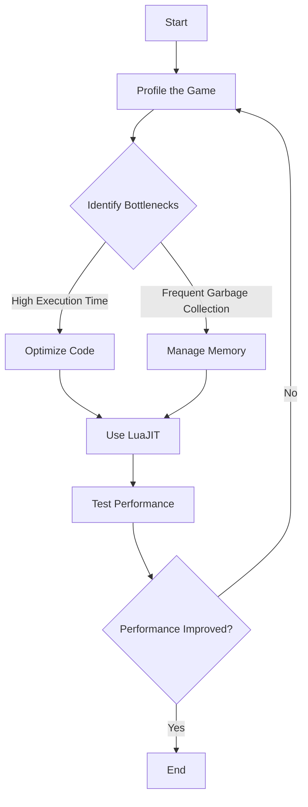

## 10.14 Performance Optimization Techniques in Lua Game Development

In the competitive world of game development, performance optimization is crucial for delivering smooth and engaging experiences. Lua, with its lightweight nature and flexibility, is a popular choice for scripting in games. However, to harness its full potential, developers must employ various performance optimization techniques. In this section, we will explore strategies to maximize game performance using Lua, focusing on profiling, memory management, and code optimization.

### Maximizing Game Performance

Performance optimization in game development involves enhancing the efficiency and responsiveness of a game. This is especially important in high frame rate applications and mobile games, where resources are limited. Let's delve into the key techniques for optimizing performance in Lua-based games.

#### Key Techniques

1. **Profiling: Identifying Performance Bottlenecks**

   Profiling is the process of analyzing a program to determine which parts are consuming the most resources. By identifying bottlenecks, developers can focus their optimization efforts where they will have the most impact.

   - **Tools and Techniques**: Use Lua profilers such as [LuaProfiler](https://github.com/kikito/luaprofiler) to gather data on function call frequency and execution time.
   - **Analyzing Results**: Look for functions with high execution times or frequent calls. These are prime candidates for optimization.

   ```lua
   -- Example of using LuaProfiler
   require("profiler")
   profiler.start("profile.txt")

   -- Your game code here

   profiler.stop()
   ```

   > **Try It Yourself**: Experiment with different sections of your code to see how changes affect performance. Use the profiler to compare results.

2. **Memory Management: Reducing Garbage Collection Impact**

   Lua's garbage collector automatically manages memory, but improper handling can lead to performance issues. Efficient memory management is crucial for minimizing the impact of garbage collection.

   - **Minimize Table Creations**: Frequent creation and destruction of tables can trigger garbage collection. Reuse tables where possible.
   - **Optimize Object Lifetimes**: Keep objects alive for as long as necessary, but no longer. This reduces the frequency of garbage collection cycles.

   ```lua
   -- Example of table reuse
   local reusableTable = {}

   function processData(data)
       -- Clear the table instead of creating a new one
       for k in pairs(reusableTable) do
           reusableTable[k] = nil
       end
       -- Populate the table with new data
       for i, v in ipairs(data) do
           reusableTable[i] = v
       end
   end
   ```

   > **Try It Yourself**: Implement table reuse in your game logic and observe the impact on memory usage and performance.

3. **Optimizing Lua Code: Using LuaJIT, Minimizing Table Creations**

   LuaJIT is a Just-In-Time Compiler for Lua that significantly improves performance by compiling Lua code into machine code at runtime.

   - **Leverage LuaJIT**: Use LuaJIT to boost performance, especially in computationally intensive sections of your code.
   - **Minimize Table Creations**: As mentioned earlier, reducing the creation of tables can lead to performance gains.

   ```lua
   -- Example of using LuaJIT
   -- Ensure your LuaJIT installation is set up correctly
   local ffi = require("ffi")

   ffi.cdef[[
   double sin(double x);
   ]]

   print(ffi.C.sin(1.0))  -- Use C library functions for performance
   ```

   > **Try It Yourself**: Integrate LuaJIT into your project and measure the performance improvements in different parts of your game.

### Use Cases and Examples

#### High Frame Rate Applications

In high frame rate applications, maintaining a consistent frame rate is critical for a smooth user experience. Performance optimization techniques can help achieve this by reducing frame time and ensuring that the game runs smoothly even on less powerful hardware.

- **Example**: A fast-paced action game where quick response times are essential. By optimizing code and managing memory efficiently, developers can ensure that the game maintains a high frame rate.

#### Mobile Game Optimization

Mobile devices have limited resources compared to PCs or consoles. Optimizing performance on mobile platforms involves careful management of CPU, memory, and battery usage.

- **Example**: A mobile puzzle game that needs to run efficiently on a wide range of devices. By profiling the game and optimizing resource usage, developers can deliver a consistent experience across different hardware configurations.

### Visualizing Performance Optimization

To better understand the flow of performance optimization in Lua game development, let's visualize the process using a flowchart.



> **Diagram Description**: This flowchart illustrates the iterative process of performance optimization in Lua game development. It begins with profiling the game to identify bottlenecks, followed by code optimization and memory management. The process is repeated until performance improvements are achieved.

### References and Links

- [LuaProfiler GitHub Repository](https://github.com/kikito/luaprofiler)
- [LuaJIT Official Website](https://luajit.org/)
- [Lua Performance Tips](https://www.lua.org/gems/sample.pdf)

### Knowledge Check

- **Question**: What is the primary purpose of profiling in game development?
  - **Answer**: To identify performance bottlenecks and focus optimization efforts where they will have the most impact.

- **Exercise**: Use a Lua profiler on a small section of your game code. Identify any functions with high execution times and attempt to optimize them.

### Embrace the Journey

Remember, performance optimization is an ongoing process. As you develop your game, continue to profile and optimize your code. Stay curious, experiment with different techniques, and enjoy the journey of creating efficient and engaging games.

## Quiz Time!



### What is the main goal of profiling in game development?

- [x] Identifying performance bottlenecks
- [ ] Increasing code complexity
- [ ] Adding more features
- [ ] Reducing code readability

> **Explanation:** Profiling helps identify parts of the code that consume the most resources, allowing developers to focus on optimizing those areas.

### Which tool can be used for profiling Lua code?

- [x] LuaProfiler
- [ ] LuaJIT
- [ ] LuaSQL
- [ ] LuaSocket

> **Explanation:** LuaProfiler is a tool specifically designed for profiling Lua code to analyze performance.

### What is one way to reduce the impact of garbage collection in Lua?

- [x] Minimize table creations
- [ ] Increase the number of global variables
- [ ] Use more nested loops
- [ ] Avoid using functions

> **Explanation:** Minimizing table creations reduces the frequency of garbage collection cycles, improving performance.

### How does LuaJIT improve performance?

- [x] By compiling Lua code into machine code at runtime
- [ ] By adding more memory to the system
- [ ] By increasing the number of threads
- [ ] By reducing the number of lines of code

> **Explanation:** LuaJIT compiles Lua code into machine code at runtime, significantly boosting performance.

### What is a common optimization technique for high frame rate applications?

- [x] Efficient memory management
- [ ] Increasing the number of assets
- [ ] Using more complex algorithms
- [ ] Adding more graphical effects

> **Explanation:** Efficient memory management helps maintain a consistent frame rate, which is crucial for high frame rate applications.

### What is the benefit of reusing tables in Lua?

- [x] Reduces garbage collection impact
- [ ] Increases code complexity
- [ ] Decreases code readability
- [ ] Increases memory usage

> **Explanation:** Reusing tables minimizes the creation of new tables, reducing the impact of garbage collection.

### Which of the following is a use case for performance optimization in Lua?

- [x] Mobile game optimization
- [ ] Increasing code size
- [ ] Adding more features
- [ ] Reducing code readability

> **Explanation:** Mobile game optimization is a common use case for performance optimization due to limited resources on mobile devices.

### What is a key consideration when optimizing Lua code for mobile platforms?

- [x] Managing CPU, memory, and battery usage
- [ ] Increasing the number of graphical effects
- [ ] Using more complex algorithms
- [ ] Adding more features

> **Explanation:** Managing CPU, memory, and battery usage is crucial for optimizing performance on mobile platforms.

### What is the role of LuaJIT in performance optimization?

- [x] It compiles Lua code into machine code at runtime
- [ ] It increases the number of global variables
- [ ] It adds more features to the game
- [ ] It reduces code readability

> **Explanation:** LuaJIT compiles Lua code into machine code at runtime, significantly improving performance.

### True or False: Profiling is only necessary at the end of the development process.

- [ ] True
- [x] False

> **Explanation:** Profiling should be an ongoing process throughout development to continuously identify and address performance bottlenecks.



By mastering these performance optimization techniques, you'll be well-equipped to create efficient and engaging Lua-based games. Keep experimenting, stay curious, and enjoy the journey of game development!
