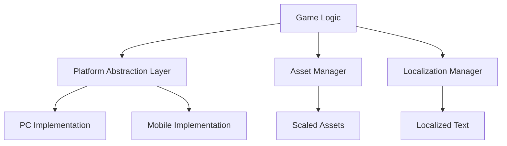

## 10.15 Cross-Platform Considerations in Games

In today's gaming industry, developing games that run seamlessly across multiple platforms is crucial. With the proliferation of devices ranging from PCs and consoles to mobile phones and tablets, ensuring a consistent gaming experience is both a challenge and a necessity. This section delves into the key considerations for cross-platform game development using Lua, focusing on abstracting platform-specific code, asset scaling, and internationalization.

### Developing for Multiple Platforms

When developing games for multiple platforms, we must consider the differences in hardware, operating systems, and user interfaces. The goal is to create a game that feels native and performs optimally on each platform without having to rewrite the entire codebase for each one.

#### Implementing Cross-Platform Support

To achieve cross-platform compatibility, we need to abstract platform-specific code and manage assets effectively. Let's explore these concepts in detail.

##### Abstracting Platform-Specific Code

One of the primary challenges in cross-platform development is handling platform-specific functionality. This includes differences in input methods, graphics rendering, file systems, and network protocols. To manage these differences, we can use abstraction layers and modular design.

###### Using Modules for Different Platforms

By creating modules for platform-specific code, we can isolate these differences and provide a unified interface for the rest of the game code. This approach allows us to switch out platform-specific implementations without affecting the core game logic.

```lua
-- Abstracted Input Module
local Input = {}

-- Platform-specific implementation for PC
local function pcInput()
    -- Handle keyboard and mouse input
end

-- Platform-specific implementation for Mobile
local function mobileInput()
    -- Handle touch input
end

-- Select the appropriate input method based on the platform
if platform == "PC" then
    Input.getInput = pcInput
elseif platform == "Mobile" then
    Input.getInput = mobileInput
end

return Input
```

In this example, we define an `Input` module that abstracts input handling. Depending on the platform, we assign the appropriate input function to `Input.getInput`. This modular approach allows us to maintain a single codebase while supporting multiple platforms.

###### Asset Scaling

Another critical aspect of cross-platform development is managing assets such as images, sounds, and fonts. Different devices have varying screen sizes and resolutions, which can affect how assets are displayed. To ensure a consistent visual experience, we need to implement asset scaling.

###### Adjusting Resources for Different Screen Sizes

Asset scaling involves creating multiple versions of assets optimized for different screen sizes and resolutions. This ensures that the game looks good on both high-resolution displays and smaller screens.

```lua
-- Asset Scaling Function
local function scaleAsset(asset, scaleFactor)
    -- Adjust the asset size based on the scale factor
    asset.width = asset.width * scaleFactor
    asset.height = asset.height * scaleFactor
end

-- Example usage
local image = { width = 100, height = 100 }
local scaleFactor = 1.5 -- Example scale factor for a high-resolution display
scaleAsset(image, scaleFactor)
```

In this code snippet, we define a `scaleAsset` function that adjusts the size of an asset based on a given scale factor. By applying this function to all assets, we can ensure they are appropriately scaled for the target device.

### Use Cases and Examples

Let's explore some practical use cases and examples of cross-platform game development.

#### Porting Games to Mobile Devices

Porting a game from PC or console to mobile devices involves several considerations, including touch input, performance optimization, and screen size adaptation.

##### Touch Input

Mobile devices rely on touch input, which requires a different approach compared to keyboard and mouse or gamepad input. We need to design intuitive touch controls that provide a seamless gaming experience.

```lua
-- Touch Input Handling
local function handleTouchInput(touchEvent)
    if touchEvent.phase == "began" then
        -- Handle touch start
    elseif touchEvent.phase == "moved" then
        -- Handle touch move
    elseif touchEvent.phase == "ended" then
        -- Handle touch end
    end
end

-- Register touch event listener
Runtime:addEventListener("touch", handleTouchInput)
```

In this example, we define a `handleTouchInput` function that processes touch events. By registering this function as a touch event listener, we can handle touch input in our game.

##### Performance Optimization

Mobile devices have limited processing power and memory compared to PCs and consoles. To ensure smooth performance, we need to optimize our game code and assets.

- **Reduce Asset Size**: Use compressed textures and audio files to minimize memory usage.
- **Optimize Code**: Profile and optimize code to reduce CPU usage and improve frame rates.
- **Limit Draw Calls**: Minimize the number of draw calls to improve rendering performance.

##### Screen Size Adaptation

Mobile devices come in various screen sizes and aspect ratios. We need to design our game UI and assets to adapt to different screen dimensions.

```lua
-- Screen Size Adaptation
local function adaptToScreenSize()
    local screenWidth, screenHeight = display.contentWidth, display.contentHeight
    -- Adjust UI elements based on screen size
    uiElement.x = screenWidth / 2
    uiElement.y = screenHeight / 2
end

-- Call the function to adapt UI elements
adaptToScreenSize()
```

In this code snippet, we define an `adaptToScreenSize` function that adjusts UI elements based on the screen size. This ensures that the game UI is properly aligned and scaled on different devices.

#### Internationalization and Localization

To reach a global audience, we need to support multiple languages and cultural preferences. This involves internationalizing and localizing our game content.

##### Internationalization

Internationalization (i18n) is the process of designing a game so that it can be easily adapted to different languages and regions. This involves separating translatable text from the game code and using resource files for different languages.

```lua
-- Internationalization Example
local i18n = {
    en = {
        welcome = "Welcome",
        startGame = "Start Game"
    },
    es = {
        welcome = "Bienvenido",
        startGame = "Iniciar Juego"
    }
}

-- Function to get localized text
local function getLocalizedText(key, language)
    return i18n[language][key]
end

-- Example usage
local language = "es" -- Spanish
print(getLocalizedText("welcome", language)) -- Output: Bienvenido
```

In this example, we define an `i18n` table that contains translations for different languages. The `getLocalizedText` function retrieves the localized text based on the specified language.

##### Localization

Localization (l10n) involves adapting the game content to specific regions, including translating text, adjusting date and time formats, and considering cultural differences.

- **Text Translation**: Translate all in-game text, including menus, dialogues, and instructions.
- **Cultural Adaptation**: Consider cultural preferences, such as color symbolism and imagery.
- **Date and Time Formats**: Adjust date and time formats to match regional conventions.

### Visualizing Cross-Platform Architecture

To better understand the architecture of a cross-platform game, let's visualize the components and their interactions using a Mermaid.js diagram.



**Diagram Description**: This diagram illustrates the architecture of a cross-platform game. The `Game Logic` interacts with the `Platform Abstraction Layer`, which provides platform-specific implementations for PC and mobile. The `Asset Manager` handles asset scaling, while the `Localization Manager` manages localized text.

### Try It Yourself

To deepen your understanding of cross-platform game development, try modifying the code examples provided in this section. Experiment with different input methods, asset scaling factors, and localization settings. Consider creating a simple game that runs on both PC and mobile devices, and implement touch controls and asset scaling.

### References and Links

- [Lua Programming Language](https://www.lua.org/)
- [Cross-Platform Game Development](https://en.wikipedia.org/wiki/Cross-platform_software)
- [Internationalization and Localization](https://www.w3.org/International/questions/qa-i18n)

### Knowledge Check

To reinforce your understanding of cross-platform considerations in game development, consider the following questions:

- What are the key challenges in developing cross-platform games?
- How can we abstract platform-specific code to support multiple platforms?
- What techniques can we use to scale assets for different screen sizes?
- How does internationalization differ from localization?

### Embrace the Journey

Cross-platform game development is a rewarding journey that allows us to reach a wider audience and create games that can be enjoyed on various devices. Remember, this is just the beginning. As you progress, you'll build more complex and interactive games. Keep experimenting, stay curious, and enjoy the journey!

## Quiz Time!



### What is the primary goal of cross-platform game development?

- [x] To create a game that feels native and performs optimally on each platform.
- [ ] To develop separate codebases for each platform.
- [ ] To focus solely on mobile platforms.
- [ ] To prioritize graphics over performance.

> **Explanation:** The primary goal of cross-platform game development is to create a game that feels native and performs optimally on each platform without having to rewrite the entire codebase for each one.

### How can we handle platform-specific functionality in cross-platform development?

- [x] By using abstraction layers and modular design.
- [ ] By writing separate code for each platform.
- [ ] By ignoring platform differences.
- [ ] By focusing only on the most popular platform.

> **Explanation:** We can handle platform-specific functionality by using abstraction layers and modular design, which allows us to isolate platform differences and provide a unified interface for the rest of the game code.

### What is asset scaling in cross-platform development?

- [x] Creating multiple versions of assets optimized for different screen sizes and resolutions.
- [ ] Using the same assets for all platforms.
- [ ] Reducing asset quality for performance.
- [ ] Ignoring screen size differences.

> **Explanation:** Asset scaling involves creating multiple versions of assets optimized for different screen sizes and resolutions to ensure a consistent visual experience across devices.

### What is the purpose of the `scaleAsset` function in the provided code example?

- [x] To adjust the size of an asset based on a given scale factor.
- [ ] To compress assets for mobile devices.
- [ ] To convert assets to a different format.
- [ ] To ignore asset scaling.

> **Explanation:** The `scaleAsset` function adjusts the size of an asset based on a given scale factor, ensuring that assets are appropriately scaled for the target device.

### How does internationalization differ from localization?

- [x] Internationalization is designing a game for easy adaptation to different languages, while localization involves adapting content to specific regions.
- [ ] Internationalization is translating text, while localization is designing the game.
- [ ] Internationalization is for mobile platforms, while localization is for PCs.
- [ ] Internationalization and localization are the same.

> **Explanation:** Internationalization is the process of designing a game so that it can be easily adapted to different languages and regions, while localization involves adapting the game content to specific regions.

### What is a key consideration when porting games to mobile devices?

- [x] Designing intuitive touch controls.
- [ ] Ignoring performance optimization.
- [ ] Using only high-resolution assets.
- [ ] Focusing solely on graphics.

> **Explanation:** A key consideration when porting games to mobile devices is designing intuitive touch controls that provide a seamless gaming experience.

### Why is performance optimization important for mobile devices?

- [x] Mobile devices have limited processing power and memory compared to PCs and consoles.
- [ ] Mobile devices have unlimited resources.
- [ ] Performance optimization is not necessary for mobile devices.
- [ ] Mobile devices prioritize graphics over performance.

> **Explanation:** Performance optimization is important for mobile devices because they have limited processing power and memory compared to PCs and consoles, requiring efficient use of resources to ensure smooth gameplay.

### What is the role of the `adaptToScreenSize` function in the provided code example?

- [x] To adjust UI elements based on the screen size.
- [ ] To compress UI elements for mobile devices.
- [ ] To convert UI elements to a different format.
- [ ] To ignore screen size differences.

> **Explanation:** The `adaptToScreenSize` function adjusts UI elements based on the screen size, ensuring that the game UI is properly aligned and scaled on different devices.

### What should be considered in localization besides text translation?

- [x] Cultural adaptation and date/time formats.
- [ ] Only text translation.
- [ ] Ignoring cultural differences.
- [ ] Using the same content for all regions.

> **Explanation:** In localization, besides text translation, we should consider cultural adaptation and adjust date and time formats to match regional conventions.

### True or False: Cross-platform game development allows us to reach a wider audience.

- [x] True
- [ ] False

> **Explanation:** True. Cross-platform game development allows us to reach a wider audience by creating games that can be enjoyed on various devices.




