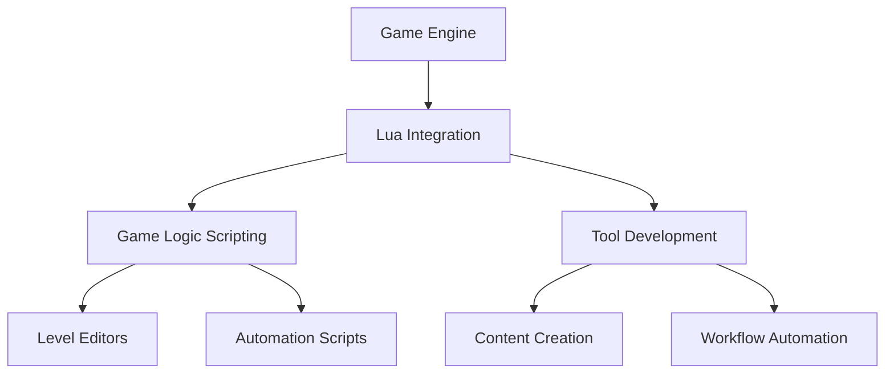

## 10.2 Using Lua in Game and Tool Creation

Lua has established itself as a powerful scripting language in the realm of game development. Its lightweight nature, ease of integration, and flexibility make it an ideal choice for extending C/C++ engines and developing game tools. In this section, we will explore how Lua can be used to enhance game development by adding scripting capabilities to engines and creating tools like level editors and automation scripts.

### Extending C/C++ Engines with Lua

One of the primary uses of Lua in game development is to extend C/C++ engines. By embedding Lua into a game engine, developers can expose engine functionalities to scripts, allowing for dynamic content creation and modification without recompiling the engine. This approach not only speeds up the development process but also empowers designers and non-programmers to contribute to game logic and content.

#### Benefits of Using Lua with C/C++ Engines

- **Flexibility**: Lua scripts can be modified and reloaded at runtime, enabling rapid iteration and prototyping.
- **Separation of Concerns**: Game logic can be separated from engine code, making it easier to manage and maintain.
- **Accessibility**: Lua's simple syntax makes it accessible to non-programmers, allowing designers to script game behaviors.
- **Performance**: Lua is lightweight and fast, with a small memory footprint, making it suitable for performance-critical applications.

#### Integrating Lua with a C/C++ Engine

To integrate Lua with a C/C++ engine, follow these steps:

1. **Include the Lua Library**: Add the Lua library to your project. You can download it from the [official Lua website](https://www.lua.org/download.html).

2. **Initialize the Lua State**: Create a Lua state in your C/C++ application. This state will be used to execute Lua scripts.

   ```cpp
   #include <lua.hpp>

   lua_State* L = luaL_newstate();
   luaL_openlibs(L);
   ```

3. **Expose C/C++ Functions to Lua**: Use the Lua C API to register C/C++ functions that can be called from Lua scripts.

   ```cpp
   int myFunction(lua_State* L) {
       // Function implementation
       return 0;
   }

   lua_register(L, "myFunction", myFunction);
   ```

4. **Load and Execute Lua Scripts**: Load and run Lua scripts from your C/C++ application.

   ```cpp
   if (luaL_dofile(L, "script.lua") != LUA_OK) {
       fprintf(stderr, "Error: %s\n", lua_tostring(L, -1));
   }
   ```

5. **Close the Lua State**: When done, close the Lua state to free resources.

   ```cpp
   lua_close(L);
   ```

#### Example: A Simple Game Loop in Lua

Let's create a simple game loop using Lua. This example demonstrates how Lua can be used to control game logic while the engine handles rendering and input.

```lua
-- game.lua
local running = true

function update()
    -- Game logic goes here
    print("Updating game state")
end

function handleInput(input)
    if input == "quit" then
        running = false
    end
end

function isRunning()
    return running
end
```

In the C/C++ engine, you would call these Lua functions in your main loop:

```cpp
while (true) {
    lua_getglobal(L, "isRunning");
    lua_call(L, 0, 1);
    bool running = lua_toboolean(L, -1);
    lua_pop(L, 1);

    if (!running) break;

    lua_getglobal(L, "update");
    lua_call(L, 0, 0);

    // Handle input and other engine tasks
}
```

### Game Tools Development

In addition to extending game engines, Lua is also used to develop various game tools. These tools can range from level editors to automation scripts that streamline workflows.

#### Level Editors

Level editors are essential tools in game development, allowing designers to create and modify game levels visually. Lua can be used to script the behavior of level editors, providing a flexible and customizable environment for content creation.

##### Building a Level Editor with Lua

1. **Define the Editor Interface**: Use a GUI library to create the editor interface. Libraries like [ImGui](https://github.com/ocornut/imgui) can be used for this purpose.

2. **Script Level Elements**: Use Lua to define the properties and behaviors of level elements. This allows designers to script interactions and events without modifying the editor's source code.

3. **Save and Load Levels**: Implement functionality to save and load levels using Lua scripts. This can be done by serializing level data to a file.

4. **Preview and Test Levels**: Allow designers to preview and test levels directly within the editor, using Lua scripts to control game logic.

##### Example: Scripting a Level Element

```lua
-- level_element.lua
local element = {}

function element:new(x, y)
    local obj = {x = x, y = y}
    setmetatable(obj, self)
    self.__index = self
    return obj
end

function element:draw()
    -- Draw the element at its position
    print("Drawing element at (" .. self.x .. ", " .. self.y .. ")")
end

function element:onClick()
    -- Handle click event
    print("Element clicked!")
end

return element
```

In the level editor, you can create and manipulate these elements:

```lua
local Element = require("level_element")

local myElement = Element:new(100, 200)
myElement:draw()
myElement:onClick()
```

#### Automation Scripts

Automation scripts are used to streamline workflows in game development. They can automate repetitive tasks, such as asset processing, build automation, and testing.

##### Creating Automation Scripts with Lua

1. **Identify Repetitive Tasks**: Determine which tasks can be automated to save time and reduce errors.

2. **Write Lua Scripts**: Use Lua to write scripts that automate these tasks. Lua's simplicity and ease of use make it ideal for scripting automation tasks.

3. **Integrate with Build Systems**: Integrate Lua scripts with build systems to automate the build process. This can include compiling assets, running tests, and deploying builds.

4. **Schedule and Trigger Scripts**: Use task schedulers or build systems to trigger Lua scripts at specific times or events.

##### Example: Automating Asset Processing

```lua
-- asset_processor.lua
local lfs = require("lfs")

function processAssets(directory)
    for file in lfs.dir(directory) do
        if file ~= "." and file ~= ".." then
            local filePath = directory .. "/" .. file
            print("Processing asset: " .. filePath)
            -- Perform asset processing
        end
    end
end

processAssets("assets")
```

### Visualizing Lua's Role in Game Development

To better understand how Lua fits into the game development process, let's visualize its role using a flowchart.



**Figure 1**: Visualizing Lua's Role in Game Development

### Try It Yourself

Now that we've covered the basics of using Lua in game and tool creation, it's time to try it yourself. Here are a few suggestions to get you started:

- **Modify the Game Loop**: Add new functions to the Lua game loop example, such as `render()` or `handleCollision()`, and call them from the C/C++ engine.
- **Extend the Level Editor**: Add new features to the level editor example, such as dragging and dropping elements or saving level data to a file.
- **Create an Automation Script**: Write a Lua script to automate a task in your development workflow, such as compressing assets or running tests.

### Knowledge Check

Before we wrap up, let's review some key concepts:

- **What are the benefits of using Lua with C/C++ engines?**
- **How can Lua be used to develop game tools like level editors?**
- **What are some examples of tasks that can be automated with Lua scripts?**

### Embrace the Journey

Remember, this is just the beginning. As you progress, you'll discover more ways to leverage Lua in game development. Keep experimenting, stay curious, and enjoy the journey!

## Quiz Time!



### What is one of the primary benefits of using Lua in game development?

- [x] Flexibility in modifying scripts at runtime
- [ ] High-level graphics rendering
- [ ] Built-in physics engine
- [ ] Advanced AI capabilities

> **Explanation:** Lua allows developers to modify scripts at runtime, providing flexibility and rapid iteration.

### How can Lua be integrated with a C/C++ engine?

- [x] By using the Lua C API to register functions and execute scripts
- [ ] By compiling Lua scripts into C++ code
- [ ] By using Lua as a standalone application
- [ ] By converting Lua scripts into machine code

> **Explanation:** The Lua C API allows developers to register C/C++ functions and execute Lua scripts within an engine.

### What is a common use of Lua in game tools development?

- [x] Scripting level editors for content creation
- [ ] Developing 3D rendering engines
- [ ] Creating audio processing libraries
- [ ] Building network protocols

> **Explanation:** Lua is often used to script level editors, allowing designers to create and modify game content.

### What is the purpose of automation scripts in game development?

- [x] To streamline workflows by automating repetitive tasks
- [ ] To enhance graphics rendering
- [ ] To improve network performance
- [ ] To develop AI algorithms

> **Explanation:** Automation scripts help streamline workflows by automating repetitive tasks, saving time and reducing errors.

### Which of the following is a step in integrating Lua with a C/C++ engine?

- [x] Initializing the Lua state
- [ ] Compiling Lua scripts into C++ code
- [ ] Using Lua as a standalone application
- [ ] Converting Lua scripts into machine code

> **Explanation:** Initializing the Lua state is a crucial step in integrating Lua with a C/C++ engine.

### What is a benefit of using Lua for level editors?

- [x] It allows for scripting interactions and events without modifying source code
- [ ] It provides advanced 3D rendering capabilities
- [ ] It includes built-in physics simulations
- [ ] It offers high-level AI development tools

> **Explanation:** Lua allows designers to script interactions and events without modifying the editor's source code.

### How can Lua scripts be triggered in a build system?

- [x] By using task schedulers or build systems
- [ ] By manually executing scripts
- [ ] By compiling them into the build process
- [ ] By converting them into machine code

> **Explanation:** Task schedulers or build systems can trigger Lua scripts at specific times or events.

### What is a key feature of Lua that makes it suitable for automation scripts?

- [x] Its simplicity and ease of use
- [ ] Its advanced graphics capabilities
- [ ] Its built-in AI algorithms
- [ ] Its high-level network protocols

> **Explanation:** Lua's simplicity and ease of use make it ideal for writing automation scripts.

### What is the role of Lua in game logic scripting?

- [x] To separate game logic from engine code
- [ ] To render high-quality graphics
- [ ] To process audio signals
- [ ] To manage network connections

> **Explanation:** Lua helps separate game logic from engine code, making it easier to manage and maintain.

### True or False: Lua can only be used for scripting in game development.

- [ ] True
- [x] False

> **Explanation:** Lua can be used for both scripting and tool development in game development.


