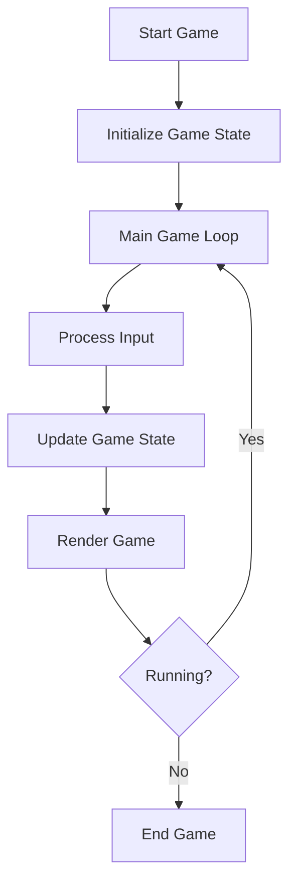

## 10.3 Game Loop Pattern

In the realm of game development, the Game Loop Pattern is a fundamental concept that serves as the backbone of any interactive application. It is responsible for managing the continuous execution of game logic, updating the game state, and rendering frames to the screen. In this section, we will delve into the intricacies of the Game Loop Pattern, specifically focusing on its implementation in Lua, a lightweight and versatile scripting language widely used in game development.

### Understanding the Game Loop Pattern

The Game Loop Pattern is a design pattern that provides a structured approach to handling the flow of a game. It ensures that the game runs smoothly by repeatedly executing a series of steps: processing input, updating the game state, and rendering the game world. This loop continues until the game is terminated, either by the player or by an external event.

#### Key Components of the Game Loop

1. **Input Handling**: Captures and processes user inputs, such as keyboard presses, mouse movements, or touch events.

2. **Game State Update**: Applies game logic to update the state of game objects, such as moving characters, checking collisions, and updating scores.

3. **Rendering**: Draws the current state of the game world to the screen, ensuring that the player sees the most up-to-date visuals.

4. **Frame Rate Control**: Manages the timing of the loop to maintain a consistent frame rate, ensuring smooth gameplay.

### Implementing the Game Loop in Lua

Implementing a game loop in Lua involves creating a function that encapsulates the loop's logic and is repeatedly called to update and render the game. Let's explore how to implement a basic game loop in Lua.

#### Basic Game Loop Structure

```lua
-- Initialize game state
local running = true
local lastTime = os.clock()

-- Main game loop
while running do
    -- Calculate delta time
    local currentTime = os.clock()
    local deltaTime = currentTime - lastTime
    lastTime = currentTime

    -- Process input
    processInput()

    -- Update game state
    updateGameState(deltaTime)

    -- Render game
    renderGame()

    -- Control frame rate
    controlFrameRate()
end
```

In this basic structure, we initialize the game state and enter a `while` loop that continues as long as the game is running. Within the loop, we calculate the `deltaTime`, which represents the time elapsed since the last frame. This value is crucial for ensuring that game updates are consistent, regardless of the frame rate.

#### Detailed Breakdown

1. **Process Input**: This function captures and processes user inputs. In Lua, this might involve checking for key presses or mouse movements.

    ```lua
    function processInput()
        -- Example: Check for key press
        if love.keyboard.isDown("escape") then
            running = false
        end
    end
    ```

2. **Update Game State**: This function updates the game logic based on the elapsed time (`deltaTime`). It might involve moving characters, checking for collisions, or updating scores.

    ```lua
    function updateGameState(deltaTime)
        -- Example: Move a character
        player.x = player.x + player.speed * deltaTime
    end
    ```

3. **Render Game**: This function draws the current state of the game world to the screen. In Lua, this might involve using a graphics library like LÖVE.

    ```lua
    function renderGame()
        -- Example: Draw a player
        love.graphics.draw(player.image, player.x, player.y)
    end
    ```

4. **Control Frame Rate**: This function manages the timing of the loop to maintain a consistent frame rate. It might involve sleeping for a short duration to prevent the loop from running too fast.

    ```lua
    function controlFrameRate()
        -- Example: Sleep for a short duration
        love.timer.sleep(0.016) -- Approximately 60 FPS
    end
    ```

### Frame Rate Control

Controlling the frame rate is crucial for ensuring smooth gameplay. A consistent frame rate provides a stable experience for players, preventing issues such as stuttering or lag. In Lua, frame rate control can be achieved by calculating the time taken for each loop iteration and adjusting the loop's timing accordingly.

#### Implementing Frame Rate Control

```lua
local targetFPS = 60
local frameDuration = 1 / targetFPS

function controlFrameRate()
    local frameTime = os.clock() - lastTime
    if frameTime < frameDuration then
        love.timer.sleep(frameDuration - frameTime)
    end
end
```

In this implementation, we calculate the `frameTime`, which is the time taken for the current frame. If the `frameTime` is less than the `frameDuration` (the desired duration for each frame), we sleep for the remaining time to maintain the target frame rate.

### Use Cases and Examples

The Game Loop Pattern is applicable in various scenarios within game development. Let's explore some common use cases and examples.

#### Animations and Physics Simulations

Animations and physics simulations rely heavily on the game loop to update the state of objects over time. By using the `deltaTime`, we can ensure that animations and physics calculations are consistent, regardless of the frame rate.

```lua
function updateGameState(deltaTime)
    -- Update animation frame
    animation.currentFrame = animation.currentFrame + animation.speed * deltaTime

    -- Apply physics calculations
    object.velocity = object.velocity + gravity * deltaTime
    object.position = object.position + object.velocity * deltaTime
end
```

#### Input Handling

Input handling is a critical component of the game loop. By processing inputs within the loop, we can ensure that player actions are immediately reflected in the game state.

```lua
function processInput()
    if love.keyboard.isDown("left") then
        player.x = player.x - player.speed * deltaTime
    elseif love.keyboard.isDown("right") then
        player.x = player.x + player.speed * deltaTime
    end
end
```

### Visualizing the Game Loop

To better understand the flow of the game loop, let's visualize it using a flowchart.



**Figure 1**: This flowchart illustrates the flow of the game loop, starting from initializing the game state, processing input, updating the game state, rendering the game, and checking if the game is still running.

### Design Considerations

When implementing the Game Loop Pattern, there are several design considerations to keep in mind:

1. **Consistency**: Ensure that the game loop runs consistently, regardless of the hardware or platform. This can be achieved by using `deltaTime` to update game logic.

2. **Performance**: Optimize the game loop to minimize performance bottlenecks. This might involve profiling the loop to identify slow operations and optimizing them.

3. **Scalability**: Design the game loop to be scalable, allowing for the addition of new features or components without significant refactoring.

4. **Modularity**: Keep the game loop modular by separating concerns into distinct functions or modules. This improves maintainability and readability.

### Differences and Similarities

The Game Loop Pattern shares similarities with other design patterns, such as the Observer Pattern, which is used for event handling. However, the Game Loop Pattern is unique in its focus on continuous execution and real-time updates.

### Try It Yourself

To gain a deeper understanding of the Game Loop Pattern, try modifying the code examples provided. Experiment with different frame rates, add new game logic, or integrate additional input handling. By doing so, you'll gain practical experience and a better understanding of how the game loop operates.

### Conclusion

The Game Loop Pattern is a cornerstone of game development, providing a structured approach to managing game execution. By understanding and implementing this pattern in Lua, you can create smooth, responsive, and engaging games. Remember, this is just the beginning. As you progress, you'll build more complex and interactive games. Keep experimenting, stay curious, and enjoy the journey!

## Quiz Time!



### What is the primary purpose of the Game Loop Pattern?

- [x] To manage the continuous execution of game logic, updating the game state, and rendering frames.
- [ ] To handle user authentication in games.
- [ ] To manage game assets and resources.
- [ ] To implement network communication in games.

> **Explanation:** The Game Loop Pattern is responsible for managing the continuous execution of game logic, updating the game state, and rendering frames to the screen.

### Which component of the game loop is responsible for capturing and processing user inputs?

- [x] Input Handling
- [ ] Game State Update
- [ ] Rendering
- [ ] Frame Rate Control

> **Explanation:** Input Handling is responsible for capturing and processing user inputs, such as keyboard presses, mouse movements, or touch events.

### What is the role of `deltaTime` in the game loop?

- [x] To ensure that game updates are consistent, regardless of the frame rate.
- [ ] To manage the rendering of game graphics.
- [ ] To handle user inputs.
- [ ] To control the game's audio.

> **Explanation:** `deltaTime` represents the time elapsed since the last frame and is used to ensure that game updates are consistent, regardless of the frame rate.

### How can frame rate control be achieved in Lua?

- [x] By calculating the time taken for each loop iteration and adjusting the loop's timing accordingly.
- [ ] By using a fixed time step for all game updates.
- [ ] By ignoring the time taken for each loop iteration.
- [ ] By using a random time step for game updates.

> **Explanation:** Frame rate control can be achieved by calculating the time taken for each loop iteration and adjusting the loop's timing accordingly to maintain a consistent frame rate.

### Which function in the game loop is responsible for drawing the current state of the game world to the screen?

- [x] Render Game
- [ ] Process Input
- [ ] Update Game State
- [ ] Control Frame Rate

> **Explanation:** The Render Game function is responsible for drawing the current state of the game world to the screen.

### What is a common use case for the Game Loop Pattern?

- [x] Animations and physics simulations
- [ ] User authentication
- [ ] Network communication
- [ ] Asset management

> **Explanation:** The Game Loop Pattern is commonly used for animations and physics simulations, as it allows for continuous updates to the game state.

### How can you ensure that the game loop runs consistently, regardless of the hardware or platform?

- [x] By using `deltaTime` to update game logic.
- [ ] By using a fixed time step for all updates.
- [ ] By ignoring hardware differences.
- [ ] By using platform-specific optimizations.

> **Explanation:** Using `deltaTime` to update game logic ensures that the game loop runs consistently, regardless of the hardware or platform.

### What is a key design consideration when implementing the Game Loop Pattern?

- [x] Consistency
- [ ] User interface design
- [ ] Network latency
- [ ] Asset loading

> **Explanation:** Consistency is a key design consideration when implementing the Game Loop Pattern, ensuring that the loop runs smoothly and predictably.

### Which design pattern is commonly used for event handling in games?

- [x] Observer Pattern
- [ ] Singleton Pattern
- [ ] Factory Pattern
- [ ] Strategy Pattern

> **Explanation:** The Observer Pattern is commonly used for event handling in games, allowing objects to be notified of changes or events.

### True or False: The Game Loop Pattern is unique in its focus on continuous execution and real-time updates.

- [x] True
- [ ] False

> **Explanation:** True. The Game Loop Pattern is unique in its focus on continuous execution and real-time updates, making it essential for interactive applications like games.


