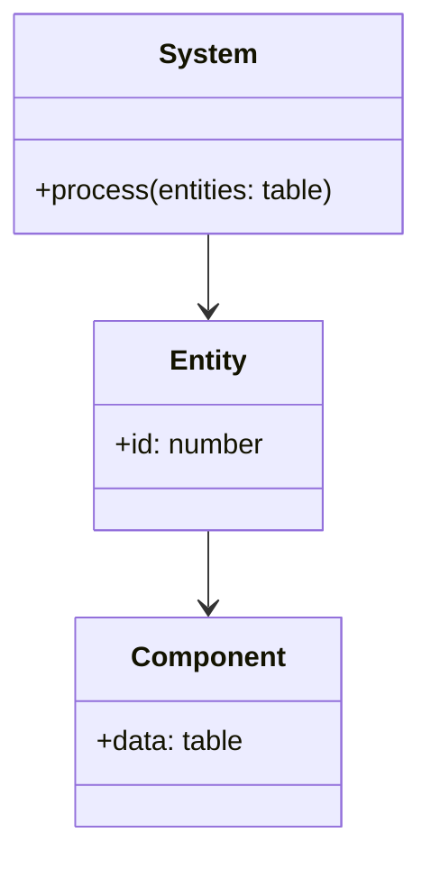

## 10.4 Entity Component System (ECS) Pattern

The Entity Component System (ECS) pattern is a powerful architectural pattern used in game development to create flexible and reusable game objects. By decomposing entities into components, ECS allows developers to manage complex game worlds efficiently and optimize performance. In this section, we will explore the ECS pattern in Lua, focusing on its implementation, use cases, and benefits.

### Flexible Game Object Architecture

The ECS pattern is designed to address the limitations of traditional object-oriented programming (OOP) approaches in game development. In OOP, game objects are typically represented as classes with inheritance hierarchies. However, this can lead to rigid and complex structures that are difficult to extend and maintain. ECS offers a more flexible approach by separating data and behavior into distinct components and systems.

#### Key Concepts of ECS

1. **Entities**: In ECS, an entity is a unique identifier that represents a game object. Entities themselves do not contain any data or behavior. Instead, they act as containers for components.

2. **Components**: Components are data containers that store the attributes and properties of an entity. Each component represents a specific aspect of an entity, such as position, velocity, or health. Components are typically implemented as simple data structures without any logic.

3. **Systems**: Systems are responsible for processing entities with specific components. They contain the logic and behavior that operate on the data stored in components. Systems iterate over entities, checking for the presence of required components, and perform operations accordingly.

### Implementing ECS in Lua

Let's dive into the implementation of the ECS pattern in Lua. We will create a simple ECS framework that demonstrates the core concepts of entities, components, and systems.

#### Step 1: Define Entities

Entities in ECS are unique identifiers. In Lua, we can represent entities as simple numbers or strings. Here's a basic implementation:

```lua
-- Entity Manager
local EntityManager = {}
EntityManager.__index = EntityManager

function EntityManager:new()
    local instance = {
        nextEntityId = 1,
        entities = {}
    }
    setmetatable(instance, EntityManager)
    return instance
end

function EntityManager:createEntity()
    local entityId = self.nextEntityId
    self.entities[entityId] = true
    self.nextEntityId = self.nextEntityId + 1
    return entityId
end

function EntityManager:destroyEntity(entityId)
    self.entities[entityId] = nil
end

-- Usage
local entityManager = EntityManager:new()
local playerEntity = entityManager:createEntity()
print("Created Entity ID:", playerEntity)
```

#### Step 2: Define Components

Components are data structures that store the attributes of entities. In Lua, we can use tables to represent components. Here's an example of a position component:

```lua
-- Position Component
local PositionComponent = {}
PositionComponent.__index = PositionComponent

function PositionComponent:new(x, y)
    local instance = {
        x = x or 0,
        y = y or 0
    }
    setmetatable(instance, PositionComponent)
    return instance
end

-- Usage
local position = PositionComponent:new(10, 20)
print("Position:", position.x, position.y)
```

#### Step 3: Define Systems

Systems contain the logic that operates on entities with specific components. In Lua, we can implement systems as functions or objects. Here's an example of a movement system:

```lua
-- Movement System
local MovementSystem = {}
MovementSystem.__index = MovementSystem

function MovementSystem:new()
    local instance = {
        entities = {}
    }
    setmetatable(instance, MovementSystem)
    return instance
end

function MovementSystem:addEntity(entity, positionComponent, velocityComponent)
    self.entities[entity] = {position = positionComponent, velocity = velocityComponent}
end

function MovementSystem:update(dt)
    for entity, components in pairs(self.entities) do
        local position = components.position
        local velocity = components.velocity
        position.x = position.x + velocity.x * dt
        position.y = position.y + velocity.y * dt
    end
end

-- Usage
local movementSystem = MovementSystem:new()
local velocityComponent = {x = 5, y = 0}
movementSystem:addEntity(playerEntity, position, velocityComponent)
movementSystem:update(1)
print("Updated Position:", position.x, position.y)
```

### Use Cases and Examples

The ECS pattern is particularly useful in scenarios where game worlds are complex and require high performance. Here are some common use cases:

1. **Complex Game Worlds**: ECS allows developers to manage large numbers of entities with diverse behaviors and attributes. By decoupling data and logic, ECS makes it easier to extend and modify game objects.

2. **Performance Optimization**: ECS can improve performance by enabling efficient data processing. Systems can be optimized to process only the necessary components, reducing overhead and improving frame rates.

3. **Dynamic Behavior**: ECS supports dynamic behavior changes by adding or removing components from entities. This flexibility allows for easy implementation of features like power-ups, status effects, and more.

### Visualizing ECS Architecture

To better understand the ECS pattern, let's visualize the architecture using a class diagram:



**Diagram Description**: The diagram illustrates the relationship between entities, components, and systems in the ECS pattern. Entities are linked to components, and systems operate on entities with specific components.

### Design Considerations

When implementing the ECS pattern in Lua, consider the following:

- **Data-Oriented Design**: ECS promotes a data-oriented design approach, which can lead to more efficient memory usage and cache-friendly data access patterns.

- **Component Granularity**: Determine the appropriate level of granularity for components. Too many small components can lead to overhead, while too few large components can reduce flexibility.

- **System Dependencies**: Be mindful of dependencies between systems. Ensure that systems are designed to operate independently and avoid tight coupling.

### Differences and Similarities

The ECS pattern is often compared to traditional OOP approaches. Here are some key differences and similarities:

- **Separation of Concerns**: ECS separates data and behavior, while OOP often combines them in classes.

- **Flexibility**: ECS offers greater flexibility in modifying and extending game objects compared to rigid inheritance hierarchies in OOP.

- **Performance**: ECS can provide performance benefits by optimizing data access patterns, whereas OOP may introduce overhead due to complex class structures.

### Try It Yourself

Now that we've covered the basics of ECS in Lua, try experimenting with the code examples. Here are some suggestions:

- **Add New Components**: Create additional components, such as health or inventory, and integrate them into the ECS framework.

- **Implement New Systems**: Develop new systems, such as rendering or collision detection, and see how they interact with existing components.

- **Optimize Performance**: Experiment with different data structures and algorithms to optimize the performance of your ECS implementation.

### References and Links

For further reading on ECS and game development in Lua, consider the following resources:

- [Lua Programming Guide](https://www.lua.org/manual/5.4/)
- [Game Programming Patterns](http://gameprogrammingpatterns.com/)
- [ECS in Game Development](https://en.wikipedia.org/wiki/Entity_component_system)

### Knowledge Check

Before we wrap up, let's test your understanding of the ECS pattern with a few questions:

1. What are the three main components of the ECS pattern?
2. How does ECS improve performance in game development?
3. What is the role of systems in the ECS pattern?
4. How does ECS differ from traditional OOP approaches?

### Embrace the Journey

Remember, mastering the ECS pattern is just the beginning of your journey in game development with Lua. As you continue to explore and experiment, you'll discover new ways to create dynamic and engaging game worlds. Keep learning, stay curious, and enjoy the process!

## Quiz Time!



### What are the three main components of the ECS pattern?

- [x] Entities, Components, Systems
- [ ] Classes, Objects, Methods
- [ ] Nodes, Edges, Graphs
- [ ] Functions, Variables, Loops

> **Explanation:** The ECS pattern consists of Entities, Components, and Systems, which together form the core architecture for managing game objects.

### How does ECS improve performance in game development?

- [x] By optimizing data access patterns and reducing overhead
- [ ] By increasing the number of classes
- [ ] By using inheritance hierarchies
- [ ] By combining data and logic in a single structure

> **Explanation:** ECS improves performance by optimizing data access patterns and reducing overhead, allowing for efficient processing of game objects.

### What is the role of systems in the ECS pattern?

- [x] Systems contain the logic that operates on entities with specific components
- [ ] Systems store the attributes of entities
- [ ] Systems act as unique identifiers for game objects
- [ ] Systems manage the creation and destruction of entities

> **Explanation:** Systems in ECS contain the logic that operates on entities with specific components, processing data and implementing behavior.

### How does ECS differ from traditional OOP approaches?

- [x] ECS separates data and behavior, while OOP combines them in classes
- [ ] ECS uses inheritance hierarchies, while OOP does not
- [ ] ECS is less flexible than OOP
- [ ] ECS introduces more overhead than OOP

> **Explanation:** ECS separates data and behavior, offering greater flexibility compared to the combined approach of classes in traditional OOP.

### What is a key benefit of using ECS in game development?

- [x] Flexibility in modifying and extending game objects
- [ ] Increased complexity of class structures
- [ ] Reduced number of game objects
- [ ] Simplified inheritance hierarchies

> **Explanation:** ECS provides flexibility in modifying and extending game objects, making it easier to manage complex game worlds.

### What is the primary function of components in ECS?

- [x] To store the attributes and properties of an entity
- [ ] To process entities with specific components
- [ ] To act as unique identifiers for game objects
- [ ] To manage the creation and destruction of entities

> **Explanation:** Components in ECS store the attributes and properties of an entity, representing specific aspects like position or health.

### How can ECS support dynamic behavior changes in game objects?

- [x] By adding or removing components from entities
- [ ] By modifying class hierarchies
- [ ] By increasing the number of systems
- [ ] By combining data and logic in a single structure

> **Explanation:** ECS supports dynamic behavior changes by allowing components to be added or removed from entities, enabling flexible modifications.

### What is a common use case for ECS in game development?

- [x] Managing large numbers of entities with diverse behaviors
- [ ] Simplifying inheritance hierarchies
- [ ] Reducing the number of game objects
- [ ] Combining data and logic in a single structure

> **Explanation:** ECS is commonly used to manage large numbers of entities with diverse behaviors, making it ideal for complex game worlds.

### How does ECS promote a data-oriented design approach?

- [x] By separating data and behavior into components and systems
- [ ] By using inheritance hierarchies
- [ ] By combining data and logic in a single structure
- [ ] By increasing the number of classes

> **Explanation:** ECS promotes a data-oriented design approach by separating data and behavior into components and systems, optimizing memory usage and data access.

### True or False: ECS can improve performance by enabling efficient data processing.

- [x] True
- [ ] False

> **Explanation:** True. ECS can improve performance by enabling efficient data processing, reducing overhead, and optimizing data access patterns.


