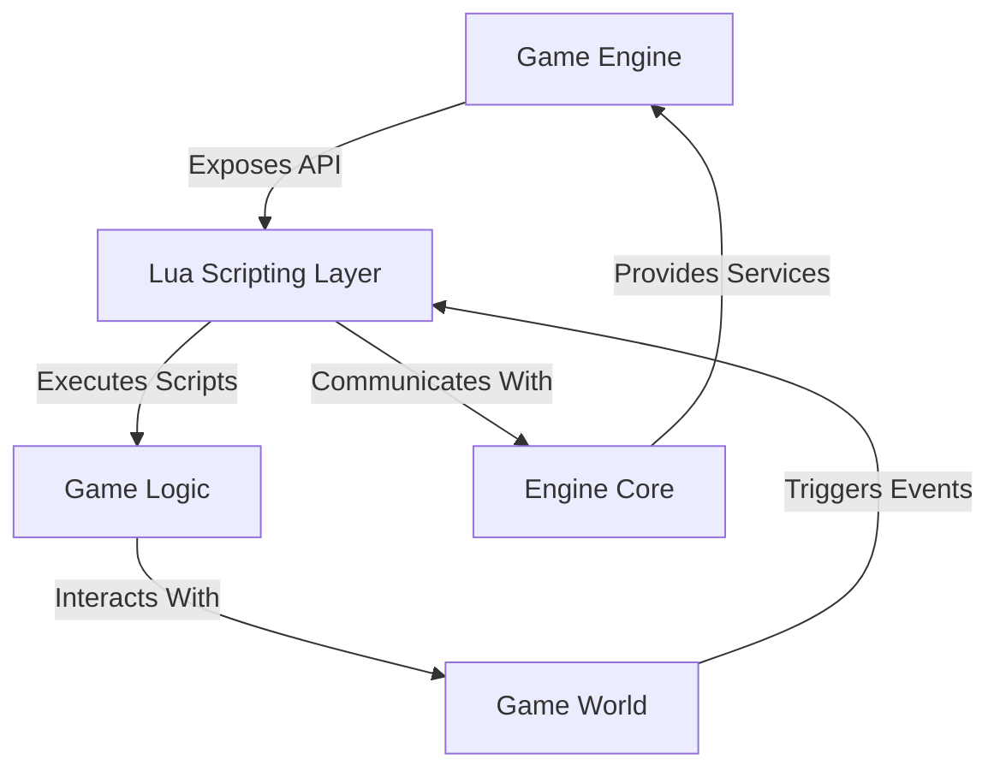

## 10.5 Designing an Efficient Lua-Driven Game Scripting Engine

In the realm of game development, scripting engines play a pivotal role in enabling flexibility and rapid iteration. Lua, with its lightweight footprint and ease of embedding, is a popular choice for scripting in games. In this section, we will explore how to design an efficient Lua-driven game scripting engine, focusing on balancing performance and flexibility, managing script lifecycles, and ensuring efficient inter-language communication.

### Balancing Performance and Flexibility

When designing a game scripting engine, one of the primary challenges is to balance performance with flexibility. Lua's dynamic nature allows for rapid prototyping and iteration, but it can also introduce performance bottlenecks if not managed properly.

#### Key Considerations

1. **Script Execution**: Efficiently manage the lifecycle of scripts to ensure they are executed at the right time and with minimal overhead.
2. **Inter-language Communication**: Facilitate efficient data exchange between Lua scripts and the core engine, minimizing the performance impact of context switching.

### Script Execution: Managing Script Lifecycles

Managing the lifecycle of scripts involves determining when and how scripts are loaded, executed, and unloaded. This process is crucial for maintaining performance and ensuring that scripts do not consume unnecessary resources.

#### Loading and Unloading Scripts

Efficient script management begins with loading and unloading scripts as needed. Consider the following strategies:

- **Lazy Loading**: Load scripts only when they are needed. This approach reduces the initial load time and memory usage.
- **Script Caching**: Cache frequently used scripts to avoid repeated loading and parsing. This can significantly improve performance, especially in resource-constrained environments.

#### Execution Contexts

Scripts should be executed within well-defined contexts to ensure they have access to the necessary resources and data. Consider the following:

- **Global Context**: Use a global context for scripts that need access to shared resources or global state.
- **Local Context**: Use a local context for scripts that operate independently or require isolation from other scripts.

#### Scheduling and Execution

Efficient scheduling and execution of scripts are crucial for maintaining performance. Consider the following techniques:

- **Event-Driven Execution**: Trigger script execution based on events, such as user input or game state changes. This approach ensures scripts are executed only when necessary.
- **Time-Sliced Execution**: Divide script execution into small time slices to prevent long-running scripts from blocking the main game loop.

### Inter-language Communication: Efficient Data Exchange

Efficient communication between Lua scripts and the core engine is essential for performance. Consider the following strategies:

#### Data Marshaling

Data marshaling involves converting data between Lua and the engine's native format. Consider the following techniques:

- **Lightweight Data Structures**: Use lightweight data structures, such as tables, to minimize the overhead of data conversion.
- **Custom Serialization**: Implement custom serialization routines for complex data types to optimize performance.

#### Function Binding

Function binding involves exposing engine functions to Lua scripts. Consider the following approaches:

- **Automatic Binding**: Use tools or libraries to automatically generate bindings for engine functions. This approach reduces manual effort and ensures consistency.
- **Manual Binding**: Manually bind critical functions to optimize performance and control over the binding process.

### Use Cases and Examples

Let's explore some use cases and examples of Lua-driven game scripting engines.

#### Custom Game Engines

Custom game engines often use Lua for scripting due to its flexibility and ease of integration. Consider the following example:

```lua
-- Define a simple game object in Lua
GameObject = {}
GameObject.__index = GameObject

function GameObject:new(name)
    local obj = setmetatable({}, GameObject)
    obj.name = name or "Unnamed"
    obj.components = {}
    return obj
end

function GameObject:addComponent(component)
    table.insert(self.components, component)
end

function GameObject:update(dt)
    for _, component in ipairs(self.components) do
        component:update(dt)
    end
end

-- Define a component in Lua
Component = {}
Component.__index = Component

function Component:new()
    local comp = setmetatable({}, Component)
    return comp
end

function Component:update(dt)
    -- Component-specific update logic
end

-- Usage
local player = GameObject:new("Player")
local movementComponent = Component:new()
player:addComponent(movementComponent)

-- Update loop
function updateGame(dt)
    player:update(dt)
end
```

In this example, we define a simple game object and component system in Lua. The `GameObject` class manages a list of components, and each component can define its own update logic. This approach allows for flexible and modular game logic.

#### Mod Support

Lua is often used to provide mod support in games, allowing players to extend or modify the game. Consider the following example:

```lua
-- Define a mod in Lua
Mod = {}
Mod.__index = Mod

function Mod:new(name)
    local mod = setmetatable({}, Mod)
    mod.name = name or "Unnamed Mod"
    mod.scripts = {}
    return mod
end

function Mod:loadScript(scriptPath)
    local script = loadfile(scriptPath)
    if script then
        table.insert(self.scripts, script)
    end
end

function Mod:executeScripts()
    for _, script in ipairs(self.scripts) do
        script()
    end
end

-- Usage
local myMod = Mod:new("My Custom Mod")
myMod:loadScript("path/to/script.lua")
myMod:executeScripts()
```

In this example, we define a simple mod system in Lua. The `Mod` class manages a list of scripts, which can be loaded and executed dynamically. This approach allows players to create and share custom content for the game.

### Visualizing Lua-Driven Game Scripting Engine

To better understand the architecture of a Lua-driven game scripting engine, let's visualize the key components and their interactions.



**Diagram Description**: This diagram illustrates the interaction between the game engine, Lua scripting layer, game logic, game world, and engine core. The game engine exposes an API to the Lua scripting layer, which executes scripts to implement game logic. The game logic interacts with the game world, which triggers events that are handled by the scripting layer. The scripting layer communicates with the engine core to access services and resources.

### Try It Yourself

To deepen your understanding, try modifying the provided code examples:

- **Extend the GameObject**: Add new components with custom behavior, such as rendering or physics.
- **Enhance the Mod System**: Implement a system for loading and managing multiple mods, each with its own set of scripts.
- **Optimize Data Exchange**: Experiment with different data structures and serialization techniques to improve performance.

### Knowledge Check

Before we conclude, let's reinforce the key concepts with a few questions:

- What are the benefits of using Lua for game scripting?
- How can you manage the lifecycle of scripts to optimize performance?
- What strategies can you use to facilitate efficient inter-language communication?

### Embrace the Journey

Remember, designing an efficient Lua-driven game scripting engine is a journey. As you progress, you'll discover new techniques and optimizations that will enhance your engine's performance and flexibility. Keep experimenting, stay curious, and enjoy the journey!

## Quiz Time!



### What is one of the primary challenges when designing a game scripting engine?

- [x] Balancing performance with flexibility
- [ ] Ensuring scripts are written in multiple languages
- [ ] Making scripts run only on specific hardware
- [ ] Limiting the number of scripts that can be executed

> **Explanation:** Balancing performance with flexibility is crucial to ensure that the scripting engine can handle dynamic content without compromising on speed.

### Which strategy can be used to load scripts only when they are needed?

- [x] Lazy Loading
- [ ] Eager Loading
- [ ] Preemptive Loading
- [ ] Static Loading

> **Explanation:** Lazy loading involves loading scripts only when they are needed, reducing initial load time and memory usage.

### What is the purpose of using a global context for script execution?

- [x] To provide access to shared resources or global state
- [ ] To isolate scripts from each other
- [ ] To prevent scripts from accessing engine functions
- [ ] To ensure scripts run in parallel

> **Explanation:** A global context allows scripts to access shared resources or global state, which is useful for scripts that need to interact with the entire game.

### What is one benefit of using event-driven execution for scripts?

- [x] Scripts are executed only when necessary
- [ ] Scripts run continuously in the background
- [ ] Scripts are executed in a random order
- [ ] Scripts are executed at a fixed interval

> **Explanation:** Event-driven execution ensures that scripts are executed only when necessary, such as in response to user input or game state changes.

### Which technique can be used to minimize the overhead of data conversion between Lua and the engine?

- [x] Lightweight Data Structures
- [ ] Heavyweight Data Structures
- [ ] Complex Serialization
- [ ] Static Typing

> **Explanation:** Using lightweight data structures helps minimize the overhead of data conversion, making the exchange between Lua and the engine more efficient.

### What is the role of function binding in a Lua-driven game scripting engine?

- [x] Exposing engine functions to Lua scripts
- [ ] Preventing scripts from accessing engine functions
- [ ] Isolating scripts from each other
- [ ] Ensuring scripts run in parallel

> **Explanation:** Function binding involves exposing engine functions to Lua scripts, allowing scripts to interact with the engine and perform various tasks.

### How can you optimize performance when binding functions manually?

- [x] By controlling the binding process
- [ ] By using automatic binding tools
- [ ] By avoiding function binding altogether
- [ ] By using heavyweight data structures

> **Explanation:** Manually binding functions allows for optimization and control over the binding process, which can enhance performance.

### What is a common use case for Lua in game development?

- [x] Mod support
- [ ] Hardware optimization
- [ ] Network security
- [ ] Database management

> **Explanation:** Lua is commonly used for mod support, allowing players to extend or modify the game with custom content.

### What is the benefit of using a local context for script execution?

- [x] To isolate scripts from each other
- [ ] To provide access to shared resources
- [ ] To ensure scripts run in parallel
- [ ] To prevent scripts from accessing engine functions

> **Explanation:** A local context isolates scripts from each other, which is useful for scripts that operate independently or require isolation.

### True or False: Lua's dynamic nature can introduce performance bottlenecks if not managed properly.

- [x] True
- [ ] False

> **Explanation:** Lua's dynamic nature allows for rapid prototyping but can introduce performance bottlenecks if not managed properly.


