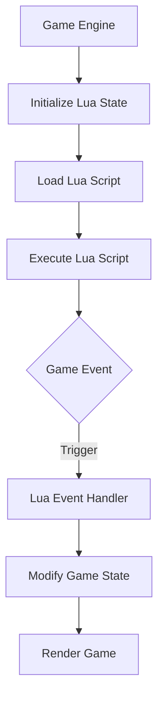

## 10.6 Scripting Engines and Integration

In the realm of game development, scripting engines play a pivotal role in enabling dynamic content creation, flexible game logic, and rapid prototyping. Lua, with its lightweight nature and ease of embedding, has become a popular choice for scripting in games. This section delves into the techniques for integrating Lua into game engines, focusing on embedding Lua, utilizing the Lua C API, and handling events to trigger scripts. We'll explore use cases and provide examples of gameplay logic and AI behavior scripting.

### Embedding Lua in Games

Embedding Lua into a game engine involves integrating the Lua interpreter into the engine's architecture, allowing game developers to write scripts that interact with the game world. This process enhances the flexibility and extensibility of the game, enabling non-programmers to modify game behavior without altering the core engine code.

#### Implementing Scripting Engines

To implement a scripting engine using Lua, we need to understand the Lua C API, which provides the necessary functions to interact with Lua from C/C++ code. This interaction is crucial for embedding Lua scripts within a game engine.

##### Lua C API: Interacting with Lua State from C/C++

The Lua C API is the bridge between C/C++ and Lua, allowing developers to execute Lua code, manipulate Lua variables, and call Lua functions from C/C++. Here's a step-by-step guide to using the Lua C API:

1. **Initialize the Lua State**: The Lua state is the environment where Lua scripts are executed. It is created using the `luaL_newstate()` function.

    ```c
    lua_State *L = luaL_newstate();
    luaL_openlibs(L);  // Load Lua libraries
    ```

2. **Load and Execute Lua Scripts**: Use `luaL_loadfile()` to load a Lua script and `lua_pcall()` to execute it.

    ```c
    if (luaL_loadfile(L, "script.lua") || lua_pcall(L, 0, 0, 0)) {
        fprintf(stderr, "Error: %s\n", lua_tostring(L, -1));
        lua_pop(L, 1);  // Remove error message from stack
    }
    ```

3. **Calling Lua Functions from C**: Push the function name onto the stack, followed by the arguments, and use `lua_pcall()` to call the function.

    ```c
    lua_getglobal(L, "luaFunction");  // Push function onto stack
    lua_pushnumber(L, 10);  // Push argument
    if (lua_pcall(L, 1, 1, 0) != LUA_OK) {
        fprintf(stderr, "Error: %s\n", lua_tostring(L, -1));
    }
    double result = lua_tonumber(L, -1);  // Get result
    lua_pop(L, 1);  // Pop result from stack
    ```

4. **Exposing C Functions to Lua**: Register C functions with Lua using `lua_register()`.

    ```c
    int cFunction(lua_State *L) {
        double arg = lua_tonumber(L, 1);
        lua_pushnumber(L, arg * 2);
        return 1;  // Number of return values
    }

    lua_register(L, "cFunction", cFunction);
    ```

##### Event Handling: Triggering Scripts from Engine Events

Event handling is a crucial aspect of game development, allowing scripts to respond to changes in the game world. By integrating Lua with the game engine's event system, developers can trigger Lua scripts based on specific events, such as player actions or environmental changes.

1. **Define Events in the Game Engine**: Create an event system that can notify Lua scripts of changes.

    ```c
    typedef struct {
        const char *eventType;
        void *eventData;
    } GameEvent;

    void triggerEvent(lua_State *L, GameEvent *event) {
        lua_getglobal(L, "onEvent");  // Get Lua event handler
        lua_pushstring(L, event->eventType);  // Push event type
        if (lua_pcall(L, 1, 0, 0) != LUA_OK) {
            fprintf(stderr, "Error: %s\n", lua_tostring(L, -1));
        }
    }
    ```

2. **Implement Lua Event Handlers**: Write Lua functions to handle events.

    ```lua
    function onEvent(eventType)
        if eventType == "PLAYER_JUMP" then
            print("Player jumped!")
        elseif eventType == "ENEMY_SPAWN" then
            print("Enemy spawned!")
        end
    end
    ```

3. **Integrate Event Handling with Game Logic**: Use the event system to trigger Lua scripts based on game logic.

    ```c
    GameEvent event = {"PLAYER_JUMP", NULL};
    triggerEvent(L, &event);
    ```

### Use Cases and Examples

Lua scripting is versatile and can be applied to various aspects of game development. Here, we explore two common use cases: gameplay logic scripting and AI behavior scripting.

#### Gameplay Logic Scripting

Gameplay logic scripting involves using Lua to define the rules and mechanics of the game. This approach allows designers to tweak gameplay elements without recompiling the game engine.

**Example: Implementing a Simple Game Mechanic**

Consider a game where the player collects coins. We can use Lua to define the logic for collecting coins and updating the player's score.

```lua
-- Lua script: coin.lua
playerScore = 0

function collectCoin()
    playerScore = playerScore + 10
    print("Coin collected! Score: " .. playerScore)
end
```

**Integrating with the Game Engine**

In the game engine, call the `collectCoin` function when the player collects a coin.

```c
lua_getglobal(L, "collectCoin");
if (lua_pcall(L, 0, 0, 0) != LUA_OK) {
    fprintf(stderr, "Error: %s\n", lua_tostring(L, -1));
}
```

#### AI Behavior Scripting

AI behavior scripting involves using Lua to define the actions and decisions of non-player characters (NPCs). This approach allows for more complex and dynamic AI behaviors.

**Example: Simple AI Behavior**

Consider an NPC that patrols an area and chases the player when detected.

```lua
-- Lua script: ai.lua
function patrol()
    print("Patrolling...")
end

function chasePlayer()
    print("Chasing player!")
end

function updateAI(playerDetected)
    if playerDetected then
        chasePlayer()
    else
        patrol()
    end
end
```

**Integrating with the Game Engine**

In the game engine, call the `updateAI` function based on the player's proximity to the NPC.

```c
lua_getglobal(L, "updateAI");
lua_pushboolean(L, playerDetected);
if (lua_pcall(L, 1, 0, 0) != LUA_OK) {
    fprintf(stderr, "Error: %s\n", lua_tostring(L, -1));
}
```

### Visualizing Lua Integration in Game Engines

To better understand how Lua integrates with game engines, let's visualize the process using a flowchart.



**Diagram Description**: This flowchart illustrates the integration of Lua scripting within a game engine. The game engine initializes the Lua state, loads and executes Lua scripts, and triggers Lua event handlers based on game events. The Lua scripts modify the game state, which is then rendered by the game engine.

### Try It Yourself

To deepen your understanding of Lua scripting in game engines, try modifying the provided code examples:

- **Experiment with Different Game Mechanics**: Modify the `collectCoin` function to include additional game mechanics, such as power-ups or penalties.
- **Enhance AI Behavior**: Extend the `updateAI` function to include more complex behaviors, such as hiding or seeking cover.
- **Create Custom Events**: Define new events in the game engine and write corresponding Lua event handlers.

### Knowledge Check

Before moving on, let's reinforce what we've learned with a few questions:

- How does the Lua C API facilitate interaction between C/C++ and Lua?
- What are the benefits of using Lua for gameplay logic scripting?
- How can Lua scripts be triggered by game events?

### Embrace the Journey

Remember, integrating Lua scripting into game engines is a powerful way to enhance flexibility and creativity in game development. As you experiment with Lua, you'll discover new ways to create dynamic and engaging gameplay experiences. Keep exploring, stay curious, and enjoy the journey!

## Quiz Time!



### How does the Lua C API facilitate interaction between C/C++ and Lua?

- [x] By providing functions to execute Lua code and manipulate Lua variables from C/C++
- [ ] By converting Lua scripts into C++ code
- [ ] By replacing C++ code with Lua scripts
- [ ] By providing a graphical interface for Lua scripting

> **Explanation:** The Lua C API provides functions that allow C/C++ code to execute Lua scripts, manipulate Lua variables, and call Lua functions, facilitating interaction between the two languages.

### What is the primary benefit of embedding Lua in a game engine?

- [x] It allows for dynamic content creation and flexible game logic
- [ ] It replaces the need for a game engine
- [ ] It simplifies the rendering process
- [ ] It increases the game's file size

> **Explanation:** Embedding Lua in a game engine allows developers to create dynamic content and flexible game logic, enabling rapid prototyping and easy modification of game behavior.

### Which function is used to initialize the Lua state in C/C++?

- [x] luaL_newstate()
- [ ] luaL_openlibs()
- [ ] luaL_loadfile()
- [ ] lua_pcall()

> **Explanation:** The `luaL_newstate()` function is used to initialize the Lua state, creating the environment where Lua scripts are executed.

### How can Lua scripts be triggered by game events?

- [x] By integrating Lua with the game engine's event system
- [ ] By compiling Lua scripts into the game engine
- [ ] By using Lua scripts as configuration files
- [ ] By writing Lua scripts in a separate application

> **Explanation:** Lua scripts can be triggered by game events by integrating Lua with the game engine's event system, allowing scripts to respond to changes in the game world.

### What is a common use case for Lua scripting in games?

- [x] AI behavior scripting
- [ ] Graphics rendering
- [ ] Network communication
- [ ] Audio processing

> **Explanation:** A common use case for Lua scripting in games is AI behavior scripting, where Lua is used to define the actions and decisions of non-player characters.

### What is the purpose of the `lua_pcall()` function?

- [x] To execute a Lua function from C/C++ code
- [ ] To load a Lua script file
- [ ] To register a C function with Lua
- [ ] To initialize the Lua state

> **Explanation:** The `lua_pcall()` function is used to execute a Lua function from C/C++ code, allowing the program to call Lua functions and handle any errors that occur during execution.

### How can C functions be exposed to Lua?

- [x] By registering them with Lua using `lua_register()`
- [ ] By writing them in a separate Lua script
- [ ] By converting them to Lua functions
- [ ] By embedding them in the Lua interpreter

> **Explanation:** C functions can be exposed to Lua by registering them with Lua using the `lua_register()` function, making them callable from Lua scripts.

### What is the role of event handling in game development?

- [x] To allow scripts to respond to changes in the game world
- [ ] To manage memory allocation
- [ ] To optimize graphics rendering
- [ ] To handle network communication

> **Explanation:** Event handling in game development allows scripts to respond to changes in the game world, enabling dynamic and interactive gameplay experiences.

### What is a benefit of using Lua for gameplay logic scripting?

- [x] It allows designers to tweak gameplay elements without recompiling the game engine
- [ ] It simplifies the game's graphics rendering
- [ ] It reduces the game's memory usage
- [ ] It eliminates the need for a game engine

> **Explanation:** Using Lua for gameplay logic scripting allows designers to tweak gameplay elements without recompiling the game engine, providing flexibility and ease of modification.

### True or False: Lua can only be used for scripting in game development.

- [ ] True
- [x] False

> **Explanation:** False. Lua is a versatile scripting language that can be used in various domains beyond game development, including web development, data processing, and more.


