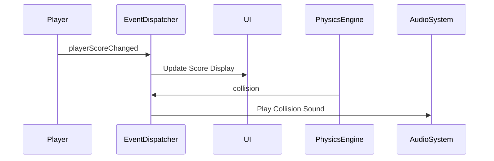

## 10.7 Event Queues and Message Passing

In the realm of game development, effective communication between various components is crucial for creating a seamless and interactive experience. Event queues and message passing are essential design patterns that facilitate this communication, enabling decoupled interactions between game systems. In this section, we will delve into the concepts of event queues and message passing, explore their implementation in Lua, and provide practical examples to illustrate their use in game development.

### Understanding Event Queues and Message Passing

**Event Queues** are data structures that store events generated by various parts of a system. These events are processed in a sequential manner, allowing different components to react to changes or actions without direct coupling. This decoupling is achieved through a centralized event dispatcher that manages the flow of events.

**Message Passing** involves sending messages between different components or systems to convey information or trigger actions. This pattern is particularly useful in asynchronous environments, where components operate independently and need a mechanism to communicate without blocking each other.

### Communication Between Game Systems

In a game, various systems such as the user interface (UI), physics engine, AI, and audio need to communicate frequently. Using events and messages allows these systems to interact without being tightly coupled, making the game architecture more flexible and maintainable.

#### Implementing Event Systems

To implement an event system in Lua, we need to define the following components:

1. **Event Dispatcher**: A centralized entity responsible for managing events and notifying subscribers.
2. **Event Queue**: A data structure that holds events until they are processed.
3. **Subscribers**: Components that listen for specific events and react accordingly.

Let's explore each component in detail.

##### Event Dispatchers

The event dispatcher is the heart of the event system. It maintains a list of subscribers for each event type and notifies them when an event occurs. Here's a basic implementation of an event dispatcher in Lua:

```lua
-- EventDispatcher.lua
local EventDispatcher = {}
EventDispatcher.__index = EventDispatcher

function EventDispatcher:new()
    local instance = {
        subscribers = {}
    }
    setmetatable(instance, EventDispatcher)
    return instance
end

function EventDispatcher:subscribe(eventType, listener)
    if not self.subscribers[eventType] then
        self.subscribers[eventType] = {}
    end
    table.insert(self.subscribers[eventType], listener)
end

function EventDispatcher:unsubscribe(eventType, listener)
    if self.subscribers[eventType] then
        for i, subscribedListener in ipairs(self.subscribers[eventType]) do
            if subscribedListener == listener then
                table.remove(self.subscribers[eventType], i)
                break
            end
        end
    end
end

function EventDispatcher:dispatch(eventType, ...)
    if self.subscribers[eventType] then
        for _, listener in ipairs(self.subscribers[eventType]) do
            listener(...)
        end
    end
end

return EventDispatcher
```

In this implementation, the `EventDispatcher` class provides methods to subscribe and unsubscribe listeners for specific event types. The `dispatch` method notifies all subscribers of an event, passing any additional arguments to the listeners.

##### Message Queues

Message queues are used to pass data between systems asynchronously. They allow components to send messages without waiting for the recipient to process them immediately. Here's a simple implementation of a message queue in Lua:

```lua
-- MessageQueue.lua
local MessageQueue = {}
MessageQueue.__index = MessageQueue

function MessageQueue:new()
    local instance = {
        queue = {}
    }
    setmetatable(instance, MessageQueue)
    return instance
end

function MessageQueue:enqueue(message)
    table.insert(self.queue, message)
end

function MessageQueue:dequeue()
    return table.remove(self.queue, 1)
end

function MessageQueue:isEmpty()
    return #self.queue == 0
end

return MessageQueue
```

The `MessageQueue` class provides methods to enqueue and dequeue messages, as well as check if the queue is empty. This simple implementation can be extended to include priority handling or other features as needed.

### Use Cases and Examples

Let's explore some practical use cases of event queues and message passing in game development.

#### UI Updates

In a game, the UI often needs to update in response to various events, such as player actions or changes in game state. By using an event system, the UI can subscribe to relevant events and update itself accordingly.

```lua
-- UI.lua
local EventDispatcher = require("EventDispatcher")

local UI = {}
UI.__index = UI

function UI:new(eventDispatcher)
    local instance = {
        eventDispatcher = eventDispatcher
    }
    setmetatable(instance, UI)
    self.eventDispatcher:subscribe("playerScoreChanged", function(score)
        self:updateScoreDisplay(score)
    end)
    return instance
end

function UI:updateScoreDisplay(score)
    print("Score updated to: " .. score)
end

return UI
```

In this example, the `UI` class subscribes to the `playerScoreChanged` event and updates the score display whenever the event is dispatched.

#### Cross-System Notifications

In a complex game, different systems may need to notify each other of certain events. For example, the physics engine might need to notify the audio system when a collision occurs, so that a sound effect can be played.

```lua
-- PhysicsEngine.lua
local EventDispatcher = require("EventDispatcher")

local PhysicsEngine = {}
PhysicsEngine.__index = PhysicsEngine

function PhysicsEngine:new(eventDispatcher)
    local instance = {
        eventDispatcher = eventDispatcher
    }
    setmetatable(instance, PhysicsEngine)
    return instance
end

function PhysicsEngine:detectCollision()
    -- Collision detection logic
    local collisionDetected = true
    if collisionDetected then
        self.eventDispatcher:dispatch("collision", "collisionSound")
    end
end

return PhysicsEngine
```

```lua
-- AudioSystem.lua
local EventDispatcher = require("EventDispatcher")

local AudioSystem = {}
AudioSystem.__index = AudioSystem

function AudioSystem:new(eventDispatcher)
    local instance = {
        eventDispatcher = eventDispatcher
    }
    setmetatable(instance, AudioSystem)
    self.eventDispatcher:subscribe("collision", function(sound)
        self:playSound(sound)
    end)
    return instance
end

function AudioSystem:playSound(sound)
    print("Playing sound: " .. sound)
end

return AudioSystem
```

In this example, the `PhysicsEngine` dispatches a `collision` event when a collision is detected, and the `AudioSystem` listens for this event to play the corresponding sound.

### Visualizing Event Queues and Message Passing

To better understand the flow of events and messages in a game, let's visualize the process using a sequence diagram:



This diagram illustrates how events are dispatched and processed by different components in the game. The `EventDispatcher` acts as a central hub, routing events to the appropriate subscribers.

### Try It Yourself

To gain a deeper understanding of event queues and message passing, try modifying the code examples provided. Here are some suggestions:

- Add a new event type and implement a subscriber that reacts to it.
- Extend the `MessageQueue` class to support priority-based message handling.
- Implement a logging system that records all dispatched events for debugging purposes.

### Key Takeaways

- Event queues and message passing are powerful design patterns for decoupling interactions between game systems.
- An event dispatcher manages the flow of events, notifying subscribers of relevant changes.
- Message queues enable asynchronous communication between components, allowing them to operate independently.
- These patterns enhance the flexibility and maintainability of game architecture.

### References and Further Reading

- [Lua Programming Guide](https://www.lua.org/manual/5.4/)
- [Game Programming Patterns](https://gameprogrammingpatterns.com/)
- [MDN Web Docs: Event Loop](https://developer.mozilla.org/en-US/docs/Web/JavaScript/EventLoop)

## Quiz Time!



### What is the primary purpose of an event queue in game development?

- [x] To store events generated by various parts of a system for sequential processing.
- [ ] To directly couple different game systems.
- [ ] To replace message passing entirely.
- [ ] To handle only UI-related events.

> **Explanation:** Event queues store events generated by various parts of a system, allowing them to be processed sequentially and enabling decoupled interactions.

### How does message passing benefit asynchronous environments?

- [x] It allows components to communicate without blocking each other.
- [ ] It requires components to operate synchronously.
- [ ] It eliminates the need for event dispatchers.
- [ ] It only works with UI components.

> **Explanation:** Message passing allows components to communicate asynchronously, enabling them to operate independently without blocking each other.

### What role does an event dispatcher play in an event system?

- [x] It manages events and notifies subscribers.
- [ ] It generates events for the system.
- [ ] It replaces message queues.
- [ ] It only handles UI updates.

> **Explanation:** An event dispatcher manages events and notifies subscribers, acting as a central hub for event flow.

### Which component is responsible for listening to specific events and reacting accordingly?

- [x] Subscribers
- [ ] Event Dispatcher
- [ ] Message Queue
- [ ] UI System

> **Explanation:** Subscribers are components that listen for specific events and react accordingly.

### What is a potential use case for message queues in game development?

- [x] Passing data between systems asynchronously.
- [ ] Directly coupling game systems.
- [ ] Replacing event dispatchers.
- [ ] Handling only collision events.

> **Explanation:** Message queues are used to pass data between systems asynchronously, allowing components to communicate without being tightly coupled.

### How can you extend the `MessageQueue` class to support priority-based message handling?

- [x] By adding a priority attribute to messages and sorting the queue.
- [ ] By removing the enqueue method.
- [ ] By using only one message type.
- [ ] By eliminating the dequeue method.

> **Explanation:** To support priority-based message handling, you can add a priority attribute to messages and sort the queue accordingly.

### What is a benefit of using event queues and message passing in game architecture?

- [x] They enhance flexibility and maintainability.
- [ ] They increase coupling between systems.
- [ ] They eliminate the need for UI updates.
- [ ] They only work with audio systems.

> **Explanation:** Event queues and message passing enhance the flexibility and maintainability of game architecture by decoupling interactions between systems.

### Which Lua component is used to store events until they are processed?

- [x] Event Queue
- [ ] Event Dispatcher
- [ ] Message Queue
- [ ] Subscriber

> **Explanation:** An event queue is used to store events until they are processed, allowing for sequential handling.

### What is the function of the `dispatch` method in the `EventDispatcher` class?

- [x] To notify all subscribers of an event.
- [ ] To generate new events.
- [ ] To replace message queues.
- [ ] To handle only collision events.

> **Explanation:** The `dispatch` method notifies all subscribers of an event, passing any additional arguments to the listeners.

### True or False: Message passing requires components to operate synchronously.

- [ ] True
- [x] False

> **Explanation:** False. Message passing allows components to communicate asynchronously, enabling them to operate independently.



Remember, mastering event queues and message passing is just the beginning. As you continue your journey in game development, these patterns will serve as foundational tools for building complex and interactive systems. Keep experimenting, stay curious, and enjoy the journey!
