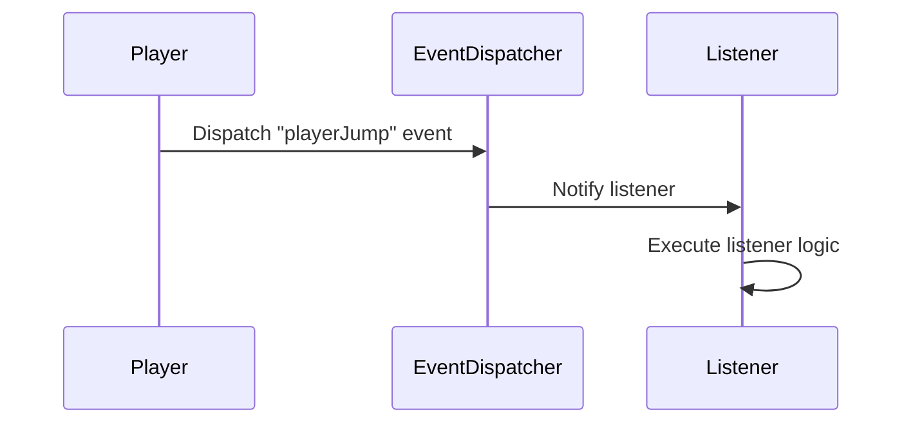

## 10.8 A Dynamic and Flexible Event System for Script-Driven Games

In the realm of game development, creating a dynamic and flexible event system is crucial for enhancing interactivity and enabling script-driven gameplay. This section will guide you through the process of building an event system in Lua that supports dynamic event registration and custom event types, allowing for a rich and interactive gaming experience.

### Enhancing Interactivity: Creating an Event System Tailored for Scripting

An event system serves as the backbone of interactivity in games, enabling various components to communicate and respond to player actions, environmental changes, and other in-game events. By implementing a dynamic and flexible event system, you can empower game designers and modders to create complex interactions without modifying the core game engine.

#### Key Features of a Dynamic Event System

1. **Dynamic Event Registration**: Allow scripts to register and handle events at runtime, enabling flexibility and extensibility.
2. **Custom Event Types**: Define new events within scripts, providing the ability to tailor the event system to specific game needs.

### Designing the Event System

To create a robust event system, we need to focus on the following components:

- **Event Dispatcher**: Manages event registration and dispatching.
- **Event Listeners**: Functions or objects that respond to specific events.
- **Event Data**: Information passed along with events to provide context.

#### Event Dispatcher

The event dispatcher is responsible for managing the lifecycle of events, including registration, deregistration, and dispatching. It maintains a registry of events and their associated listeners.

```lua
-- EventDispatcher.lua
local EventDispatcher = {}
EventDispatcher.__index = EventDispatcher

function EventDispatcher:new()
    local instance = {
        listeners = {}
    }
    setmetatable(instance, EventDispatcher)
    return instance
end

function EventDispatcher:register(eventType, listener)
    if not self.listeners[eventType] then
        self.listeners[eventType] = {}
    end
    table.insert(self.listeners[eventType], listener)
end

function EventDispatcher:unregister(eventType, listener)
    if not self.listeners[eventType] then return end
    for i, registeredListener in ipairs(self.listeners[eventType]) do
        if registeredListener == listener then
            table.remove(self.listeners[eventType], i)
            break
        end
    end
end

function EventDispatcher:dispatch(eventType, eventData)
    if not self.listeners[eventType] then return end
    for _, listener in ipairs(self.listeners[eventType]) do
        listener(eventData)
    end
end

return EventDispatcher
```

**Explanation**: The `EventDispatcher` class allows for registering, unregistering, and dispatching events. It uses a table to store listeners for each event type, enabling dynamic event handling.

#### Event Listeners

Event listeners are functions or objects that respond to events. They are registered with the event dispatcher and are invoked when the corresponding event is dispatched.

```lua
-- Example of registering an event listener
local dispatcher = EventDispatcher:new()

local function onPlayerJump(eventData)
    print("Player jumped with velocity:", eventData.velocity)
end

dispatcher:register("playerJump", onPlayerJump)

-- Dispatching the event
dispatcher:dispatch("playerJump", { velocity = 10 })
```

**Explanation**: In this example, we register a listener for the `playerJump` event. When the event is dispatched, the listener function `onPlayerJump` is called with the event data.

#### Custom Event Types

Custom event types allow game developers to define new events specific to their game's needs. This flexibility is crucial for supporting diverse gameplay mechanics and modding.

```lua
-- Defining a custom event type
local function onEnemyDefeated(eventData)
    print("Enemy defeated:", eventData.enemyName)
end

dispatcher:register("enemyDefeated", onEnemyDefeated)

-- Dispatching the custom event
dispatcher:dispatch("enemyDefeated", { enemyName = "Goblin" })
```

**Explanation**: Here, we define a custom event type `enemyDefeated` and register a listener for it. This allows us to handle specific game events dynamically.

### Use Cases and Examples

#### Player Actions Triggering Scripted Events

In many games, player actions such as jumping, attacking, or interacting with objects trigger events that need to be handled by the game logic. By using a dynamic event system, you can easily register and handle these events in scripts.

```lua
-- Handling player actions
local function onPlayerAttack(eventData)
    print("Player attacked with weapon:", eventData.weapon)
end

dispatcher:register("playerAttack", onPlayerAttack)

-- Simulating a player attack
dispatcher:dispatch("playerAttack", { weapon = "Sword" })
```

**Explanation**: This example demonstrates how player actions can trigger events that are handled by the event system, allowing for flexible and dynamic game logic.

#### Modding Support

A dynamic event system is essential for supporting modding, as it allows modders to extend the game by adding new events and listeners without modifying the core game code.

```lua
-- Modding example: Adding a new event
local function onTreasureFound(eventData)
    print("Treasure found:", eventData.treasureName)
end

dispatcher:register("treasureFound", onTreasureFound)

-- Dispatching the modded event
dispatcher:dispatch("treasureFound", { treasureName = "Golden Crown" })
```

**Explanation**: By allowing modders to define and handle new events, the game becomes more extensible and customizable, fostering a vibrant modding community.

### Visualizing the Event System

To better understand the flow of events in our system, let's visualize the process using a sequence diagram.



**Description**: This sequence diagram illustrates the flow of an event from the player action to the event dispatcher and finally to the listener, showcasing the dynamic nature of the event system.

### Try It Yourself

To deepen your understanding of the event system, try modifying the code examples:

- **Add New Events**: Define and handle new custom events, such as `playerLevelUp` or `itemCollected`.
- **Experiment with Event Data**: Pass different types of data with events and see how it affects the listener logic.
- **Create Complex Interactions**: Combine multiple events to create complex game interactions, such as a chain reaction of events.

### Knowledge Check

- **Question**: What are the key components of an event system?
- **Exercise**: Implement a new event type and listener in the provided code examples.

### Embrace the Journey

Remember, building a dynamic and flexible event system is just the beginning. As you continue to develop your game, you'll discover new ways to leverage events for creating engaging and interactive experiences. Keep experimenting, stay curious, and enjoy the journey!

## Quiz Time!



### What is the primary role of the Event Dispatcher in an event system?

- [x] To manage event registration and dispatching
- [ ] To handle player input
- [ ] To render graphics
- [ ] To manage game physics

> **Explanation:** The Event Dispatcher is responsible for managing the lifecycle of events, including registration, deregistration, and dispatching.

### How can custom event types benefit a game?

- [x] They allow for game-specific events to be defined
- [ ] They reduce the game's file size
- [ ] They improve graphics rendering
- [ ] They manage memory allocation

> **Explanation:** Custom event types allow developers to define events specific to their game's needs, enhancing flexibility and extensibility.

### What is an example of a player action that might trigger an event?

- [x] Jumping
- [ ] Saving the game
- [ ] Loading a level
- [ ] Exiting the game

> **Explanation:** Player actions like jumping can trigger events that are handled by the game logic.

### Why is dynamic event registration important?

- [x] It allows events to be registered and handled at runtime
- [ ] It improves the game's graphics
- [ ] It reduces the game's loading time
- [ ] It manages network connections

> **Explanation:** Dynamic event registration enables flexibility and extensibility by allowing events to be registered and handled at runtime.

### What is a benefit of supporting modding through an event system?

- [x] It allows modders to extend the game without modifying core code
- [ ] It increases the game's file size
- [ ] It improves the game's graphics
- [ ] It reduces the game's loading time

> **Explanation:** Supporting modding through an event system allows modders to add new events and listeners, enhancing the game's extensibility and customization.

### How can event data be used in an event system?

- [x] To provide context for the event
- [ ] To render graphics
- [ ] To manage memory allocation
- [ ] To handle player input

> **Explanation:** Event data provides context for the event, allowing listeners to respond appropriately.

### What is a potential use case for a dynamic event system in games?

- [x] Triggering scripted events based on player actions
- [ ] Improving graphics rendering
- [ ] Managing network connections
- [ ] Reducing memory usage

> **Explanation:** A dynamic event system can trigger scripted events based on player actions, enhancing interactivity.

### What is the purpose of an event listener?

- [x] To respond to specific events
- [ ] To manage game physics
- [ ] To render graphics
- [ ] To handle player input

> **Explanation:** Event listeners are functions or objects that respond to specific events.

### How can modders benefit from a dynamic event system?

- [x] By adding new events and listeners without modifying core code
- [ ] By improving the game's graphics
- [ ] By reducing the game's file size
- [ ] By managing memory allocation

> **Explanation:** Modders can add new events and listeners, enhancing the game's extensibility and customization.

### True or False: An event system can only handle predefined events.

- [ ] True
- [x] False

> **Explanation:** An event system can handle both predefined and custom events, allowing for flexibility and extensibility.




