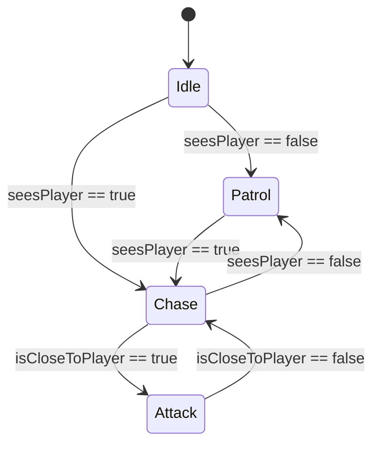
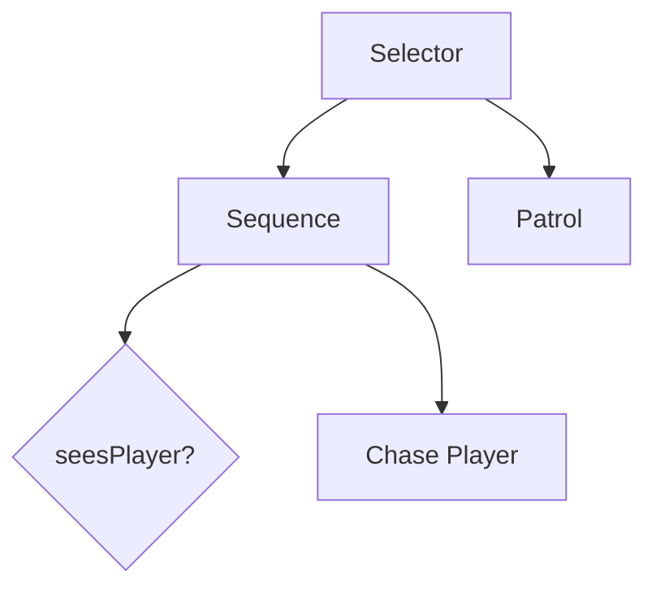

## 10.9 AI Patterns: State Machines and Behavior Trees

In the realm of game development, creating intelligent and responsive non-player characters (NPCs) is crucial for an engaging player experience. Two popular AI patterns used to control NPC behaviors are State Machines and Behavior Trees. These patterns help in structuring AI logic in a way that is both manageable and scalable. In this section, we will delve into these patterns, exploring their implementation in Lua, and provide practical examples to illustrate their use in game development.

### Implementing Game AI: Common Patterns for Controlling Non-Player Characters

Game AI often requires NPCs to exhibit complex behaviors that can adapt to the player's actions and the game environment. State Machines and Behavior Trees are two patterns that provide a structured approach to implementing such behaviors.

#### State Machines

State Machines are a fundamental concept in AI programming, providing a way to model the states and transitions of an entity. They are particularly useful for defining clear and predictable behavior patterns.

##### Finite State Machines (FSMs)

A Finite State Machine (FSM) is a computational model consisting of a finite number of states, transitions between these states, and actions. FSMs are widely used in game development for tasks such as enemy AI, where an NPC might have states like "patrolling," "chasing," and "attacking."

###### Implementing FSMs Using Tables and Functions

In Lua, FSMs can be implemented using tables and functions to represent states and transitions. Here's a simple example of an FSM for an enemy NPC:

```lua
-- Define states
local states = {
    idle = {},
    patrol = {},
    chase = {},
    attack = {}
}

-- Define transitions
states.idle.update = function(self, npc)
    if npc:seesPlayer() then
        return states.chase
    else
        return states.patrol
    end
end

states.patrol.update = function(self, npc)
    if npc:seesPlayer() then
        return states.chase
    end
    npc:patrol()
    return self
end

states.chase.update = function(self, npc)
    if npc:isCloseToPlayer() then
        return states.attack
    elseif not npc:seesPlayer() then
        return states.patrol
    end
    npc:chasePlayer()
    return self
end

states.attack.update = function(self, npc)
    if not npc:isCloseToPlayer() then
        return states.chase
    end
    npc:attackPlayer()
    return self
end

-- NPC class
local NPC = {}
NPC.__index = NPC

function NPC:new()
    local npc = setmetatable({}, NPC)
    npc.state = states.idle
    return npc
end

function NPC:update()
    self.state = self.state.update(self, self)
end

function NPC:seesPlayer()
    -- Logic to determine if the NPC sees the player
end

function NPC:isCloseToPlayer()
    -- Logic to determine if the NPC is close to the player
end

function NPC:patrol()
    print("Patrolling...")
end

function NPC:chasePlayer()
    print("Chasing player...")
end

function NPC:attackPlayer()
    print("Attacking player!")
end

-- Usage
local enemy = NPC:new()
while true do
    enemy:update()
end
```

In this example, each state is represented as a table with an `update` function that determines the next state based on the NPC's perception of the environment.

##### Hierarchical State Machines

For more complex behaviors, Hierarchical State Machines (HSMs) can be used. HSMs allow states to be nested within other states, providing a way to manage complexity by organizing states into a hierarchy.

###### Managing Complex Behaviors

Consider an NPC that has a "combat" state, which itself contains sub-states like "melee" and "ranged." An HSM can be used to encapsulate these sub-states within the "combat" state, allowing for more organized and modular AI logic.

```lua
-- Define hierarchical states
local combatStates = {
    melee = {},
    ranged = {}
}

local states = {
    idle = {},
    patrol = {},
    combat = {subStates = combatStates}
}

-- Define transitions for combat sub-states
combatStates.melee.update = function(self, npc)
    if npc:isFarFromPlayer() then
        return combatStates.ranged
    end
    npc:meleeAttack()
    return self
end

combatStates.ranged.update = function(self, npc)
    if npc:isCloseToPlayer() then
        return combatStates.melee
    end
    npc:rangedAttack()
    return self
end

-- Define transitions for main states
states.idle.update = function(self, npc)
    if npc:seesPlayer() then
        return states.combat
    else
        return states.patrol
    end
end

states.patrol.update = function(self, npc)
    if npc:seesPlayer() then
        return states.combat
    end
    npc:patrol()
    return self
end

states.combat.update = function(self, npc)
    return npc.combatState.update(npc.combatState, npc)
end

-- NPC class with hierarchical state
function NPC:new()
    local npc = setmetatable({}, NPC)
    npc.state = states.idle
    npc.combatState = combatStates.melee
    return npc
end

function NPC:update()
    self.state = self.state.update(self, self)
end

function NPC:isFarFromPlayer()
    -- Logic to determine if the NPC is far from the player
end

function NPC:meleeAttack()
    print("Performing melee attack!")
end

function NPC:rangedAttack()
    print("Performing ranged attack!")
end

-- Usage
local enemy = NPC:new()
while true do
    enemy:update()
end
```

In this example, the `combat` state manages its own sub-states, allowing the NPC to switch between melee and ranged attacks based on the player's distance.

#### Behavior Trees

Behavior Trees offer a more flexible and scalable approach to AI programming compared to FSMs. They are particularly useful for implementing complex decision-making processes.

##### Nodes and Leaves

A Behavior Tree is composed of nodes, which can be either composite nodes (such as sequences and selectors) or leaf nodes (actions and conditions). Composite nodes control the flow of execution, while leaf nodes perform actions or check conditions.

###### Defining Behaviors and Conditions

Here's a simple Behavior Tree implementation for an NPC using Lua:

```lua
-- Define nodes
local Node = {}
Node.__index = Node

function Node:new()
    return setmetatable({}, self)
end

function Node:run(npc)
    error("run method not implemented")
end

-- Define composite nodes
local Sequence = setmetatable({}, {__index = Node})
function Sequence:new(children)
    local seq = Node.new(self)
    seq.children = children
    return seq
end

function Sequence:run(npc)
    for _, child in ipairs(self.children) do
        if not child:run(npc) then
            return false
        end
    end
    return true
end

local Selector = setmetatable({}, {__index = Node})
function Selector:new(children)
    local sel = Node.new(self)
    sel.children = children
    return sel
end

function Selector:run(npc)
    for _, child in ipairs(self.children) do
        if child:run(npc) then
            return true
        end
    end
    return false
end

-- Define leaf nodes
local Condition = setmetatable({}, {__index = Node})
function Condition:new(func)
    local cond = Node.new(self)
    cond.func = func
    return cond
end

function Condition:run(npc)
    return self.func(npc)
end

local Action = setmetatable({}, {__index = Node})
function Action:new(func)
    local act = Node.new(self)
    act.func = func
    return act
end

function Action:run(npc)
    self.func(npc)
    return true
end

-- NPC class
local NPC = {}
NPC.__index = NPC

function NPC:new()
    local npc = setmetatable({}, NPC)
    npc.tree = Selector:new({
        Sequence:new({
            Condition:new(function(npc) return npc:seesPlayer() end),
            Action:new(function(npc) npc:chasePlayer() end)
        }),
        Action:new(function(npc) npc:patrol() end)
    })
    return npc
end

function NPC:update()
    self.tree:run(self)
end

function NPC:seesPlayer()
    -- Logic to determine if the NPC sees the player
end

function NPC:chasePlayer()
    print("Chasing player...")
end

function NPC:patrol()
    print("Patrolling...")
end

-- Usage
local enemy = NPC:new()
while true do
    enemy:update()
end
```

In this example, the NPC uses a Behavior Tree to decide whether to chase the player or patrol based on whether the player is visible.

##### Execution Flow

The execution flow of a Behavior Tree is determined by traversing the tree from the root node. Composite nodes like sequences and selectors dictate the order in which child nodes are evaluated.

###### Determining Behavior Based on Tree Traversal

In the Behavior Tree example above, the `Selector` node first checks if the player is visible and, if so, executes the `chasePlayer` action. If the player is not visible, it defaults to the `patrol` action.

### Use Cases and Examples

State Machines and Behavior Trees are versatile patterns that can be applied to various AI scenarios in game development.

#### Enemy AI

For enemy AI, FSMs can be used to model simple behaviors like patrolling and attacking, while Behavior Trees can handle more complex decision-making processes, such as choosing between different attack strategies based on the player's actions.

#### Game Character Behaviors

Both patterns can be used to implement diverse character behaviors, from simple NPCs that follow predefined paths to complex AI that adapts to the player's tactics and the game environment.

### Visualizing State Machines and Behavior Trees

To better understand the structure and flow of State Machines and Behavior Trees, let's visualize these concepts using Mermaid.js diagrams.

#### Finite State Machine Diagram



**Figure 1:** A simple FSM for an enemy NPC with states for idle, patrol, chase, and attack.

#### Behavior Tree Diagram



**Figure 2:** A Behavior Tree for an NPC that decides whether to chase the player or patrol.

### Try It Yourself

To deepen your understanding of State Machines and Behavior Trees, try modifying the code examples provided:

- **Add New States or Actions**: Expand the FSM or Behavior Tree with additional states or actions, such as "hiding" or "searching."
- **Implement New Conditions**: Create new conditions for transitions, like "low health" or "out of ammo."
- **Experiment with Hierarchical State Machines**: Introduce nested states to manage more complex behaviors.

### Knowledge Check

To reinforce your understanding of State Machines and Behavior Trees, consider the following questions:

- How do State Machines differ from Behavior Trees in terms of structure and execution flow?
- What are the advantages of using Hierarchical State Machines for complex behaviors?
- How can Behavior Trees be used to implement adaptive AI that responds to player actions?

### Embrace the Journey

Remember, mastering AI patterns like State Machines and Behavior Trees is a journey. As you continue to experiment and apply these patterns in your projects, you'll gain deeper insights into creating intelligent and engaging game AI. Keep exploring, stay curious, and enjoy the process of bringing your game worlds to life!

## Quiz Time!



### What is a Finite State Machine (FSM)?

- [x] A computational model consisting of a finite number of states and transitions.
- [ ] A data structure used for storing game assets.
- [ ] A type of behavior tree node.
- [ ] A Lua library for game development.

> **Explanation:** A Finite State Machine (FSM) is a computational model that consists of a finite number of states and transitions between those states.

### How can Hierarchical State Machines (HSMs) help manage complexity?

- [x] By organizing states into a hierarchy.
- [ ] By reducing the number of states.
- [ ] By eliminating transitions.
- [ ] By using only one state.

> **Explanation:** Hierarchical State Machines (HSMs) help manage complexity by organizing states into a hierarchy, allowing for nested states and more modular AI logic.

### What is a Behavior Tree composed of?

- [x] Nodes, which can be composite or leaf nodes.
- [ ] Only leaf nodes.
- [ ] Only composite nodes.
- [ ] A single root node.

> **Explanation:** A Behavior Tree is composed of nodes, which can be either composite nodes (such as sequences and selectors) or leaf nodes (actions and conditions).

### What is the role of a Selector node in a Behavior Tree?

- [x] To evaluate child nodes and return true if any child succeeds.
- [ ] To execute all child nodes sequentially.
- [ ] To always return false.
- [ ] To store game data.

> **Explanation:** A Selector node in a Behavior Tree evaluates its child nodes and returns true if any child succeeds, allowing for decision-making based on multiple conditions.

### How can Behavior Trees be used in game AI?

- [x] To implement complex decision-making processes.
- [ ] To store player data.
- [ ] To render graphics.
- [ ] To manage game assets.

> **Explanation:** Behavior Trees are used in game AI to implement complex decision-making processes, allowing NPCs to adapt to player actions and the game environment.

### What is the main advantage of using FSMs for game AI?

- [x] They provide clear and predictable behavior patterns.
- [ ] They eliminate the need for transitions.
- [ ] They reduce the number of states.
- [ ] They increase the complexity of AI logic.

> **Explanation:** FSMs provide clear and predictable behavior patterns, making them suitable for modeling simple and straightforward AI behaviors.

### What is a leaf node in a Behavior Tree?

- [x] A node that performs actions or checks conditions.
- [ ] A node that controls the flow of execution.
- [ ] A node that stores game data.
- [ ] A node that renders graphics.

> **Explanation:** A leaf node in a Behavior Tree is a node that performs actions or checks conditions, serving as the end point of a decision-making process.

### How do FSMs and Behavior Trees differ in execution flow?

- [x] FSMs have a linear execution flow, while Behavior Trees have a hierarchical flow.
- [ ] FSMs have a hierarchical flow, while Behavior Trees have a linear flow.
- [ ] Both have the same execution flow.
- [ ] Neither has an execution flow.

> **Explanation:** FSMs have a linear execution flow with defined transitions between states, while Behavior Trees have a hierarchical flow with nodes that dictate the order of execution.

### What is the purpose of a Sequence node in a Behavior Tree?

- [x] To execute child nodes sequentially until one fails.
- [ ] To execute all child nodes simultaneously.
- [ ] To always return true.
- [ ] To store game data.

> **Explanation:** A Sequence node in a Behavior Tree executes its child nodes sequentially and returns false if any child fails, ensuring a series of actions are completed in order.

### True or False: Behavior Trees are more flexible than FSMs for implementing complex AI.

- [x] True
- [ ] False

> **Explanation:** True. Behavior Trees are more flexible than FSMs for implementing complex AI because they allow for more scalable and adaptable decision-making processes.


