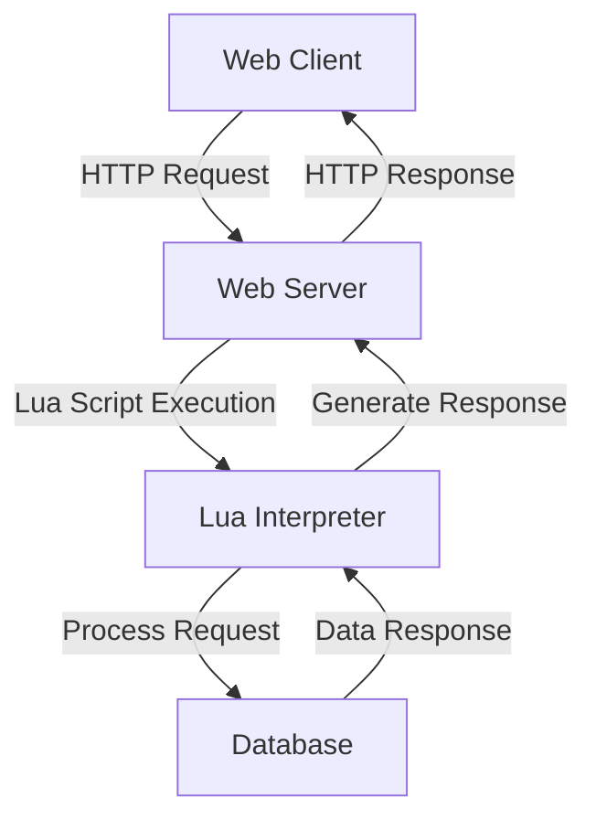

## 11.1 Introduction to Lua in Web Development

Lua, a lightweight and efficient scripting language, has found its niche in web development, offering unique advantages for both server-side and client-side applications. In this section, we will explore how Lua is utilized in web development, its benefits, and the frameworks that support its integration into web projects.

### Lua as a Web Language

Lua's simplicity and flexibility make it an attractive choice for web development. It can be embedded into web servers, used for scripting in web applications, and even employed for client-side scripting in certain scenarios. Let's delve into how Lua is used in web development:

#### Server-Side Lua

On the server side, Lua can be embedded into web servers to handle requests, manage sessions, and perform various backend tasks. Lua's lightweight nature ensures that it does not add significant overhead to server operations, making it ideal for high-performance web applications.

**Example: Integrating Lua with Nginx**

Nginx, a popular web server, supports Lua through the OpenResty platform. OpenResty extends Nginx with Lua scripting capabilities, allowing developers to write custom logic for handling HTTP requests.

```lua
-- A simple Lua script for handling HTTP requests in OpenResty
local function handle_request()
    ngx.say("Hello, Lua in Web Development!")
end

-- Register the function to handle requests
ngx.req.read_body()
handle_request()
```

In this example, we define a Lua function `handle_request` that outputs a simple message. This function is registered to handle incoming HTTP requests, demonstrating how Lua can be used to extend server functionality.

#### Client-Side Lua

While Lua is not as commonly used on the client side as JavaScript, it can still be employed in certain environments, such as game development or embedded systems, where Lua scripts can interact with web technologies.

### Advantages of Using Lua for Web Projects

Lua offers several advantages for web development projects, making it a compelling choice for developers seeking performance and flexibility.

#### Performance

Lua is renowned for its efficiency and lightweight footprint. Its interpreter is small and fast, allowing Lua scripts to execute quickly with minimal resource consumption. This performance advantage is particularly beneficial for web servers that need to handle a high volume of requests.

**Performance Comparison: Lua vs. Other Languages**

| Language   | Interpreter Size | Execution Speed | Memory Usage |
|------------|------------------|-----------------|--------------|
| Lua        | Small            | Fast            | Low          |
| Python     | Medium           | Moderate        | Moderate     |
| JavaScript | Large            | Fast            | High         |

Lua's small interpreter size and low memory usage make it an excellent choice for resource-constrained environments, such as embedded systems or cloud-based applications.

#### Embedding Lua

One of Lua's standout features is its ability to be easily embedded into other applications. This capability allows developers to integrate Lua scripting into web servers, content management systems, and other web-based platforms.

**Example: Embedding Lua in a Web Server**

```c
#include <lua.h>
#include <lualib.h>
#include <lauxlib.h>

int main() {
    lua_State *L = luaL_newstate();  // Create a new Lua state
    luaL_openlibs(L);                // Load Lua libraries

    // Execute a Lua script
    luaL_dostring(L, "print('Lua embedded in C!')");

    lua_close(L);  // Close the Lua state
    return 0;
}
```

In this C example, we create a new Lua state, load the standard Lua libraries, and execute a simple Lua script. This demonstrates how Lua can be embedded into a C application, allowing for seamless integration of Lua scripting capabilities.

### Overview of Lua Web Frameworks

Several frameworks and tools have been developed to support Lua in web development, providing developers with the necessary infrastructure to build robust web applications.

#### Popular Lua Web Frameworks

1. **OpenResty**: Built on top of Nginx, OpenResty allows developers to use Lua scripts to handle HTTP requests, manage sessions, and interact with databases. It is widely used for building high-performance web applications and APIs.

2. **Lapis**: A web framework for Lua that runs on OpenResty, Lapis provides a rich set of features for building web applications, including routing, templating, and database integration.

3. **Sailor**: A lightweight MVC framework for Lua, Sailor is designed for building web applications with a focus on simplicity and ease of use. It supports routing, templating, and ORM for database interactions.

4. **Orbit**: A minimalistic web framework for Lua, Orbit is designed for building small to medium-sized web applications. It provides basic routing and templating capabilities.

#### Choosing the Right Framework

When selecting a Lua web framework, consider the following factors:

- **Project Requirements**: Determine the specific needs of your project, such as performance, scalability, and ease of use.
- **Community Support**: Evaluate the level of community support and available resources for the framework.
- **Integration Capabilities**: Assess how well the framework integrates with other technologies and platforms you plan to use.

### Try It Yourself

To get hands-on experience with Lua in web development, try modifying the provided code examples. Experiment with different Lua scripts in OpenResty or embed Lua into a C application to see how it enhances functionality.

### Visualizing Lua's Role in Web Development

To better understand Lua's role in web development, let's visualize how Lua interacts with web servers and applications.



**Diagram Description**: This flowchart illustrates the interaction between a web client, web server, Lua interpreter, and database. The web client sends an HTTP request to the server, which executes a Lua script to process the request. The Lua interpreter interacts with the database to retrieve or store data, and the server generates an HTTP response back to the client.

### Knowledge Check

- What are the advantages of using Lua for web development?
- How can Lua be embedded into web servers?
- Name some popular Lua web frameworks and their features.

### Embrace the Journey

Remember, this is just the beginning. As you progress, you'll discover more about Lua's capabilities in web development. Keep experimenting, stay curious, and enjoy the journey!

### References and Links

- [OpenResty Official Website](https://openresty.org/)
- [Lapis Framework Documentation](https://leafo.net/lapis/)
- [Sailor Framework GitHub](https://github.com/sailorproject/sailor)

## Quiz Time!



### What is one of the main advantages of using Lua in web development?

- [x] Lightweight and efficient
- [ ] High memory usage
- [ ] Complex syntax
- [ ] Slow execution speed

> **Explanation:** Lua is known for its lightweight and efficient nature, making it ideal for web development.

### How can Lua be integrated into web servers?

- [x] By embedding it into the server
- [ ] By using it as a standalone application
- [ ] By replacing the server's core language
- [ ] By using it only for client-side scripting

> **Explanation:** Lua can be embedded into web servers to extend their functionality with custom scripting.

### Which of the following is a popular Lua web framework?

- [x] OpenResty
- [ ] Django
- [ ] Flask
- [ ] Express

> **Explanation:** OpenResty is a popular Lua web framework built on top of Nginx.

### What is the role of the Lua interpreter in web development?

- [x] To execute Lua scripts
- [ ] To compile Lua scripts into machine code
- [ ] To replace the web server
- [ ] To handle client-side rendering

> **Explanation:** The Lua interpreter executes Lua scripts, allowing them to interact with web servers and applications.

### Which factor should be considered when choosing a Lua web framework?

- [x] Project requirements
- [ ] The number of developers
- [ ] The age of the framework
- [ ] The color scheme of the framework's website

> **Explanation:** Project requirements are crucial in determining the best framework for a specific web development project.

### What is OpenResty built on top of?

- [x] Nginx
- [ ] Apache
- [ ] IIS
- [ ] Tomcat

> **Explanation:** OpenResty is built on top of Nginx, extending it with Lua scripting capabilities.

### Which Lua web framework is known for its simplicity and ease of use?

- [x] Sailor
- [ ] Lapis
- [ ] Orbit
- [ ] Django

> **Explanation:** Sailor is a lightweight MVC framework for Lua, designed for simplicity and ease of use.

### What is a key feature of the Lapis framework?

- [x] Routing and templating
- [ ] Built-in database
- [ ] Client-side rendering
- [ ] Machine learning integration

> **Explanation:** Lapis provides routing and templating features for building web applications.

### What does the Lua interpreter interact with in a web application?

- [x] Database
- [ ] Client-side scripts
- [ ] CSS stylesheets
- [ ] HTML templates

> **Explanation:** The Lua interpreter interacts with databases to retrieve or store data as part of web application processing.

### True or False: Lua is commonly used for client-side scripting in web development.

- [ ] True
- [x] False

> **Explanation:** Lua is not commonly used for client-side scripting; it is more prevalent on the server side or in specific environments like game development.


