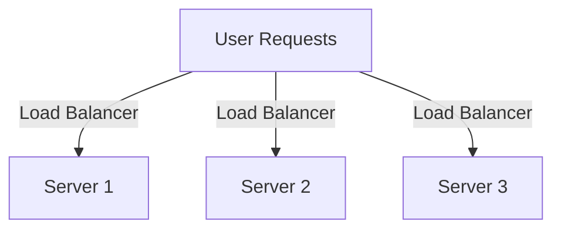
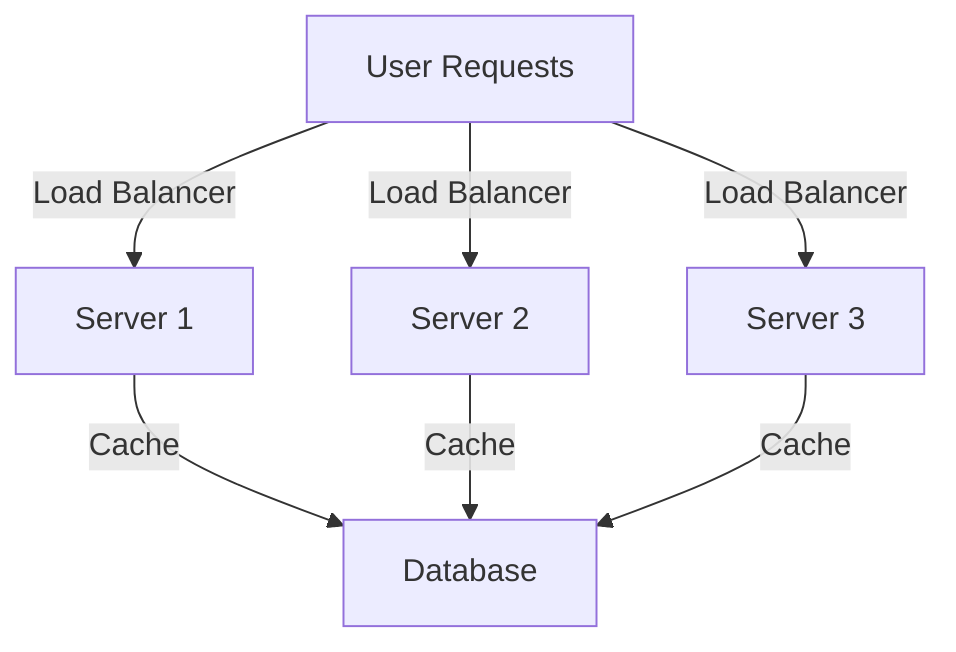

## 11.10 Scaling Lua Web Applications

Scaling web applications is a critical aspect of modern software development, especially as user bases grow and demand increases. In this section, we will explore strategies for scaling Lua web applications, focusing on performance optimization, horizontal and vertical scaling, and real-world use cases. By the end of this guide, you will have a comprehensive understanding of how to architect Lua applications that can handle increased load and data efficiently.

### Planning for Growth

Before diving into specific strategies, it's essential to plan for growth. This involves understanding your application's current limitations, predicting future demands, and designing a scalable architecture from the outset.

#### Key Considerations

- **Current Load and Performance Metrics**: Analyze your application's current performance metrics to identify potential bottlenecks.
- **Future Growth Projections**: Estimate future growth based on user acquisition strategies and market trends.
- **Scalable Architecture Design**: Design your application architecture to accommodate future growth without significant rework.

### Performance Optimization

Performance optimization is the first step in scaling any application. By improving the efficiency of your code and infrastructure, you can handle more users with the same resources.

#### Caching Mechanisms

Caching is a powerful technique for reducing processing time by storing frequently accessed data in a temporary storage layer. This can significantly improve response times and reduce server load.

```lua
-- Example of a simple caching mechanism in Lua
local cache = {}

function getData(key)
    if cache[key] then
        return cache[key]  -- Return cached data
    else
        local data = fetchDataFromDatabase(key)  -- Simulate a database call
        cache[key] = data  -- Store data in cache
        return data
    end
end

-- Simulate fetching data
function fetchDataFromDatabase(key)
    -- Simulate a delay
    os.execute("sleep 1")
    return "Data for " .. key
end

-- Usage
print(getData("user:123"))  -- Fetches from database and caches
print(getData("user:123"))  -- Returns cached data
```

**Key Points**:
- **Cache Invalidation**: Ensure that cached data is invalidated when it becomes stale.
- **Cache Strategies**: Use strategies like Least Recently Used (LRU) to manage cache size.

#### Load Testing

Load testing involves simulating user traffic to identify bottlenecks and optimize code. Tools like Apache JMeter or Lua-based load testing frameworks can be used for this purpose.

**Steps for Load Testing**:
1. **Define Test Scenarios**: Identify critical user journeys and simulate them.
2. **Set Load Parameters**: Determine the number of concurrent users and request rates.
3. **Analyze Results**: Identify bottlenecks and optimize code accordingly.

### Horizontal Scaling

Horizontal scaling involves adding more servers to handle increased load. This approach is often more cost-effective than vertical scaling and provides better fault tolerance.

#### Load Balancing

Load balancing distributes incoming traffic across multiple servers, ensuring no single server is overwhelmed.



**Key Points**:
- **Stateless Design**: Ensure your application is stateless so any server can handle any request.
- **Session Management**: Use external session stores like Redis for session management.

#### Stateless Design

A stateless design ensures that each request is independent, allowing any server to handle it. This is crucial for effective load balancing.

**Implementation Tips**:
- **Avoid Server-Side Sessions**: Use client-side tokens or external session stores.
- **Design APIs to be Idempotent**: Ensure repeated requests have the same effect as a single request.

### Vertical Scaling

Vertical scaling involves increasing the resources (CPU, memory) of a single server. While this can be effective, it has limitations and is often more expensive than horizontal scaling.

#### Resource Allocation

Optimizing resource allocation involves ensuring that your application uses memory and CPU efficiently.

**Techniques**:
- **Optimize Algorithms**: Use efficient algorithms and data structures.
- **Profile and Optimize Code**: Use profiling tools to identify and optimize slow code paths.

#### Asynchronous Processing

Asynchronous processing allows your application to handle multiple tasks concurrently, improving performance and responsiveness.

```lua
-- Example of asynchronous processing using coroutines in Lua
local socket = require("socket")

function asyncTask()
    local co = coroutine.create(function()
        local client = socket.connect("example.com", 80)
        client:send("GET / HTTP/1.1\r\nHost: example.com\r\n\r\n")
        local response = client:receive("*a")
        print(response)
        client:close()
    end)
    coroutine.resume(co)
end

-- Usage
asyncTask()
```

**Key Points**:
- **Non-Blocking I/O**: Use non-blocking I/O operations to improve responsiveness.
- **Event-Driven Architecture**: Consider using an event-driven architecture for high-concurrency applications.

### Use Cases and Examples

#### High-Traffic Websites

Scaling high-traffic websites involves managing spikes in user activity efficiently.

**Strategies**:
- **Auto-Scaling**: Use cloud services that support auto-scaling to handle traffic spikes.
- **Content Delivery Networks (CDNs)**: Use CDNs to cache static content closer to users.

#### Global Applications

Serving users across different regions requires a distributed architecture.

**Strategies**:
- **Geo-Distributed Servers**: Deploy servers in multiple regions to reduce latency.
- **Data Replication**: Use data replication strategies to ensure data consistency across regions.

### Try It Yourself

Experiment with the provided code examples by modifying them to suit your needs. For instance, try implementing a more sophisticated caching strategy or simulate a load test using different parameters.

### Visualizing Scaling Strategies



This diagram illustrates a typical horizontally scaled architecture with load balancing and caching.

### References and Links

- [MDN Web Docs: Caching](https://developer.mozilla.org/en-US/docs/Web/HTTP/Caching)
- [Apache JMeter](https://jmeter.apache.org/)
- [Redis](https://redis.io/)

### Knowledge Check

- What are the benefits of using a stateless design in a web application?
- How does caching improve the performance of a web application?
- What is the difference between horizontal and vertical scaling?

### Embrace the Journey

Remember, scaling is an ongoing process. As your application grows, continue to monitor performance metrics and adjust your strategies accordingly. Keep experimenting, stay curious, and enjoy the journey!

### Quiz Time!



### What is the primary benefit of horizontal scaling?

- [x] It allows adding more servers to handle increased load.
- [ ] It increases the resources of a single server.
- [ ] It reduces the need for load balancing.
- [ ] It simplifies session management.

> **Explanation:** Horizontal scaling involves adding more servers to distribute the load, improving fault tolerance and capacity.

### Which of the following is a key advantage of a stateless design?

- [x] Any server can handle any request.
- [ ] It requires server-side sessions.
- [ ] It increases server dependency.
- [ ] It complicates load balancing.

> **Explanation:** A stateless design ensures that each request is independent, allowing any server to handle it, which is crucial for load balancing.

### What is the purpose of caching in web applications?

- [x] To store frequently accessed data and reduce processing time.
- [ ] To increase the number of servers.
- [ ] To manage user sessions.
- [ ] To handle asynchronous tasks.

> **Explanation:** Caching stores frequently accessed data to reduce the need for repeated processing, improving response times.

### What is a common tool used for load testing web applications?

- [x] Apache JMeter
- [ ] Redis
- [ ] LuaSocket
- [ ] Nginx

> **Explanation:** Apache JMeter is a popular tool for simulating user traffic and identifying performance bottlenecks.

### Which scaling strategy involves increasing the resources of a single server?

- [x] Vertical scaling
- [ ] Horizontal scaling
- [ ] Load balancing
- [ ] Stateless design

> **Explanation:** Vertical scaling involves increasing the resources (CPU, memory) of a single server to handle more load.

### What is a benefit of using a Content Delivery Network (CDN)?

- [x] It caches static content closer to users.
- [ ] It increases server-side processing.
- [ ] It manages user sessions.
- [ ] It simplifies database queries.

> **Explanation:** CDNs cache static content closer to users, reducing latency and improving load times.

### How does asynchronous processing improve application performance?

- [x] By allowing multiple tasks to be handled concurrently.
- [ ] By increasing server dependency.
- [ ] By simplifying session management.
- [ ] By reducing the number of servers.

> **Explanation:** Asynchronous processing allows multiple tasks to be handled concurrently, improving responsiveness and performance.

### What is a key consideration when designing a scalable architecture?

- [x] Predicting future growth and designing for scalability.
- [ ] Reducing the number of servers.
- [ ] Increasing server-side sessions.
- [ ] Simplifying database queries.

> **Explanation:** Designing for scalability involves predicting future growth and ensuring the architecture can accommodate increased load.

### What is the role of a load balancer in a web application?

- [x] To distribute incoming traffic across multiple servers.
- [ ] To increase server-side processing.
- [ ] To manage user sessions.
- [ ] To handle asynchronous tasks.

> **Explanation:** A load balancer distributes incoming traffic across multiple servers, ensuring no single server is overwhelmed.

### True or False: Vertical scaling is generally more cost-effective than horizontal scaling.

- [ ] True
- [x] False

> **Explanation:** Horizontal scaling is often more cost-effective and provides better fault tolerance compared to vertical scaling.




