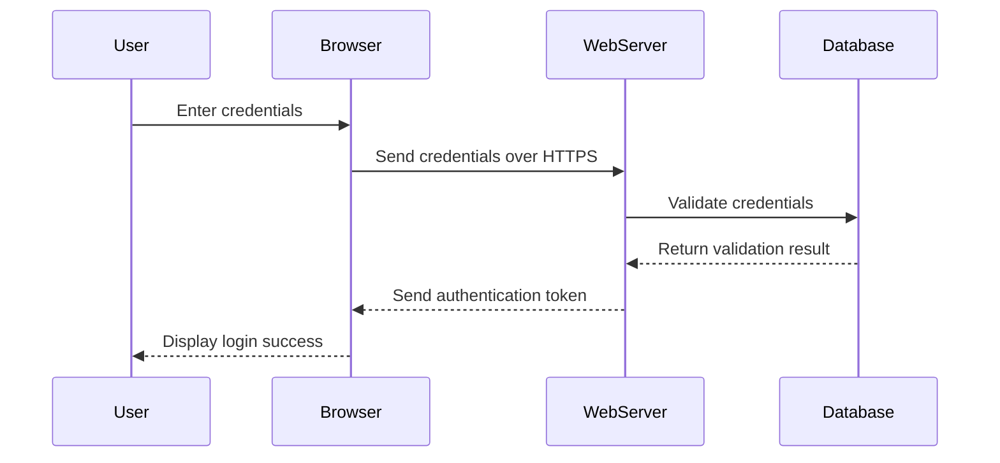

## 11.11 Security Considerations in Web Applications

In the realm of web development, security is paramount. As developers and architects, it's our responsibility to ensure that our applications are robust against potential threats. This section delves into the security considerations specific to web applications built with Lua, focusing on common vulnerabilities and best practices to protect your projects.

### Protecting Web Applications: Identifying and Mitigating Common Security Risks

Web applications are constantly under threat from various security vulnerabilities. Understanding these vulnerabilities and implementing strategies to mitigate them is crucial for maintaining the integrity and security of your applications.

#### Common Vulnerabilities

1. **SQL Injection**

   SQL Injection is a prevalent attack vector where an attacker can execute arbitrary SQL code on a database. This can lead to unauthorized data access, data corruption, or even complete database compromise.

   **Prevention Strategies:**

   - **Use Prepared Statements:** Always use parameterized queries or prepared statements to separate SQL logic from data.
   - **Input Validation:** Validate and sanitize all user inputs to ensure they conform to expected formats.
   - **Least Privilege Principle:** Limit database permissions to only what is necessary for the application to function.

   **Example:**

   ```lua
   -- Using LuaSQL for database interaction
   local env = require("luasql.mysql").mysql()
   local conn = env:connect("database", "user", "password")

   -- Vulnerable query
   local query = "SELECT * FROM users WHERE username = '" .. user_input .. "'"

   -- Secure query using prepared statements
   local stmt = conn:prepare("SELECT * FROM users WHERE username = ?")
   stmt:execute(user_input)
   ```

2. **Cross-Site Scripting (XSS)**

   XSS attacks occur when an attacker injects malicious scripts into content that is then served to other users. This can lead to data theft, session hijacking, and more.

   **Prevention Strategies:**

   - **Sanitize User Input:** Use libraries or functions to sanitize and escape user inputs.
   - **Content Security Policy (CSP):** Implement CSP headers to restrict the sources from which scripts can be loaded.
   - **Output Encoding:** Encode data before rendering it in the browser to prevent script execution.

   **Example:**

   ```lua
   -- Function to escape HTML special characters
   function escape_html(str)
       local replacements = { ["&"] = "&amp;", ["<"] = "&lt;", [">"] = "&gt;", ['"'] = "&quot;", ["'"] = "&#39;" }
       return str:gsub("[&<>'\"]", replacements)
   end

   -- Usage
   local safe_output = escape_html(user_input)
   ```

3. **Cross-Site Request Forgery (CSRF)**

   CSRF attacks trick users into performing actions they did not intend to, by exploiting their authenticated session with a web application.

   **Prevention Strategies:**

   - **CSRF Tokens:** Implement anti-CSRF tokens to validate requests.
   - **SameSite Cookies:** Use the `SameSite` attribute for cookies to restrict cross-origin requests.
   - **Double Submit Cookie Pattern:** Use a combination of cookies and request parameters to verify requests.

   **Example:**

   ```lua
   -- Generating a CSRF token
   local function generate_csrf_token()
       return tostring(math.random(100000, 999999))
   end

   -- Validating a CSRF token
   local function validate_csrf_token(session_token, request_token)
       return session_token == request_token
   end
   ```

### Best Practices

1. **Input Validation**

   Ensure that all data entering your application is validated and sanitized. This prevents malicious data from causing harm.

   **Strategies:**

   - **Whitelist Validation:** Only allow known good data.
   - **Regular Expressions:** Use regex to enforce data formats.
   - **Library Functions:** Utilize existing libraries for common validation tasks.

2. **Secure Data Transmission**

   Protect data in transit by using secure protocols and encryption.

   **Strategies:**

   - **HTTPS:** Always use HTTPS to encrypt data between the client and server.
   - **TLS/SSL Certificates:** Regularly update and manage your certificates.
   - **Data Encryption:** Encrypt sensitive data before transmission.

3. **Error Handling**

   Avoid exposing sensitive information through error messages.

   **Strategies:**

   - **Generic Error Messages:** Provide users with generic error messages while logging detailed errors internally.
   - **Error Logging:** Implement robust logging mechanisms to track errors without exposing them to users.
   - **Exception Handling:** Use try-catch blocks to gracefully handle exceptions.

### Use Cases and Examples

1. **Secure Login Systems**

   Protecting user credentials is critical. Implement secure authentication mechanisms to safeguard user data.

   **Strategies:**

   - **Password Hashing:** Use strong hashing algorithms like bcrypt or Argon2 for storing passwords.
   - **Multi-Factor Authentication (MFA):** Implement MFA to add an extra layer of security.
   - **Session Management:** Use secure cookies and manage session lifecycles effectively.

   **Example:**

   ```lua
   -- Hashing a password using bcrypt
   local bcrypt = require("bcrypt")
   local hashed_password = bcrypt.digest("user_password", 10)

   -- Verifying a password
   local is_valid = bcrypt.verify("user_password", hashed_password)
   ```

2. **Compliance with Standards**

   Ensure your application complies with relevant security standards and regulations, such as GDPR and PCI DSS.

   **Strategies:**

   - **Data Protection Policies:** Implement policies to protect user data.
   - **Regular Audits:** Conduct regular security audits and vulnerability assessments.
   - **Documentation:** Maintain thorough documentation of security practices and compliance measures.

### Visualizing Security Concepts

To better understand the flow of security measures in a web application, let's visualize the process using a sequence diagram.



**Diagram Description:** This sequence diagram illustrates the secure login process, highlighting the use of HTTPS for secure transmission and the interaction between the browser, web server, and database.

### References and Links

- [OWASP Top Ten](https://owasp.org/www-project-top-ten/): A comprehensive guide to the most critical security risks to web applications.
- [Mozilla Developer Network (MDN) Web Security](https://developer.mozilla.org/en-US/docs/Web/Security): A resource for understanding web security concepts and best practices.
- [Let's Encrypt](https://letsencrypt.org/): A free, automated, and open certificate authority for securing your web applications with HTTPS.

### Knowledge Check

To reinforce your understanding of web application security, consider the following questions:

- What are the key differences between SQL Injection and XSS attacks?
- How can CSRF tokens be implemented in a Lua-based web application?
- Why is input validation crucial for web application security?

### Embrace the Journey

Remember, securing web applications is an ongoing process. As threats evolve, so must our strategies to combat them. Keep learning, stay vigilant, and continue to refine your security practices. By doing so, you'll not only protect your applications but also build trust with your users.

## Quiz Time!



### What is a common method to prevent SQL Injection attacks?

- [x] Use prepared statements
- [ ] Use inline SQL queries
- [ ] Disable database logging
- [ ] Use HTTP instead of HTTPS

> **Explanation:** Prepared statements separate SQL logic from data, preventing SQL Injection.

### Which of the following is a strategy to prevent XSS attacks?

- [x] Sanitize user input
- [ ] Use inline JavaScript
- [ ] Disable browser caching
- [ ] Use HTTP instead of HTTPS

> **Explanation:** Sanitizing user input prevents malicious scripts from being executed.

### What is the purpose of a CSRF token?

- [x] To verify the legitimacy of requests
- [ ] To encrypt user passwords
- [ ] To log user actions
- [ ] To manage user sessions

> **Explanation:** CSRF tokens help verify that requests are made by authenticated users.

### Which protocol should be used to ensure secure data transmission?

- [x] HTTPS
- [ ] HTTP
- [ ] FTP
- [ ] SMTP

> **Explanation:** HTTPS encrypts data between the client and server, ensuring secure transmission.

### What is a best practice for error handling in web applications?

- [x] Provide generic error messages to users
- [ ] Display detailed error messages to users
- [ ] Log errors in the browser console
- [ ] Ignore minor errors

> **Explanation:** Generic error messages prevent information leakage while detailed errors are logged internally.

### How can you protect user credentials in a web application?

- [x] Use password hashing
- [ ] Store passwords in plain text
- [ ] Use HTTP for login forms
- [ ] Disable password complexity requirements

> **Explanation:** Password hashing secures user credentials by storing them in a non-reversible format.

### What is a key component of secure session management?

- [x] Use secure cookies
- [ ] Use plain text cookies
- [ ] Disable cookies
- [ ] Use HTTP instead of HTTPS

> **Explanation:** Secure cookies ensure that session data is transmitted securely.

### Why is compliance with standards like GDPR important?

- [x] To protect user data and ensure legal compliance
- [ ] To increase application speed
- [ ] To reduce server costs
- [ ] To improve user interface design

> **Explanation:** Compliance with standards ensures that user data is protected and legal requirements are met.

### What is the role of Content Security Policy (CSP) in web security?

- [x] To restrict the sources from which scripts can be loaded
- [ ] To manage user sessions
- [ ] To encrypt database connections
- [ ] To log user actions

> **Explanation:** CSP helps prevent XSS attacks by restricting script sources.

### True or False: Regular security audits are unnecessary if you follow best practices.

- [ ] True
- [x] False

> **Explanation:** Regular security audits are essential to identify and address new vulnerabilities.


