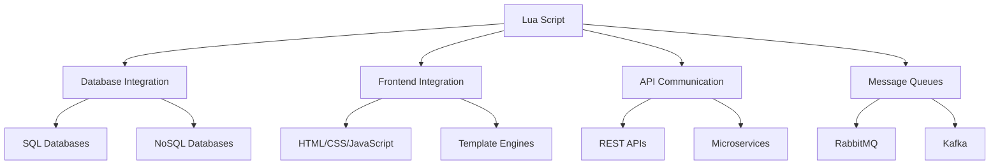

## 11.12 Integrating Lua with Other Web Technologies

In today's interconnected web ecosystem, integrating different technologies is crucial for building robust and scalable applications. Lua, known for its lightweight and embeddable nature, offers unique advantages when combined with other web technologies. This section explores how Lua can be integrated with databases, frontend frameworks, APIs, and microservices to create seamless web applications.

### Interoperability with Web Ecosystem

#### Combining Lua with Other Languages and Frameworks

Lua's simplicity and flexibility make it an excellent choice for integration with various languages and frameworks. Its ability to be embedded in other applications allows developers to leverage Lua's scripting capabilities while utilizing the strengths of other technologies.

### Working with Databases

#### Using LuaSQL: Accessing SQL Databases from Lua

LuaSQL is a powerful library that enables Lua to interact with SQL databases. It provides a consistent API for connecting to databases like MySQL, PostgreSQL, and SQLite.

```lua
-- Example: Connecting to a MySQL database using LuaSQL
local luasql = require "luasql.mysql"
local env = luasql.mysql()
local conn = env:connect('database_name', 'username', 'password', 'localhost', 3306)

-- Execute a query
local cursor = conn:execute("SELECT * FROM users")

-- Fetch and print results
row = cursor:fetch({}, "a")
while row do
    print(string.format("Name: %s, Age: %d", row.name, row.age))
    row = cursor:fetch(row, "a")
end

-- Close the connection
cursor:close()
conn:close()
env:close()
```

> **Try It Yourself**: Modify the code to connect to a different database or execute a different SQL query.

#### NoSQL Integrations: Connecting to MongoDB, Redis, etc.

Lua can also be integrated with NoSQL databases like MongoDB and Redis. Libraries such as `lua-resty-redis` and `lua-mongo` provide interfaces for interacting with these databases.

```lua
-- Example: Connecting to Redis using lua-resty-redis
local redis = require "resty.redis"
local red = redis:new()

red:set_timeout(1000) -- 1 second

-- Connect to Redis server
local ok, err = red:connect("127.0.0.1", 6379)
if not ok then
    ngx.say("Failed to connect: ", err)
    return
end

-- Set and get a value
ok, err = red:set("key", "value")
if not ok then
    ngx.say("Failed to set key: ", err)
    return
end

local res, err = red:get("key")
if not res then
    ngx.say("Failed to get key: ", err)
    return
end

ngx.say("Key value: ", res)
```

> **Try It Yourself**: Experiment with different Redis commands or connect to a MongoDB database using `lua-mongo`.

### Frontend Integration

#### Generating Dynamic Content: Serving HTML, CSS, and JavaScript

Lua can be used to generate dynamic web content by serving HTML, CSS, and JavaScript. This is particularly useful in server-side scripting environments where Lua is embedded.

```lua
-- Example: Generating a simple HTML page with Lua
local html = [[
<!DOCTYPE html>
<html>
<head>
    <title>Lua Web Page</title>
    <style>
        body { font-family: Arial, sans-serif; }
    </style>
</head>
<body>
    <h1>Welcome to Lua Web Page</h1>
    <p>This page is generated using Lua.</p>
</body>
</html>
]]

-- Serve the HTML content
ngx.say(html)
```

> **Try It Yourself**: Add more HTML elements or styles to the page.

#### Template Engines: Using Lua for Server-Side Rendering

Template engines allow developers to separate HTML structure from Lua logic, making it easier to manage dynamic content. Libraries like `etlua` and `lustache` provide templating capabilities in Lua.

```lua
-- Example: Using etlua for server-side rendering
local etlua = require "etlua"
local template = etlua.compile([[
<!DOCTYPE html>
<html>
<head>
    <title><%= title %></title>
</head>
<body>
    <h1><%= heading %></h1>
    <p><%= message %></p>
</body>
</html>
]])

local data = {
    title = "Lua Template",
    heading = "Hello, Lua!",
    message = "This is a message rendered using etlua."
}

local output = template(data)
ngx.say(output)
```

> **Try It Yourself**: Modify the template to include additional data or logic.

### APIs and Microservices

#### Communicating with Other Services: Consuming and Providing APIs

Lua can be used to consume and provide APIs, making it a versatile tool for building microservices. Libraries like `lua-resty-http` enable HTTP communication with other services.

```lua
-- Example: Consuming a REST API using lua-resty-http
local http = require "resty.http"
local httpc = http.new()

local res, err = httpc:request_uri("http://api.example.com/data", {
    method = "GET",
    headers = {
        ["Accept"] = "application/json",
    }
})

if not res then
    ngx.say("Failed to request: ", err)
    return
end

ngx.say("Response: ", res.body)
```

> **Try It Yourself**: Change the API endpoint or request method to interact with different services.

#### Message Queues and Brokers: Integrating with Systems like RabbitMQ or Kafka

Message queues and brokers facilitate communication between distributed systems. Lua can be integrated with RabbitMQ or Kafka using libraries like `lua-resty-rabbitmqstomp` and `lua-kafka`.

```lua
-- Example: Publishing a message to RabbitMQ using lua-resty-rabbitmqstomp
local rabbitmq = require "resty.rabbitmqstomp"
local mq, err = rabbitmq:new()

mq:set_timeout(1000) -- 1 second

local ok, err = mq:connect("127.0.0.1", 61613)
if not ok then
    ngx.say("Failed to connect to RabbitMQ: ", err)
    return
end

local ok, err = mq:send({
    destination = "/queue/test",
    body = "Hello, RabbitMQ!"
})

if not ok then
    ngx.say("Failed to send message: ", err)
    return
end

ngx.say("Message sent successfully")
```

> **Try It Yourself**: Experiment with different message queues or brokers.

### Use Cases and Examples

#### Full-Stack Development: Building Complete Web Solutions with Lua

Lua can be used as part of a full-stack development approach, where it handles server-side logic, interacts with databases, and communicates with frontend technologies.

```lua
-- Example: A simple full-stack application using Lua
-- Backend: Lua script to handle API requests and database interactions
-- Frontend: HTML/CSS/JavaScript served by Lua

-- Backend Lua script
local http = require "resty.http"
local httpc = http.new()

-- Handle API request
local res, err = httpc:request_uri("http://api.example.com/data", {
    method = "GET",
    headers = {
        ["Accept"] = "application/json",
    }
})

if not res then
    ngx.say("Failed to request: ", err)
    return
end

-- Serve HTML content
local html = [[
<!DOCTYPE html>
<html>
<head>
    <title>Full-Stack Lua App</title>
</head>
<body>
    <h1>Data from API</h1>
    <pre>]] .. res.body .. [[</pre>
</body>
</html>
]]

ngx.say(html)
```

> **Try It Yourself**: Extend the application to include more complex interactions or integrate additional technologies.

#### Hybrid Applications: Combining Lua with Other Technologies for Specific Needs

Hybrid applications leverage the strengths of multiple technologies to meet specific requirements. Lua can be combined with other languages and frameworks to create efficient and scalable solutions.

```lua
-- Example: Hybrid application using Lua and Node.js
-- Lua handles lightweight scripting tasks
-- Node.js manages heavy lifting and asynchronous operations

-- Lua script for lightweight tasks
local function process_data(data)
    -- Perform data processing
    return data:upper()
end

-- Node.js script for heavy lifting
const express = require('express');
const app = express();

app.get('/process', (req, res) => {
    const data = req.query.data;
    const processedData = process_data(data); // Call Lua function
    res.send(`Processed Data: ${processedData}`);
});

app.listen(3000, () => {
    console.log('Server running on port 3000');
});
```

> **Try It Yourself**: Modify the application to include additional processing or integrate with other services.

### Visualizing Lua's Integration with Web Technologies



> **Diagram Description**: This flowchart illustrates how Lua can be integrated with various web technologies, including databases, frontend frameworks, APIs, and message queues.

### References and Links

- [LuaSQL Documentation](https://keplerproject.github.io/luasql/)
- [lua-resty-redis](https://github.com/openresty/lua-resty-redis)
- [etlua Template Engine](https://github.com/leafo/etlua)
- [lua-resty-http](https://github.com/pintsized/lua-resty-http)
- [lua-resty-rabbitmqstomp](https://github.com/wingify/lua-resty-rabbitmqstomp)

### Knowledge Check

- What are the benefits of integrating Lua with other web technologies?
- How can Lua be used to interact with SQL and NoSQL databases?
- What are some use cases for combining Lua with frontend technologies?
- How can Lua be utilized in API communication and microservices?
- What are the advantages of using Lua in hybrid applications?

### Embrace the Journey

Remember, integrating Lua with other web technologies opens up a world of possibilities for building efficient and scalable web applications. As you explore these integrations, keep experimenting, stay curious, and enjoy the journey!

## Quiz Time!



### What is LuaSQL used for?

- [x] Accessing SQL databases from Lua
- [ ] Generating dynamic web content
- [ ] Consuming REST APIs
- [ ] Integrating with message queues

> **Explanation:** LuaSQL is a library that allows Lua to interact with SQL databases.

### Which library is used to connect Lua with Redis?

- [x] lua-resty-redis
- [ ] lua-resty-http
- [ ] etlua
- [ ] lua-mongo

> **Explanation:** lua-resty-redis is a library used to connect Lua with Redis.

### What is the purpose of template engines in Lua?

- [x] Separating HTML structure from Lua logic
- [ ] Connecting to databases
- [ ] Consuming APIs
- [ ] Handling message queues

> **Explanation:** Template engines allow developers to separate HTML structure from Lua logic, making it easier to manage dynamic content.

### How can Lua be used in API communication?

- [x] Consuming and providing APIs
- [ ] Generating HTML content
- [ ] Connecting to SQL databases
- [ ] Integrating with frontend frameworks

> **Explanation:** Lua can be used to consume and provide APIs, making it a versatile tool for building microservices.

### Which library is used for HTTP communication in Lua?

- [x] lua-resty-http
- [ ] lua-resty-redis
- [ ] etlua
- [ ] lua-mongo

> **Explanation:** lua-resty-http is a library used for HTTP communication in Lua.

### What is a use case for hybrid applications with Lua?

- [x] Combining Lua with other technologies for specific needs
- [ ] Generating static HTML pages
- [ ] Consuming REST APIs
- [ ] Accessing SQL databases

> **Explanation:** Hybrid applications leverage the strengths of multiple technologies to meet specific requirements, and Lua can be combined with other languages and frameworks to create efficient solutions.

### What is the advantage of using Lua in full-stack development?

- [x] Handling server-side logic and interacting with databases
- [ ] Generating static HTML content
- [ ] Consuming REST APIs
- [ ] Integrating with message queues

> **Explanation:** Lua can be used as part of a full-stack development approach, where it handles server-side logic and interacts with databases.

### Which library is used to connect Lua with RabbitMQ?

- [x] lua-resty-rabbitmqstomp
- [ ] lua-resty-http
- [ ] lua-resty-redis
- [ ] lua-mongo

> **Explanation:** lua-resty-rabbitmqstomp is a library used to connect Lua with RabbitMQ.

### What is the benefit of using message queues in Lua applications?

- [x] Facilitating communication between distributed systems
- [ ] Generating dynamic web content
- [ ] Consuming REST APIs
- [ ] Accessing SQL databases

> **Explanation:** Message queues facilitate communication between distributed systems, making them useful in Lua applications.

### True or False: Lua can only be used for backend development.

- [ ] True
- [x] False

> **Explanation:** Lua can be used for both backend and frontend development, as well as for integrating with various web technologies.


