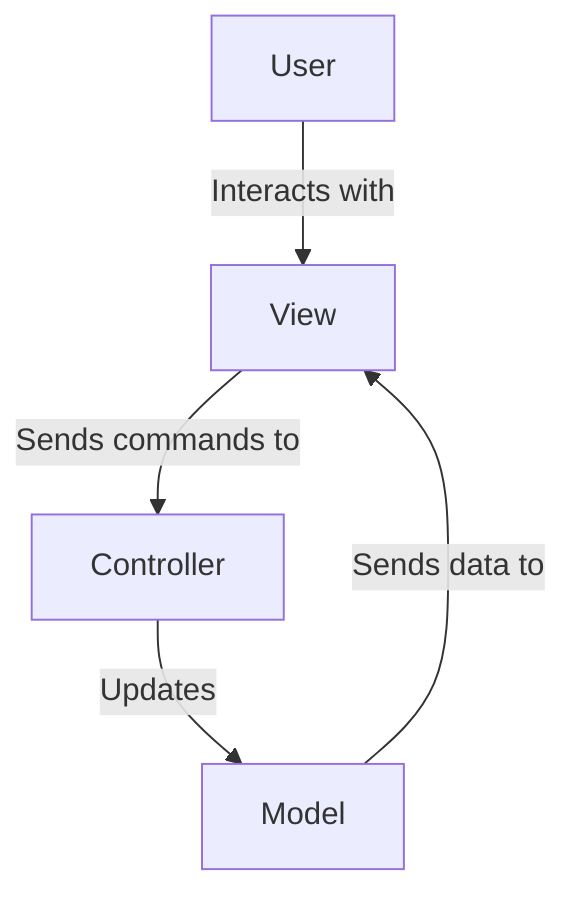
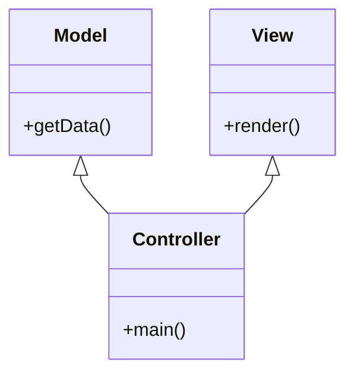

## 11.2 MVC Web Development with Kepler

In the realm of web development, the Model-View-Controller (MVC) architecture stands as a cornerstone for building scalable and maintainable applications. The Kepler Project, an open-source initiative, brings the power of Lua to web development, offering a robust framework for implementing MVC architecture. This section delves into the intricacies of using Kepler for MVC web development, providing expert developers with the knowledge and tools to create dynamic web applications.

### Understanding Kepler Project

The Kepler Project is a pioneering open-source framework designed to facilitate web development using Lua. It provides a comprehensive suite of tools and libraries that enable developers to build web applications efficiently. Kepler's architecture is modular, allowing developers to pick and choose components that best fit their project needs.

#### Key Features of Kepler

- **Modular Design**: Kepler's modularity allows for flexibility in application design, enabling developers to integrate only the necessary components.
- **Lightweight and Fast**: Leveraging Lua's lightweight nature, Kepler ensures high performance and low memory footprint.
- **Extensive Libraries**: Kepler includes a rich set of libraries for handling HTTP requests, session management, and more.
- **Community Support**: As an open-source project, Kepler benefits from a vibrant community that contributes to its growth and evolution.

### Model-View-Controller (MVC) Architecture

The MVC architecture is a design pattern that separates an application into three interconnected components: Model, View, and Controller. This separation of concerns facilitates modular development, making applications easier to manage and scale.

#### Separation of Concerns

- **Model**: Represents the application's data and business logic. It is responsible for managing the data, responding to requests for information, and updating the data based on instructions from the Controller.
- **View**: The user interface of the application. It displays data from the Model to the user and sends user commands to the Controller.
- **Controller**: Acts as an intermediary between the Model and the View. It processes user input, interacts with the Model, and updates the View accordingly.



*Figure 1: MVC Architecture Flow*

### Implementing MVC in Kepler

Implementing MVC in Kepler involves structuring your web application to adhere to the principles of separation of concerns. This structure ensures that each component of the application is responsible for a specific aspect of the application's functionality.

#### Structuring Web Applications

1. **Model Layer**: Define Lua tables and functions to handle data operations. Use Kepler's database libraries to interact with databases.
2. **View Layer**: Create HTML templates that display data to users. Use Lua scripts to dynamically generate content.
3. **Controller Layer**: Write Lua scripts to handle user input and coordinate between the Model and View.

### Developing with Kepler

To harness the full potential of Kepler for MVC web development, you need to set up the development environment and understand the process of creating web applications.

#### Setting Up Kepler Environment

1. **Installation**: Install Lua and Kepler on your system. You can download Kepler from its [official website](http://keplerproject.github.io/).
2. **Configuration**: Configure the environment by setting up necessary paths and dependencies. Ensure that LuaRocks, the package manager for Lua, is installed for managing libraries.

```bash
sudo apt-get install lua5.1

sudo apt-get install luarocks

luarocks install kepler
```

#### Creating Web Applications

Let's build a simple web application using Kepler to demonstrate the MVC architecture.

1. **Create a Project Structure**: Organize your project into directories for Models, Views, and Controllers.

```plaintext
myapp/
├── controllers/
│   └── main.lua
├── models/
│   └── data.lua
├── views/
│   └── index.lp
└── init.lua
```

2. **Define the Model**: Create a `data.lua` file in the `models` directory to handle data operations.

```lua
-- models/data.lua
local Data = {}

function Data.getData()
    return { message = "Hello, Kepler!" }
end

return Data
```

3. **Create the View**: Develop an HTML template in the `views` directory.

```html
<!-- views/index.lp -->
<html>
<head>
    <title>Kepler MVC Example</title>
</head>
<body>
    <h1><%= message %></h1>
</body>
</html>
```

4. **Implement the Controller**: Write a Lua script in the `controllers` directory to manage application logic.

```lua
-- controllers/main.lua
local Data = require("models.data")

function main()
    local data = Data.getData()
    return { render = "index.lp", data = data }
end
```

5. **Initialize the Application**: Set up the application entry point in `init.lua`.

```lua
-- init.lua
require("orbit")

module("myapp", package.seeall, orbit.new)

function index(web)
    return render_main()
end

myapp:dispatch_get(index, "/")
```

6. **Run the Application**: Start the Kepler server and access your application through a web browser.

```bash
kepler init.lua
```

### Use Cases and Examples

Kepler's flexibility and performance make it suitable for a variety of web development scenarios.

#### Dynamic Websites

Kepler can be used to build dynamic websites, such as content management systems (CMS), where content is generated dynamically based on user interactions.

#### Web Applications

Develop interactive and data-driven web applications using Kepler's MVC framework. Examples include dashboards, e-commerce platforms, and social networking sites.

### Try It Yourself

Experiment with the code examples provided by modifying the data returned by the Model or changing the HTML structure in the View. Try adding new routes and controllers to expand the application's functionality.

### Visualizing Kepler's MVC Architecture



*Figure 2: Class Diagram of Kepler's MVC Architecture*

### References and Links

- [Kepler Project Official Website](http://keplerproject.github.io/)
- [LuaRocks: The Lua Package Manager](https://luarocks.org/)
- [MVC Architecture Overview](https://developer.mozilla.org/en-US/docs/Glossary/MVC)

### Knowledge Check

- What are the key components of the MVC architecture?
- How does Kepler facilitate web development with Lua?
- Describe the process of setting up a Kepler environment.
- How can you implement a simple web application using Kepler?

### Embrace the Journey

Remember, mastering MVC web development with Kepler is a journey. As you explore and experiment, you'll gain deeper insights into building robust web applications. Keep pushing the boundaries, stay curious, and enjoy the process!

## Quiz Time!



### What is the primary purpose of the Kepler Project?

- [x] To facilitate web development using Lua
- [ ] To create desktop applications with Lua
- [ ] To develop mobile applications with Lua
- [ ] To build game engines with Lua

> **Explanation:** The Kepler Project is designed to facilitate web development using Lua, providing tools and libraries for building web applications.

### Which component of the MVC architecture handles user input?

- [ ] Model
- [ ] View
- [x] Controller
- [ ] Database

> **Explanation:** The Controller handles user input, processes it, and interacts with the Model and View accordingly.

### What is the role of the Model in MVC?

- [x] To manage application data and business logic
- [ ] To display data to the user
- [ ] To handle user input
- [ ] To render HTML templates

> **Explanation:** The Model is responsible for managing the application's data and business logic.

### How does Kepler's modular design benefit developers?

- [x] It allows developers to integrate only necessary components
- [ ] It makes applications slower
- [ ] It complicates the development process
- [ ] It restricts the use of external libraries

> **Explanation:** Kepler's modular design allows developers to integrate only the components they need, making the development process more efficient.

### What is the first step in setting up a Kepler environment?

- [x] Installing Lua and Kepler
- [ ] Writing HTML templates
- [ ] Creating a database schema
- [ ] Designing the user interface

> **Explanation:** The first step in setting up a Kepler environment is installing Lua and Kepler on your system.

### Which Kepler component is responsible for rendering HTML templates?

- [ ] Model
- [x] View
- [ ] Controller
- [ ] Router

> **Explanation:** The View component is responsible for rendering HTML templates and displaying data to the user.

### What is a common use case for Kepler?

- [x] Building dynamic websites and web applications
- [ ] Developing operating systems
- [ ] Creating video games
- [ ] Designing hardware drivers

> **Explanation:** Kepler is commonly used for building dynamic websites and web applications due to its MVC framework.

### How can you modify the data returned by the Model in Kepler?

- [x] By changing the Lua functions in the Model layer
- [ ] By editing the HTML templates
- [ ] By altering the Controller scripts
- [ ] By adjusting the server configuration

> **Explanation:** You can modify the data returned by the Model by changing the Lua functions in the Model layer.

### What is the benefit of using MVC architecture?

- [x] It separates concerns, making applications easier to manage
- [ ] It combines all application logic into a single component
- [ ] It eliminates the need for a database
- [ ] It simplifies user interface design

> **Explanation:** MVC architecture separates concerns, making applications easier to manage and scale.

### True or False: Kepler is suitable for developing desktop applications.

- [ ] True
- [x] False

> **Explanation:** Kepler is specifically designed for web development using Lua, not for developing desktop applications.


