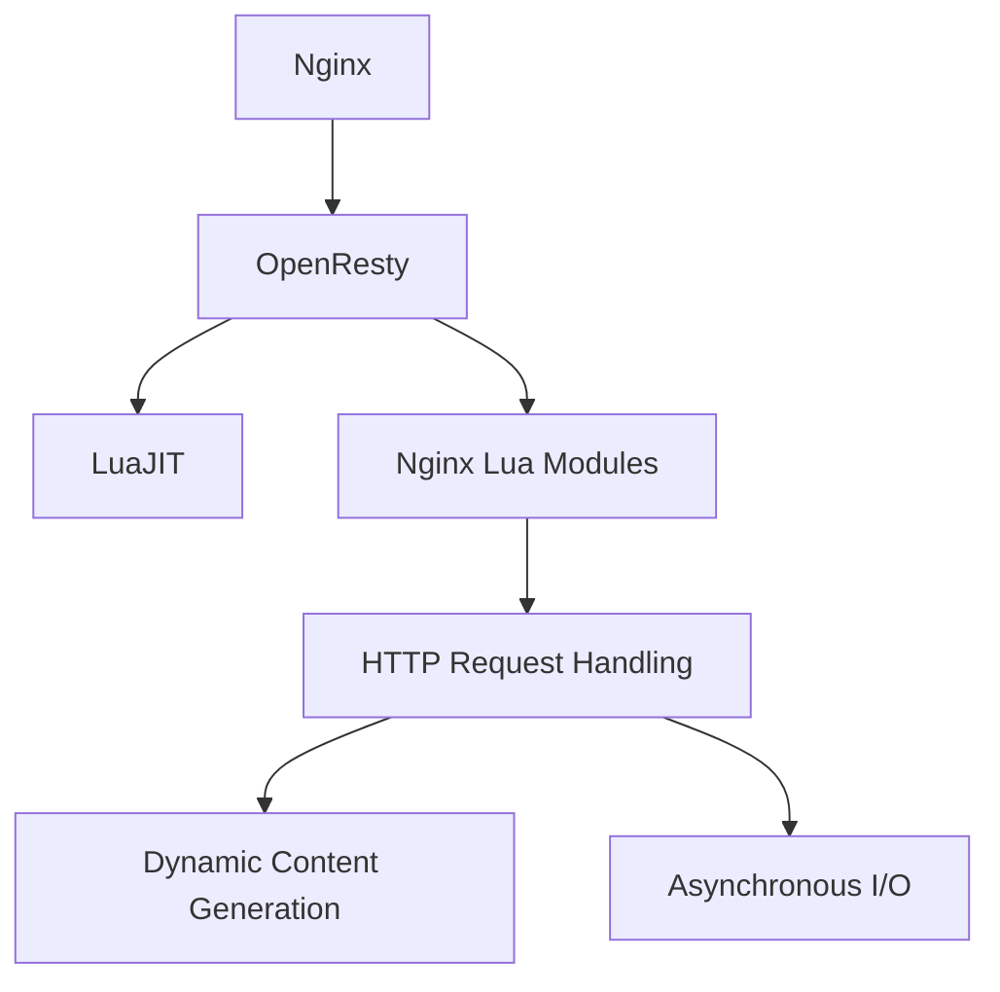

## 11.3 Using OpenResty and Nginx Lua Modules

In the realm of web development, the ability to handle high loads and provide dynamic content efficiently is paramount. OpenResty, a powerful web platform based on Nginx, allows developers to extend the capabilities of Nginx using Lua scripting. This section delves into how OpenResty and Nginx Lua modules can be leveraged to build high-performance web applications.

### Introduction to OpenResty

OpenResty is a full-fledged web application server that integrates the Nginx HTTP server with Lua scripting capabilities. It is designed to help developers build scalable web applications, web services, and dynamic web gateways. By embedding Lua directly into Nginx, OpenResty allows for high-performance, non-blocking I/O operations, making it an ideal choice for handling a large number of concurrent connections.

#### Key Features of OpenResty

- **High Performance**: Built on top of Nginx, known for its high concurrency and low memory footprint.
- **Extensibility**: Lua scripting allows for dynamic content generation and complex logic execution.
- **Asynchronous I/O**: Non-blocking operations enable efficient handling of multiple requests.
- **Rich Ecosystem**: A wide range of modules and libraries to extend functionality.

### Extending Nginx with Lua

OpenResty extends Nginx by embedding the LuaJIT compiler, allowing Lua scripts to be executed within the Nginx worker processes. This integration provides a powerful mechanism to enhance Nginx configurations and implement custom logic.

#### Nginx Lua Modules

The Nginx Lua modules are the core components that enable Lua scripting within Nginx. These modules provide hooks into various phases of the Nginx request processing cycle, allowing developers to execute Lua code at different stages.

- **ngx_http_lua_module**: The primary module for embedding Lua scripts in Nginx. It provides directives to run Lua code in various phases such as `init_by_lua`, `content_by_lua`, and `log_by_lua`.

```nginx
http {
    server {
        listen 80;
        
        location /hello {
            content_by_lua_block {
                ngx.say("Hello, OpenResty!")
            }
        }
    }
}
```

In this example, the `content_by_lua_block` directive is used to execute a Lua script that responds with "Hello, OpenResty!" when the `/hello` endpoint is accessed.

#### Scripting HTTP Servers

With OpenResty, you can script HTTP server behaviors using Lua, enabling dynamic content generation, request handling, and response customization.

- **Dynamic Content Generation**: Use Lua to generate content on-the-fly based on request parameters or external data sources.
- **Custom Request Handling**: Implement custom logic to process incoming requests, such as authentication, rate limiting, or data validation.

```lua
location /greet {
    content_by_lua_block {
        local name = ngx.var.arg_name or "Guest"
        ngx.say("Hello, " .. name .. "!")
    }
}
```

This script dynamically greets the user by name, using the `arg_name` query parameter.

### Implementing High-Performance Web Applications

OpenResty is particularly well-suited for building high-performance web applications due to its event-driven architecture and support for asynchronous programming.

#### Handling Concurrent Requests

Nginx's event-driven architecture allows it to handle thousands of concurrent connections efficiently. By leveraging Lua's non-blocking I/O capabilities, OpenResty can manage multiple requests without blocking the server.

- **Event-Driven Model**: Nginx uses an event loop to manage connections, reducing the overhead of thread or process creation.
- **Non-Blocking I/O**: Lua scripts can perform asynchronous operations, such as database queries or HTTP requests, without blocking the main thread.

```lua
location /fetch {
    content_by_lua_block {
        local http = require "resty.http"
        local httpc = http.new()
        local res, err = httpc:request_uri("http://example.com/api", {
            method = "GET",
            headers = {
                ["Content-Type"] = "application/json",
            }
        })
        
        if not res then
            ngx.say("Failed to request: ", err)
            return
        end
        
        ngx.say("Response: ", res.body)
    }
}
```

This example demonstrates how to perform an asynchronous HTTP request using the `resty.http` library, allowing the server to handle other requests while waiting for the response.

#### Asynchronous Programming

Asynchronous programming in OpenResty is facilitated by Lua's coroutines, which allow for cooperative multitasking. This approach enables efficient resource utilization and improved application responsiveness.

- **Coroutines**: Lightweight threads that can yield and resume execution, enabling non-blocking operations.
- **Cooperative Multitasking**: Tasks voluntarily yield control, allowing other tasks to run, thus maximizing CPU usage.

### Use Cases and Examples

OpenResty is versatile and can be used in various scenarios, from API gateways to load balancing and proxying.

#### API Gateways

OpenResty can be used to build scalable API gateways that handle authentication, rate limiting, and request routing.

- **Authentication**: Implement OAuth, JWT, or custom authentication mechanisms using Lua scripts.
- **Rate Limiting**: Control the number of requests per user or IP address to prevent abuse.

```lua
location /api {
    access_by_lua_block {
        local token = ngx.var.arg_token
        if not token or token ~= "expected_token" then
            ngx.exit(ngx.HTTP_UNAUTHORIZED)
        end
    }
    
    content_by_lua_block {
        ngx.say("Welcome to the API!")
    }
}
```

This script checks for a valid token before allowing access to the API.

#### Load Balancing and Proxying

Customize traffic management by implementing load balancing and proxying logic in Lua.

- **Custom Load Balancing**: Distribute requests based on custom criteria, such as user location or server load.
- **Proxying**: Forward requests to backend servers, modifying headers or request parameters as needed.

```lua
location /proxy {
    proxy_pass http://backend;
    header_filter_by_lua_block {
        ngx.header["X-Proxy-By"] = "OpenResty"
    }
}
```

This example demonstrates how to add a custom header to responses proxied to a backend server.

### Visualizing OpenResty Architecture

To better understand how OpenResty integrates with Nginx and Lua, let's visualize the architecture using a Mermaid.js diagram.



**Diagram Description**: This diagram illustrates the integration of OpenResty with Nginx and LuaJIT. Nginx serves as the base HTTP server, while OpenResty extends its capabilities with Lua scripting via Nginx Lua modules. These modules handle HTTP requests, enabling dynamic content generation and asynchronous I/O operations.

### Try It Yourself

Experiment with the provided code examples by modifying them to suit your needs. For instance, try changing the greeting message or implementing a new API endpoint with custom authentication logic. Remember, the best way to learn is by doing!

### References and Links

- [OpenResty Official Website](https://openresty.org/)
- [Nginx Lua Module Documentation](https://github.com/openresty/lua-nginx-module)
- [LuaJIT Official Website](http://luajit.org/)
- [MDN Web Docs on Asynchronous Programming](https://developer.mozilla.org/en-US/docs/Learn/JavaScript/Asynchronous)

### Knowledge Check

- What are the key features of OpenResty?
- How does OpenResty extend Nginx with Lua scripting?
- What is the role of coroutines in asynchronous programming with OpenResty?
- How can OpenResty be used to implement API gateways?

### Embrace the Journey

Remember, mastering OpenResty and Nginx Lua modules is a journey. As you progress, you'll discover new ways to optimize and scale your web applications. Keep experimenting, stay curious, and enjoy the process!

## Quiz Time!



### What is OpenResty primarily used for?

- [x] Extending Nginx with Lua scripting for high-performance web applications
- [ ] Replacing Nginx with a new web server
- [ ] Compiling Lua scripts into machine code
- [ ] Managing databases

> **Explanation:** OpenResty is a platform that integrates Nginx with Lua scripting to build high-performance web applications.

### Which module is primarily used to embed Lua scripts in Nginx?

- [x] ngx_http_lua_module
- [ ] ngx_stream_lua_module
- [ ] ngx_mail_lua_module
- [ ] ngx_core_lua_module

> **Explanation:** The `ngx_http_lua_module` is the primary module for embedding Lua scripts in Nginx.

### What is a key advantage of using Lua scripting with Nginx?

- [x] Non-blocking I/O operations
- [ ] Increased memory usage
- [ ] Slower request processing
- [ ] Limited scalability

> **Explanation:** Lua scripting with Nginx allows for non-blocking I/O operations, improving performance and scalability.

### How does OpenResty handle concurrent requests efficiently?

- [x] By using an event-driven architecture
- [ ] By creating a new thread for each request
- [ ] By using synchronous I/O operations
- [ ] By limiting the number of connections

> **Explanation:** OpenResty uses Nginx's event-driven architecture to handle concurrent requests efficiently.

### What is the purpose of coroutines in OpenResty?

- [x] To enable cooperative multitasking
- [ ] To block the main thread
- [ ] To increase memory usage
- [ ] To slow down request processing

> **Explanation:** Coroutines in OpenResty enable cooperative multitasking, allowing non-blocking operations.

### Which of the following is a use case for OpenResty?

- [x] Building API gateways
- [ ] Replacing databases
- [ ] Compiling Java code
- [ ] Managing file systems

> **Explanation:** OpenResty can be used to build scalable API gateways, among other use cases.

### How can OpenResty be used for load balancing?

- [x] By implementing custom logic in Lua scripts
- [ ] By replacing Nginx's load balancer
- [ ] By using synchronous I/O operations
- [ ] By limiting the number of servers

> **Explanation:** OpenResty allows for custom load balancing logic to be implemented in Lua scripts.

### What is a benefit of using OpenResty for web development?

- [x] High concurrency and low memory footprint
- [ ] Increased complexity and overhead
- [ ] Limited scalability
- [ ] Slower response times

> **Explanation:** OpenResty offers high concurrency and a low memory footprint, making it ideal for web development.

### Which directive is used to execute Lua code in the content phase?

- [x] content_by_lua_block
- [ ] access_by_lua_block
- [ ] init_by_lua_block
- [ ] log_by_lua_block

> **Explanation:** The `content_by_lua_block` directive is used to execute Lua code in the content phase of request processing.

### True or False: OpenResty can only be used for static content delivery.

- [ ] True
- [x] False

> **Explanation:** False. OpenResty is used for dynamic content generation and can handle complex web application logic.


