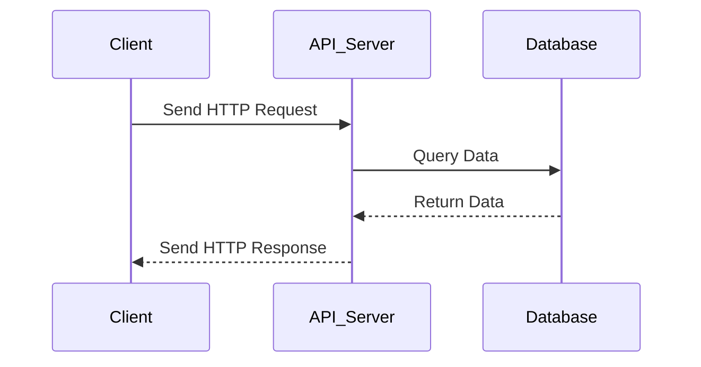

## 11.4 Building Web APIs with Lua

In today's interconnected digital landscape, Web APIs serve as the backbone of communication between different software systems. Lua, with its lightweight footprint and flexibility, is an excellent choice for building efficient and scalable Web APIs. In this section, we will delve into the principles of designing RESTful APIs using Lua, explore how to implement them, and cover essential topics such as routing requests, processing data formats, and implementing authentication and authorization.

### Designing RESTful APIs

REST (Representational State Transfer) is an architectural style that defines a set of constraints for creating Web services. RESTful APIs are designed to be stateless, cacheable, and provide a uniform interface. Let's explore the key principles of REST and how to implement them in Lua.

#### Principles of REST

1. **Statelessness**: Each request from a client must contain all the information needed to understand and process the request. The server does not store any session information about the client.

2. **Client-Server Architecture**: The client and server are separate entities, allowing them to evolve independently.

3. **Cacheability**: Responses must define themselves as cacheable or not to prevent clients from reusing stale or inappropriate data.

4. **Uniform Interface**: A consistent and standardized interface between components, simplifying the architecture.

5. **Layered System**: The architecture can be composed of hierarchical layers, each with specific responsibilities.

6. **Code on Demand (Optional)**: Servers can extend client functionality by transferring executable code.

#### Implementing RESTful APIs in Lua

To implement RESTful APIs in Lua, we need to focus on routing requests, processing data formats, and ensuring secure communication.

### Implementing APIs

#### Routing Requests

Routing is the process of mapping URLs to specific Lua functions that handle requests. A well-designed routing system is crucial for building efficient APIs.

**Example: Basic Routing in Lua**

```lua
-- Simple routing example using a Lua table
local routes = {
    GET = {
        ["/api/users"] = function() return "List of users" end,
        ["/api/users/:id"] = function(id) return "User with ID: " .. id end
    },
    POST = {
        ["/api/users"] = function() return "Create a new user" end
    }
}

-- Function to handle incoming requests
function handle_request(method, path)
    local route = routes[method] and routes[method][path]
    if route then
        return route()
    else
        return "404 Not Found"
    end
end

-- Example usage
print(handle_request("GET", "/api/users")) -- Output: List of users
```

In this example, we use a Lua table to define routes for different HTTP methods and paths. The `handle_request` function looks up the appropriate route and executes the corresponding function.

#### Processing Data Formats

APIs often need to handle various data formats such as JSON and XML. Lua provides libraries to facilitate this process.

**Example: Handling JSON Data**

```lua
-- Using the cjson library for JSON processing
local cjson = require "cjson"

-- Function to parse JSON data
function parse_json(json_string)
    local data = cjson.decode(json_string)
    return data
end

-- Function to encode data as JSON
function encode_json(data)
    local json_string = cjson.encode(data)
    return json_string
end

-- Example usage
local json_data = '{"name": "John", "age": 30}'
local lua_table = parse_json(json_data)
print(lua_table.name) -- Output: John

local new_json = encode_json({name = "Jane", age = 25})
print(new_json) -- Output: {"name":"Jane","age":25}
```

In this example, we use the `cjson` library to decode JSON strings into Lua tables and encode Lua tables into JSON strings.

### Authentication and Authorization

Security is a critical aspect of API development. Implementing authentication and authorization ensures that only authorized users can access certain resources.

#### API Keys and Tokens

API keys and tokens are common methods for authenticating API requests. They provide a way to identify and authorize users.

**Example: Implementing API Key Authentication**

```lua
-- Sample API keys
local api_keys = {
    ["12345"] = true,
    ["67890"] = true
}

-- Function to authenticate requests using API keys
function authenticate_request(api_key)
    if api_keys[api_key] then
        return true
    else
        return false
    end
end

-- Example usage
local api_key = "12345"
if authenticate_request(api_key) then
    print("Access granted")
else
    print("Access denied")
end
```

In this example, we use a Lua table to store valid API keys and a function to check if a given API key is valid.

#### OAuth Integration

OAuth is a widely used protocol for third-party authentication. Integrating OAuth into your Lua API allows users to authenticate using external services.

**Example: OAuth Integration Workflow**

1. **Client Requests Authorization**: The client requests authorization from the user to access their data.

2. **User Grants Authorization**: The user grants authorization, and the client receives an authorization code.

3. **Client Requests Token**: The client exchanges the authorization code for an access token.

4. **Access Protected Resources**: The client uses the access token to access protected resources.

### Use Cases and Examples

#### Microservices

Microservices architecture involves building small, independent services that communicate over a network. Lua's lightweight nature makes it ideal for developing microservices.

**Example: Building a Simple Microservice**

```lua
-- Simple microservice example using LuaSocket
local socket = require "socket"

-- Function to handle requests
function handle_request(client)
    local request = client:receive()
    if request then
        client:send("HTTP/1.1 200 OK\r\nContent-Type: text/plain\r\n\r\nHello from Lua microservice!")
    end
    client:close()
end

-- Create a TCP server
local server = assert(socket.bind("*", 8080))
print("Microservice running on port 8080")

-- Accept and handle client connections
while true do
    local client = server:accept()
    handle_request(client)
end
```

In this example, we use LuaSocket to create a simple TCP server that responds to HTTP requests.

#### Mobile App Backends

Lua can be used to build backends for mobile applications, providing data and functionality to mobile clients.

**Example: Mobile App Backend with Lua**

```lua
-- Sample mobile app backend using Lua and JSON
local cjson = require "cjson"

-- Function to handle user login
function login_user(username, password)
    -- Simulate user authentication
    if username == "user" and password == "pass" then
        return cjson.encode({status = "success", message = "Login successful"})
    else
        return cjson.encode({status = "error", message = "Invalid credentials"})
    end
end

-- Example usage
local response = login_user("user", "pass")
print(response) -- Output: {"status":"success","message":"Login successful"}
```

In this example, we simulate a user login process and return a JSON response.

### Try It Yourself

Experiment with the code examples provided in this section. Try modifying the routing logic, adding new routes, or implementing additional authentication methods. Explore different data formats and experiment with integrating OAuth into your API.

### Visualizing API Architecture

To better understand the architecture of a Web API, let's visualize the flow of a typical API request using a sequence diagram.



**Diagram Description**: This sequence diagram illustrates the flow of an API request from the client to the API server, which queries the database and returns the response to the client.

### References and Links

- [RESTful Web Services](https://restfulapi.net/)
- [OAuth 2.0](https://oauth.net/2/)
- [LuaSocket Documentation](http://w3.impa.br/~diego/software/luasocket/)
- [cjson Library](https://www.kyne.com.au/~mark/software/lua-cjson.php)

### Knowledge Check

- What are the key principles of RESTful APIs?
- How can you implement routing in a Lua-based API?
- What are some common data formats handled by APIs?
- How do API keys and tokens enhance security?
- What is the role of OAuth in API authentication?

### Embrace the Journey

Building Web APIs with Lua is a rewarding journey that empowers you to create efficient and scalable services. Remember, this is just the beginning. As you progress, you'll build more complex and interactive APIs. Keep experimenting, stay curious, and enjoy the journey!

## Quiz Time!



### What is a key principle of RESTful APIs?

- [x] Statelessness
- [ ] Stateful interactions
- [ ] Client-side storage
- [ ] Server-side sessions

> **Explanation:** RESTful APIs are designed to be stateless, meaning each request from a client must contain all the information needed to understand and process the request.

### How can you implement routing in a Lua-based API?

- [x] Using a Lua table to map URLs to functions
- [ ] Using a database to store routes
- [ ] Using a file system to manage routes
- [ ] Using a third-party service for routing

> **Explanation:** Routing in Lua can be implemented using a Lua table to map URLs to specific functions that handle requests.

### Which library is commonly used for JSON processing in Lua?

- [x] cjson
- [ ] xmlparser
- [ ] luajson
- [ ] jsonlib

> **Explanation:** The `cjson` library is commonly used for JSON processing in Lua, allowing for encoding and decoding of JSON data.

### What is the purpose of API keys in API security?

- [x] To authenticate and authorize API requests
- [ ] To store user data
- [ ] To encrypt data
- [ ] To manage server sessions

> **Explanation:** API keys are used to authenticate and authorize API requests, ensuring that only authorized users can access certain resources.

### What is OAuth used for in API development?

- [x] Third-party authentication
- [ ] Data encryption
- [ ] Session management
- [ ] Data storage

> **Explanation:** OAuth is a protocol used for third-party authentication, allowing users to authenticate using external services.

### What is a common use case for Lua-based APIs?

- [x] Microservices architecture
- [ ] Desktop application development
- [ ] Game development
- [ ] Operating system design

> **Explanation:** Lua's lightweight nature makes it ideal for developing microservices, which are small, independent services that communicate over a network.

### How can you handle JSON data in Lua?

- [x] Using the cjson library to decode and encode JSON
- [ ] Using the xmlparser library
- [ ] Using the jsonlib library
- [ ] Using the jsonparser library

> **Explanation:** JSON data in Lua can be handled using the `cjson` library, which provides functions to decode and encode JSON data.

### What is a benefit of using microservices architecture?

- [x] Scalability and modularity
- [ ] Increased complexity
- [ ] Monolithic design
- [ ] Centralized control

> **Explanation:** Microservices architecture offers scalability and modularity, allowing for independent development and deployment of services.

### What is a key feature of RESTful APIs?

- [x] Uniform Interface
- [ ] Server-side sessions
- [ ] Client-side storage
- [ ] Stateful interactions

> **Explanation:** RESTful APIs provide a uniform interface, which simplifies the architecture and allows for consistent communication between components.

### True or False: Lua is suitable for building mobile app backends.

- [x] True
- [ ] False

> **Explanation:** Lua is suitable for building mobile app backends, providing data and functionality to mobile clients with its lightweight and flexible nature.


