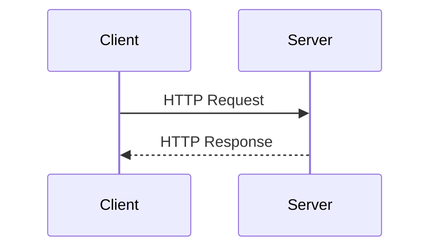

## 11.5 Handling HTTP Requests and Responses

In the realm of web development, understanding how to handle HTTP requests and responses is crucial. Lua, with its lightweight and flexible nature, offers powerful capabilities for managing these interactions. In this section, we will delve into the essentials of HTTP protocol, explore how to parse requests, generate responses, and handle errors effectively. By the end of this guide, you'll be equipped to build robust web applications using Lua.

### Understanding HTTP Protocol

HTTP (Hypertext Transfer Protocol) is the foundation of data communication on the web. It operates as a request-response protocol between a client and server. Here are the key components:

- **Requests**: Initiated by the client, requests contain a method (e.g., GET, POST), a URL, headers, and optionally a body.
- **Responses**: Sent by the server, responses include a status code, headers, and a body.
- **Headers**: Metadata about the request or response, such as content type and caching instructions.
- **Status Codes**: Indicate the result of the request, such as 200 (OK), 404 (Not Found), or 500 (Internal Server Error).

### Parsing Requests

Parsing HTTP requests involves extracting information from the request message. This includes accessing parameters, headers, and body content.

#### Accessing Request Data

To handle HTTP requests in Lua, we often use libraries like **LuaSocket** or frameworks like **OpenResty**. Here's a basic example using LuaSocket to parse a request:

```lua
local socket = require("socket")
local server = assert(socket.bind("*", 8080))
local client = server:accept()

local request = client:receive("*l")
print("Received request: " .. request)

-- Extracting headers
local headers = {}
while true do
    local line = client:receive("*l")
    if line == "" then break end
    local key, value = line:match("^(.-):%s*(.*)")
    headers[key] = value
end

-- Accessing request data
local method, path = request:match("^(%w+)%s+(.-)%s+HTTP")
print("Method: " .. method)
print("Path: " .. path)
```

In this example, we bind a server to port 8080, accept a client connection, and read the request line. We then extract headers and parse the method and path.

#### Handling Different Methods

HTTP supports various methods, each serving a different purpose:

- **GET**: Retrieve data from the server.
- **POST**: Send data to the server.
- **PUT**: Update existing data.
- **DELETE**: Remove data.

Here's how you might handle different methods:

```lua
if method == "GET" then
    -- Handle GET request
elseif method == "POST" then
    -- Handle POST request
elseif method == "PUT" then
    -- Handle PUT request
elseif method == "DELETE" then
    -- Handle DELETE request
else
    -- Handle other methods
end
```

### Generating Responses

Once a request is parsed, the server must generate an appropriate response. This involves setting headers and sending data back to the client.

#### Setting Response Headers

Headers provide essential information about the response. Common headers include `Content-Type`, `Cache-Control`, and `Content-Length`.

```lua
local response = "HTTP/1.1 200 OK\r\n"
response = response .. "Content-Type: text/html\r\n"
response = response .. "Content-Length: " .. #body .. "\r\n"
response = response .. "\r\n" .. body
client:send(response)
```

In this example, we set the `Content-Type` to `text/html` and specify the `Content-Length`.

#### Sending Data

The response body can contain various content types, such as HTML, JSON, or plain text. Here's how to send a JSON response:

```lua
local json = require("json") -- Assuming a JSON library is available
local data = { message = "Hello, world!" }
local body = json.encode(data)

local response = "HTTP/1.1 200 OK\r\n"
response = response .. "Content-Type: application/json\r\n"
response = response .. "Content-Length: " .. #body .. "\r\n"
response = response .. "\r\n" .. body
client:send(response)
```

### Error Handling

Proper error handling enhances user experience and ensures robust applications.

#### Status Codes

Use appropriate HTTP status codes to indicate the result of a request. For example, use 404 for not found errors and 500 for server errors.

```lua
local function sendError(client, statusCode, message)
    local response = "HTTP/1.1 " .. statusCode .. " " .. message .. "\r\n"
    response = response .. "Content-Type: text/plain\r\n"
    response = response .. "Content-Length: " .. #message .. "\r\n"
    response = response .. "\r\n" .. message
    client:send(response)
end

sendError(client, "404", "Not Found")
```

#### Custom Error Pages

Enhance user experience by providing custom error pages. This involves sending HTML content with a friendly message.

```lua
local errorPage = [[
<html>
<head><title>Error</title></head>
<body>
<h1>Oops! Something went wrong.</h1>
<p>Please try again later.</p>
</body>
</html>
]]

sendError(client, "500", errorPage)
```

### Use Cases and Examples

Let's explore some practical use cases for handling HTTP requests and responses in Lua.

#### Form Processing

Handling user input from forms is a common task. Here's how you might process a form submission:

```lua
if method == "POST" and path == "/submit" then
    local body = client:receive("*a")
    local params = parseFormData(body)
    -- Process form data
    local response = "HTTP/1.1 200 OK\r\n"
    response = response .. "Content-Type: text/plain\r\n"
    response = response .. "\r\n" .. "Form submitted successfully!"
    client:send(response)
end
```

#### File Uploads and Downloads

Managing file uploads and downloads involves handling binary data. Here's a basic example of handling a file upload:

```lua
if method == "POST" and path == "/upload" then
    local boundary = headers["Content-Type"]:match("boundary=(.+)")
    local body = client:receive("*a")
    local fileData = extractFileData(body, boundary)
    -- Save fileData to disk
    local response = "HTTP/1.1 200 OK\r\n"
    response = response .. "Content-Type: text/plain\r\n"
    response = response .. "\r\n" .. "File uploaded successfully!"
    client:send(response)
end
```

### Visualizing HTTP Request-Response Flow

To better understand the flow of HTTP requests and responses, let's visualize it using a sequence diagram.



This diagram illustrates the basic interaction between a client and server, where the client sends a request and the server responds.

### Try It Yourself

Experiment with the code examples provided. Try modifying the request handling logic to support additional HTTP methods or customize the response headers and content. This hands-on approach will deepen your understanding of handling HTTP requests and responses in Lua.

### References and Links

For further reading on HTTP protocol and Lua web development, consider exploring the following resources:

- [MDN Web Docs: HTTP](https://developer.mozilla.org/en-US/docs/Web/HTTP)
- [LuaSocket Documentation](http://w3.impa.br/~diego/software/luasocket/)
- [OpenResty Documentation](https://openresty.org/en/)

### Knowledge Check

- What are the key components of an HTTP request?
- How can you extract headers from an HTTP request in Lua?
- What is the purpose of HTTP status codes?
- How do you send a JSON response in Lua?
- What are some common HTTP methods and their purposes?

### Embrace the Journey

Remember, mastering HTTP requests and responses in Lua is just the beginning. As you progress, you'll build more complex and interactive web applications. Keep experimenting, stay curious, and enjoy the journey!

## Quiz Time!



### What is the primary purpose of HTTP?

- [x] To facilitate communication between a client and server
- [ ] To encrypt data
- [ ] To store data
- [ ] To manage databases

> **Explanation:** HTTP is a protocol used for communication between a client and server on the web.

### Which Lua library is commonly used for handling HTTP requests?

- [x] LuaSocket
- [ ] LuaSQL
- [ ] LuaJIT
- [ ] LuaRocks

> **Explanation:** LuaSocket is a popular library for handling network communication, including HTTP requests.

### What is the role of HTTP headers?

- [x] To provide metadata about the request or response
- [ ] To store cookies
- [ ] To encrypt data
- [ ] To manage sessions

> **Explanation:** HTTP headers contain metadata about the request or response, such as content type and caching instructions.

### How can you send a JSON response in Lua?

- [x] By setting the Content-Type header to application/json and sending JSON-encoded data
- [ ] By setting the Content-Type header to text/plain
- [ ] By using the LuaSQL library
- [ ] By encrypting the data

> **Explanation:** To send a JSON response, set the Content-Type header to application/json and send JSON-encoded data.

### What HTTP status code indicates a successful request?

- [x] 200
- [ ] 404
- [ ] 500
- [ ] 301

> **Explanation:** The 200 status code indicates a successful HTTP request.

### How do you handle a POST request in Lua?

- [x] By checking if the method is "POST" and processing the request body
- [ ] By checking if the method is "GET"
- [ ] By setting the Content-Type header to application/x-www-form-urlencoded
- [ ] By using the LuaJIT library

> **Explanation:** To handle a POST request, check if the method is "POST" and process the request body accordingly.

### What is the purpose of custom error pages?

- [x] To enhance user experience during errors
- [ ] To encrypt data
- [ ] To store cookies
- [ ] To manage sessions

> **Explanation:** Custom error pages provide a user-friendly message during errors, enhancing the user experience.

### Which HTTP method is used to update existing data?

- [x] PUT
- [ ] GET
- [ ] DELETE
- [ ] POST

> **Explanation:** The PUT method is used to update existing data on the server.

### What is the function of the Content-Length header?

- [x] To specify the size of the response body
- [ ] To encrypt data
- [ ] To manage sessions
- [ ] To store cookies

> **Explanation:** The Content-Length header specifies the size of the response body in bytes.

### True or False: HTTP is a stateful protocol.

- [ ] True
- [x] False

> **Explanation:** HTTP is a stateless protocol, meaning each request is independent and does not retain state information.


