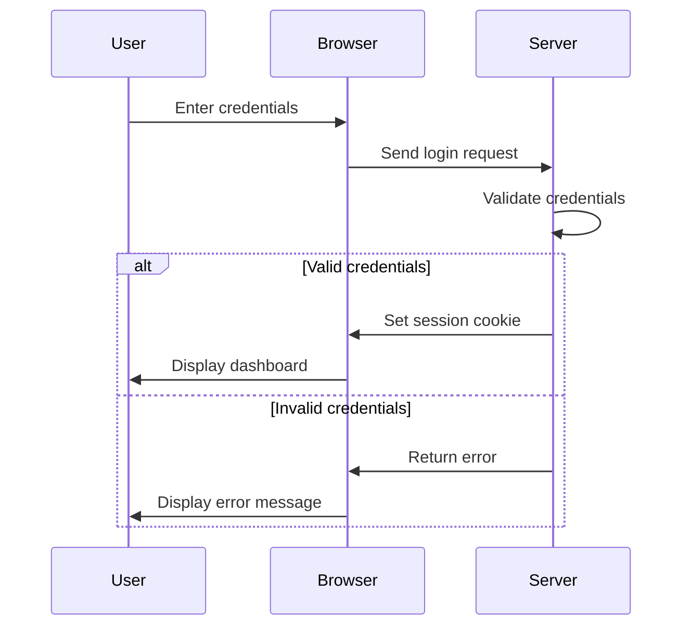

## 11.6 Session Management and Authentication

In the realm of web development, managing user sessions and ensuring secure authentication are critical components for building robust applications. In this section, we will delve into the intricacies of session management and authentication using Lua, providing you with the tools and knowledge to implement these features effectively.

### Maintaining User Sessions

User sessions are essential for tracking the state of a user across multiple requests. This allows for a seamless user experience, where users can log in, access personalized content, and maintain their state throughout their interaction with the application.

#### Implementing Sessions in Lua

There are several techniques for implementing sessions in Lua, each with its own advantages and considerations.

##### Cookies and Tokens

Cookies and tokens are common methods for session tracking. They allow the server to identify and authenticate users across multiple requests.

###### Cookies

Cookies are small pieces of data stored on the client's browser. They are sent with every HTTP request to the server, allowing the server to recognize returning users.

```lua
-- Setting a cookie in Lua
function set_cookie(response, name, value, path, domain, secure, httponly)
    local cookie = name .. "=" .. value
    if path then cookie = cookie .. "; Path=" .. path end
    if domain then cookie = cookie .. "; Domain=" .. domain end
    if secure then cookie = cookie .. "; Secure" end
    if httponly then cookie = cookie .. "; HttpOnly" end
    response:set_header("Set-Cookie", cookie)
end

-- Example usage
set_cookie(response, "session_id", "abc123", "/", "example.com", true, true)
```

###### Tokens

Tokens, such as JSON Web Tokens (JWT), are another method for session tracking. They are self-contained and can carry user information securely.

```lua
-- Generating a JWT token in Lua
local jwt = require "luajwt"

local payload = {
    sub = "1234567890",
    name = "John Doe",
    admin = true
}

local secret = "your-256-bit-secret"

local token, err = jwt.encode(payload, secret)
if not err then
    print("Generated Token: " .. token)
end
```

##### Server-Side Session Storage

Storing session data on the server is a secure way to manage user sessions. This method involves keeping session data in a database or in-memory store, with the session ID stored in a cookie or token.

```lua
-- Example of server-side session storage using a table
local sessions = {}

function create_session(user_id)
    local session_id = generate_session_id()
    sessions[session_id] = { user_id = user_id, created_at = os.time() }
    return session_id
end

function get_session(session_id)
    return sessions[session_id]
end
```

### User Authentication

Authentication is the process of verifying the identity of a user. It is a crucial step in ensuring that only authorized users can access certain parts of an application.

#### Login Mechanisms

Login mechanisms typically involve validating user credentials, such as a username and password.

```lua
-- Example of a simple login function
function login(username, password)
    local user = find_user_by_username(username)
    if user and verify_password(password, user.hashed_password) then
        return create_session(user.id)
    else
        return nil, "Invalid credentials"
    end
end
```

#### Password Security

Ensuring password security is paramount. This involves hashing passwords before storing them and using encryption to protect sensitive data.

```lua
-- Example of hashing a password
local bcrypt = require "bcrypt"

local password = "mysecretpassword"
local hashed_password = bcrypt.digest(password, 10)

-- Verifying a password
local is_valid = bcrypt.verify(password, hashed_password)
```

### Authorization and Access Control

Authorization determines what an authenticated user is allowed to do. It involves defining permissions and access levels.

#### Role-Based Access Control (RBAC)

RBAC is a method of restricting access based on user roles. Each role has a set of permissions associated with it.

```lua
-- Example of role-based access control
local roles = {
    admin = { "read", "write", "delete" },
    user = { "read", "write" }
}

function has_permission(role, permission)
    return roles[role] and table.contains(roles[role], permission)
end
```

#### Middleware for Authentication

Middleware can be used to modularize security checks, ensuring that authentication and authorization are consistently applied across routes.

```lua
-- Example of authentication middleware
function auth_middleware(next)
    return function(request, response)
        local session_id = request:get_cookie("session_id")
        local session = get_session(session_id)
        if session then
            request.user = find_user_by_id(session.user_id)
            return next(request, response)
        else
            response:status(401):send("Unauthorized")
        end
    end
end
```

### Use Cases and Examples

#### User Account Systems

Implementing a user account system involves registration, login, and profile management.

```lua
-- Example of a user registration function
function register(username, password)
    if find_user_by_username(username) then
        return nil, "Username already exists"
    end
    local hashed_password = bcrypt.digest(password, 10)
    return create_user(username, hashed_password)
end
```

#### Secure Areas of Websites

Restricting access to certain content is crucial for protecting sensitive information.

```lua
-- Example of restricting access to a secure area
function secure_area(request, response)
    if not request.user then
        response:status(403):send("Forbidden")
    else
        response:send("Welcome to the secure area, " .. request.user.name)
    end
end
```

### Visualizing Session Management and Authentication

To better understand the flow of session management and authentication, let's visualize the process using a sequence diagram.



### References and Links

- [MDN Web Docs on HTTP Cookies](https://developer.mozilla.org/en-US/docs/Web/HTTP/Cookies)
- [JWT.io for JSON Web Tokens](https://jwt.io/)
- [OWASP Authentication Cheat Sheet](https://cheatsheetseries.owasp.org/cheatsheets/Authentication_Cheat_Sheet.html)

### Knowledge Check

- Explain the difference between cookies and tokens for session management.
- Demonstrate how to implement a simple login mechanism in Lua.
- Provide an example of role-based access control.
- Discuss the importance of password hashing and encryption.

### Embrace the Journey

Remember, mastering session management and authentication is a journey. As you progress, you'll build more secure and user-friendly applications. Keep experimenting, stay curious, and enjoy the journey!

### Quiz Time!



### What is the primary purpose of session management in web applications?

- [x] To track user state across multiple requests
- [ ] To store user passwords securely
- [ ] To encrypt user data
- [ ] To manage database connections

> **Explanation:** Session management is used to maintain user state across multiple requests, allowing for a seamless user experience.

### Which of the following is a common method for session tracking?

- [x] Cookies
- [ ] Passwords
- [ ] Encryption keys
- [ ] Database queries

> **Explanation:** Cookies are a common method for session tracking, as they allow the server to recognize returning users.

### What is the role of tokens in session management?

- [x] To carry user information securely
- [ ] To encrypt user passwords
- [ ] To manage database connections
- [ ] To store user preferences

> **Explanation:** Tokens, such as JSON Web Tokens (JWT), are used to carry user information securely across requests.

### How does server-side session storage enhance security?

- [x] By keeping session data on the server
- [ ] By storing passwords in plain text
- [ ] By using cookies for all data
- [ ] By encrypting all HTTP requests

> **Explanation:** Server-side session storage enhances security by keeping session data on the server, reducing the risk of client-side tampering.

### What is the purpose of password hashing?

- [x] To protect passwords from being stored in plain text
- [ ] To encrypt user data
- [ ] To manage user sessions
- [ ] To validate user credentials

> **Explanation:** Password hashing is used to protect passwords from being stored in plain text, enhancing security.

### What is Role-Based Access Control (RBAC)?

- [x] A method of restricting access based on user roles
- [ ] A way to encrypt user data
- [ ] A technique for managing database connections
- [ ] A method for hashing passwords

> **Explanation:** RBAC is a method of restricting access based on user roles, defining permissions for each role.

### How can middleware be used in authentication?

- [x] By modularizing security checks
- [ ] By storing user passwords
- [ ] By encrypting HTTP requests
- [ ] By managing database connections

> **Explanation:** Middleware can be used to modularize security checks, ensuring consistent authentication and authorization across routes.

### What is a common use case for user account systems?

- [x] Registration, login, and profile management
- [ ] Encrypting user data
- [ ] Managing database connections
- [ ] Storing session data

> **Explanation:** User account systems commonly involve registration, login, and profile management.

### Why is it important to restrict access to secure areas of a website?

- [x] To protect sensitive information
- [ ] To encrypt user data
- [ ] To manage database connections
- [ ] To store user preferences

> **Explanation:** Restricting access to secure areas is important for protecting sensitive information from unauthorized access.

### True or False: Session management and authentication are only necessary for large-scale applications.

- [ ] True
- [x] False

> **Explanation:** Session management and authentication are necessary for applications of all sizes to ensure security and user experience.


