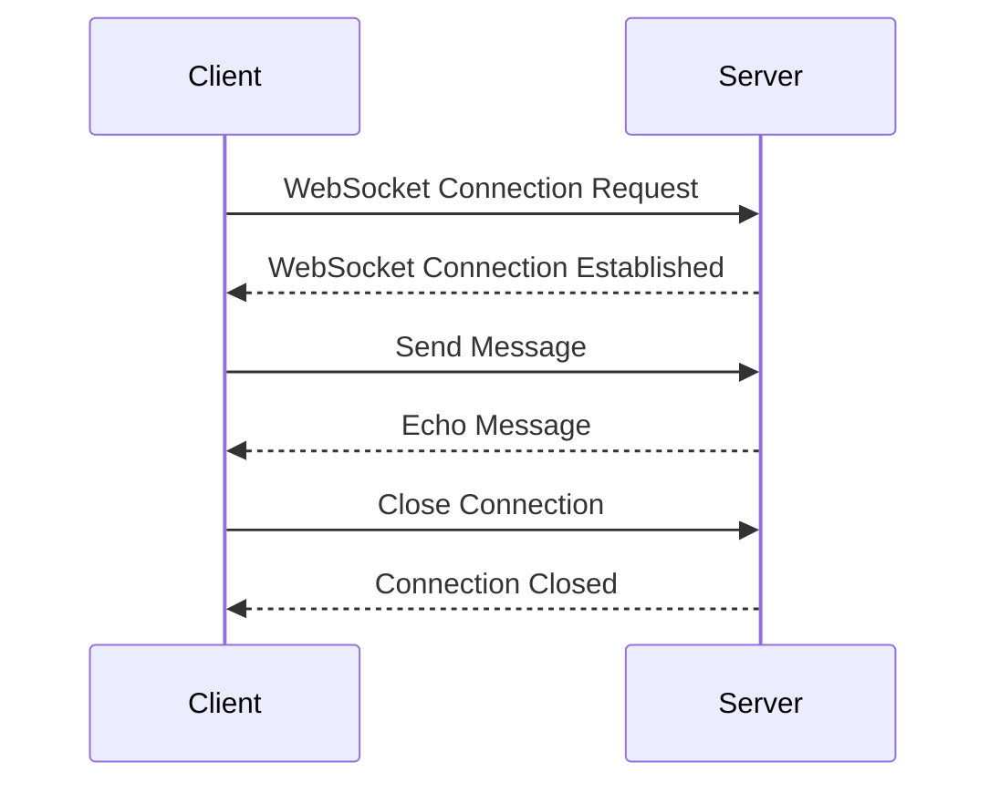

## 11.7 WebSockets and Real-Time Communication

In today's fast-paced digital world, real-time communication is essential for creating interactive and dynamic web applications. WebSockets provide a powerful protocol for enabling two-way interactive communication between a client and a server. In this section, we will explore how to implement WebSockets in Lua, handle real-time data, and discuss practical use cases such as chat applications and live data feeds.

### Introduction to WebSockets

WebSockets are a protocol that allows for full-duplex communication channels over a single TCP connection. Unlike traditional HTTP requests, which are one-way and require a new connection for each request/response cycle, WebSockets maintain a persistent connection, allowing for continuous data exchange between the client and server.

#### Key Features of WebSockets

- **Full-Duplex Communication**: Enables simultaneous two-way communication.
- **Low Latency**: Reduces the overhead of establishing new connections, resulting in faster data transmission.
- **Persistent Connection**: Maintains a single connection for ongoing communication, reducing server load and improving efficiency.

### Implementing WebSockets in Lua

To implement WebSockets in Lua, we need to set up both the server-side and client-side components. Lua's lightweight nature and flexibility make it an excellent choice for handling WebSocket connections.

#### Server-Side Setup

On the server side, we can use Lua with a web server like Nginx or OpenResty, which supports WebSocket connections. Here's a basic example of setting up a WebSocket server using Lua:

```lua
-- Import necessary modules
local websocket = require("resty.websocket.server")

-- Create a WebSocket server
local function handle_websocket()
    local wb, err = websocket:new{
        timeout = 5000,  -- 5 seconds timeout
        max_payload_len = 65535
    }

    if not wb then
        ngx.log(ngx.ERR, "failed to create websocket: ", err)
        return ngx.exit(444)
    end

    while true do
        local data, typ, err = wb:recv_frame()

        if not data then
            ngx.log(ngx.ERR, "failed to receive frame: ", err)
            return ngx.exit(444)
        end

        if typ == "close" then
            break
        elseif typ == "ping" then
            wb:send_pong()
        elseif typ == "pong" then
            -- ignore
        elseif typ == "text" then
            -- Echo the received message back to the client
            wb:send_text(data)
        end
    end

    wb:send_close()
end

-- Call the WebSocket handler
handle_websocket()
```

**Explanation:**

- We use the `resty.websocket.server` module to create a WebSocket server.
- The server listens for incoming WebSocket connections and handles different frame types such as text, ping, and close.
- In this example, the server echoes back any text messages it receives.

#### Client Integration

On the client side, we can use JavaScript to establish a WebSocket connection with the server. Here's a simple example:

```html
<!DOCTYPE html>
<html lang="en">
<head>
    <meta charset="UTF-8">
    <title>WebSocket Client</title>
</head>
<body>
    <h1>WebSocket Client</h1>
    <script>
        // Create a new WebSocket connection
        const socket = new WebSocket('ws://localhost:8080');

        // Event handler for when the connection is opened
        socket.onopen = function(event) {
            console.log('WebSocket connection opened');
            socket.send('Hello, server!');
        };

        // Event handler for when a message is received from the server
        socket.onmessage = function(event) {
            console.log('Message from server: ', event.data);
        };

        // Event handler for when the connection is closed
        socket.onclose = function(event) {
            console.log('WebSocket connection closed');
        };

        // Event handler for when an error occurs
        socket.onerror = function(error) {
            console.error('WebSocket error: ', error);
        };
    </script>
</body>
</html>
```

**Explanation:**

- We create a new WebSocket connection to the server using the `WebSocket` constructor.
- We define event handlers for `onopen`, `onmessage`, `onclose`, and `onerror` to handle different stages of the WebSocket lifecycle.
- The client sends a message to the server once the connection is opened.

### Real-Time Data Handling

WebSockets are ideal for handling real-time data, allowing for instant updates and interactions. Let's explore some common patterns for real-time data handling.

#### Broadcasting Messages

Broadcasting messages to multiple clients is a common requirement in real-time applications. Here's how we can implement broadcasting in Lua:

```lua
local clients = {}

local function broadcast_message(message)
    for _, client in ipairs(clients) do
        client:send_text(message)
    end
end

local function handle_websocket()
    local wb, err = websocket:new{
        timeout = 5000,
        max_payload_len = 65535
    }

    if not wb then
        ngx.log(ngx.ERR, "failed to create websocket: ", err)
        return ngx.exit(444)
    end

    table.insert(clients, wb)

    while true do
        local data, typ, err = wb:recv_frame()

        if not data then
            ngx.log(ngx.ERR, "failed to receive frame: ", err)
            return ngx.exit(444)
        end

        if typ == "close" then
            break
        elseif typ == "text" then
            broadcast_message(data)
        end
    end

    wb:send_close()
end

handle_websocket()
```

**Explanation:**

- We maintain a list of connected clients in the `clients` table.
- The `broadcast_message` function sends a message to all connected clients.
- When a client sends a text message, it is broadcasted to all other clients.

#### Event-Driven Communication

Event-driven communication allows applications to react to real-time events. This pattern is useful for applications like live notifications or collaborative editing.

```lua
local events = {}

local function register_event(event_name, callback)
    events[event_name] = events[event_name] or {}
    table.insert(events[event_name], callback)
end

local function trigger_event(event_name, ...)
    if events[event_name] then
        for _, callback in ipairs(events[event_name]) do
            callback(...)
        end
    end
end

-- Register an event
register_event("message_received", function(message)
    print("New message: ", message)
end)

-- Trigger an event
trigger_event("message_received", "Hello, World!")
```

**Explanation:**

- We use a table `events` to store event callbacks.
- The `register_event` function registers a callback for a specific event.
- The `trigger_event` function triggers all callbacks associated with an event.

### Use Cases and Examples

WebSockets are versatile and can be used in various real-time applications. Let's explore some common use cases.

#### Chat Applications

Chat applications are a classic example of real-time communication. WebSockets enable instant messaging between users. Here's a simple chat server implementation:

```lua
local clients = {}

local function broadcast_message(sender, message)
    for _, client in ipairs(clients) do
        if client ~= sender then
            client:send_text(message)
        end
    end
end

local function handle_websocket()
    local wb, err = websocket:new{
        timeout = 5000,
        max_payload_len = 65535
    }

    if not wb then
        ngx.log(ngx.ERR, "failed to create websocket: ", err)
        return ngx.exit(444)
    end

    table.insert(clients, wb)

    while true do
        local data, typ, err = wb:recv_frame()

        if not data then
            ngx.log(ngx.ERR, "failed to receive frame: ", err)
            return ngx.exit(444)
        end

        if typ == "close" then
            break
        elseif typ == "text" then
            broadcast_message(wb, data)
        end
    end

    wb:send_close()
end

handle_websocket()
```

**Explanation:**

- The server maintains a list of connected clients.
- When a client sends a message, it is broadcasted to all other clients.

#### Live Data Feeds

WebSockets are ideal for live data feeds such as stock tickers, dashboards, and notifications. They allow for real-time updates without the need for constant polling.

```lua
local function send_live_data(client)
    while true do
        local data = get_latest_data()
        client:send_text(data)
        ngx.sleep(1)  -- Send updates every second
    end
end

local function handle_websocket()
    local wb, err = websocket:new{
        timeout = 5000,
        max_payload_len = 65535
    }

    if not wb then
        ngx.log(ngx.ERR, "failed to create websocket: ", err)
        return ngx.exit(444)
    end

    send_live_data(wb)
    wb:send_close()
end

handle_websocket()
```

**Explanation:**

- The `send_live_data` function sends the latest data to the client at regular intervals.
- This pattern is useful for applications that require continuous updates.

### Visualizing WebSocket Communication

To better understand the flow of WebSocket communication, let's visualize the interaction between the client and server using a sequence diagram.



**Diagram Explanation:**

- The client initiates a WebSocket connection request to the server.
- The server establishes the connection and acknowledges it.
- The client sends a message, and the server echoes it back.
- The client closes the connection, and the server acknowledges the closure.

### Try It Yourself

Experiment with the WebSocket examples provided above. Here are some suggestions for modifications:

- **Enhance the Chat Application**: Add features like user authentication, private messaging, or message history.
- **Create a Real-Time Dashboard**: Use WebSockets to display live data from a sensor or API.
- **Implement a Collaborative Editor**: Allow multiple users to edit a document simultaneously with real-time updates.

### References and Links

- [MDN Web Docs: WebSockets](https://developer.mozilla.org/en-US/docs/Web/API/WebSockets_API)
- [OpenResty: WebSocket Support](https://openresty.org/en/websocket.html)
- [Nginx: WebSocket Proxying](https://nginx.org/en/docs/http/websocket.html)

### Knowledge Check

- What are the key features of WebSockets?
- How do you handle WebSocket connections in Lua?
- What are some common use cases for WebSockets?

### Embrace the Journey

Remember, mastering WebSockets and real-time communication is a journey. As you explore these concepts, you'll unlock new possibilities for creating interactive and dynamic web applications. Keep experimenting, stay curious, and enjoy the journey!

## Quiz Time!



### What is the primary advantage of using WebSockets over traditional HTTP requests?

- [x] Full-duplex communication
- [ ] Simplicity of implementation
- [ ] Better security
- [ ] Lower cost

> **Explanation:** WebSockets allow for full-duplex communication, enabling simultaneous two-way data exchange, which is not possible with traditional HTTP requests.

### How does a WebSocket server in Lua typically handle incoming connections?

- [x] By creating a persistent connection and handling different frame types
- [ ] By establishing a new connection for each request
- [ ] By using HTTP polling
- [ ] By sending data only when requested

> **Explanation:** A WebSocket server in Lua maintains a persistent connection and handles different frame types such as text, ping, and close.

### What is a common use case for WebSockets?

- [x] Real-time chat applications
- [ ] Static website hosting
- [ ] Batch processing
- [ ] File storage

> **Explanation:** WebSockets are commonly used for real-time chat applications due to their ability to handle continuous, two-way communication.

### In the provided Lua WebSocket server example, what does the server do when it receives a text message?

- [x] Echoes the message back to the client
- [ ] Closes the connection
- [ ] Ignores the message
- [ ] Sends a ping response

> **Explanation:** The server echoes the received text message back to the client, demonstrating a simple echo server functionality.

### What is the purpose of the `broadcast_message` function in the Lua WebSocket server example?

- [x] To send a message to all connected clients
- [ ] To close all connections
- [ ] To log messages to a file
- [ ] To authenticate clients

> **Explanation:** The `broadcast_message` function sends a message to all connected clients, enabling real-time broadcasting.

### Which of the following is NOT a feature of WebSockets?

- [ ] Full-duplex communication
- [ ] Low latency
- [x] Stateless communication
- [ ] Persistent connection

> **Explanation:** WebSockets provide stateful communication, maintaining a persistent connection, unlike stateless HTTP.

### What is the role of the `onmessage` event handler in the JavaScript WebSocket client example?

- [x] To handle messages received from the server
- [ ] To send messages to the server
- [ ] To close the connection
- [ ] To log errors

> **Explanation:** The `onmessage` event handler processes messages received from the server, allowing the client to react to incoming data.

### What is a key benefit of using WebSockets for live data feeds?

- [x] Real-time updates without constant polling
- [ ] Reduced server load due to statelessness
- [ ] Simplified server-side logic
- [ ] Enhanced security features

> **Explanation:** WebSockets enable real-time updates without the need for constant polling, making them ideal for live data feeds.

### True or False: WebSockets require a new connection for each message sent.

- [ ] True
- [x] False

> **Explanation:** WebSockets maintain a persistent connection, allowing for continuous communication without the need to establish a new connection for each message.

### What is a potential modification you can try with the provided WebSocket examples?

- [x] Implementing user authentication in the chat application
- [ ] Converting WebSockets to HTTP requests
- [ ] Removing the persistent connection feature
- [ ] Disabling real-time updates

> **Explanation:** Implementing user authentication in the chat application is a potential enhancement that can be tried with the provided WebSocket examples.


