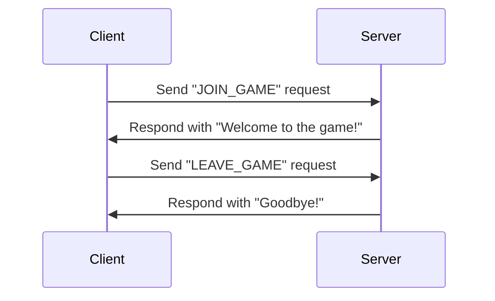

## 11.8 Lua as a Protocol Language

In the realm of software engineering, communication protocols are essential for enabling systems to exchange data efficiently and reliably. Lua, with its lightweight nature and flexibility, is an excellent choice for defining and implementing custom protocols. In this section, we will explore how Lua can be used to create custom protocols, implement protocol handlers for both binary and text-based data formats, and integrate with existing protocols to enhance interoperability. We will also delve into practical use cases such as embedded systems communication and game server protocols.

### Creating Custom Protocols

Creating custom protocols involves defining a set of rules and conventions for data exchange between systems. Lua's simplicity and extensibility make it an ideal language for this task. Let's explore how to use Lua to define and parse communication protocols.

#### Defining Protocols

When defining a protocol, it's crucial to specify the structure of the messages, including headers, payloads, and any necessary metadata. Lua's table data structure is particularly useful for representing these components.

```lua
-- Define a simple protocol message structure
local protocol_message = {
    header = {
        message_type = "REQUEST",
        version = 1.0
    },
    payload = {
        data = "Hello, World!"
    }
}

-- Function to serialize the protocol message into a string
local function serialize_message(message)
    return string.format("Type: %s\nVersion: %.1f\nData: %s",
        message.header.message_type,
        message.header.version,
        message.payload.data)
end

-- Serialize and print the message
local serialized_message = serialize_message(protocol_message)
print(serialized_message)
```

In this example, we define a simple protocol message with a header and a payload. The `serialize_message` function converts the message into a string format suitable for transmission.

#### Parsing Protocols

Parsing involves interpreting received messages and extracting relevant information. Lua's pattern matching capabilities are useful for this purpose.

```lua
-- Function to parse a serialized protocol message
local function parse_message(serialized)
    local message_type, version, data = string.match(serialized, "Type: (%w+)\nVersion: ([%d%.]+)\nData: (.+)")
    return {
        header = {
            message_type = message_type,
            version = tonumber(version)
        },
        payload = {
            data = data
        }
    }
end

-- Parse the serialized message
local parsed_message = parse_message(serialized_message)
print(parsed_message.header.message_type)  -- Output: REQUEST
print(parsed_message.payload.data)         -- Output: Hello, World!
```

Here, we use Lua's `string.match` function to extract the message components from the serialized string.

### Implementing Protocol Handlers

Protocol handlers are responsible for managing the encoding and decoding of messages, as well as handling communication logic. Let's explore how to implement handlers for binary and text-based protocols.

#### Binary Protocols

Binary protocols are efficient for transmitting data in compact formats. Lua provides libraries such as `struct` for handling binary data.

```lua
local struct = require("struct")

-- Define a binary protocol message structure
local function create_binary_message(message_type, version, data)
    return struct.pack(">c1f4s", message_type, version, data)
end

-- Function to decode a binary protocol message
local function decode_binary_message(binary_data)
    local message_type, version, data = struct.unpack(">c1f4s", binary_data)
    return {
        header = {
            message_type = message_type,
            version = version
        },
        payload = {
            data = data
        }
    }
end

-- Create and decode a binary message
local binary_message = create_binary_message("R", 1.0, "Hello")
local decoded_message = decode_binary_message(binary_message)
print(decoded_message.header.message_type)  -- Output: R
print(decoded_message.payload.data)         -- Output: Hello
```

In this example, we use the `struct` library to pack and unpack binary data, allowing for efficient message transmission and reception.

#### Text-Based Protocols

Text-based protocols are human-readable and often used for command languages. Lua's string manipulation functions are well-suited for implementing these protocols.

```lua
-- Define a text-based command protocol
local function execute_command(command)
    if command == "HELLO" then
        return "Hello, User!"
    elseif command == "GOODBYE" then
        return "Goodbye, User!"
    else
        return "Unknown command"
    end
end

-- Execute a command and print the response
local response = execute_command("HELLO")
print(response)  -- Output: Hello, User!
```

Here, we define a simple command protocol with two commands, `HELLO` and `GOODBYE`, and a function to execute them.

### Interoperability

Interoperability is crucial for integrating Lua with existing protocols and bridging communication between different systems.

#### Using Lua with Existing Protocols

Lua can be integrated with existing protocols such as MQTT, SMTP, and more. Libraries like `luamqtt` and `luasocket` facilitate this integration.

```lua
local mqtt = require("luamqtt")

-- Connect to an MQTT broker and publish a message
local client = mqtt.client{ uri = "mqtt://broker.hivemq.com" }
client:connect()
client:publish("test/topic", "Hello, MQTT!")
client:disconnect()
```

In this example, we use the `luamqtt` library to connect to an MQTT broker and publish a message.

#### Bridging Systems

Lua can act as a bridge between different systems, facilitating communication and data exchange.

```lua
-- Function to bridge data between two systems
local function bridge_data(source_data)
    -- Transform and forward data to the target system
    local transformed_data = string.upper(source_data)
    print("Forwarding data:", transformed_data)
end

-- Simulate receiving data from a source system
local source_data = "hello"
bridge_data(source_data)  -- Output: Forwarding data: HELLO
```

Here, we define a simple bridge function that transforms data before forwarding it to a target system.

### Use Cases and Examples

Let's explore some practical use cases for Lua as a protocol language.

#### Embedded Systems Communication

Lua is well-suited for embedded systems, where lightweight and efficient communication protocols are essential.

```lua
-- Define a protocol for an IoT device
local function send_device_command(command)
    -- Simulate sending a command to an IoT device
    print("Sending command to device:", command)
end

-- Send a command to turn on a device
send_device_command("TURN_ON")
```

In this example, we define a simple protocol for sending commands to an IoT device.

#### Game Server Protocols

Lua is commonly used in game development for scripting and managing client-server interactions.

```lua
-- Define a protocol for a game server
local function handle_client_request(request)
    if request == "JOIN_GAME" then
        return "Welcome to the game!"
    elseif request == "LEAVE_GAME" then
        return "Goodbye!"
    else
        return "Invalid request"
    end
end

-- Handle a client request and print the response
local response = handle_client_request("JOIN_GAME")
print(response)  -- Output: Welcome to the game!
```

Here, we define a simple protocol for handling client requests in a game server.

### Try It Yourself

Experiment with the code examples provided in this section. Try modifying the protocol definitions, handlers, and use cases to suit your needs. For instance, you can extend the command protocol to include additional commands or implement a more complex binary protocol with multiple data fields.

### Visualizing Protocol Communication

To better understand how protocols facilitate communication, let's visualize a simple client-server interaction using a sequence diagram.



This diagram illustrates the sequence of messages exchanged between a client and a server using a simple game protocol.

### Knowledge Check

- **What are the key components of a protocol message?**
- **How can Lua's pattern matching be used to parse protocol messages?**
- **What are the advantages of using binary protocols over text-based protocols?**
- **How can Lua be integrated with existing protocols like MQTT?**
- **What are some practical use cases for Lua as a protocol language?**

### Embrace the Journey

Remember, mastering Lua as a protocol language is just the beginning. As you continue to explore and experiment, you'll discover new ways to leverage Lua's capabilities for efficient and reliable communication. Keep learning, stay curious, and enjoy the journey!

## Quiz Time!



### What is a key advantage of using Lua for protocol design?

- [x] Lua's simplicity and extensibility
- [ ] Lua's complex syntax
- [ ] Lua's lack of libraries
- [ ] Lua's large memory footprint

> **Explanation:** Lua's simplicity and extensibility make it an ideal choice for protocol design.

### Which Lua data structure is particularly useful for representing protocol message components?

- [x] Tables
- [ ] Arrays
- [ ] Strings
- [ ] Numbers

> **Explanation:** Lua's table data structure is versatile and can represent complex data structures like protocol messages.

### What function is used in Lua to extract components from a serialized string?

- [x] string.match
- [ ] string.find
- [ ] string.gsub
- [ ] string.format

> **Explanation:** The `string.match` function is used to extract components from a serialized string using pattern matching.

### Which library is used in Lua for handling binary data?

- [x] struct
- [ ] socket
- [ ] json
- [ ] xml

> **Explanation:** The `struct` library is used in Lua for packing and unpacking binary data.

### What is a common use case for text-based protocols?

- [x] Command languages
- [ ] Image processing
- [ ] Video streaming
- [ ] Machine learning

> **Explanation:** Text-based protocols are often used for command languages due to their human-readable nature.

### How can Lua be integrated with the MQTT protocol?

- [x] Using the luamqtt library
- [ ] Using the luajson library
- [ ] Using the luaxml library
- [ ] Using the luagame library

> **Explanation:** The `luamqtt` library facilitates integration with the MQTT protocol in Lua.

### What is a practical use case for Lua as a protocol language in embedded systems?

- [x] IoT device communication
- [ ] Video editing
- [ ] Graphic design
- [ ] Audio processing

> **Explanation:** Lua is well-suited for lightweight communication protocols in embedded systems, such as IoT devices.

### What is the purpose of a protocol handler?

- [x] Managing the encoding and decoding of messages
- [ ] Designing user interfaces
- [ ] Compiling Lua code
- [ ] Debugging applications

> **Explanation:** Protocol handlers manage the encoding and decoding of messages and handle communication logic.

### Which Lua feature is useful for bridging communication between different systems?

- [x] String manipulation functions
- [ ] Complex data types
- [ ] Heavyweight libraries
- [ ] Static typing

> **Explanation:** Lua's string manipulation functions are useful for transforming and forwarding data between systems.

### True or False: Lua is commonly used in game development for scripting and managing client-server interactions.

- [x] True
- [ ] False

> **Explanation:** Lua is widely used in game development for scripting and managing client-server interactions due to its flexibility and ease of use.


