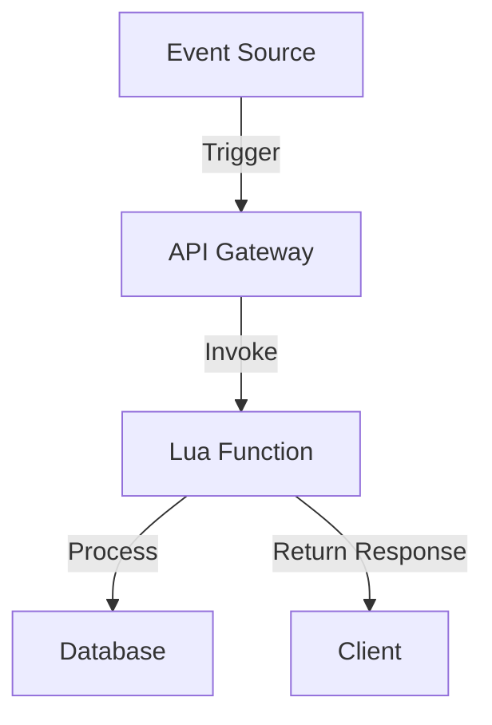

## 11.9 Lua in Serverless Architectures

Serverless computing has revolutionized the way developers build and deploy applications by abstracting away the underlying infrastructure. In this section, we will explore how Lua, a lightweight scripting language, fits into the serverless paradigm. We will cover the implementation of serverless functions with Lua, event-driven execution, and practical use cases.

### Understanding Serverless Computing

Serverless computing allows developers to run code without the need to manage servers. This model provides automatic scaling, built-in high availability, and a pay-per-use billing model. The serverless architecture is ideal for applications with unpredictable workloads, as it can dynamically allocate resources based on demand.

#### Key Characteristics of Serverless Computing

- **No Server Management**: Developers focus solely on writing code, while the cloud provider handles server management.
- **Scalability**: Functions automatically scale with the number of requests.
- **Cost Efficiency**: Users are charged only for the compute time consumed by their functions.
- **Event-Driven**: Functions are triggered by events such as HTTP requests, database changes, or scheduled tasks.

### Implementing Serverless Functions with Lua

Lua's lightweight nature makes it an excellent choice for serverless functions. Its small footprint and fast execution time are well-suited for the ephemeral nature of serverless environments.

#### Platforms Supporting Lua

Several serverless platforms support Lua, either natively or through custom runtimes. Some of these platforms include:

- **AWS Lambda**: While AWS Lambda does not natively support Lua, you can create a custom runtime using AWS Lambda Layers.
- **OpenWhisk**: Apache OpenWhisk supports Lua through its runtime support for various languages.
- **FaaS (Function as a Service)**: Platforms like OpenFaaS allow you to deploy Lua functions using Docker containers.

#### Function Deployment

Deploying Lua functions in a serverless environment involves packaging your code and any dependencies. Here's a step-by-step guide to deploying a Lua function on AWS Lambda using a custom runtime:

1. **Create a Lua Script**: Write your Lua function. For example, a simple function to return a greeting message:

    ```lua
    -- greeting.lua
    local function handler(event)
        return {
            statusCode = 200,
            body = "Hello, " .. (event.name or "World") .. "!"
        }
    end

    return handler
    ```

2. **Package the Function**: Package your Lua script along with any dependencies into a ZIP file.

3. **Create a Custom Runtime**: Use AWS Lambda Layers to create a custom runtime for Lua. This involves creating a bootstrap script that invokes the Lua interpreter.

4. **Deploy the Function**: Use the AWS CLI or AWS Management Console to deploy your function, specifying the custom runtime.

5. **Test the Function**: Trigger the function using an event and verify the output.

### Event-Driven Execution

Serverless functions are inherently event-driven, meaning they are executed in response to specific events or triggers.

#### Triggers and Events

Triggers can be HTTP requests, changes in a database, file uploads, or scheduled events. For example, you can set up a Lua function to process incoming HTTP requests using an API Gateway.

#### Statelessness in Functions

Serverless functions are stateless, meaning they do not retain any state between invocations. This requires developers to design functions that do not rely on server state. Instead, any necessary state should be stored in external services like databases or object storage.

### Use Cases and Examples

Lua's versatility makes it suitable for various serverless use cases. Here are some examples:

#### Backend Logic

Lua can be used to handle backend logic for APIs. For instance, you can create a Lua function to process incoming API requests, perform data validation, and interact with a database.

```lua
-- api_handler.lua
local json = require("json")
local db = require("database")

local function handler(event)
    local data = json.decode(event.body)
    local result = db.query("SELECT * FROM users WHERE id = ?", data.userId)
    
    return {
        statusCode = 200,
        body = json.encode(result)
    }
end

return handler
```

#### Automation Tasks

Serverless functions are ideal for automation tasks such as scheduled operations and maintenance scripts. For example, you can create a Lua function to clean up old data from a database on a daily schedule.

```lua
-- cleanup.lua
local db = require("database")

local function handler(event)
    db.execute("DELETE FROM logs WHERE created_at < DATE_SUB(NOW(), INTERVAL 30 DAY)")
    return {
        statusCode = 200,
        body = "Cleanup completed."
    }
end

return handler
```

### Visualizing Serverless Architecture with Lua

To better understand how Lua fits into a serverless architecture, let's visualize a typical serverless workflow using a Mermaid.js diagram.



**Diagram Description**: This diagram illustrates a serverless architecture where an event source triggers an API Gateway, which invokes a Lua function. The function processes the request, interacts with a database, and returns a response to the client.

### References and Links

- [AWS Lambda Custom Runtimes](https://docs.aws.amazon.com/lambda/latest/dg/runtimes-custom.html)
- [OpenWhisk Lua Runtime](https://github.com/apache/openwhisk-runtime-lua)
- [OpenFaaS](https://www.openfaas.com/)

### Knowledge Check

- Explain the benefits of using Lua in serverless architectures.
- Describe how to deploy a Lua function on AWS Lambda.
- Discuss the importance of statelessness in serverless functions.

### Embrace the Journey

Remember, integrating Lua into serverless architectures is just the beginning. As you progress, you'll discover more complex use cases and optimizations. Keep experimenting, stay curious, and enjoy the journey!

## Quiz Time!



### What is a key characteristic of serverless computing?

- [x] No server management
- [ ] Requires manual scaling
- [ ] Fixed pricing model
- [ ] Statefulness

> **Explanation:** Serverless computing abstracts server management, allowing developers to focus on writing code.

### Which platform supports Lua through custom runtimes?

- [x] AWS Lambda
- [ ] Google Cloud Functions
- [ ] Azure Functions
- [ ] IBM Cloud Functions

> **Explanation:** AWS Lambda supports Lua through custom runtimes using AWS Lambda Layers.

### What is a common trigger for serverless functions?

- [x] HTTP requests
- [ ] Manual invocation
- [ ] Static file changes
- [ ] Direct database access

> **Explanation:** HTTP requests are a common trigger for serverless functions, often handled via API Gateways.

### Why must serverless functions be stateless?

- [x] They do not retain state between invocations
- [ ] They rely on server state
- [ ] They store state in memory
- [ ] They are always stateful

> **Explanation:** Serverless functions are stateless to ensure scalability and reliability, storing state externally if needed.

### What is a use case for Lua in serverless architectures?

- [x] Backend logic for APIs
- [ ] Real-time video processing
- [ ] Desktop application development
- [ ] Embedded systems programming

> **Explanation:** Lua is well-suited for handling backend logic in serverless architectures, such as processing API requests.

### How can Lua functions be deployed on AWS Lambda?

- [x] Using custom runtimes and AWS Lambda Layers
- [ ] Directly uploading Lua scripts
- [ ] Using built-in Lua support
- [ ] Through AWS CloudFormation

> **Explanation:** Lua functions can be deployed on AWS Lambda using custom runtimes and AWS Lambda Layers.

### What is an advantage of using serverless computing?

- [x] Automatic scaling
- [ ] Fixed resource allocation
- [ ] Manual server management
- [ ] High upfront costs

> **Explanation:** Serverless computing automatically scales resources based on demand, providing cost efficiency.

### What is a common use case for serverless functions?

- [x] Automation tasks
- [ ] Desktop application development
- [ ] Real-time video processing
- [ ] Embedded systems programming

> **Explanation:** Serverless functions are ideal for automation tasks, such as scheduled operations and maintenance scripts.

### What is the role of an API Gateway in serverless architectures?

- [x] It triggers serverless functions
- [ ] It stores server state
- [ ] It manages server resources
- [ ] It provides manual scaling

> **Explanation:** An API Gateway triggers serverless functions, often in response to HTTP requests.

### True or False: Serverless functions are inherently stateful.

- [ ] True
- [x] False

> **Explanation:** Serverless functions are inherently stateless, meaning they do not retain state between invocations.




