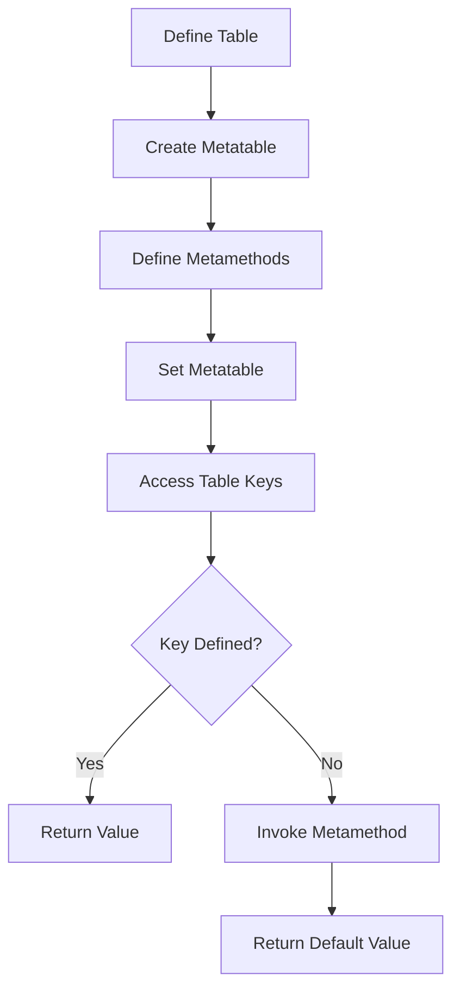

## 12.1 Introduction to Metaprogramming

Metaprogramming is a powerful programming technique that involves writing programs that can read, generate, analyze, or transform other programs. This capability allows developers to create more flexible and adaptable code, reducing redundancy and enhancing the overall efficiency of software development. In this section, we will delve into the world of metaprogramming in Lua, exploring its benefits, key concepts, and practical applications.

### Dynamic Code Manipulation

At its core, metaprogramming is about dynamic code manipulation. This means that the code can change its behavior at runtime, adapting to different conditions and requirements. This dynamic nature is particularly useful in scenarios where the software needs to be highly flexible and responsive to changes.

#### Benefits of Metaprogramming

1. **Flexibility**: Metaprogramming allows for the adaptation of behavior at runtime, enabling programs to modify themselves or other programs as needed. This flexibility is crucial in environments where requirements are constantly evolving.

2. **Code Generation**: By generating code automatically, metaprogramming reduces redundancy and minimizes the risk of errors. This is especially beneficial in large-scale projects where similar code patterns are repeated across different parts of the application.

3. **Enhanced Abstraction**: Metaprogramming enables the creation of higher-level abstractions, allowing developers to focus on the logic and functionality of the application rather than the underlying implementation details.

4. **Improved Maintainability**: By reducing code duplication and increasing abstraction, metaprogramming can lead to more maintainable codebases, making it easier to implement changes and updates.

### Metaprogramming in Lua

Lua is a lightweight, high-level programming language that is particularly well-suited for metaprogramming. Its simple syntax, dynamic typing, and powerful table and function constructs make it an ideal choice for developers looking to leverage metaprogramming techniques.

#### Key Features of Lua for Metaprogramming

- **Tables**: Lua's tables are versatile data structures that can be used to represent arrays, dictionaries, and even objects. This flexibility makes them a cornerstone of metaprogramming in Lua.

- **Metatables and Metamethods**: Lua's metatables and metamethods allow developers to define custom behavior for operations on tables, enabling powerful and flexible metaprogramming capabilities.

- **First-Class Functions**: In Lua, functions are first-class citizens, meaning they can be stored in variables, passed as arguments, and returned from other functions. This feature is essential for creating dynamic and adaptable code.

- **Dynamic Typing**: Lua's dynamic typing system allows for greater flexibility in handling different data types, making it easier to implement metaprogramming techniques.

### Practical Applications of Metaprogramming in Lua

Metaprogramming can be applied in various scenarios to enhance the functionality and flexibility of Lua applications. Some common use cases include:

1. **Domain-Specific Languages (DSLs)**: Metaprogramming can be used to create DSLs, which are specialized languages tailored to specific problem domains. This allows developers to express complex logic in a more intuitive and readable manner.

2. **Code Generation and Transformation**: By generating and transforming code at runtime, developers can automate repetitive tasks and optimize performance.

3. **Dynamic Proxies and Interceptors**: Metaprogramming enables the creation of dynamic proxies and interceptors, which can be used to modify or extend the behavior of existing objects and functions.

4. **Aspect-Oriented Programming (AOP)**: Metaprogramming facilitates AOP, allowing developers to separate cross-cutting concerns such as logging, security, and error handling from the main application logic.

### Code Examples

Let's explore some code examples to illustrate the concepts of metaprogramming in Lua.

#### Example 1: Using Metatables for Dynamic Behavior

```lua
-- Define a table with default values
local defaults = {x = 0, y = 0}

-- Create a metatable with an __index metamethod
local mt = {
    __index = function(table, key)
        return defaults[key]
    end
}

-- Create a new table and set its metatable
local point = {}
setmetatable(point, mt)

-- Accessing undefined keys returns default values
print(point.x) -- Output: 0
print(point.y) -- Output: 0
print(point.z) -- Output: nil (no default value for z)
```

In this example, we use a metatable to provide default values for a table. The `__index` metamethod is used to return default values when accessing undefined keys.

#### Example 2: Creating a Simple DSL

```lua
-- Define a DSL for creating shapes
local ShapeDSL = {}

function ShapeDSL.circle(radius)
    return {type = "circle", radius = radius}
end

function ShapeDSL.square(side)
    return {type = "square", side = side}
end

-- Use the DSL to create shapes
local circle = ShapeDSL.circle(5)
local square = ShapeDSL.square(10)

print(circle.type, circle.radius) -- Output: circle 5
print(square.type, square.side)   -- Output: square 10
```

In this example, we define a simple DSL for creating shapes. The DSL provides a more intuitive and readable way to create shape objects.

#### Example 3: Dynamic Function Generation

```lua
-- Function to create a new function that adds a constant value
function createAdder(value)
    return function(x)
        return x + value
    end
end

-- Create an adder function that adds 10
local add10 = createAdder(10)

-- Use the dynamically generated function
print(add10(5)) -- Output: 15
```

Here, we define a function `createAdder` that generates new functions dynamically. This allows us to create custom functions with specific behavior at runtime.

### Visualizing Metaprogramming Concepts

To better understand the flow of metaprogramming in Lua, let's visualize the process of using metatables and metamethods.



**Diagram Description**: This flowchart illustrates the process of using metatables and metamethods in Lua. When a key is accessed in a table, the metamethod is invoked if the key is not defined, allowing for dynamic behavior.

### References and Links

For further reading on metaprogramming and Lua, consider exploring the following resources:

- [Programming in Lua](https://www.lua.org/pil/contents.html)
- [Lua 5.4 Reference Manual](https://www.lua.org/manual/5.4/)
- [Metatables and Metamethods in Lua](https://www.lua.org/manual/5.4/manual.html#2.4)

### Knowledge Check

To reinforce your understanding of metaprogramming in Lua, consider the following questions and exercises:

1. What are the key benefits of metaprogramming in software development?
2. How do metatables and metamethods enable dynamic behavior in Lua?
3. Create a simple DSL using Lua for a different domain, such as a calculator or a task manager.
4. Experiment with the provided code examples by modifying the metatable behavior or adding new DSL functions.

### Embrace the Journey

Remember, this is just the beginning of your exploration into metaprogramming in Lua. As you continue to experiment and learn, you'll discover new ways to leverage these powerful techniques to create more flexible and efficient software. Keep experimenting, stay curious, and enjoy the journey!

## Quiz Time!



### What is metaprogramming?

- [x] Writing programs that can read, generate, analyze, or transform other programs.
- [ ] Writing programs that only perform mathematical calculations.
- [ ] Writing programs that interact with hardware directly.
- [ ] Writing programs that are only used for web development.

> **Explanation:** Metaprogramming involves writing programs that can manipulate other programs, enhancing flexibility and reducing redundancy.

### Which Lua feature is essential for metaprogramming?

- [x] Metatables and Metamethods
- [ ] Static Typing
- [ ] Fixed Arrays
- [ ] Strong Typing

> **Explanation:** Metatables and metamethods in Lua allow for dynamic behavior and are essential for metaprogramming.

### What is a benefit of metaprogramming?

- [x] Flexibility
- [ ] Increased code size
- [ ] Reduced performance
- [ ] Increased redundancy

> **Explanation:** Metaprogramming provides flexibility by allowing programs to adapt their behavior at runtime.

### How can metaprogramming improve maintainability?

- [x] By reducing code duplication and increasing abstraction.
- [ ] By making code more complex and harder to understand.
- [ ] By increasing the number of lines of code.
- [ ] By using more global variables.

> **Explanation:** Metaprogramming reduces redundancy and increases abstraction, leading to more maintainable code.

### What is a Domain-Specific Language (DSL)?

- [x] A specialized language tailored to a specific problem domain.
- [ ] A general-purpose programming language.
- [ ] A language used only for web development.
- [ ] A language that cannot be used for metaprogramming.

> **Explanation:** A DSL is a specialized language designed for a specific problem domain, often created using metaprogramming techniques.

### How does Lua's dynamic typing benefit metaprogramming?

- [x] It allows for greater flexibility in handling different data types.
- [ ] It enforces strict type checking at compile time.
- [ ] It limits the types of data that can be used.
- [ ] It requires explicit type declarations.

> **Explanation:** Lua's dynamic typing allows for flexible handling of data types, which is beneficial for metaprogramming.

### What is the role of first-class functions in metaprogramming?

- [x] They can be stored in variables, passed as arguments, and returned from other functions.
- [ ] They can only be used for mathematical operations.
- [ ] They are limited to a single use case.
- [ ] They cannot be used in metaprogramming.

> **Explanation:** First-class functions in Lua can be manipulated like any other data type, making them essential for metaprogramming.

### What does the `__index` metamethod do in Lua?

- [x] It provides default values for undefined keys in a table.
- [ ] It prevents access to all keys in a table.
- [ ] It deletes keys from a table.
- [ ] It sorts the keys in a table.

> **Explanation:** The `__index` metamethod is used to provide default values for undefined keys in a table.

### What is a dynamic proxy in metaprogramming?

- [x] An object that modifies or extends the behavior of existing objects and functions.
- [ ] A static object that cannot change behavior.
- [ ] A proxy that only works with network connections.
- [ ] A proxy that does not interact with other objects.

> **Explanation:** A dynamic proxy is used to modify or extend the behavior of existing objects and functions in metaprogramming.

### True or False: Metaprogramming can be used to create Aspect-Oriented Programming (AOP) solutions.

- [x] True
- [ ] False

> **Explanation:** Metaprogramming can facilitate AOP by allowing developers to separate cross-cutting concerns from the main application logic.


