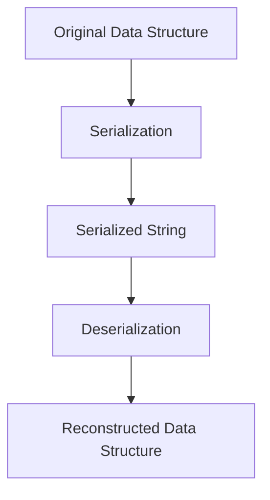

## 12.10 Serialization and Deserialization Patterns

Serialization and deserialization are crucial processes in software development, enabling the conversion of complex data structures into a format that can be easily stored or transmitted and then reconstructed back into its original form. In Lua, these patterns are particularly useful for saving game states, transferring data over networks, and persisting configurations. Let's delve into the intricacies of these patterns and explore how to implement them effectively in Lua.

### Converting Data Structures to Strings

Serialization is the process of converting a data structure into a string format, allowing it to be saved to a file or sent over a network. Deserialization is the reverse process, reconstructing the data structure from the serialized string. These processes are essential for data persistence and communication between different systems or components.

#### Implementing Serialization

Serialization in Lua can be implemented using custom functions or by leveraging standard formats like JSON or XML. Each approach has its advantages and trade-offs, which we will explore in detail.

##### Custom Serialization Functions

Custom serialization functions provide flexibility and control over how data is serialized. This approach is particularly useful when dealing with complex data structures or when specific serialization requirements exist.

```lua
-- Custom serialization function for Lua tables
function serializeTable(tbl, indent)
    indent = indent or ""
    local result = "{\n"
    for k, v in pairs(tbl) do
        local key = type(k) == "string" and string.format("%q", k) or k
        local value
        if type(v) == "table" then
            value = serializeTable(v, indent .. "  ")
        else
            value = type(v) == "string" and string.format("%q", v) or tostring(v)
        end
        result = result .. indent .. "  [" .. key .. "] = " .. value .. ",\n"
    end
    return result .. indent .. "}"
end

-- Example usage
local data = {
    name = "Lua",
    version = 5.4,
    features = {"lightweight", "embeddable", "fast"},
    config = {debug = true, optimize = false}
}

print(serializeTable(data))
```

In this example, we define a `serializeTable` function that recursively serializes a Lua table into a string representation. The function handles nested tables and supports different data types, ensuring a comprehensive serialization process.

##### Standard Formats

Using standard formats like JSON or XML for serialization provides interoperability and ease of use, especially when interacting with other systems or languages. Lua has libraries such as `dkjson` and `luasocket` that facilitate JSON and XML serialization.

###### JSON Serialization

JSON (JavaScript Object Notation) is a lightweight data interchange format that is easy to read and write. It is widely used for data serialization due to its simplicity and compatibility with various programming languages.

```lua
local json = require("dkjson")

-- Serialize a Lua table to JSON
local jsonData = json.encode(data, {indent = true})
print(jsonData)

-- Deserialize JSON back to a Lua table
local decodedData, pos, err = json.decode(jsonData, 1, nil)
if err then
    print("Error:", err)
else
    print(decodedData.name)  -- Output: Lua
end
```

In this example, we use the `dkjson` library to serialize a Lua table into a JSON string and then deserialize it back into a Lua table. The `encode` function converts the table to JSON, while the `decode` function parses the JSON string back into a table.

###### XML Serialization

XML (Extensible Markup Language) is another popular format for data serialization. It is more verbose than JSON but offers greater flexibility in representing complex data structures.

```lua
local xml = require("xml")

-- Serialize a Lua table to XML
local xmlData = xml.dump(data)
print(xmlData)

-- Deserialize XML back to a Lua table
local parsedData = xml.load(xmlData)
print(parsedData.name)  -- Output: Lua
```

Using the `xml` library, we can serialize a Lua table into an XML string and deserialize it back. The `dump` function converts the table to XML, while the `load` function parses the XML string back into a table.

### Deserialization

Deserialization is the process of reconstructing data from its serialized form. This involves parsing the serialized string and converting it back into the original data structure.

#### Reconstructing Data

Reconstructing data from a serialized format requires careful handling of data types and structures. Lua's dynamic typing and flexible table structure make it well-suited for deserialization tasks.

```lua
-- Deserialize a custom serialized string back to a Lua table
function deserializeTable(serializedStr)
    local func = load("return " .. serializedStr)
    if func then
        return func()
    else
        error("Failed to deserialize string")
    end
end

-- Example usage
local serializedStr = serializeTable(data)
local deserializedData = deserializeTable(serializedStr)
print(deserializedData.name)  -- Output: Lua
```

In this example, we define a `deserializeTable` function that uses Lua's `load` function to execute the serialized string and reconstruct the original table. This approach leverages Lua's ability to execute code dynamically, making deserialization straightforward.

#### Handling Complex Structures

When dealing with complex data structures, such as those with references or cycles, additional considerations are necessary to ensure accurate deserialization.

```lua
-- Handling references and cycles in serialization
local function serializeWithCycles(tbl, seen)
    seen = seen or {}
    if seen[tbl] then
        return "nil"  -- Handle cycles by returning nil or a reference
    end
    seen[tbl] = true
    local result = "{\n"
    for k, v in pairs(tbl) do
        local key = type(k) == "string" and string.format("%q", k) or k
        local value
        if type(v) == "table" then
            value = serializeWithCycles(v, seen)
        else
            value = type(v) == "string" and string.format("%q", v) or tostring(v)
        end
        result = result .. "  [" .. key .. "] = " .. value .. ",\n"
    end
    return result .. "}"
end

-- Example usage with a cyclic table
local cyclicData = {}
cyclicData.self = cyclicData

local serializedCyclic = serializeWithCycles(cyclicData)
print(serializedCyclic)  -- Output: { ["self"] = nil, }
```

In this example, we modify the serialization function to handle cycles by keeping track of seen tables. This prevents infinite loops and ensures that cyclic references are managed appropriately.

### Use Cases and Examples

Serialization and deserialization are widely used in various applications, from saving game states to transferring data over networks. Let's explore some common use cases and examples.

#### Saving Game State

In game development, serialization is essential for saving player progress and game state. By serializing the game state into a file, players can resume their progress later.

```lua
-- Serialize game state to a file
local gameState = {
    level = 5,
    score = 1200,
    inventory = {"sword", "shield", "potion"}
}

local file = io.open("game_state.txt", "w")
file:write(serializeTable(gameState))
file:close()

-- Deserialize game state from a file
local file = io.open("game_state.txt", "r")
local serializedState = file:read("*a")
file:close()

local loadedState = deserializeTable(serializedState)
print(loadedState.level)  -- Output: 5
```

In this example, we serialize the game state to a file and later deserialize it to restore the player's progress. This approach ensures that game data is persistent across sessions.

#### Data Transfer

Serialization is also crucial for data transfer between systems or over networks. By converting data into a serialized format, it can be easily transmitted and reconstructed on the receiving end.

```lua
-- Serialize data for network transfer
local networkData = {
    message = "Hello, World!",
    timestamp = os.time()
}

local serializedNetworkData = json.encode(networkData)

-- Simulate sending data over a network
local receivedData = serializedNetworkData

-- Deserialize received data
local deserializedNetworkData = json.decode(receivedData)
print(deserializedNetworkData.message)  -- Output: Hello, World!
```

In this example, we serialize data into JSON for network transfer and deserialize it upon receipt. This pattern is common in client-server architectures and distributed systems.

### Try It Yourself

Experiment with the provided code examples by modifying the data structures or serialization formats. Try serializing different types of data, such as nested tables or tables with mixed data types, and observe how the serialization and deserialization processes handle them.

### Visualizing Serialization and Deserialization

To better understand the serialization and deserialization processes, let's visualize the flow of data conversion and reconstruction.



This flowchart illustrates the transformation of an original data structure into a serialized string and its subsequent reconstruction through deserialization. Understanding this flow is key to mastering serialization and deserialization patterns.

### References and Links

- [Lua Users Wiki: Serialization](http://lua-users.org/wiki/Serialization)
- [JSON for Lua](https://github.com/harningt/luajson)
- [XML for Lua](https://github.com/lubyk/xml)

### Knowledge Check

- What are the key differences between JSON and XML serialization?
- How can cyclic references be handled during serialization?
- What are some common use cases for serialization in software development?

### Embrace the Journey

Serialization and deserialization are powerful tools in a developer's toolkit, enabling data persistence and communication across systems. As you explore these patterns, remember that practice and experimentation are key to mastering them. Keep experimenting, stay curious, and enjoy the journey!

## Quiz Time!



### What is serialization in Lua?

- [x] Converting a data structure into a string format for storage or transmission
- [ ] Converting a string into a data structure
- [ ] Executing a Lua script
- [ ] Compiling Lua code

> **Explanation:** Serialization is the process of converting a data structure into a string format, allowing it to be stored or transmitted.

### Which Lua library is commonly used for JSON serialization?

- [x] dkjson
- [ ] luasocket
- [ ] xml
- [ ] lpeg

> **Explanation:** The `dkjson` library is commonly used for JSON serialization in Lua.

### What is the purpose of deserialization?

- [x] Reconstructing a data structure from its serialized form
- [ ] Converting a data structure into a string
- [ ] Executing a Lua script
- [ ] Compiling Lua code

> **Explanation:** Deserialization is the process of reconstructing a data structure from its serialized form.

### How can cyclic references be handled during serialization?

- [x] By keeping track of seen tables and returning nil for cycles
- [ ] By ignoring them
- [ ] By converting them to strings
- [ ] By using a different serialization format

> **Explanation:** Cyclic references can be handled by keeping track of seen tables and returning nil for cycles to prevent infinite loops.

### What is a common use case for serialization in game development?

- [x] Saving game state
- [ ] Rendering graphics
- [ ] Handling user input
- [ ] Networking

> **Explanation:** Serialization is commonly used in game development for saving game state and player progress.

### Which format is more verbose, JSON or XML?

- [ ] JSON
- [x] XML
- [ ] Both are equally verbose
- [ ] Neither is verbose

> **Explanation:** XML is more verbose than JSON, offering greater flexibility in representing complex data structures.

### What function is used to execute serialized Lua code?

- [x] load
- [ ] require
- [ ] print
- [ ] tostring

> **Explanation:** The `load` function is used to execute serialized Lua code and reconstruct the original data structure.

### What is a benefit of using standard formats like JSON for serialization?

- [x] Interoperability with other systems and languages
- [ ] Faster execution
- [ ] Smaller file size
- [ ] Easier to read for humans

> **Explanation:** Using standard formats like JSON provides interoperability with other systems and languages.

### What is the primary goal of serialization?

- [x] To enable data persistence and communication
- [ ] To execute Lua scripts
- [ ] To compile Lua code
- [ ] To render graphics

> **Explanation:** The primary goal of serialization is to enable data persistence and communication across systems.

### True or False: Deserialization can only be performed on JSON data.

- [ ] True
- [x] False

> **Explanation:** Deserialization can be performed on various serialized formats, not just JSON.


