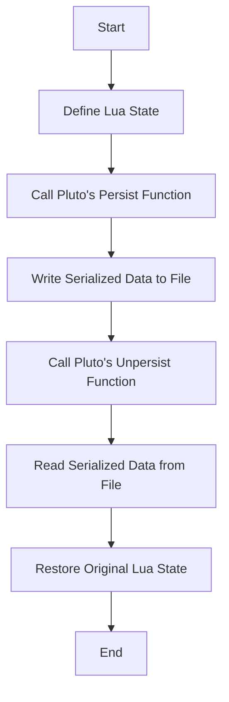

## 12.11 Serialization with Pluto

Serialization is a crucial aspect of software development, allowing data to be converted into a format that can be easily stored and retrieved. In Lua, the Pluto library offers powerful capabilities for serializing entire Lua states, including functions and closures. This section will guide you through the process of using Pluto for serialization, exploring its capabilities, implementation, and practical use cases.

### Using Pluto Library: A Lua Library for Serializing Entire Lua States

Pluto is a robust library designed to serialize and deserialize Lua states. It stands out for its ability to handle complex data structures, including functions and closures, which are typically challenging to serialize. Let's delve into the capabilities of Pluto and how it can be integrated into your Lua projects.

#### Capabilities of Pluto

Pluto offers several advanced features that make it an invaluable tool for Lua developers:

- **Function Serialization**: Pluto can serialize and deserialize functions, preserving their behavior and state. This includes closures, which are functions that capture variables from their surrounding environment.

- **Handling Upvalues**: Upvalues are variables that are used by a closure but are defined outside of it. Pluto manages these upvalues effectively, ensuring that the closure's environment is accurately restored during deserialization.

- **Complex Data Structures**: Pluto can handle complex data structures, including tables with metatables, ensuring that all aspects of the Lua state are preserved.

#### Implementing with Pluto

To leverage Pluto's capabilities, you need to integrate it into your Lua project. This involves installation, setup, and understanding the serialization process.

##### Installation and Setup

Integrating Pluto into your Lua project is straightforward. Follow these steps to get started:

1. **Download Pluto**: Obtain the Pluto library from a reliable source, such as its [GitHub repository](https://github.com/hoelzro/pluto).

2. **Install Pluto**: Place the Pluto library files in your Lua project's directory. Ensure that your Lua environment can access these files.

3. **Require Pluto**: In your Lua script, require the Pluto library to access its functions:

   ```lua
   local pluto = require("pluto")
   ```

##### Serialization Process

The serialization process with Pluto involves converting Lua data structures into a serialized format and then deserializing them back into their original form. Here's how you can achieve this:

1. **Serialize Data**: Use Pluto's `persist` function to serialize Lua data structures. This function takes a Lua state and converts it into a binary format.

   ```lua
   local file = io.open("state.dat", "wb")
   pluto.persist(file, myData)
   file:close()
   ```

   In this example, `myData` is the Lua state you want to serialize, and `state.dat` is the file where the serialized data will be stored.

2. **Deserialize Data**: Use Pluto's `unpersist` function to deserialize the data back into its original form.

   ```lua
   local file = io.open("state.dat", "rb")
   local restoredData = pluto.unpersist(file)
   file:close()
   ```

   The `restoredData` variable now contains the original Lua state, fully restored.

### Use Cases and Examples

Pluto's serialization capabilities open up a range of possibilities for Lua developers. Here are some practical use cases and examples:

#### Complex State Persistence

One of the primary use cases for Pluto is saving entire program states. This is particularly useful in applications where you need to preserve the state across sessions.

**Example**: Saving Game State

Consider a game where you want to save the player's progress, including their inventory, position, and game settings. Pluto can serialize the entire game state, allowing you to restore it later.

```lua
-- Define the game state
local gameState = {
    player = {
        name = "Hero",
        position = {x = 100, y = 200},
        inventory = {"sword", "shield", "potion"}
    },
    settings = {
        volume = 0.8,
        difficulty = "hard"
    }
}

-- Serialize the game state
local file = io.open("gameState.dat", "wb")
pluto.persist(file, gameState)
file:close()

-- Deserialize the game state
local file = io.open("gameState.dat", "rb")
local restoredGameState = pluto.unpersist(file)
file:close()

print(restoredGameState.player.name) -- Output: Hero
```

#### Checkpointing

Checkpointing involves creating restore points during execution, allowing you to revert to a previous state if needed. This is useful in long-running processes or simulations.

**Example**: Checkpointing in a Simulation

Imagine a simulation that runs for several hours. You can use Pluto to create checkpoints, saving the state at regular intervals.

```lua
-- Define the simulation state
local simulationState = {
    time = 0,
    entities = {
        {id = 1, position = {x = 10, y = 20}},
        {id = 2, position = {x = 30, y = 40}}
    }
}

-- Function to create a checkpoint
local function createCheckpoint(state, filename)
    local file = io.open(filename, "wb")
    pluto.persist(file, state)
    file:close()
end

-- Function to restore a checkpoint
local function restoreCheckpoint(filename)
    local file = io.open(filename, "rb")
    local state = pluto.unpersist(file)
    file:close()
    return state
end

-- Create a checkpoint
createCheckpoint(simulationState, "checkpoint.dat")

-- Restore the checkpoint
local restoredState = restoreCheckpoint("checkpoint.dat")
print(restoredState.time) -- Output: 0
```

### Try It Yourself

Experiment with Pluto by modifying the examples above. Try serializing different types of data, such as functions with closures, and observe how Pluto handles them. You can also create more complex data structures and test Pluto's ability to serialize and deserialize them accurately.

### Visualizing Pluto's Serialization Process

To better understand how Pluto handles serialization, let's visualize the process using a flowchart.



**Figure 1**: The flowchart illustrates the serialization and deserialization process using Pluto.

### References and Links

For further reading on Lua serialization and the Pluto library, consider the following resources:

- [Pluto GitHub Repository](https://github.com/hoelzro/pluto)
- [Lua Users Wiki on Serialization](http://lua-users.org/wiki/Serialization)
- [MDN Web Docs on Serialization](https://developer.mozilla.org/en-US/docs/Web/Guide/API/DOM/The_structured_clone_algorithm)

### Knowledge Check

To reinforce your understanding of Pluto and serialization in Lua, consider the following questions:

- What are the primary capabilities of the Pluto library?
- How does Pluto handle function serialization and upvalues?
- What are some practical use cases for serialization with Pluto?

### Embrace the Journey

Remember, mastering serialization with Pluto is just one step in your Lua programming journey. As you continue to explore Lua's capabilities, you'll discover new ways to leverage serialization for more complex and efficient applications. Keep experimenting, stay curious, and enjoy the journey!

## Quiz Time!



### What is the primary purpose of the Pluto library in Lua?

- [x] To serialize and deserialize entire Lua states, including functions and closures.
- [ ] To provide a graphical user interface for Lua applications.
- [ ] To enhance Lua's mathematical capabilities.
- [ ] To manage memory allocation in Lua.

> **Explanation:** Pluto is designed to serialize and deserialize entire Lua states, including functions and closures, making it a powerful tool for state persistence.

### How does Pluto handle upvalues in Lua?

- [x] By managing closure environments to ensure accurate restoration during deserialization.
- [ ] By ignoring them during serialization.
- [ ] By converting them into global variables.
- [ ] By storing them in a separate file.

> **Explanation:** Pluto manages closure environments, ensuring that upvalues are accurately restored during deserialization.

### What is a practical use case for Pluto's serialization capabilities?

- [x] Saving entire program states for later restoration.
- [ ] Creating graphical user interfaces.
- [ ] Enhancing Lua's networking capabilities.
- [ ] Managing Lua's garbage collection.

> **Explanation:** Pluto's serialization capabilities are ideal for saving entire program states, allowing for later restoration.

### Which function is used to serialize data with Pluto?

- [x] `persist`
- [ ] `serialize`
- [ ] `save`
- [ ] `store`

> **Explanation:** The `persist` function is used to serialize data with Pluto.

### What is the purpose of checkpointing in a simulation?

- [x] To create restore points during execution.
- [ ] To enhance the graphical output of the simulation.
- [ ] To increase the speed of the simulation.
- [ ] To reduce memory usage.

> **Explanation:** Checkpointing involves creating restore points during execution, allowing you to revert to a previous state if needed.

### How can you integrate Pluto into a Lua project?

- [x] By downloading the Pluto library and requiring it in your Lua script.
- [ ] By installing it through Lua's package manager.
- [ ] By writing custom serialization functions.
- [ ] By modifying Lua's core libraries.

> **Explanation:** Integrating Pluto involves downloading the library and requiring it in your Lua script.

### What type of data structures can Pluto handle?

- [x] Complex data structures, including tables with metatables.
- [ ] Only simple data types like numbers and strings.
- [ ] Only global variables.
- [ ] Only functions without closures.

> **Explanation:** Pluto can handle complex data structures, including tables with metatables.

### What is the output format of Pluto's serialization process?

- [x] Binary format
- [ ] JSON format
- [ ] XML format
- [ ] Plain text format

> **Explanation:** Pluto's serialization process outputs data in a binary format.

### Can Pluto serialize functions with closures?

- [x] True
- [ ] False

> **Explanation:** Pluto can serialize functions with closures, preserving their behavior and state.

### What is the first step in the serialization process with Pluto?

- [x] Define the Lua state to be serialized.
- [ ] Open the file for writing.
- [ ] Call the `unpersist` function.
- [ ] Write the serialized data to a file.

> **Explanation:** The first step in the serialization process is to define the Lua state to be serialized.


