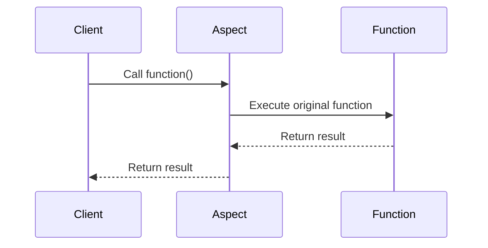

## 12.12 Aspect-Oriented Programming Techniques

Aspect-Oriented Programming (AOP) is a programming paradigm that aims to increase modularity by allowing the separation of cross-cutting concerns. In traditional programming, certain functionalities like logging, error handling, or security checks tend to spread across multiple modules, making the code harder to maintain and evolve. AOP addresses this issue by enabling developers to define these concerns separately from the main business logic.

### Separating Cross-Cutting Concerns

Cross-cutting concerns are aspects of a program that affect multiple components, such as logging, security, or transaction management. By isolating these concerns, AOP helps in maintaining cleaner and more modular code. In Lua, we can achieve AOP by leveraging its powerful metaprogramming capabilities.

#### Implementing AOP in Lua

In Lua, AOP can be implemented using metatables, wrappers, and proxies. These techniques allow us to intercept function calls and property accesses, enabling us to inject additional behavior without modifying the original code.

##### Using Metatables

Metatables in Lua provide a way to change the behavior of tables. By defining metamethods, we can intercept operations on tables, such as indexing, arithmetic operations, or function calls. This feature can be used to implement AOP by intercepting and modifying the behavior of functions or properties.

```lua
-- Define a metatable with a __call metamethod
local aspectMetatable = {
    __call = function(func, ...)
        print("Before function call")
        local result = func(...)
        print("After function call")
        return result
    end
}

-- Original function
local function greet(name)
    print("Hello, " .. name)
end

-- Set the metatable for the function
setmetatable(greet, aspectMetatable)

-- Call the function
greet("World")
```

In this example, the `greet` function is wrapped with a metatable that intercepts calls to the function, allowing us to execute code before and after the function call.

##### Wrappers and Proxies

Wrappers and proxies are another way to implement AOP in Lua. A wrapper function can be used to add additional behavior to an existing function, while a proxy can intercept property accesses and modifications.

###### Wrappers

A wrapper function takes an existing function and returns a new function that adds additional behavior.

```lua
-- Define a wrapper function
local function logWrapper(func)
    return function(...)
        print("Function called with arguments:", ...)
        local result = func(...)
        print("Function returned:", result)
        return result
    end
end

-- Original function
local function add(a, b)
    return a + b
end

-- Wrap the function
local wrappedAdd = logWrapper(add)

-- Call the wrapped function
wrappedAdd(3, 4)
```

In this example, the `logWrapper` function adds logging behavior to the `add` function, printing the arguments and return value.

###### Proxies

A proxy can be used to intercept property accesses and modifications. In Lua, this can be achieved using metatables.

```lua
-- Define a proxy metatable
local proxyMetatable = {
    __index = function(table, key)
        print("Accessing property:", key)
        return rawget(table, key)
    end,
    __newindex = function(table, key, value)
        print("Setting property:", key, "to", value)
        rawset(table, key, value)
    end
}

-- Original table
local person = { name = "Alice", age = 30 }

-- Set the proxy metatable
setmetatable(person, proxyMetatable)

-- Access and modify properties
print(person.name)
person.age = 31
```

In this example, the proxy intercepts accesses and modifications to the `person` table, allowing us to log these operations.

### Use Cases and Examples

AOP can be applied to various use cases, such as logging, validation, security, and more. Let's explore some common scenarios where AOP can be beneficial.

#### Logging and Tracing

Logging is a common cross-cutting concern that can be effectively managed using AOP. By intercepting function calls, we can log execution details without cluttering the main logic.

```lua
-- Define a logging aspect
local function loggingAspect(func)
    return function(...)
        print("Entering function:", debug.getinfo(func).name)
        local result = func(...)
        print("Exiting function:", debug.getinfo(func).name)
        return result
    end
end

-- Original function
local function multiply(x, y)
    return x * y
end

-- Apply the logging aspect
local loggedMultiply = loggingAspect(multiply)

-- Call the function
loggedMultiply(5, 6)
```

In this example, the `loggingAspect` function logs the entry and exit of the `multiply` function, providing valuable tracing information.

#### Validation

Validation is another area where AOP can be useful. By intercepting function calls, we can enforce constraints and ensure data integrity across multiple modules.

```lua
-- Define a validation aspect
local function validationAspect(func, validator)
    return function(...)
        local args = {...}
        for i, arg in ipairs(args) do
            assert(validator(arg), "Invalid argument: " .. tostring(arg))
        end
        return func(...)
    end
end

-- Validator function
local function isNumber(value)
    return type(value) == "number"
end

-- Original function
local function divide(a, b)
    return a / b
end

-- Apply the validation aspect
local validatedDivide = validationAspect(divide, isNumber)

-- Call the function
validatedDivide(10, 2)
```

In this example, the `validationAspect` function ensures that all arguments passed to the `divide` function are numbers, preventing runtime errors.

### Visualizing Aspect-Oriented Programming in Lua

To better understand how AOP works in Lua, let's visualize the process using a sequence diagram. This diagram illustrates the flow of a function call with an aspect applied.



In this sequence diagram, the client calls a function, which is intercepted by an aspect. The aspect executes the original function and returns the result to the client, allowing for additional behavior to be injected.

### Design Considerations

When implementing AOP in Lua, consider the following design considerations:

- **Performance Overhead**: Intercepting function calls and property accesses can introduce performance overhead. Use AOP judiciously and profile your code to ensure acceptable performance.
- **Complexity**: While AOP can simplify the main logic by separating cross-cutting concerns, it can also introduce complexity. Ensure that aspects are well-documented and easy to understand.
- **Debugging**: Debugging code with AOP can be challenging, as the flow of execution is not always straightforward. Use logging and tracing to aid in debugging.

### Differences and Similarities

AOP is often compared to other programming paradigms, such as object-oriented programming (OOP) and functional programming. While OOP focuses on encapsulating data and behavior within objects, AOP focuses on separating cross-cutting concerns. Functional programming, on the other hand, emphasizes immutability and pure functions. AOP can complement these paradigms by providing a way to manage concerns that cut across multiple modules.

### Try It Yourself

Experiment with the code examples provided in this section. Try modifying the logging and validation aspects to suit your needs. For example, you can add additional logging information, such as timestamps or execution times, or create more complex validation rules.

### References and Links

For further reading on Aspect-Oriented Programming and Lua, consider the following resources:

- [Aspect-Oriented Programming on Wikipedia](https://en.wikipedia.org/wiki/Aspect-oriented_programming)
- [Lua Metatables and Metamethods](https://www.lua.org/manual/5.4/manual.html#2.4)
- [Lua Programming Guide](https://www.lua.org/pil/)

### Knowledge Check

- What are cross-cutting concerns, and why are they important in software development?
- How can metatables be used to implement AOP in Lua?
- What are the benefits and drawbacks of using wrappers and proxies for AOP?
- How can AOP be applied to logging and validation in Lua?

### Embrace the Journey

Remember, mastering AOP in Lua is just the beginning. As you continue to explore and experiment with these techniques, you'll discover new ways to enhance your software architecture. Keep learning, stay curious, and enjoy the journey!

## Quiz Time!



### What is the main goal of Aspect-Oriented Programming (AOP)?

- [x] To separate cross-cutting concerns from the main business logic
- [ ] To improve the performance of the application
- [ ] To replace object-oriented programming
- [ ] To simplify the user interface

> **Explanation:** AOP aims to separate cross-cutting concerns, such as logging and security, from the main business logic to improve modularity.

### How can metatables be used in Lua for AOP?

- [x] By intercepting function calls and property accesses
- [ ] By creating new data types
- [ ] By optimizing memory usage
- [ ] By simplifying syntax

> **Explanation:** Metatables allow us to intercept operations on tables, such as function calls and property accesses, enabling AOP in Lua.

### What is a wrapper function in the context of AOP?

- [x] A function that adds additional behavior to an existing function
- [ ] A function that replaces an existing function
- [ ] A function that optimizes an existing function
- [ ] A function that simplifies an existing function

> **Explanation:** A wrapper function takes an existing function and returns a new function that adds additional behavior, such as logging or validation.

### What is a proxy in Lua?

- [x] A mechanism to intercept property accesses and modifications
- [ ] A tool for optimizing code
- [ ] A method for simplifying syntax
- [ ] A way to create new data types

> **Explanation:** A proxy in Lua can intercept property accesses and modifications, allowing for additional behavior to be injected.

### Which of the following is a common use case for AOP?

- [x] Logging and tracing
- [x] Validation
- [ ] Memory optimization
- [ ] Syntax simplification

> **Explanation:** AOP is commonly used for logging, tracing, and validation, as these are cross-cutting concerns that affect multiple parts of a program.

### What is a potential drawback of using AOP?

- [x] Performance overhead
- [ ] Improved modularity
- [ ] Simplified debugging
- [ ] Enhanced readability

> **Explanation:** AOP can introduce performance overhead due to the interception of function calls and property accesses.

### How can logging be implemented using AOP in Lua?

- [x] By intercepting function calls and adding logging behavior
- [ ] By creating new data types
- [ ] By optimizing memory usage
- [ ] By simplifying syntax

> **Explanation:** Logging can be implemented using AOP by intercepting function calls and adding logging behavior before and after the function execution.

### What is the role of a validator function in AOP?

- [x] To enforce constraints and ensure data integrity
- [ ] To optimize code execution
- [ ] To simplify syntax
- [ ] To create new data types

> **Explanation:** A validator function in AOP is used to enforce constraints and ensure data integrity across multiple modules.

### What is the benefit of using AOP for validation?

- [x] It ensures data integrity across multiple modules
- [ ] It improves code readability
- [ ] It simplifies syntax
- [ ] It optimizes memory usage

> **Explanation:** AOP for validation ensures data integrity across multiple modules by enforcing constraints on function arguments.

### True or False: AOP can complement object-oriented programming by managing cross-cutting concerns.

- [x] True
- [ ] False

> **Explanation:** AOP can complement object-oriented programming by providing a way to manage cross-cutting concerns, such as logging and security, separately from the main business logic.


