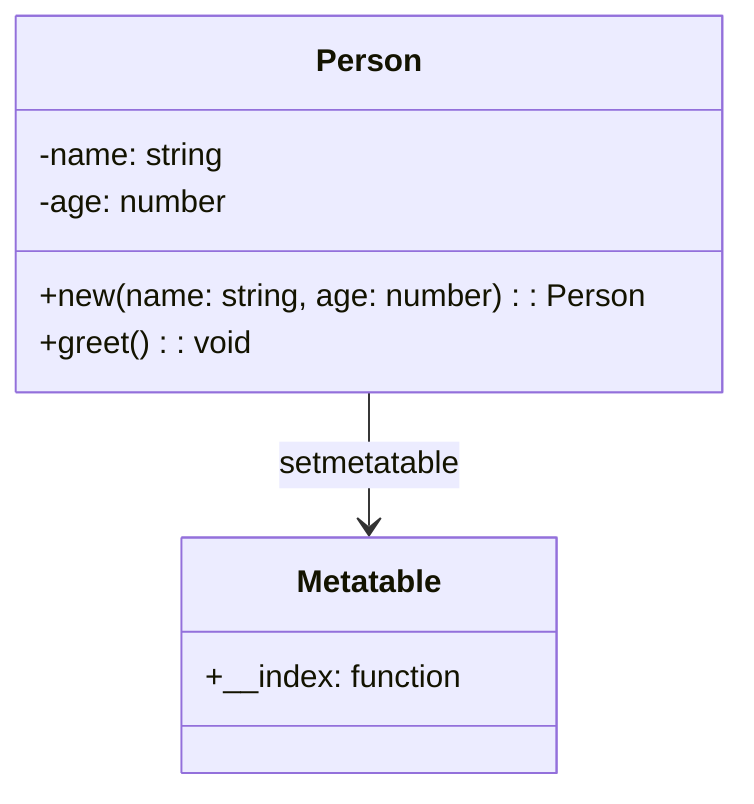

## 12.13 Best Practices and Pitfalls in Metaprogramming

Metaprogramming in Lua is a powerful technique that allows developers to write code that can manipulate other code. This capability can lead to more flexible and reusable code, but it also comes with its own set of challenges. In this section, we will explore the best practices for writing maintainable metacode and highlight common pitfalls to avoid. By following these guidelines, you can harness the full potential of metaprogramming while minimizing complexity and ensuring code quality.

### Writing Maintainable Metacode

Metaprogramming can significantly enhance the flexibility and expressiveness of your code. However, it can also introduce complexity that makes your codebase difficult to understand and maintain. Here are some best practices to ensure that your metacode remains maintainable:

#### Best Practices

1. **Clear Abstractions**

   - **Explain**: Use metaprogramming to create clear and concise abstractions. Avoid convoluted constructs that obscure the logic of your code.
   - **Example**: Consider using metatables to implement object-oriented features in Lua. Ensure that the abstraction is intuitive and aligns with the expected behavior of objects.

   ```lua
   -- Define a simple class-like structure using metatables
   local Person = {}
   Person.__index = Person

   function Person:new(name, age)
       local instance = setmetatable({}, Person)
       instance.name = name
       instance.age = age
       return instance
   end

   function Person:greet()
       print("Hello, my name is " .. self.name)
   end

   -- Usage
   local john = Person:new("John", 30)
   john:greet()  -- Output: Hello, my name is John
   ```

2. **Documentation**

   - **Explain**: Document your metaprogramming constructs thoroughly. Metacode can be non-obvious, so clear documentation is essential for future maintainers.
   - **Example**: Include comments and documentation strings that explain the purpose and behavior of metatables and metamethods.

   ```lua
   -- Metatable for logging access to table fields
   local logger = {
       __index = function(table, key)
           print("Accessing key: " .. key)
           return rawget(table, key)
       end
   }

   -- Set the metatable for a table
   local data = setmetatable({name = "Alice", age = 25}, logger)

   -- Accessing fields
   print(data.name)  -- Logs: Accessing key: name
   ```

3. **Testing**

   - **Explain**: Rigorous testing is crucial for metaprogramming. Subtle bugs can arise from dynamic code manipulation, so comprehensive test coverage is necessary.
   - **Example**: Write unit tests that cover various scenarios and edge cases for your metaprogramming constructs.

   ```lua
   -- Test for the Person class
   local function test_person()
       local person = Person:new("Alice", 25)
       assert(person.name == "Alice", "Name should be Alice")
       assert(person.age == 25, "Age should be 25")
       person:greet()  -- Ensure no errors occur
   end

   test_person()
   ```

### Common Pitfalls

While metaprogramming offers powerful capabilities, it also introduces potential pitfalls that can lead to problematic code. Here are some common pitfalls to be aware of:

1. **Overuse of Metatables**

   - **Explain**: Overusing metatables can lead to code that is difficult to debug and understand. Use metatables judiciously and only when they provide clear benefits.
   - **Example**: Avoid using metatables for simple tasks that can be accomplished with straightforward Lua constructs.

   ```lua
   -- Overuse example: Using metatables for basic arithmetic
   local mt = {
       __add = function(a, b)
           return a.value + b.value
       end
   }

   local a = setmetatable({value = 10}, mt)
   local b = setmetatable({value = 20}, mt)

   -- This adds unnecessary complexity for simple addition
   local sum = a + b
   ```

2. **Performance Overhead**

   - **Explain**: Metaprogramming can introduce performance overhead if not used carefully. Avoid unnecessary complexity that can degrade the efficiency of your code.
   - **Example**: Be mindful of the performance implications of using metatables and metamethods in performance-critical sections of your code.

   ```lua
   -- Example of potential performance overhead
   local mt = {
       __index = function(table, key)
           -- Simulate a costly operation
           for i = 1, 1000000 do end
           return rawget(table, key)
       end
   }

   local data = setmetatable({x = 10}, mt)

   -- Accessing 'x' repeatedly can cause performance issues
   for i = 1, 100 do
       print(data.x)
   end
   ```

### Tips for Success

To successfully leverage metaprogramming in Lua, consider the following tips:

1. **Simplicity**

   - **Explain**: Use metaprogramming sparingly and purposefully. Aim for simplicity and clarity in your metacode.
   - **Example**: Implement metaprogramming constructs only when they provide significant benefits in terms of code reuse or flexibility.

2. **Community Standards**

   - **Explain**: Follow established patterns and conventions within the Lua community. Leveraging community standards can help ensure that your code is understandable and maintainable by others.
   - **Example**: Use common idioms and patterns for metatables and metamethods that are widely recognized and understood.

### Visualizing Metaprogramming Concepts

To better understand the flow and structure of metaprogramming in Lua, let's visualize a simple metatable-based object system:



**Description**: This diagram illustrates a basic object system using metatables. The `Person` class uses a metatable to define behavior for instances, such as the `greet` method.

### Knowledge Check

Before we conclude, let's reinforce our understanding with a few questions:

- What are the key benefits of using metaprogramming in Lua?
- How can overuse of metatables lead to difficult-to-debug code?
- Why is documentation important in metaprogramming?
- What are some performance considerations when using metatables?

### Embrace the Journey

Remember, metaprogramming is a powerful tool in your Lua programming toolkit. By following best practices and avoiding common pitfalls, you can create flexible and maintainable code that leverages the full potential of Lua's dynamic capabilities. Keep experimenting, stay curious, and enjoy the journey of mastering metaprogramming in Lua!

## Quiz Time!



### What is a key benefit of using metaprogramming in Lua?

- [x] It allows for more flexible and reusable code.
- [ ] It simplifies all coding tasks.
- [ ] It eliminates the need for testing.
- [ ] It automatically optimizes performance.

> **Explanation:** Metaprogramming allows for more flexible and reusable code by enabling dynamic code manipulation.

### Why should metaprogramming constructs be documented thoroughly?

- [x] To ensure future maintainers understand non-obvious code behavior.
- [ ] To make the code longer.
- [ ] To avoid writing tests.
- [ ] To increase performance.

> **Explanation:** Documentation is crucial in metaprogramming to explain non-obvious code behavior and assist future maintainers.

### What is a common pitfall of overusing metatables?

- [x] It can lead to hard-to-debug code.
- [ ] It makes code faster.
- [ ] It simplifies code logic.
- [ ] It improves readability.

> **Explanation:** Overusing metatables can lead to hard-to-debug code due to increased complexity.

### How can performance overhead be introduced in metaprogramming?

- [x] By introducing unnecessary complexity.
- [ ] By simplifying code.
- [ ] By removing all metatables.
- [ ] By using only basic Lua constructs.

> **Explanation:** Unnecessary complexity in metaprogramming can introduce performance overhead.

### What should you aim for when using metaprogramming?

- [x] Simplicity and clarity.
- [ ] Complexity and obscurity.
- [ ] Maximum code length.
- [ ] Minimal documentation.

> **Explanation:** Aim for simplicity and clarity to ensure maintainable metacode.

### What is the role of testing in metaprogramming?

- [x] To catch subtle bugs that may arise from dynamic code manipulation.
- [ ] To make code longer.
- [ ] To avoid documentation.
- [ ] To increase performance.

> **Explanation:** Rigorous testing is crucial in metaprogramming to catch subtle bugs.

### Why is it important to follow community standards in metaprogramming?

- [x] To ensure code is understandable and maintainable by others.
- [ ] To make code unique.
- [ ] To avoid using metatables.
- [ ] To increase performance.

> **Explanation:** Following community standards helps ensure code is understandable and maintainable by others.

### What is a potential downside of using metatables for simple tasks?

- [x] It adds unnecessary complexity.
- [ ] It simplifies code.
- [ ] It improves performance.
- [ ] It eliminates the need for testing.

> **Explanation:** Using metatables for simple tasks can add unnecessary complexity.

### What is the purpose of using metatables in Lua?

- [x] To define custom behavior for tables.
- [ ] To eliminate the need for functions.
- [ ] To simplify all coding tasks.
- [ ] To automatically optimize performance.

> **Explanation:** Metatables are used to define custom behavior for tables in Lua.

### True or False: Metaprogramming should be used sparingly and purposefully.

- [x] True
- [ ] False

> **Explanation:** Metaprogramming should be used sparingly and purposefully to avoid unnecessary complexity.


