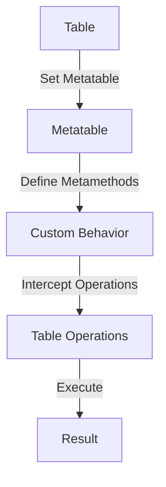

## 12.2 Using Metatables for Dynamic Behavior

In the world of Lua programming, metatables are a powerful feature that allows developers to modify the behavior of tables dynamically. By understanding and utilizing metatables, you can create more flexible and efficient code, implement custom behaviors, and even design domain-specific languages. In this section, we will delve into the concept of metatables, explore key metamethods, and demonstrate how to implement dynamic behavior in Lua.

### Understanding Metatables

Metatables are special tables in Lua that can change the way other tables behave. They act as a kind of "meta-layer" that allows you to define custom behaviors for operations on tables. This includes arithmetic operations, indexing, calling, and more. By associating a metatable with a table, you can intercept and customize these operations.

#### Key Metamethods

Metamethods are functions defined in a metatable that Lua calls when certain operations are performed on a table. Here are some of the most important metamethods:

- **Arithmetic Metamethods**: These allow you to customize arithmetic operations such as addition (`__add`), subtraction (`__sub`), multiplication (`__mul`), and division (`__div`). By defining these metamethods, you can control how your custom objects interact with arithmetic operators.

- **Indexing Metamethods**: The `__index` and `__newindex` metamethods are used to control access to table fields. `__index` is called when a key is not found in the table, allowing you to provide default values or computed properties. `__newindex` is called when a new key-value pair is added to the table, enabling you to enforce constraints or trigger side effects.

- **Call Metamethod**: The `__call` metamethod allows you to define behavior when a table is called like a function. This is useful for creating callable objects or implementing function-like behavior in tables.

### Implementing Dynamic Behavior

Metatables enable you to implement dynamic behavior in Lua by customizing how tables respond to various operations. Let's explore some common use cases and examples.

#### Operator Overloading

Operator overloading allows you to define how custom objects interact with operators. By using arithmetic metamethods, you can create objects that behave like numbers or other data types.

```lua
-- Define a vector metatable with custom addition
Vector = {}
Vector.__index = Vector

function Vector:new(x, y)
    local vec = {x = x, y = y}
    setmetatable(vec, self)
    return vec
end

function Vector:__add(other)
    return Vector:new(self.x + other.x, self.y + other.y)
end

-- Create two vectors
local v1 = Vector:new(1, 2)
local v2 = Vector:new(3, 4)

-- Add the vectors using the overloaded + operator
local v3 = v1 + v2
print(v3.x, v3.y)  -- Output: 4 6
```

In this example, we define a `Vector` metatable with a custom `__add` metamethod. This allows us to add two vectors using the `+` operator, resulting in a new vector with the sum of the components.

#### Customizing Table Access

Metatables can also be used to create read-only tables or computed properties by customizing table access with the `__index` and `__newindex` metamethods.

```lua
-- Define a read-only table metatable
ReadOnly = {}
function ReadOnly:__index(key)
    return self._data[key]
end

function ReadOnly:__newindex(key, value)
    error("Attempt to modify read-only table")
end

-- Create a read-only table
local data = {name = "Lua", version = "5.4"}
local readOnlyData = setmetatable({_data = data}, ReadOnly)

-- Accessing values works as expected
print(readOnlyData.name)  -- Output: Lua

-- Attempting to modify the table raises an error
-- readOnlyData.name = "New Lua"  -- Error: Attempt to modify read-only table
```

In this example, we create a read-only table by defining `__index` to access the underlying data and `__newindex` to prevent modifications.

### Use Cases and Examples

Metatables are versatile and can be used in various scenarios to enhance the functionality of your Lua programs.

#### Creating Class Systems

Metatables are often used to implement class systems in Lua, allowing for inheritance and polymorphism. By defining metamethods, you can create objects that behave like classes with methods and properties.

```lua
-- Define a base class with a metatable
Animal = {}
Animal.__index = Animal

function Animal:new(name)
    local obj = {name = name}
    setmetatable(obj, self)
    return obj
end

function Animal:speak()
    print(self.name .. " makes a sound.")
end

-- Define a subclass with its own metatable
Dog = setmetatable({}, {__index = Animal})

function Dog:speak()
    print(self.name .. " barks.")
end

-- Create instances of the classes
local animal = Animal:new("Generic Animal")
local dog = Dog:new("Fido")

-- Call the speak method on both instances
animal:speak()  -- Output: Generic Animal makes a sound.
dog:speak()     -- Output: Fido barks.
```

In this example, we define a base `Animal` class and a `Dog` subclass. The `Dog` class inherits from `Animal` and overrides the `speak` method to provide custom behavior.

#### Domain-Specific Languages (DSLs)

Metatables can be used to create domain-specific languages (DSLs) that simplify complex configurations or tasks. By defining custom behaviors, you can create a more intuitive and expressive syntax for specific domains.

```lua
-- Define a DSL for configuring a server
ServerConfig = {}
ServerConfig.__index = ServerConfig

function ServerConfig:new()
    local config = {}
    setmetatable(config, self)
    return config
end

function ServerConfig:__call(params)
    for k, v in pairs(params) do
        self[k] = v
    end
end

-- Create a server configuration using the DSL
local config = ServerConfig:new()
config {
    host = "localhost",
    port = 8080,
    maxConnections = 100
}

-- Access the configuration values
print(config.host)  -- Output: localhost
print(config.port)  -- Output: 8080
```

In this example, we define a simple DSL for configuring a server. The `ServerConfig` metatable uses the `__call` metamethod to allow configuration parameters to be set using a table-like syntax.

### Visualizing Metatable Operations

To better understand how metatables work, let's visualize the process of using a metatable to customize table behavior.



In this diagram, we see the flow of operations when using a metatable. A table is associated with a metatable, which defines metamethods to customize behavior. These metamethods intercept operations on the table and execute custom behavior, resulting in the desired outcome.

### Try It Yourself

Experiment with metatables by modifying the code examples provided. Here are some suggestions:

- Add more arithmetic metamethods to the `Vector` example, such as subtraction or multiplication.
- Create a metatable that logs all access to a table, including reads and writes.
- Implement a simple class system with inheritance and method overriding using metatables.

### References and Links

For further reading on metatables and metamethods in Lua, consider the following resources:

- [Programming in Lua](https://www.lua.org/pil/13.html) - A comprehensive guide to Lua programming, including metatables.
- [Lua 5.4 Reference Manual](https://www.lua.org/manual/5.4/) - The official reference manual for Lua, detailing metatables and metamethods.
- [Lua Users Wiki](http://lua-users.org/wiki/MetamethodsTutorial) - A community-driven resource with tutorials and examples on using metamethods.

### Knowledge Check

To reinforce your understanding of metatables and dynamic behavior in Lua, consider the following questions and exercises:

- What is a metatable, and how does it differ from a regular table?
- How can you use the `__index` metamethod to provide default values for a table?
- Implement a metatable that allows a table to behave like a stack, with `push` and `pop` operations.
- Create a metatable that enforces type constraints on table values, raising an error if a value of the wrong type is assigned.

### Embrace the Journey

Remember, mastering metatables is just the beginning of your journey into advanced Lua programming. As you continue to explore and experiment, you'll discover new ways to leverage metatables to create powerful and flexible code. Keep pushing the boundaries of what's possible, and enjoy the process of learning and growing as a developer!

---

## Quiz Time!



### What is a metatable in Lua?

- [x] A special table that can change the behavior of another table
- [ ] A table that stores metadata about Lua scripts
- [ ] A table that contains all global variables
- [ ] A table used for debugging purposes

> **Explanation:** A metatable is a special table in Lua that can change the behavior of another table by defining custom behaviors for operations.

### Which metamethod is used to customize addition operations?

- [x] __add
- [ ] __sub
- [ ] __mul
- [ ] __div

> **Explanation:** The `__add` metamethod is used to customize addition operations in Lua.

### How can you prevent modifications to a table using metatables?

- [x] Define a __newindex metamethod that raises an error
- [ ] Use the __index metamethod to return nil
- [ ] Set the table to read-only mode
- [ ] Use the __call metamethod to intercept writes

> **Explanation:** By defining a `__newindex` metamethod that raises an error, you can prevent modifications to a table.

### What is the purpose of the __call metamethod?

- [x] To define behavior when a table is called like a function
- [ ] To intercept arithmetic operations
- [ ] To provide default values for missing keys
- [ ] To log all table accesses

> **Explanation:** The `__call` metamethod allows you to define behavior when a table is called like a function.

### Which metamethod would you use to provide default values for missing keys in a table?

- [x] __index
- [ ] __newindex
- [ ] __add
- [ ] __call

> **Explanation:** The `__index` metamethod is used to provide default values for missing keys in a table.

### What is operator overloading in Lua?

- [x] Defining custom behavior for operators using metamethods
- [ ] Using operators to overload a table with data
- [ ] Creating multiple operators for a single operation
- [ ] Using operators to access table fields

> **Explanation:** Operator overloading in Lua involves defining custom behavior for operators using metamethods.

### How can metatables be used to create class systems in Lua?

- [x] By defining metamethods to implement inheritance and polymorphism
- [ ] By storing class definitions in a global table
- [ ] By using metatables to log method calls
- [ ] By creating a separate metatable for each class

> **Explanation:** Metatables can be used to create class systems in Lua by defining metamethods to implement inheritance and polymorphism.

### What is a domain-specific language (DSL)?

- [x] A specialized language for a specific domain or task
- [ ] A language that is specific to Lua
- [ ] A language used for debugging purposes
- [ ] A language that replaces Lua scripts

> **Explanation:** A domain-specific language (DSL) is a specialized language designed for a specific domain or task.

### How can you use the __index metamethod to create computed properties?

- [x] By returning a computed value when a key is accessed
- [ ] By storing computed values in a separate table
- [ ] By using the __call metamethod to compute values
- [ ] By defining a global function to compute values

> **Explanation:** The `__index` metamethod can be used to create computed properties by returning a computed value when a key is accessed.

### True or False: Metatables can only be used with tables in Lua.

- [x] True
- [ ] False

> **Explanation:** Metatables are specifically designed to be used with tables in Lua to modify their behavior.


