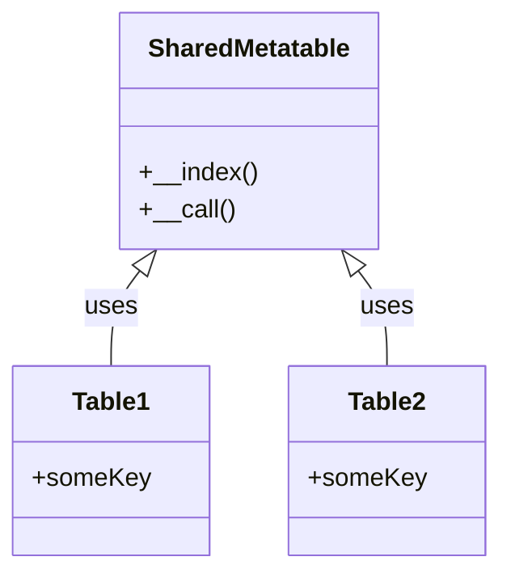

## 12.3 Effecting Large-Scale Changes Using Metatables

In the world of Lua programming, metatables offer a powerful mechanism for altering the behavior of tables, Lua's primary data structure. By leveraging metatables, developers can implement large-scale changes across multiple objects, enabling dynamic behavior modification and enhancing the flexibility of their applications. This section will delve into the techniques and considerations involved in using metatables for global behavior modification, providing practical examples and insights into their application.

### Global Behavior Modification

Global behavior modification refers to the ability to change the behavior of multiple objects simultaneously by using shared metatables. This approach is particularly useful when you need to apply a common set of behaviors or modifications across a group of tables, such as logging, monitoring, or implementing cross-cutting concerns like security checks.

#### Techniques for Global Behavior Modification

1. **Shared Metatables**: By assigning a common metatable to multiple tables, you can ensure that any changes made to the metatable are reflected across all associated tables. This technique allows for consistent behavior modification without the need to individually alter each table.

2. **Dynamic Dispatch**: Dynamic dispatch involves modifying methods across a set of objects, enabling you to change the behavior of these objects at runtime. This technique is particularly useful for implementing polymorphic behavior and adapting to changing requirements.

#### Considerations for Global Behavior Modification

- **Performance Impact**: While metatables provide a flexible mechanism for behavior modification, they can introduce performance overhead. It's important to understand the potential impact on your application's performance and optimize accordingly.

- **Maintainability**: Balancing dynamic behavior with code clarity is crucial. Overusing metatables can lead to complex and difficult-to-maintain code. It's essential to document your use of metatables and ensure that your code remains understandable to other developers.

### Use Cases and Examples

#### Logging and Monitoring

One common use case for global behavior modification is injecting logging into various objects. By using shared metatables, you can automatically log method calls and property accesses across a group of tables, providing valuable insights into your application's behavior.

```lua
-- Define a logging function
local function logAccess(key, value)
    print("Accessed key:", key, "with value:", value)
end

-- Create a shared metatable with a __index metamethod
local sharedMetatable = {
    __index = function(table, key)
        local value = rawget(table, key)
        logAccess(key, value)
        return value
    end
}

-- Create multiple tables and assign the shared metatable
local table1 = setmetatable({}, sharedMetatable)
local table2 = setmetatable({}, sharedMetatable)

-- Access elements to trigger logging
table1.someKey = "someValue"
print(table1.someKey)  -- Logs: Accessed key: someKey with value: someValue
print(table2.someKey)  -- Logs: Accessed key: someKey with value: nil
```

#### Aspect-Oriented Programming

Aspect-Oriented Programming (AOP) is a programming paradigm that allows you to add cross-cutting concerns, such as security checks, without modifying the core logic of your application. By using metatables, you can implement AOP in Lua, injecting additional behavior into your objects.

```lua
-- Define a security check function
local function securityCheck()
    print("Security check passed")
end

-- Create a shared metatable with a __call metamethod
local aspectMetatable = {
    __call = function(func, ...)
        securityCheck()
        return func(...)
    end
}

-- Define a function and assign the aspect metatable
local function performAction()
    print("Performing action")
end

setmetatable(performAction, aspectMetatable)

-- Call the function to trigger the security check
performAction()  -- Logs: Security check passed
                 --       Performing action
```

### Visualizing Metatable Behavior

To better understand how shared metatables can effect large-scale changes, let's visualize the relationship between tables and their shared metatable using a class diagram.



In this diagram, `Table1` and `Table2` both use the `SharedMetatable`, which defines the `__index` and `__call` metamethods. This shared metatable allows for consistent behavior modification across both tables.

### Try It Yourself

To deepen your understanding of metatables and their applications, try modifying the code examples provided. Experiment with different metamethods, such as `__newindex` or `__tostring`, and observe how they affect the behavior of your tables. Consider implementing additional cross-cutting concerns, such as caching or validation, using shared metatables.

### References and Links

For further reading on metatables and their applications, consider exploring the following resources:

- [Lua 5.4 Reference Manual](https://www.lua.org/manual/5.4/)
- [Programming in Lua](https://www.lua.org/pil/contents.html)
- [Aspect-Oriented Programming](https://en.wikipedia.org/wiki/Aspect-oriented_programming)

### Knowledge Check

- What are the benefits of using shared metatables for global behavior modification?
- How can dynamic dispatch be used to modify methods across a set of objects?
- What are some potential performance impacts of using metatables?
- How can metatables be used to implement Aspect-Oriented Programming in Lua?

### Embrace the Journey

Remember, mastering metatables and their applications is a journey. As you continue to explore Lua's metaprogramming capabilities, you'll discover new ways to enhance your software design and create more flexible, dynamic applications. Keep experimenting, stay curious, and enjoy the journey!

## Quiz Time!



### What is a primary benefit of using shared metatables?

- [x] Consistent behavior modification across multiple tables
- [ ] Improved memory management
- [ ] Enhanced security features
- [ ] Simplified syntax for table creation

> **Explanation:** Shared metatables allow for consistent behavior modification across multiple tables by applying the same metatable to each table.

### How does dynamic dispatch modify methods across a set of objects?

- [x] By changing the behavior of objects at runtime
- [ ] By compiling methods into a single function
- [ ] By using static typing
- [ ] By removing unused methods

> **Explanation:** Dynamic dispatch allows for modifying methods across a set of objects by changing their behavior at runtime, enabling polymorphic behavior.

### What is a potential downside of using metatables?

- [x] Performance overhead
- [ ] Increased memory usage
- [ ] Reduced code readability
- [ ] Limited functionality

> **Explanation:** Metatables can introduce performance overhead due to the additional processing required for metamethods.

### How can metatables be used in Aspect-Oriented Programming?

- [x] By injecting cross-cutting concerns like security checks
- [ ] By simplifying function calls
- [ ] By reducing code duplication
- [ ] By enhancing error handling

> **Explanation:** Metatables can be used in Aspect-Oriented Programming to inject cross-cutting concerns, such as security checks, into objects.

### Which metamethod would you use to log property accesses?

- [x] __index
- [ ] __newindex
- [ ] __call
- [ ] __tostring

> **Explanation:** The `__index` metamethod is used to log property accesses by intercepting table indexing operations.

### What is a key consideration when using metatables for global behavior modification?

- [x] Balancing dynamic behavior with code clarity
- [ ] Ensuring compatibility with older Lua versions
- [ ] Reducing the number of tables in use
- [ ] Increasing the number of metamethods

> **Explanation:** Balancing dynamic behavior with code clarity is crucial to maintainable and understandable code when using metatables.

### What is the role of the __call metamethod in the provided example?

- [x] To trigger a security check before executing a function
- [ ] To log function calls
- [ ] To modify function arguments
- [ ] To enhance function performance

> **Explanation:** The `__call` metamethod is used to trigger a security check before executing a function, as demonstrated in the example.

### How can you visualize the relationship between tables and their shared metatable?

- [x] Using a class diagram
- [ ] Using a sequence diagram
- [ ] Using a flowchart
- [ ] Using a pie chart

> **Explanation:** A class diagram can be used to visualize the relationship between tables and their shared metatable, showing how they interact.

### What is a common use case for global behavior modification with metatables?

- [x] Logging and monitoring
- [ ] Data encryption
- [ ] Memory management
- [ ] User authentication

> **Explanation:** Logging and monitoring are common use cases for global behavior modification with metatables, allowing for consistent logging across multiple objects.

### True or False: Metatables can only be used with tables in Lua.

- [x] True
- [ ] False

> **Explanation:** Metatables are specifically designed to modify the behavior of tables in Lua, as tables are the primary data structure.




