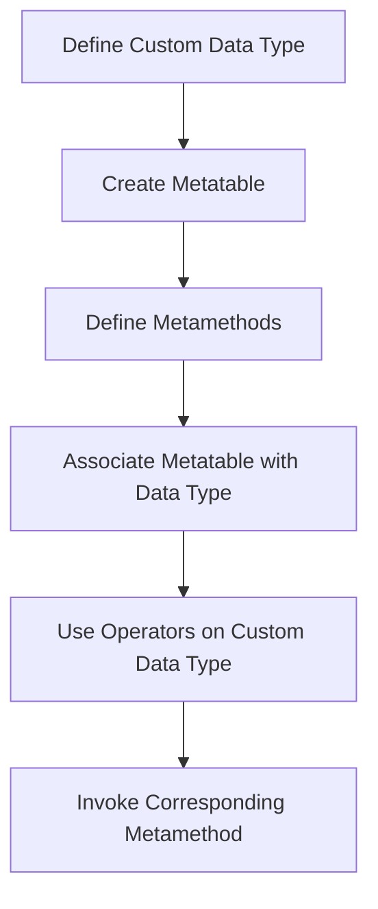

## 12.4 Operator Overloading with Metamethods

In the world of programming, operators are fundamental tools that allow us to perform operations on data types. However, when dealing with custom data types, the default behavior of these operators may not suffice. This is where operator overloading comes into play, allowing us to define custom behavior for operators when they are applied to user-defined types. In Lua, this is achieved through the use of metamethods.

### Customizing Operators

Operator overloading in Lua is a powerful feature that allows developers to define how objects respond to standard operators. This customization is done through metamethods, which are special methods associated with metatables. By defining these metamethods, you can control the behavior of operators such as addition, multiplication, and equality for your custom data types.

#### Implementing Operator Overloading

To implement operator overloading in Lua, you need to define specific metamethods in the metatable of your custom data type. Let's explore some of the most commonly used metamethods for operator overloading:

- **`__add`**: Defines behavior for the addition operator (`+`).
- **`__sub`**: Defines behavior for the subtraction operator (`-`).
- **`__mul`**: Defines behavior for the multiplication operator (`*`).
- **`__div`**: Defines behavior for the division operator (`/`).
- **`__eq`**: Defines behavior for the equality operator (`==`).
- **`__lt`**: Defines behavior for the less-than operator (`<`).
- **`__le`**: Defines behavior for the less-than-or-equal-to operator (`<=`).

Let's dive into a practical example to see how these metamethods can be implemented.

#### Example: Implementing a Vector Class

Consider a scenario where you need to implement a vector class that supports arithmetic operations. Here's how you can achieve this using metamethods:

```lua
-- Define a Vector class
Vector = {}
Vector.__index = Vector

-- Constructor for creating a new vector
function Vector:new(x, y)
    local vec = {x = x, y = y}
    setmetatable(vec, Vector)
    return vec
end

-- Metamethod for vector addition
function Vector.__add(v1, v2)
    return Vector:new(v1.x + v2.x, v1.y + v2.y)
end

-- Metamethod for vector subtraction
function Vector.__sub(v1, v2)
    return Vector:new(v1.x - v2.x, v1.y - v2.y)
end

-- Metamethod for vector multiplication (dot product)
function Vector.__mul(v1, v2)
    return v1.x * v2.x + v1.y * v2.y
end

-- Metamethod for equality check
function Vector.__eq(v1, v2)
    return v1.x == v2.x and v1.y == v2.y
end

-- Create two vectors
local v1 = Vector:new(3, 4)
local v2 = Vector:new(1, 2)

-- Perform operations
local v3 = v1 + v2
local v4 = v1 - v2
local dotProduct = v1 * v2
local areEqual = v1 == v2

-- Output results
print("v3: (" .. v3.x .. ", " .. v3.y .. ")")
print("v4: (" .. v4.x .. ", " .. v4.y .. ")")
print("Dot Product: " .. dotProduct)
print("Are v1 and v2 equal? " .. tostring(areEqual))
```

In this example, we define a `Vector` class with metamethods for addition, subtraction, multiplication, and equality. The `__add` metamethod allows us to use the `+` operator to add two vectors, while the `__mul` metamethod defines the dot product operation.

### Complex Data Types

Operator overloading is particularly useful when working with complex data types such as vectors, matrices, or custom mathematical objects. By defining appropriate metamethods, you can simplify the syntax for performing operations on these types, making your code more intuitive and readable.

#### Example: Matrix Class with Operator Overloading

Let's extend our understanding by implementing a matrix class that supports addition and multiplication:

```lua
-- Define a Matrix class
Matrix = {}
Matrix.__index = Matrix

-- Constructor for creating a new matrix
function Matrix:new(data)
    local mat = {data = data}
    setmetatable(mat, Matrix)
    return mat
end

-- Metamethod for matrix addition
function Matrix.__add(m1, m2)
    local result = {}
    for i = 1, #m1.data do
        result[i] = {}
        for j = 1, #m1.data[i] do
            result[i][j] = m1.data[i][j] + m2.data[i][j]
        end
    end
    return Matrix:new(result)
end

-- Metamethod for matrix multiplication
function Matrix.__mul(m1, m2)
    local result = {}
    for i = 1, #m1.data do
        result[i] = {}
        for j = 1, #m2.data[1] do
            result[i][j] = 0
            for k = 1, #m2.data do
                result[i][j] = result[i][j] + m1.data[i][k] * m2.data[k][j]
            end
        end
    end
    return Matrix:new(result)
end

-- Create two matrices
local m1 = Matrix:new({{1, 2}, {3, 4}})
local m2 = Matrix:new({{5, 6}, {7, 8}})

-- Perform operations
local m3 = m1 + m2
local m4 = m1 * m2

-- Output results
print("Matrix m3:")
for i = 1, #m3.data do
    for j = 1, #m3.data[i] do
        io.write(m3.data[i][j] .. " ")
    end
    print()
end

print("Matrix m4:")
for i = 1, #m4.data do
    for j = 1, #m4.data[i] do
        io.write(m4.data[i][j] .. " ")
    end
    print()
end
```

In this example, we define a `Matrix` class with metamethods for addition and multiplication. The `__add` metamethod allows us to use the `+` operator to add two matrices, while the `__mul` metamethod defines matrix multiplication.

### Use Cases and Examples

Operator overloading with metamethods is not limited to mathematical objects. It can be applied to a wide range of use cases, enhancing the usability and readability of custom data structures.

#### Mathematical Libraries

In mathematical libraries, operator overloading can simplify syntax for calculations, making it easier to work with complex mathematical expressions. By defining metamethods for arithmetic operations, you can create a more intuitive interface for users of your library.

#### Custom Data Structures

For custom data structures, operator overloading can enhance usability by allowing developers to use familiar operators to interact with the data. This can lead to more readable and maintainable code, as operations on custom types become more intuitive.

### Visualizing Operator Overloading

To better understand how operator overloading works in Lua, let's visualize the process using a flowchart:



This flowchart illustrates the steps involved in implementing operator overloading for a custom data type in Lua. By defining metamethods in the metatable and associating it with the data type, you can customize the behavior of operators.

### Try It Yourself

Now that we've explored the basics of operator overloading with metamethods, it's time to experiment with the code examples. Try modifying the `Vector` and `Matrix` classes to add support for additional operations, such as division or modulus. You can also create your own custom data types and define metamethods to customize their behavior.

### References and Links

For further reading on Lua metamethods and operator overloading, consider exploring the following resources:

- [Lua 5.4 Reference Manual - Metatables and Metamethods](https://www.lua.org/manual/5.4/manual.html#2.4)
- [Programming in Lua - Metatables and Metamethods](https://www.lua.org/pil/13.html)

### Knowledge Check

Before we wrap up, let's reinforce our understanding with a few questions:

1. What is the purpose of metamethods in Lua?
2. How can operator overloading enhance the usability of custom data types?
3. What are some common metamethods used for operator overloading?
4. How does the `__add` metamethod work in the context of a vector class?
5. What are some potential use cases for operator overloading in Lua?

### Embrace the Journey

Remember, mastering operator overloading with metamethods is just one step in your journey to becoming a proficient Lua developer. As you continue to explore the language, you'll discover new ways to leverage its powerful features to create efficient and elegant solutions. Keep experimenting, stay curious, and enjoy the journey!

## Quiz Time!



### What is the purpose of metamethods in Lua?

- [x] To define custom behavior for operators on user-defined types
- [ ] To create new operators in Lua
- [ ] To optimize Lua's built-in functions
- [ ] To manage memory allocation in Lua

> **Explanation:** Metamethods in Lua are used to define custom behavior for operators when they are applied to user-defined types.

### Which metamethod is used to define behavior for the addition operator?

- [x] `__add`
- [ ] `__sub`
- [ ] `__mul`
- [ ] `__div`

> **Explanation:** The `__add` metamethod is used to define custom behavior for the addition operator (`+`).

### How can operator overloading enhance the usability of custom data types?

- [x] By allowing familiar operators to be used with custom types
- [ ] By reducing the need for functions
- [ ] By increasing the complexity of code
- [ ] By limiting the operations that can be performed

> **Explanation:** Operator overloading allows familiar operators to be used with custom types, making the code more intuitive and readable.

### What is the result of using the `__eq` metamethod?

- [x] It defines behavior for the equality operator (`==`)
- [ ] It defines behavior for the addition operator (`+`)
- [ ] It defines behavior for the multiplication operator (`*`)
- [ ] It defines behavior for the division operator (`/`)

> **Explanation:** The `__eq` metamethod is used to define custom behavior for the equality operator (`==`).

### Which of the following is a potential use case for operator overloading in Lua?

- [x] Simplifying syntax for mathematical calculations
- [ ] Creating new data types
- [ ] Optimizing memory usage
- [ ] Managing file I/O operations

> **Explanation:** Operator overloading can simplify syntax for mathematical calculations, making it easier to work with complex expressions.

### What is the first step in implementing operator overloading for a custom data type?

- [x] Define a custom data type
- [ ] Create a metatable
- [ ] Define metamethods
- [ ] Associate the metatable with the data type

> **Explanation:** The first step is to define a custom data type that will use operator overloading.

### Which metamethod would you use to define behavior for the multiplication operator?

- [x] `__mul`
- [ ] `__add`
- [ ] `__sub`
- [ ] `__div`

> **Explanation:** The `__mul` metamethod is used to define custom behavior for the multiplication operator (`*`).

### What is the purpose of the `setmetatable` function in Lua?

- [x] To associate a metatable with a table
- [ ] To create a new table
- [ ] To define a new metamethod
- [ ] To optimize table operations

> **Explanation:** The `setmetatable` function is used to associate a metatable with a table, enabling custom behavior through metamethods.

### How does the `__sub` metamethod work in the context of a vector class?

- [x] It defines behavior for vector subtraction
- [ ] It defines behavior for vector addition
- [ ] It defines behavior for vector multiplication
- [ ] It defines behavior for vector division

> **Explanation:** The `__sub` metamethod is used to define custom behavior for vector subtraction.

### True or False: Operator overloading in Lua is limited to arithmetic operations.

- [ ] True
- [x] False

> **Explanation:** Operator overloading in Lua is not limited to arithmetic operations; it can also be used for relational and logical operators.


