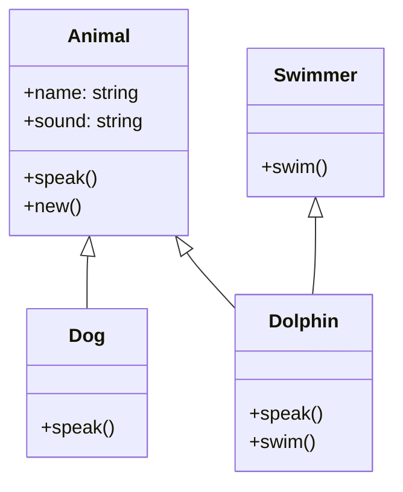

## 12.5 Implementing Classes and Inheritance

In this section, we delve into the fascinating world of simulating object-oriented programming (OOP) in Lua. Lua, being a lightweight and flexible language, does not have built-in support for classes and inheritance as seen in traditional OOP languages like Java or C++. However, Lua's powerful table and metatable constructs allow us to mimic these concepts effectively. Let's explore how we can implement classes and inheritance in Lua, and how these techniques can be applied to create robust and reusable code.

### Simulating OOP in Lua

Lua's tables are the cornerstone of its data structures and can be used to represent objects. By leveraging metatables, we can simulate class behavior, including inheritance and polymorphism.

#### Class Implementation Techniques

##### Prototype-Based Inheritance

Prototype-based inheritance is a style of object-oriented programming where objects inherit directly from other objects. In Lua, this can be achieved by using tables as prototypes.

```lua
-- Define a prototype for a simple class
local Animal = {
    name = "Unknown",
    sound = "Silent"
}

-- Method to make the animal speak
function Animal:speak()
    print(self.name .. " says " .. self.sound)
end

-- Create a new instance of Animal
local dog = {name = "Dog", sound = "Woof"}
setmetatable(dog, {__index = Animal})

dog:speak()  -- Output: Dog says Woof
```

In this example, `dog` is an instance that inherits from the `Animal` prototype. The `__index` metamethod is used to delegate method calls to the prototype.

##### Class Constructors

Constructors in Lua are functions that return new instances of a class. They are typically used to initialize object properties.

```lua
-- Constructor for the Animal class
function Animal:new(o, name, sound)
    o = o or {}
    setmetatable(o, self)
    self.__index = self
    o.name = name or self.name
    o.sound = sound or self.sound
    return o
end

-- Create a new instance using the constructor
local cat = Animal:new(nil, "Cat", "Meow")
cat:speak()  -- Output: Cat says Meow
```

The `new` function acts as a constructor, initializing the object and setting its metatable to allow inheritance from `Animal`.

##### Method Lookup

Method lookup in Lua is facilitated by the `__index` metamethod, which allows us to define how missing keys are resolved.

```lua
-- Define a method in the Animal class
function Animal:describe()
    print("This is a " .. self.name)
end

-- Create a new instance and call the method
local bird = Animal:new(nil, "Bird", "Tweet")
bird:describe()  -- Output: This is a Bird
```

The `__index` metamethod ensures that if a method is not found in the instance, it is looked up in the prototype.

### Inheritance Models

Lua supports various inheritance models, including single and multiple inheritance.

#### Single Inheritance

Single inheritance involves a straightforward parent-child relationship, where a child class inherits from a single parent class.

```lua
-- Define a subclass of Animal
local Dog = Animal:new(nil, "Dog", "Woof")

-- Override the speak method
function Dog:speak()
    print(self.name .. " barks " .. self.sound)
end

local myDog = Dog:new()
myDog:speak()  -- Output: Dog barks Woof
```

In this example, `Dog` inherits from `Animal` and overrides the `speak` method.

#### Multiple Inheritance

Multiple inheritance allows a class to inherit behaviors from multiple sources. This can be achieved using a combination of tables and metatables.

```lua
-- Define another prototype
local Swimmer = {
    swim = function(self)
        print(self.name .. " is swimming")
    end
}

-- Create a new class that inherits from both Animal and Swimmer
local Dolphin = Animal:new(nil, "Dolphin", "Click")
setmetatable(Dolphin, {__index = function(table, key)
    return Swimmer[key] or Animal[key]
end})

local myDolphin = Dolphin:new()
myDolphin:speak()  -- Output: Dolphin says Click
myDolphin:swim()   -- Output: Dolphin is swimming
```

Here, `Dolphin` inherits methods from both `Animal` and `Swimmer`, demonstrating multiple inheritance.

### Use Cases and Examples

Implementing classes and inheritance in Lua can be particularly useful in scenarios where object-oriented design patterns are beneficial.

#### Object-Oriented Applications

Object-oriented applications can be structured using familiar OOP patterns, making the code more organized and maintainable.

```lua
-- Define a Vehicle class
local Vehicle = {
    type = "Unknown",
    speed = 0
}

function Vehicle:new(o, type, speed)
    o = o or {}
    setmetatable(o, self)
    self.__index = self
    o.type = type or self.type
    o.speed = speed or self.speed
    return o
end

function Vehicle:move()
    print(self.type .. " is moving at " .. self.speed .. " km/h")
end

-- Define a Car class that inherits from Vehicle
local Car = Vehicle:new(nil, "Car", 120)

local myCar = Car:new()
myCar:move()  -- Output: Car is moving at 120 km/h
```

In this example, `Car` is a subclass of `Vehicle`, inheriting its properties and methods.

#### Reusable Components

By building libraries with extensible classes, developers can create reusable components that can be easily integrated into different projects.

```lua
-- Define a reusable Logger class
local Logger = {
    level = "INFO"
}

function Logger:new(o, level)
    o = o or {}
    setmetatable(o, self)
    self.__index = self
    o.level = level or self.level
    return o
end

function Logger:log(message)
    print("[" .. self.level .. "] " .. message)
end

-- Create a new Logger instance
local errorLogger = Logger:new(nil, "ERROR")
errorLogger:log("This is an error message")  -- Output: [ERROR] This is an error message
```

The `Logger` class can be reused across different applications, providing a consistent logging mechanism.

### Visualizing Class and Inheritance Relationships

To better understand the relationships between classes and inheritance in Lua, let's visualize the structure using a class diagram.



This diagram illustrates the inheritance relationships between `Animal`, `Dog`, `Swimmer`, and `Dolphin`.

### Design Considerations

When implementing classes and inheritance in Lua, consider the following:

- **Simplicity**: Lua's approach to OOP is simple and flexible, but it requires careful design to avoid complexity.
- **Performance**: Using metatables can introduce overhead, so it's important to balance flexibility with performance.
- **Maintainability**: Ensure that your class hierarchies are logical and easy to understand to facilitate maintenance.

### Differences and Similarities

Lua's approach to OOP is unique compared to traditional OOP languages. While it lacks built-in class support, its flexibility allows for creative solutions. It's important to understand these differences to effectively leverage Lua's capabilities.

### Try It Yourself

Experiment with the code examples provided. Try modifying the classes, adding new methods, or creating additional subclasses. This hands-on approach will deepen your understanding of Lua's OOP capabilities.

### Knowledge Check

- What is the role of the `__index` metamethod in Lua's OOP implementation?
- How can multiple inheritance be achieved in Lua?
- What are the benefits of using prototype-based inheritance?

### Embrace the Journey

Remember, mastering Lua's OOP capabilities is a journey. As you explore and experiment, you'll discover new ways to structure your code and create powerful applications. Keep learning, stay curious, and enjoy the process!

## Quiz Time!



### What is the primary data structure used to simulate classes in Lua?

- [x] Tables
- [ ] Arrays
- [ ] Strings
- [ ] Functions

> **Explanation:** Tables are the primary data structure in Lua used to simulate classes and objects.

### How is method lookup achieved in Lua's OOP implementation?

- [x] Using the `__index` metamethod
- [ ] Using the `__newindex` metamethod
- [ ] Using the `__call` metamethod
- [ ] Using the `__tostring` metamethod

> **Explanation:** The `__index` metamethod is used to delegate method calls to a prototype or class.

### What is a constructor in Lua?

- [x] A function that returns new instances of a class
- [ ] A function that destroys instances of a class
- [ ] A function that modifies existing instances
- [ ] A function that prints class information

> **Explanation:** A constructor in Lua is a function that initializes and returns new instances of a class.

### How can multiple inheritance be achieved in Lua?

- [x] By using a combination of tables and metatables
- [ ] By using a single table
- [ ] By using arrays
- [ ] By using strings

> **Explanation:** Multiple inheritance in Lua can be achieved by combining tables and metatables to inherit behaviors from multiple sources.

### Which of the following is a benefit of prototype-based inheritance?

- [x] Flexibility in object creation
- [ ] Increased complexity
- [ ] Reduced performance
- [ ] Limited object reuse

> **Explanation:** Prototype-based inheritance provides flexibility in object creation and behavior sharing.

### What is the role of the `new` function in Lua's class implementation?

- [x] To act as a constructor for creating new instances
- [ ] To destroy existing instances
- [ ] To modify class properties
- [ ] To print class information

> **Explanation:** The `new` function acts as a constructor, initializing and returning new instances of a class.

### What is a key consideration when using metatables for OOP in Lua?

- [x] Balancing flexibility with performance
- [ ] Ensuring maximum complexity
- [ ] Avoiding object reuse
- [ ] Limiting method definitions

> **Explanation:** It's important to balance flexibility with performance when using metatables for OOP in Lua.

### How can you override a method in a subclass in Lua?

- [x] By defining a new method with the same name in the subclass
- [ ] By deleting the method from the superclass
- [ ] By using the `__call` metamethod
- [ ] By using the `__tostring` metamethod

> **Explanation:** A method can be overridden in a subclass by defining a new method with the same name.

### What is the purpose of the `speak` method in the `Animal` class?

- [x] To print the sound the animal makes
- [ ] To initialize the animal's properties
- [ ] To destroy the animal instance
- [ ] To modify the animal's name

> **Explanation:** The `speak` method is used to print the sound associated with the animal.

### True or False: Lua has built-in support for classes and inheritance.

- [ ] True
- [x] False

> **Explanation:** Lua does not have built-in support for classes and inheritance; these concepts are simulated using tables and metatables.


