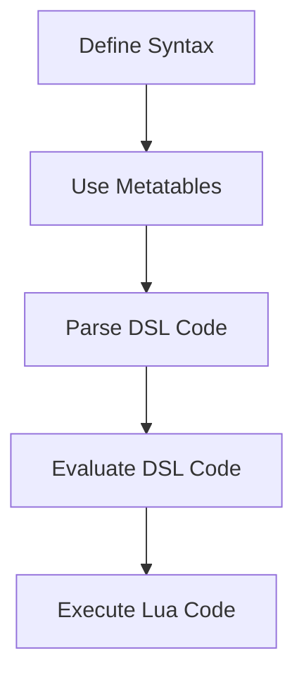

## 12.6 Building Domain-Specific Languages (DSLs)

In the world of software engineering, Domain-Specific Languages (DSLs) are powerful tools that allow developers to create specialized mini-languages tailored to specific problem domains. Lua, with its lightweight nature and powerful metaprogramming capabilities, is an excellent choice for building DSLs. In this section, we will explore the process of creating DSLs in Lua, focusing on syntax design, using metatables, parsing, and evaluating DSL code. We will also examine use cases and provide practical examples to illustrate the concepts.

### Understanding Domain-Specific Languages

A Domain-Specific Language (DSL) is a programming language or specification language dedicated to a particular problem domain, a particular problem representation technique, and/or a particular solution technique. Unlike general-purpose programming languages, DSLs are designed to be highly expressive within their domain, making them easier to use for specific tasks.

#### Key Characteristics of DSLs

- **Conciseness**: DSLs often have a concise syntax that allows users to express complex ideas succinctly.
- **Expressiveness**: They are designed to express domain concepts directly, reducing the need for boilerplate code.
- **Domain Focus**: DSLs are tailored to specific domains, such as configuration management, game scripting, or data transformation.

### Implementing DSLs in Lua

Lua's flexibility and metaprogramming capabilities make it an ideal candidate for implementing DSLs. Let's explore the key components involved in building a DSL in Lua.

#### Syntax Design

The first step in creating a DSL is designing its syntax. The syntax should be intuitive and expressive, allowing users to write code that closely resembles the domain concepts. Lua's syntax is already minimalistic, which makes it easier to design a DSL that feels natural.

**Example: A Simple Configuration DSL**

Consider a DSL for configuring a web server. The DSL might look like this:

```lua
server {
    host = "localhost",
    port = 8080,
    routes = {
        { path = "/", handler = "indexHandler" },
        { path = "/about", handler = "aboutHandler" }
    }
}
```

In this example, the DSL allows users to define server configurations using a simple and readable syntax.

#### Using Metatables

Metatables in Lua provide a mechanism to change the behavior of tables. They can be used to overload operators and function calls, which is essential for implementing DSLs.

**Example: Overloading Function Calls**

Let's overload the function call operator to create a DSL for defining mathematical expressions:

```lua
local Expression = {}
Expression.__index = Expression

function Expression.new(value)
    return setmetatable({ value = value }, Expression)
end

function Expression.__call(self, other)
    return Expression.new(self.value + other.value)
end

local a = Expression.new(5)
local b = Expression.new(10)
local c = a(b) -- This will result in an expression representing 15
```

In this example, we define a metatable for expressions and overload the function call operator to perform addition.

#### Parsing and Evaluating

Once the syntax is defined, the next step is parsing and evaluating the DSL code. This involves interpreting the DSL and executing the corresponding Lua code.

**Example: Parsing a Simple DSL**

Let's create a simple parser for a DSL that defines arithmetic operations:

```lua
local function parse(expression)
    local stack = {}
    for token in string.gmatch(expression, "%S+") do
        if tonumber(token) then
            table.insert(stack, tonumber(token))
        elseif token == "+" then
            local b = table.remove(stack)
            local a = table.remove(stack)
            table.insert(stack, a + b)
        elseif token == "-" then
            local b = table.remove(stack)
            local a = table.remove(stack)
            table.insert(stack, a - b)
        end
    end
    return stack[1]
end

local result = parse("3 4 + 2 -") -- This will evaluate to 5
```

In this example, we parse a simple postfix expression and evaluate it using a stack-based approach.

### Use Cases and Examples

DSLs have a wide range of applications. Let's explore some common use cases and provide examples.

#### Configuration Languages

DSLs are often used to simplify complex system configurations. By providing a concise syntax, they make it easier for users to define configurations without delving into the underlying code.

**Example: Web Server Configuration DSL**

```lua
webserver {
    host = "example.com",
    port = 80,
    ssl = true,
    routes = {
        { path = "/", handler = "homeHandler" },
        { path = "/api", handler = "apiHandler" }
    }
}
```

This DSL allows users to configure a web server with minimal effort, focusing on the essential details.

#### Scripting Game Mechanics

In game development, DSLs can empower designers to write game logic without needing to understand the underlying engine code. This separation of concerns allows for more efficient development.

**Example: Game Mechanics DSL**

```lua
game {
    player = {
        health = 100,
        attack = function(target)
            target.health = target.health - 10
        end
    },
    enemy = {
        health = 50,
        attack = function(target)
            target.health = target.health - 5
        end
    }
}
```

In this example, the DSL allows designers to define game mechanics in a straightforward manner, focusing on gameplay rather than implementation details.

### Visualizing DSL Implementation

To better understand the process of implementing a DSL in Lua, let's visualize the workflow using a flowchart.



**Figure 1**: Workflow for Implementing a DSL in Lua

### Try It Yourself

To deepen your understanding of DSLs in Lua, try modifying the examples provided. Experiment with different syntax designs, overload different operators, and create parsers for more complex DSLs. By doing so, you'll gain hands-on experience and a deeper appreciation for the power of DSLs.

### Knowledge Check

- What are the key characteristics of a DSL?
- How can metatables be used to implement DSLs in Lua?
- What are some common use cases for DSLs?

### Summary

In this section, we've explored the process of building Domain-Specific Languages (DSLs) in Lua. We've covered syntax design, using metatables, parsing, and evaluating DSL code. We've also examined use cases and provided practical examples to illustrate the concepts. Remember, this is just the beginning. As you continue to explore DSLs, you'll discover new ways to leverage Lua's flexibility and power to create specialized languages tailored to your needs.

## Quiz Time!



### What is a Domain-Specific Language (DSL)?

- [x] A language tailored to a specific problem domain
- [ ] A general-purpose programming language
- [ ] A language for web development only
- [ ] A language for database management

> **Explanation:** A DSL is a language designed for a specific problem domain, offering specialized syntax and semantics.

### What is the primary benefit of using DSLs?

- [x] They provide a concise and expressive syntax for specific domains.
- [ ] They are faster than general-purpose languages.
- [ ] They are easier to learn than any other language.
- [ ] They can replace all other programming languages.

> **Explanation:** DSLs offer a concise and expressive syntax tailored to specific domains, making them easier to use for domain-specific tasks.

### How can metatables be used in DSL implementation?

- [x] By overloading operators and function calls
- [ ] By creating new data types
- [ ] By managing memory allocation
- [ ] By handling network communication

> **Explanation:** Metatables allow overloading of operators and function calls, which is essential for implementing DSLs.

### What is the purpose of parsing in DSLs?

- [x] To interpret and evaluate DSL code
- [ ] To compile the code into machine language
- [ ] To optimize the code for performance
- [ ] To encrypt the code for security

> **Explanation:** Parsing is used to interpret and evaluate DSL code, translating it into executable Lua code.

### Which of the following is a common use case for DSLs?

- [x] Configuration languages
- [ ] Operating system development
- [ ] Hardware design
- [ ] Network protocols

> **Explanation:** DSLs are commonly used for configuration languages, simplifying complex system configurations.

### What is a key characteristic of a DSL?

- [x] Conciseness
- [ ] Complexity
- [ ] Generality
- [ ] Universality

> **Explanation:** DSLs are characterized by their conciseness, allowing users to express complex ideas succinctly.

### What is the role of metatables in Lua?

- [x] To change the behavior of tables
- [ ] To manage memory allocation
- [ ] To handle network communication
- [ ] To compile Lua code

> **Explanation:** Metatables in Lua provide a mechanism to change the behavior of tables, which is useful in DSL implementation.

### What is the advantage of using a DSL for game mechanics?

- [x] It allows designers to write game logic without understanding engine code.
- [ ] It makes the game run faster.
- [ ] It reduces the game's memory usage.
- [ ] It simplifies network communication.

> **Explanation:** DSLs for game mechanics allow designers to focus on gameplay without needing to understand the underlying engine code.

### What is the first step in creating a DSL?

- [x] Designing its syntax
- [ ] Parsing the code
- [ ] Evaluating the code
- [ ] Executing the code

> **Explanation:** The first step in creating a DSL is designing its syntax to be intuitive and expressive.

### True or False: DSLs can replace general-purpose programming languages.

- [ ] True
- [x] False

> **Explanation:** DSLs are not meant to replace general-purpose programming languages; they are designed for specific domains.



Remember, building DSLs is a journey of creativity and exploration. Keep experimenting, stay curious, and enjoy the process of crafting languages that empower users to express domain-specific concepts with ease.
